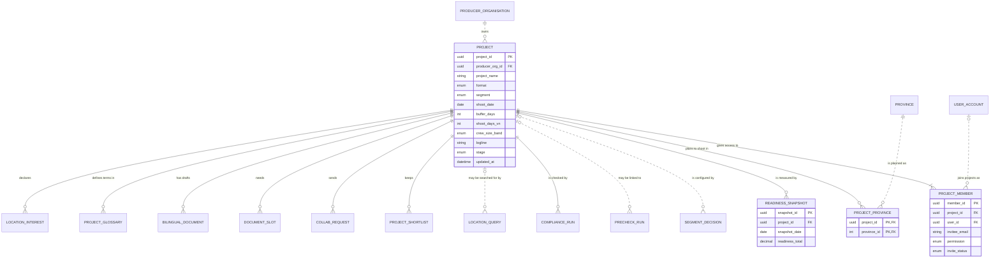

# Data Model and Mockup Data: Project workspace and readiness dashboard (M0)

> Layout reconstructed from the Session 5 lecture (*Building an ERD with AI*, steps S0–S6 and human gates 1–6) and the Session 7 rubric (C3, C4, G2–G4), because the course template file was not available to the team. Sections marked *(mandatory)* are all filled. Generated by `tools/build_dm_docs.py` from the same sources as `data/01`–`05`, `data/schema/` and `data/seed/`; the numbers below are computed, not typed.

| Field | Value |
|---|---|
| Module | M0 — Project workspace and readiness dashboard |
| Spec Document | `docs/spec/spec-M0.md` |
| Schema | `data/schema/schema-M0.sql` |
| Seed files | `09_project.csv`, `11_project_member.csv`, `13_project_province.csv`, `14_readiness_snapshot.csv` |
| Version / date | v1.0 — 01/10/2026 |
| Prepared by | Group C (draft by an AI agent, see `docs/ai-use-log.md`) |
| Status | Ready for the human gates in section 13 |

## 1. Sources and input map (mandatory)

The model of this module is derived from `docs/spec/spec-M0.md` only — no entity, column or relationship was invented. The input map below is the one used for the whole product (`data/01-entity-dictionary.md`); citations use the scheme `<MODULE> §<section> <ID>`.

```text
INPUT MAP
I am providing the following slots. Treat every slot not listed here as ABSENT, and apply the
degradation rules rather than inventing the missing material.

  FUNCTIONS = section 5 FR tables of the 9 module Spec Documents in docs/spec/
              (spec-SYS, spec-M1, spec-M0, spec-M2, spec-M3, spec-M4, spec-M5, spec-M7, spec-M10),
              104 rows (Spec Documents of 30/09/2026)
  FIELDS    = section 5.1 "Input / Output contract" of the same documents
              (every field typed, inputs marked Req / Opt), plus section 6.1
              "Attribute types" (types of the section 6 attributes no 5.1 field declares)
  ENTITIES  = section 6 "Key entities" of the same documents, 51 declared entities
  RULES     = section 5.2 "Business rules" of the same documents (BR-001 ... per module)
  SCENARIOS = section 3 user stories US-n with Given / When / Then, plus "Edge cases"
  FLOWS     = section 4 Mermaid blocks (usage flows 4.1, sequence diagrams 4.2+)
  SCREENS   = section 7 tables + docs/screens/screen-spec-<ID>.md (41 Screen Specs)
  BOUNDARY  = section 1 "Depends on" (external: Supabase Auth / PostgreSQL / Storage,
              Resend email, language-model API, PDF rendering, OpenStreetMap tiles, PostGIS)

  Out of this input: M6, M8, M9 are Won't for this release (docs/prd.md §4.4).

CITATION SCHEME = <MODULE> §<section> <ID>
  e.g. "M3 §5.1 FR-008" (field row of F-M3-08) | "M3 §5.2 BR-004" | "M3 §3 US-2" | "M3 §6"
```

## 2. Entity catalogue (mandatory)

5 entities owned by M0: 4 stored, 1 derived. Every entity is declared in §6 of the Spec Document (*discovered here* would mark one that is not). Each entity has exactly one owner module.

| Entity | Definition (one sentence) | Kind | Owner | Source | Table | Seed file (rows) |
|---|---|---|---|---|---|---|
| `PROJECT` | A film or content production a producer is preparing to shoot in Vietnam. | THING | M0 | spec §6 — M0 §6; M0 §5.1 FR-001, FR-002; M0 §5.2 BR-005 | `project` | `09_project.csv` (8) |
| `PROJECT_MEMBER` | A person's access to one project, with view or edit permission. | THING | M0 | spec §6 — M0 §6; M0 §5.1 FR-004 | `project_member` | `11_project_member.csv` (12) |
| `PROJECT_PROVINCE` | A province a project plans to shoot in. | THING | M0 | spec §6 — M0 §6; M0 §5.1 FR-001 | `project_province` | `13_project_province.csv` (9) |
| `READINESS_VIEW` | The five gauge scores, overall readiness and next steps of a project, computed on read. | DERIVED (computed on read, not stored) | M0 | spec §6 — M0 §6; M0 §5.2 BR-001 | — | — |
| `READINESS_SNAPSHOT` | The overall readiness of a project as recorded on one night. | EVENT | M0 | spec §6 — M0 §6; M0 §5.1 FR-008 | `readiness_snapshot` | `14_readiness_snapshot.csv` (14) |

**Entities of other modules referenced here** (drawn without attributes in §5): `BILINGUAL_DOCUMENT` (M5), `COLLAB_REQUEST` (M4), `COMPLIANCE_RUN` (M2), `DOCUMENT_SLOT` (M5), `LOCATION_INTEREST` (M7), `LOCATION_QUERY` (M3), `PRECHECK_RUN` (M2), `PRODUCER_ORGANISATION` (SYS), `PROJECT_GLOSSARY` (M5), `PROJECT_SHORTLIST` (M3), `PROVINCE` (M3), `SEGMENT_DECISION` (M1), `USER_ACCOUNT` (SYS).

## 3. Attributes (mandatory)

Every attribute traces to a §5.1 field, a §6.1 declared type, a key, or a deliberate audit column (*Source kind*). *Req* = required by the function; *Opt* = optional; *system-set* = filled by the system.

### PROJECT

| Column | Type | Required | Key | Source kind | Citation |
|---|---|---|---|---|---|
| `project_id` | `UUID` | system-set | PK | §5.1 field | M0 §5.1 FR-001 (OUT) |
| `producer_org_id` | `UUID` | Req | FK → `PRODUCER_ORGANISATION` | §6.1 declared type | M0 §6 ("belongs to ProducerOrganisation"); M0 §6.1 |
| `project_name` | `VARCHAR(200)` | Req |  | §5.1 field | M0 §5.1 FR-001 |
| `format` | `ENUM(feature, documentary, commercial, tv, music_video)` | Req |  | §5.1 field | M0 §5.1 FR-001 |
| `segment` | `ENUM(A, B, C)` | Req |  | §5.1 field | M0 §5.1 FR-001; M1 §5.1 FR-003 |
| `shoot_date` | `DATE` | Opt |  | §5.1 field | M0 §5.1 FR-001 (Opt), FR-002 (after today); M5 §5.1 FR-007 (Req) — see Type conflicts |
| `buffer_days` | `INTEGER` | Req |  | §5.1 field | M5 §5.1 FR-007 (0 / 7 / 14 / 21); M2 §5.1 FR-017 (default 7) |
| `shoot_days_vn` | `INTEGER` | Opt |  | §5.1 field | M0 §5.1 FR-001 |
| `crew_size_band` | `ENUM(u15, 15_50, o50)` | Opt |  | §5.1 field | M0 §5.1 FR-001 |
| `logline` | `VARCHAR(500)` | Opt |  | §5.1 field | M0 §5.1 FR-001 |
| `stage` | `ENUM(draft, preparing, archived)` | Opt |  | §5.1 field | M0 §5.1 FR-002; M0 §6; M0 §5.2 BR-005 (archived, never deleted) |
| `updated_at` | `TIMESTAMPTZ` | system-set |  | §5.1 field | M0 §5.1 FR-002 (OUT) |

**Natural key:** producer_org_id + project_name — proposed (open question).

### PROJECT_MEMBER

| Column | Type | Required | Key | Source kind | Citation |
|---|---|---|---|---|---|
| `member_id` | `UUID` | system-set | PK | §5.1 field | M0 §5.1 FR-004 (OUT) |
| `project_id` | `UUID` | Req | FK → `PROJECT` | §5.1 field | M0 §5.1 FR-004 |
| `user_id` | `UUID` | Opt | FK → `USER_ACCOUNT` | §6.1 declared type | M0 §6 (user_id); M0 §6.1 |
| `invitee_email` | `VARCHAR(254)` | Req |  | §5.1 field | M0 §5.1 FR-004 |
| `permission` | `ENUM(view, edit)` | Req |  | §5.1 field | M0 §5.1 FR-004 (owner not in the set — see Structural findings) |
| `invite_status` | `ENUM(pending, accepted)` | system-set |  | §5.1 field | M0 §5.1 FR-004 (OUT) |

**Natural key:** project_id + invitee_email (the invited address); project_id + user_id once accepted.

### PROJECT_PROVINCE

| Column | Type | Required | Key | Source kind | Citation |
|---|---|---|---|---|---|
| `project_id` | `UUID` | Req | PK, FK → `PROJECT` | key | M0 §6 |
| `province_id` | `INTEGER` | Opt | PK, FK → `PROVINCE` | §5.1 field | M0 §5.1 FR-001 (provinces ARRAY<INTEGER> Opt) |

**Natural key:** project_id + province_id.

### READINESS_SNAPSHOT

| Column | Type | Required | Key | Source kind | Citation |
|---|---|---|---|---|---|
| `snapshot_id` | `UUID` | system-set | PK | §5.1 field | M0 §5.1 FR-008 (OUT) |
| `project_id` | `UUID` | Req | FK → `PROJECT` | §5.1 field | M0 §5.1 FR-008 |
| `snapshot_date` | `DATE` | Req |  | §5.1 field | M0 §5.1 FR-008 |
| `readiness_total` | `NUMERIC(5,2)` | system-set |  | §5.1 field | M0 §6; M0 §5.1 FR-009 (OUT) |

**Natural key:** project_id + snapshot_date (one per night, M0 FR-008).

## 4. Relationships (mandatory)

Each relationship is read in both directions; the citation is the spec line it comes from. **No many-to-many relationship is left unresolved**: every many-to-many need of this module is an associative entity (e.g. PROJECT_SHORTLIST, PROJECT_PROVINCE, PROJECT_MEMBER).

| Relationship | Forward reading | Reverse reading | Side that may be zero | Type | Citation |
|---|---|---|---|---|---|
| `PRODUCER_ORGANISATION` \|\|..o{ `PROJECT` | Each producer organisation owns zero or more projects | Each project is owned by exactly one producer organisation | PROJECT side | non-identifying (`..`) | SYS §6 ("has many Projects (M0)"); M0 §6 ("belongs to ProducerOrganisation") |
| `PROJECT` \|\|--\|{ `PROJECT_MEMBER` | Each project gives access to one or more project members | Each project member belongs to exactly one project | neither | identifying (`--`) | M0 §6; M0 §5.1 FR-001 ("make the creator its owner") |
| `USER_ACCOUNT` \|o..o{ `PROJECT_MEMBER` | Each user account joins zero or more projects as a project member | Each project member is zero or one user account (none while an invitation is pending) | both sides | non-identifying (`..`) | M0 §6 ("belongs to Project and UserAccount"); M0 §5.1 FR-004 (invitee_email, invite_status pending); M0 §3 US-3 |
| `PROJECT` \|\|--o{ `PROJECT_PROVINCE` | Each project plans to shoot in zero or more project provinces | Each project province belongs to exactly one project | PROJECT_PROVINCE side | identifying (`--`) | M0 §6; M0 §5.1 FR-001 provinces Opt |
| `PROVINCE` \|\|..o{ `PROJECT_PROVINCE` | Each province is planned as zero or more project provinces | Each project province is exactly one province | PROJECT_PROVINCE side | non-identifying (`..`) | M0 §6 (province_id); M0 §5.1 FR-001 |
| `PROJECT` \|\|--o{ `READINESS_SNAPSHOT` | Each project is measured by zero or more readiness snapshots | Each readiness snapshot measures exactly one project | READINESS_SNAPSHOT side | identifying (`--`) | M0 §6; M0 §5.1 FR-008 (nightly) |
| `PROJECT` \|o..o{ `SEGMENT_DECISION` | Each project is configured by zero or more segment decisions | Each segment decision configures zero or one project | both sides | non-identifying (`..`) | M1 §6 ("belongs to Project (M0) once saved"); M1 §3 Edge cases (nothing stored before saving) |
| `PROJECT` \|o..o{ `PRECHECK_RUN` | Each project is linked to zero or more pre-check runs | Each pre-check run is linked to zero or one project | both sides | non-identifying (`..`) | M2 §6 ("may belong to a Project"); M2 §3 US-1 (guest, no sign-up) |
| `PROJECT` \|\|--o{ `COMPLIANCE_RUN` | Each project is checked by zero or more compliance runs | Each compliance run checks exactly one project | COMPLIANCE_RUN side | identifying (`--`) | M2 §6 ("belongs to Project") |
| `PROJECT` \|o..o{ `LOCATION_QUERY` | Each project may be searched for by zero or more location queries | Each location query belongs to zero or one project | both sides | non-identifying (`..`) | M3 §6 ("may belong to Project"); M3 §5.1 FR-011 project_id Opt; M3 §5.2 BR-009 (guests search without a project) |
| `PROJECT` \|\|--o{ `PROJECT_SHORTLIST` | Each project keeps zero or more shortlist entries | Each shortlist entry belongs to exactly one project | PROJECT_SHORTLIST side | identifying (`--`) | M3 §6; M3 §5.1 FR-018 |
| `PROJECT` \|\|--o{ `COLLAB_REQUEST` | Each project sends zero or more collaboration requests | Each collaboration request is sent for exactly one project | COLLAB_REQUEST side | identifying (`--`) | M4 §6; M4 §5.1 FR-012 project_id Req |
| `PROJECT` \|\|--o{ `DOCUMENT_SLOT` | Each project needs zero or more document slots | Each document slot belongs to exactly one project | DOCUMENT_SLOT side | identifying (`--`) | M5 §6 ("belongs to Project"); M5 §10 (document list for segment C open) |
| `PROJECT` \|\|--o{ `BILINGUAL_DOCUMENT` | Each project has zero or more bilingual drafts | Each bilingual draft belongs to exactly one project | BILINGUAL_DOCUMENT side | identifying (`--`) | M5 §6 (project_id) |
| `PROJECT` \|\|--o{ `PROJECT_GLOSSARY` | Each project defines zero or more glossary terms | Each glossary term belongs to exactly one project | PROJECT_GLOSSARY side | identifying (`--`) | M5 §6 ("belongs to Project"); M5 §5.2 BR-006 ("stored with the project") |
| `PROJECT` \|\|--o{ `LOCATION_INTEREST` | Each project declares zero or more location interests | Each location interest belongs to exactly one project | LOCATION_INTEREST side | identifying (`--`) | M7 §6; M7 §5.1 FR-001 project_id Req |

## 5. ERD and diagram check (mandatory)

Entities of M0 with their attributes; entities of other modules appear as names only. Relationship lines are copied from `data/03-erd.mmd`.



Renders with mermaid-cli: **yes**.

**Diagram check** — computed by the generator; the build stops if a pair differs.

| Count | Value | Compared with | Value | Agree |
|---|---|---|---|---|
| Entities owned and stored (catalogue §2) | 4 | entity blocks in the ERD (§5) | 4 | ✓ |
| Entities owned and stored (catalogue §2) | 4 | tables in `schema-M0.sql` | 4 | ✓ |
| Attributes (§3) | 24 | columns in `schema-M0.sql` | 24 | ✓ |
| Relationships with the child in this module (§4) | 6 | FOREIGN KEY constraints in `schema-M0.sql` | 6 | ✓ |
| Relationships touching this module (§4) | 16 | relationship lines in the ERD (§5) | 16 | ✓ |
| Seed files of this module (§9) | 4 | tables in `schema-M0.sql` | 4 | ✓ |

## 6. Normalization check (mandatory)

| Table | 1NF | 2NF | 3NF |
|---|---|---|---|
| `PROJECT` | ✓ | ✓ single-column key | ✓ |
| `PROJECT_MEMBER` | ✓ | ✓ single-column key | ✓ |
| `PROJECT_PROVINCE` | ✓ | ✓ composite key (project_id, province_id): every non-key column describes the whole key | ✓ |
| `READINESS_SNAPSHOT` | ✓ | ✓ single-column key | exception: `readiness_total` |

**Deliberate exceptions and their upkeep rules**

| Column | Breaks | Why it is kept | Upkeep rule |
|---|---|---|---|
| `READINESS_SNAPSHOT.readiness_total` | derived value | the nightly history cannot be recomputed later | written once a night, never updated |


## 7. Business rules and where they are enforced (mandatory)

*SCHEMA* = a constraint in `data/schema/schema-M0.sql` today. *SEED CHECK* = `data/seed/seed_rules.py`, run by the generator before it writes and by `check_seed.py`. *TRIGGER / RLS / VIEW / APP* = built at the Plan step; the named object is the brief for the agent. *NOT DATA* = a rule about wording or an external service. The last column names the seed rows that demonstrate the rule.

| Rule | Statement | Enforced in | Named object | Seed rows that show it |
|---|---|---|---|---|
| BR-001 | Scores are computed only in the database view `v_project_readiness`; the interface never recomputes them. | VIEW (Plan step) + SEED CHECK | view `v_project_readiness`; seed_rules.readiness() recomputes the latest snapshot | `14_readiness_snapshot.csv` — 2026-09-27 · 68.75 — 68.75 = formula of M0 §9 on the seed data |
| BR-002 | Gauges shown depend on segment: segment C has no *Dossier & permits* gauge; the *Logistics* gauge is shown as `—` until phase 2. | SEED CHECK + VIEW | seed_rules: no Article 13 slot on a segment C project | `09_project.csv` — Monsoon Signal · C · draft — Monsoon Signal (segment C)<br>`34_document_slot.csv` — SERVICE_CONTRACT_C · missing — its only slot is the segment C contract |
| BR-003 | Each gauge always has one next step; when a gauge is complete its next step reads *Done*. | VIEW (Plan step) | `v_project_readiness.next_actions` — one action per gauge | `09_project.csv` — Monsoon Signal · C · draft — empty project: every gauge 0 % with one first next step |
| BR-004 | Weights per segment are read from `segment_requirements`, never hard-coded. | SCHEMA | table `segment_requirement` (weights and items per segment) read by the view | `08_segment_requirement.csv` — C · ART13_LICENCE · false — segment C: licence *not needed* |
| BR-005 | Projects are archived, never deleted. An archived project (`stage = archived`) is read-only for its members, leaves the project list, and keeps its documents, requests and notices. | SCHEMA + RLS (Plan step) | `ck_project_stage` (draft, preparing, archived); policy `rls_project_archived_read_only` | `09_project.csv` — Harbour Lights (cancelled) · A · archived — Harbour Lights (cancelled) is archived, not deleted |

## 8. Schema (mandatory)

`data/schema/schema-M0.sql` — 4 tables in load order: `project`, `project_member`, `project_province`, `readiness_snapshot`; 6 foreign keys; 8 CHECK constraints. Portable SQL (SQLite 3 and PostgreSQL 14+).

Load test: `python3 data/schema/load_check.py` runs every schema file, then every seed file in filename order with foreign keys on — **PASS** (also on PostgreSQL 16 with `--postgres`).

## 9. Mockup data (mandatory)

| Item | Value |
|---|---|
| Generator | `data/seed/generate_seed.py` (writes nothing unless `seed_rules.validate` passes) |
| Regenerate | `python3 data/seed/generate_seed.py && python3 data/seed/check_seed.py` (must print PASS; `git status` stays clean) |
| Random seed | none — no randomness and no clock: keys are UUIDv5 of readable names (namespace `6f1c2a8e-3b4d-5e6f-8a9b-0c1d2e3f4a5b`), so every run is byte-identical |
| Business-rule values | computed by the generator, never typed: attention level (M2 BR-004), quote span (M2 §6.1), latest readiness (M0 §9), is_active, published |
| Files | 4 files of this module, 43 rows (product: 46 files, 427 rows) |

**Rows per file and row kinds** (1 = ordinary rows in every file)

| File | Rows | (2) Boundary | (3) Empty case | (4) Exceptional state |
|---|---|---|---|---|
| `09_project.csv` | 8 | 200-char name, 500-char logline, 0 days in Vietnam, buffer 0, 2031-12-31 | `Monsoon Signal`: no date, no member but owner, no document | `Quiet Harbour Blues`: safe deadline already passed; `Harbour Lights`: archived |
| `11_project_member.csv` | 12 | — | projects with only an owner | invitation to an address with no account (`pending`); member whose account was deactivated, kept |
| `13_project_province.csv` | 9 | — | projects with none | — (no status column) |
| `14_readiness_snapshot.csv` | 14 | 0.00 and 100.00 | `Monsoon Signal`, `Harbour Lights`: no snapshot | — (no status column) |

## 10. Edge case register (mandatory)

Computed from the seed files. (a) every enumerated value has a row; (b) empty states; (c) one boundary per numeric or date rule; (d) one row per business rule — the last column of section 7.

**(a) Enumerated values**

| Column | Value | Seed rows |
|---|---|---|
| `PROJECT.format` | `feature` | 3 row(s), e.g. Lantern Street · A · preparing |
| `PROJECT.format` | `documentary` | 2 row(s), e.g. Rice and Salt · B · preparing |
| `PROJECT.format` | `commercial` | 1 row(s), e.g. Monsoon Signal · C · draft |
| `PROJECT.format` | `tv` | 1 row(s), e.g. Above the Terraces · A · preparing |
| `PROJECT.format` | `music_video` | 1 row(s), e.g. Quiet Harbour Blues · A · preparing |
| `PROJECT.segment` | `A` | 5 row(s), e.g. Above the Terraces · A · preparing |
| `PROJECT.segment` | `B` | 2 row(s), e.g. Rice and Salt · B · preparing |
| `PROJECT.segment` | `C` | 1 row(s), e.g. Monsoon Signal · C · draft |
| `PROJECT.crew_size_band` | `u15` | 3 row(s), e.g. Above the Terraces · A · preparing |
| `PROJECT.crew_size_band` | `15_50` | 2 row(s), e.g. Harbour Lights (cancelled) · A · archived |
| `PROJECT.crew_size_band` | `o50` | 2 row(s), e.g. Lantern Street · A · preparing |
| `PROJECT.stage` | `draft` | 2 row(s), e.g. The Very Long Road from the No · B · draft |
| `PROJECT.stage` | `preparing` | 5 row(s), e.g. Above the Terraces · A · preparing |
| `PROJECT.stage` | `archived` | 1 row(s), e.g. Harbour Lights (cancelled) · A · archived |
| `PROJECT_MEMBER.permission` | `view` | 3 row(s), e.g. daniel.okafor@kestrelpictures. · view · accepted |
| `PROJECT_MEMBER.permission` | `edit` | 9 row(s), e.g. sophie.laurent@lumierenord.exa · edit · accepted |
| `PROJECT_MEMBER.invite_status` | `pending` | 1 row(s), e.g. seo.yeon.kim@harbourline.examp · view · pending |
| `PROJECT_MEMBER.invite_status` | `accepted` | 11 row(s), e.g. sophie.laurent@lumierenord.exa · edit · accepted |

**(b) Empty states**

| Empty case | Seed rows |
|---|---|
| `PROJECT` with no `PROJECT_PROVINCE` (plans to shoot in) | 2 row(s), e.g. Harbour Lights (cancelled) · A · archived |
| `PROJECT` with no `READINESS_SNAPSHOT` (is measured by) | 2 row(s), e.g. Harbour Lights (cancelled) · A · archived |
| `PROJECT` with no `SEGMENT_DECISION` (is configured by) | 3 row(s), e.g. Quiet Harbour Blues · A · preparing |
| `PROJECT` with no `PRECHECK_RUN` (may be linked to) | 6 row(s), e.g. Above the Terraces · A · preparing |
| `PROJECT` with no `COMPLIANCE_RUN` (is checked by) | 3 row(s), e.g. Harbour Lights (cancelled) · A · archived |
| `PROJECT` with no `LOCATION_QUERY` (may be searched for by) | 5 row(s), e.g. Above the Terraces · A · preparing |
| `PROJECT` with no `PROJECT_SHORTLIST` (keeps) | 2 row(s), e.g. Harbour Lights (cancelled) · A · archived |
| `PROJECT` with no `COLLAB_REQUEST` (sends) | 2 row(s), e.g. Harbour Lights (cancelled) · A · archived |
| `PROJECT` with no `DOCUMENT_SLOT` (needs) | 3 row(s), e.g. Above the Terraces · A · preparing |
| `PROJECT` with no `BILINGUAL_DOCUMENT` (has drafts) | 5 row(s), e.g. Above the Terraces · A · preparing |
| `PROJECT` with no `PROJECT_GLOSSARY` (defines terms in) | 7 row(s), e.g. Above the Terraces · A · preparing |
| `PROJECT` with no `LOCATION_INTEREST` (declares) | 2 row(s), e.g. Harbour Lights (cancelled) · A · archived |

**(c) Boundaries of numeric and date rules**

| Rule | Seed row |
|---|---|
| Project name ≤ 200, logline ≤ 500 characters (M0 §5.1 FR-001) | `09_project.csv` — The Very Long Road from the Northern M · B · draft — 200-character name, 500-character logline |
| Buffer ≥ 0 days; days in Vietnam ≥ 0 (M2 BR-006) | `09_project.csv` — The Very Long Road from the Northern M · B · draft — buffer 0, 0 days, first day 31/12/2031 |
| Readiness 0–100 (M0 §5.1 FR-008) | `14_readiness_snapshot.csv` — 2026-09-25 · 0.00 — 0.00 |
| Readiness 0–100 (M0 §5.1 FR-008) | `14_readiness_snapshot.csv` — 2026-09-27 · 100.00 — 100.00 |

**(d) Business rules** — 5 of 5 rules have their rows named in section 7.

## 11. Privacy declaration (mandatory)

- [x] No row describes a real person: every name is invented for this project (the persona list in `data/seed/README.md`).
- [x] Every e-mail address is on an `example` domain (`*.example.*`, `anonymised.example`) — checked by `seed_rules.py`.
- [x] Every phone number has the form `+84 000 000 1xx`, which cannot be a real Vietnamese number, and is used once — checked by `seed_rules.py`.
- [x] No identity document, passport, tax or bank number is stored anywhere in the model.
- [x] No real script is stored: pre-checks keep only a hash of the summary (M2 FR-007); synopsis texts in the seed are invented.
- [x] Organisations, producer companies and projects are fictional; locations and provinces are real public places, described with mock text.
- [x] Sensitive columns (authority contacts, partner private layer, project documents) are protected by Row Level Security (SYS BR-001) — listed in section 7.
- [x] Nobody in the team knows of a real value in the seed files.

Personal or sensitive columns in this module: `PROJECT.logline`, `PROJECT_MEMBER.invitee_email`.

## 12. Open questions (mandatory)

Data questions raised in `data/01`–`04` whose owner includes M0. All other open points of the module are in `docs/spec/spec-M0.md` §10.

| Question | Blocking? | Owner | Status |
|---|---|---|---|
| [NEEDS CLARIFICATION: Are READINESS_VIEW, DOSSIER_CHECK, LICENSING_TIMELINE and PROVINCE_READINESS computed on read, never stored?] | No | Group C (M0/M2/M3 owners) | Open |
| [NEEDS CLARIFICATION: How is an invitation to an email without an account stored until accepted?] | Yes | M0 owner | Open |
| [NEEDS CLARIFICATION: Can a project be deleted or only archived? What happens to its documents, requests and notices?] | Yes | M0 owner | Resolved 30/09/2026 — M0 §5.2 BR-005: archived, never deleted (`stage = archived`, M0 §5.1 FR-002); read-only; documents, requests and notices kept. |
| [NEEDS CLARIFICATION: Add `owner` to PROJECT_MEMBER.permission, and which function accepts an invitation?] | Yes | M0 owner | Open |
| [NEEDS CLARIFICATION: Add a creation time to PROJECT and LOCATION_QUERY so the demand index can be filtered by period (M10 FR-003, FR-005)?] | No | M0, M3, M10 owners | Open |

## 13. Human gates and sign-off

The gates of the Session 5 process. The agent prepared every section above; a person checks and signs.

| Gate | What the person checks | Checked by | Date |
|---|---|---|---|
| 1 — Entity authority and naming | §2: names, one owner per entity, definitions rewritten in own words | pending | pending |
| 2 — CRUD anomalies | `data/02-crud-matrix.md` rows of this module | pending | pending |
| 3 — Relationships | §4: each relationship read aloud in both directions | pending | pending |
| 4 — Logical model | §3 types and keys; type decisions in `data/04-data-model.md` | pending | pending |
| 5 — Seed | `check_seed.py` and `load_check.py` print PASS on your laptop | pending | pending |
| 6 — Review | §6, §7 and `data/05-review.md`; challenge at least one result | pending | pending |
