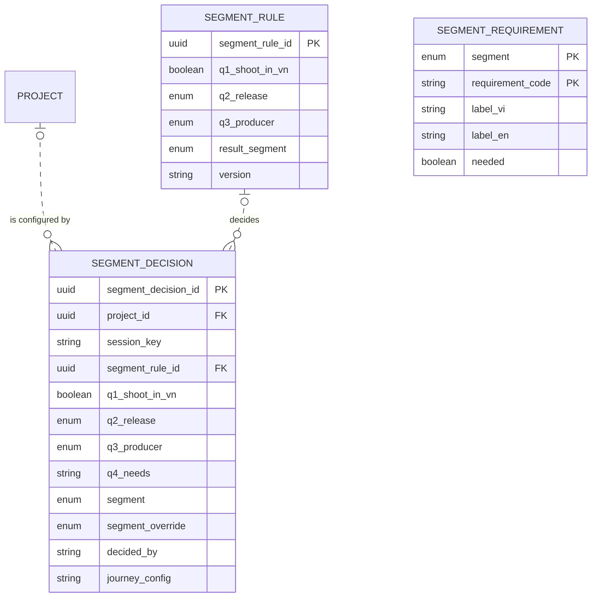

# Data Model and Mockup Data: Segment router (M1)

> Layout reconstructed from the Session 5 lecture (*Building an ERD with AI*, steps S0–S6 and human gates 1–6) and the Session 7 rubric (C3, C4, G2–G4), because the course template file was not available to the team. Sections marked *(mandatory)* are all filled. Generated by `tools/build_dm_docs.py` from the same sources as `data/01`–`05`, `data/schema/` and `data/seed/`; the numbers below are computed, not typed.

| Field | Value |
|---|---|
| Module | M1 — Segment router |
| Spec Document | `docs/spec/spec-M1.md` |
| Schema | `data/schema/schema-M1.sql` |
| Seed files | `07_segment_rule.csv`, `08_segment_requirement.csv`, `10_segment_decision.csv` |
| Version / date | v1.0 — 01/10/2026 |
| Prepared by | Group C (draft by an AI agent, see `docs/ai-use-log.md`) |
| Status | Ready for the human gates in section 13 |

## 1. Sources and input map (mandatory)

The model of this module is derived from `docs/spec/spec-M1.md` only — no entity, column or relationship was invented. The input map below is the one used for the whole product (`data/01-entity-dictionary.md`); citations use the scheme `<MODULE> §<section> <ID>`.

```text
INPUT MAP
I am providing the following slots. Treat every slot not listed here as ABSENT, and apply the
degradation rules rather than inventing the missing material.

  FUNCTIONS = section 5 FR tables of the 9 module Spec Documents in docs/spec/
              (spec-SYS, spec-M1, spec-M0, spec-M2, spec-M3, spec-M4, spec-M5, spec-M7, spec-M10),
              104 rows (Spec Documents of 30/09/2026)
  FIELDS    = section 5.1 "Input / Output contract" of the same documents
              (every field typed, inputs marked Req / Opt), plus section 6.1
              "Attribute types" (types of the section 6 attributes no 5.1 field declares)
  ENTITIES  = section 6 "Key entities" of the same documents, 51 declared entities
  RULES     = section 5.2 "Business rules" of the same documents (BR-001 ... per module)
  SCENARIOS = section 3 user stories US-n with Given / When / Then, plus "Edge cases"
  FLOWS     = section 4 Mermaid blocks (usage flows 4.1, sequence diagrams 4.2+)
  SCREENS   = section 7 tables + docs/screens/screen-spec-<ID>.md (41 Screen Specs)
  BOUNDARY  = section 1 "Depends on" (external: Supabase Auth / PostgreSQL / Storage,
              Resend email, language-model API, PDF rendering, OpenStreetMap tiles, PostGIS)

  Out of this input: M6, M8, M9 are Won't for this release (docs/prd.md §4.4).

CITATION SCHEME = <MODULE> §<section> <ID>
  e.g. "M3 §5.1 FR-008" (field row of F-M3-08) | "M3 §5.2 BR-004" | "M3 §3 US-2" | "M3 §6"
```

## 2. Entity catalogue (mandatory)

3 entities owned by M1: 3 stored, 0 derived. Every entity is declared in §6 of the Spec Document (*discovered here* would mark one that is not). Each entity has exactly one owner module.

| Entity | Definition (one sentence) | Kind | Owner | Source | Table | Seed file (rows) |
|---|---|---|---|---|---|---|
| `SEGMENT_RULE` | One row of the VFDA-approved decision table that maps router answers to segment A, B or C. | THING | M1 | spec §6 — M1 §6; M1 §5.2 BR-001 | `segment_rule` | `07_segment_rule.csv` (7) |
| `SEGMENT_REQUIREMENT` | One item a segment needs or does not need, used to configure the journey and the gauges. | THING | M1 | spec §6 — M1 §6; M0 §5.2 BR-004; M5 §5.2 BR-004 | `segment_requirement` | `08_segment_requirement.csv` (8) |
| `SEGMENT_DECISION` | The segment given to a visitor or project from their answers, including any manual override. | EVENT | M1 | spec §6 — M1 §6; M1 §5.1 FR-002 | `segment_decision` | `10_segment_decision.csv` (13) |

**Entities of other modules referenced here** (drawn without attributes in §5): `PROJECT` (M0).

## 3. Attributes (mandatory)

Every attribute traces to a §5.1 field, a §6.1 declared type, a key, or a deliberate audit column (*Source kind*). *Req* = required by the function; *Opt* = optional; *system-set* = filled by the system.

### SEGMENT_RULE

| Column | Type | Required | Key | Source kind | Citation |
|---|---|---|---|---|---|
| `segment_rule_id` | `UUID` | Req | PK | §6.1 declared type | M1 §6 (rule_id — renamed, see 01 conflicts); M1 §6.1 |
| `q1_shoot_in_vn` | `BOOLEAN` | Req |  | §5.1 field | M1 §6 (q1) = M1 §5.1 FR-002 q1_shoot_in_vn |
| `q2_release` | `ENUM(abroad, vietnam, both)` | Opt |  | §5.1 field | M1 §6 (q2) = M1 §5.1 FR-002 |
| `q3_producer` | `ENUM(foreign, vietnamese, coproduction)` | Opt |  | §5.1 field | M1 §6 (q3) = M1 §5.1 FR-002 |
| `result_segment` | `ENUM(A, B, C)` | not declared |  | §5.1 field | M1 §6; type of segment from M1 §5.1 FR-002 |
| `version` | `VARCHAR(20)` | Req |  | §6.1 declared type | M1 §6; M1 §6.1 |

**Natural key:** q1_shoot_in_vn + q2_release + q3_producer + version — the same answers always give the same segment (M1 BR-001).

### SEGMENT_REQUIREMENT

| Column | Type | Required | Key | Source kind | Citation |
|---|---|---|---|---|---|
| `segment` | `ENUM(A, B, C)` | not declared | PK | §5.1 field | M1 §6; type from M1 §5.1 FR-002 |
| `requirement_code` | `VARCHAR(40)` | Req | PK | §6.1 declared type | M1 §6; M1 §6.1 |
| `label_vi` | `TEXT` | Req |  | §6.1 declared type | M1 §6; M1 §6.1 |
| `label_en` | `TEXT` | Req |  | §6.1 declared type | M1 §6; M1 §6.1 |
| `needed` | `BOOLEAN` | Req |  | §6.1 declared type | M1 §6; M1 §3 US-1 (Needed / Not needed); M1 §6.1 |

**Natural key:** segment + requirement_code.

### SEGMENT_DECISION

| Column | Type | Required | Key | Source kind | Citation |
|---|---|---|---|---|---|
| `segment_decision_id` | `UUID` | Req | PK | §6.1 declared type | M1 §6.1 |
| `project_id` | `UUID` | Opt | FK → `PROJECT` | §6.1 declared type | M1 §6 ("belongs to Project (M0) once saved"); M1 §6.1 |
| `session_key` | `VARCHAR(40)` | Opt |  | §6.1 declared type | M1 §6 (anonymous session before sign-up); M1 §6.1 |
| `segment_rule_id` | `UUID` | Opt | FK → `SEGMENT_RULE` | §6.1 declared type | M1 §6 ("used by SegmentDecision"); M1 §6.1 |
| `q1_shoot_in_vn` | `BOOLEAN` | Req |  | §5.1 field | M1 §5.1 FR-002 (answers) |
| `q2_release` | `ENUM(abroad, vietnam, both)` | Opt |  | §5.1 field | M1 §5.1 FR-002 (Req when q1 = true) |
| `q3_producer` | `ENUM(foreign, vietnamese, coproduction)` | Opt |  | §5.1 field | M1 §5.1 FR-002 (Req when q1 = true) |
| `q4_needs` | `ENUM(locations, crew, cast, equipment, logistics)[]` | Opt |  | §5.1 field | M1 §5.1 FR-002; M1 §5.2 BR-002 |
| `segment` | `ENUM(A, B, C)` | system-set |  | §5.1 field | M1 §5.1 FR-002 (OUT) |
| `segment_override` | `ENUM(A, B, C)` | Opt |  | §5.1 field | M1 §5.1 FR-002; M1 §5.2 BR-003 — see Type conflicts |
| `decided_by` | `INTEGER[]` | system-set |  | §5.1 field | M1 §5.1 FR-002 (OUT) |
| `journey_config` | `JSONB` | system-set |  | §5.1 field | M1 §5.1 FR-002 (OUT) |

**Natural key:** None — the same answers may be given many times; a session key is not declared (open question).

## 4. Relationships (mandatory)

Each relationship is read in both directions; the citation is the spec line it comes from. **No many-to-many relationship is left unresolved**: every many-to-many need of this module is an associative entity (e.g. PROJECT_SHORTLIST, PROJECT_PROVINCE, PROJECT_MEMBER).

| Relationship | Forward reading | Reverse reading | Side that may be zero | Type | Citation |
|---|---|---|---|---|---|
| `PROJECT` \|o..o{ `SEGMENT_DECISION` | Each project is configured by zero or more segment decisions | Each segment decision configures zero or one project | both sides | non-identifying (`..`) | M1 §6 ("belongs to Project (M0) once saved"); M1 §3 Edge cases (nothing stored before saving) |
| `SEGMENT_RULE` \|o..o{ `SEGMENT_DECISION` | Each segment rule decides zero or more segment decisions | Each segment decision is decided by zero or one segment rule | both sides | non-identifying (`..`) | M1 §6 ("used by SegmentDecision"); M1 §3 US-2 (override); M1 §3 Edge cases (answers match no rule) |

## 5. ERD and diagram check (mandatory)

Entities of M1 with their attributes; entities of other modules appear as names only. Relationship lines are copied from `data/03-erd.mmd`.



Renders with mermaid-cli: **yes**.

**Diagram check** — computed by the generator; the build stops if a pair differs.

| Count | Value | Compared with | Value | Agree |
|---|---|---|---|---|
| Entities owned and stored (catalogue §2) | 3 | entity blocks in the ERD (§5) | 3 | ✓ |
| Entities owned and stored (catalogue §2) | 3 | tables in `schema-M1.sql` | 3 | ✓ |
| Attributes (§3) | 23 | columns in `schema-M1.sql` | 23 | ✓ |
| Relationships with the child in this module (§4) | 2 | FOREIGN KEY constraints in `schema-M1.sql` | 2 | ✓ |
| Relationships touching this module (§4) | 2 | relationship lines in the ERD (§5) | 2 | ✓ |
| Seed files of this module (§9) | 3 | tables in `schema-M1.sql` | 3 | ✓ |

## 6. Normalization check (mandatory)

| Table | 1NF | 2NF | 3NF |
|---|---|---|---|
| `SEGMENT_RULE` | ✓ | ✓ single-column key | ✓ |
| `SEGMENT_REQUIREMENT` | ✓ | ✓ composite key (segment, requirement_code): every non-key column describes the whole key | ✓ |
| `SEGMENT_DECISION` | exception: `q4_needs`, `decided_by` (array) | ✓ single-column key | ✓ |

**Deliberate exceptions and their upkeep rules**

| Column | Breaks | Why it is kept | Upkeep rule |
|---|---|---|---|
| `SEGMENT_DECISION.q4_needs` | 1NF (list in one column) | filtered and shown as a list | see note below |
| `SEGMENT_DECISION.decided_by` | 1NF (list in one column) | filtered and shown as a list | see note below |

Kept as a JSON array (1NF exception): the whole list is what functions filter and show; every value is checked against its declared set by seed_rules.py and, at the Plan step, by the input validation (01 OQ 3).

## 7. Business rules and where they are enforced (mandatory)

*SCHEMA* = a constraint in `data/schema/schema-M1.sql` today. *SEED CHECK* = `data/seed/seed_rules.py`, run by the generator before it writes and by `check_seed.py`. *TRIGGER / RLS / VIEW / APP* = built at the Plan step; the named object is the brief for the agent. *NOT DATA* = a rule about wording or an external service. The last column names the seed rows that demonstrate the rule.

| Rule | Statement | Enforced in | Named object | Seed rows that show it |
|---|---|---|---|---|
| BR-001 | The segment is decided by a deterministic decision table (`segment_rules`) approved by VFDA; the same answers always give the same segment. | SCHEMA + SEED CHECK | `pk_segment_rule`, `ck_segment_rule_result_segment`; seed_rules: a decision without override equals its rule | `07_segment_rule.csv` — abroad · foreign · A · 2026.1 — abroad + foreign → A<br>`07_segment_rule.csv` — abroad · foreign · A · 2025.12 — a superseded version is kept, never used |
| BR-002 | Question 4 never changes the segment; it only pre-selects service groups in M4. | APP (Plan step) | router function ignores q4_needs when choosing the segment | `10_segment_decision.csv` — session:5e0f7b22 · B — q4 = equipment, locations; segment from q1–q3 only |
| BR-003 | A manual override is always allowed and always recorded. | SCHEMA + SEED CHECK | `ck_segment_decision_segment_override`; seed_rules: an override sets the segment | `10_segment_decision.csv` — session:7c1e9a40 · B · B — override A → B is recorded<br>`10_segment_decision.csv` — session:0b6e93aa · C · C — override A → C is recorded |
| BR-004 | Changing segment never deletes documents or answers; items that no longer apply are hidden, not removed. | SEED CHECK + APP | segment change writes a new SEGMENT_DECISION; documents are never deleted | `10_segment_decision.csv` — B — Rice and Salt moved from A to B<br>`34_document_slot.csv` — A13_APPLICATION · present; A13_ART9_COMMITMENT · missing (+2) — its document slots are kept |

## 8. Schema (mandatory)

`data/schema/schema-M1.sql` — 3 tables in load order: `segment_rule`, `segment_requirement`, `segment_decision`; 2 foreign keys; 9 CHECK constraints. Portable SQL (SQLite 3 and PostgreSQL 14+).

Load test: `python3 data/schema/load_check.py` runs every schema file, then every seed file in filename order with foreign keys on — **PASS** (also on PostgreSQL 16 with `--postgres`).

## 9. Mockup data (mandatory)

| Item | Value |
|---|---|
| Generator | `data/seed/generate_seed.py` (writes nothing unless `seed_rules.validate` passes) |
| Regenerate | `python3 data/seed/generate_seed.py && python3 data/seed/check_seed.py` (must print PASS; `git status` stays clean) |
| Random seed | none — no randomness and no clock: keys are UUIDv5 of readable names (namespace `6f1c2a8e-3b4d-5e6f-8a9b-0c1d2e3f4a5b`), so every run is byte-identical |
| Business-rule values | computed by the generator, never typed: attention level (M2 BR-004), quote span (M2 §6.1), latest readiness (M0 §9), is_active, published |
| Files | 3 files of this module, 28 rows (product: 46 files, 427 rows) |

**Rows per file and row kinds** (1 = ordinary rows in every file)

| File | Rows | (2) Boundary | (3) Empty case | (4) Exceptional state |
|---|---|---|---|---|
| `07_segment_rule.csv` | 7 | — | `r0`: never used by a decision | `r0`: superseded version 2025.12 |
| `08_segment_requirement.csv` | 8 | — | C / ART13_LICENCE: *not needed* | — (no status column) |
| `10_segment_decision.csv` | 13 | empty `q4_needs` | guest session, no project | answers match no rule (no segment); overrides A → B, B → A, A → C |

## 10. Edge case register (mandatory)

Computed from the seed files. (a) every enumerated value has a row; (b) empty states; (c) one boundary per numeric or date rule; (d) one row per business rule — the last column of section 7.

**(a) Enumerated values**

| Column | Value | Seed rows |
|---|---|---|
| `SEGMENT_RULE.q2_release` | `abroad` | 3 row(s), e.g. abroad · coproduction · A · 2026.1 |
| `SEGMENT_RULE.q2_release` | `vietnam` | 2 row(s), e.g. vietnam · vietnamese · B · 2026.1 |
| `SEGMENT_RULE.q2_release` | `both` | 1 row(s), e.g. both · foreign · B · 2026.1 |
| `SEGMENT_RULE.q3_producer` | `foreign` | 4 row(s), e.g. vietnam · foreign · B · 2026.1 |
| `SEGMENT_RULE.q3_producer` | `vietnamese` | 1 row(s), e.g. vietnam · vietnamese · B · 2026.1 |
| `SEGMENT_RULE.q3_producer` | `coproduction` | 1 row(s), e.g. abroad · coproduction · A · 2026.1 |
| `SEGMENT_RULE.result_segment` | `A` | 3 row(s), e.g. abroad · coproduction · A · 2026.1 |
| `SEGMENT_RULE.result_segment` | `B` | 3 row(s), e.g. vietnam · vietnamese · B · 2026.1 |
| `SEGMENT_RULE.result_segment` | `C` | 1 row(s), e.g. C · 2026.1 |
| `SEGMENT_REQUIREMENT.segment` | `A` | 3 row(s), e.g. A · ART13_LICENCE · true |
| `SEGMENT_REQUIREMENT.segment` | `B` | 3 row(s), e.g. B · ART13_LICENCE · true |
| `SEGMENT_REQUIREMENT.segment` | `C` | 2 row(s), e.g. C · ART13_LICENCE · false |
| `SEGMENT_DECISION.q2_release` | `abroad` | 7 row(s), e.g. A |
| `SEGMENT_DECISION.q2_release` | `vietnam` | 3 row(s), e.g. B |
| `SEGMENT_DECISION.q2_release` | `both` | 1 row(s), e.g. session:5e0f7b22 · B |
| `SEGMENT_DECISION.q3_producer` | `foreign` | 9 row(s), e.g. A |
| `SEGMENT_DECISION.q3_producer` | `vietnamese` | 1 row(s), e.g. session:9a31c4e8 · B |
| `SEGMENT_DECISION.q3_producer` | `coproduction` | 1 row(s), e.g. session:c4d2a716 · A |
| `SEGMENT_DECISION.segment` | `A` | 6 row(s), e.g. A |
| `SEGMENT_DECISION.segment` | `B` | 4 row(s), e.g. B |
| `SEGMENT_DECISION.segment` | `C` | 2 row(s), e.g. C |
| `SEGMENT_DECISION.segment_override` | `A` | 1 row(s), e.g. session:d71f2c09 · A · A |
| `SEGMENT_DECISION.segment_override` | `B` | 1 row(s), e.g. session:7c1e9a40 · B · B |
| `SEGMENT_DECISION.segment_override` | `C` | 1 row(s), e.g. session:0b6e93aa · C · C |
| `SEGMENT_DECISION.q4_needs` | `locations` | 8 row(s), e.g. A |
| `SEGMENT_DECISION.q4_needs` | `crew` | 3 row(s), e.g. A |
| `SEGMENT_DECISION.q4_needs` | `cast` | 3 row(s), e.g. C |
| `SEGMENT_DECISION.q4_needs` | `equipment` | 2 row(s), e.g. session:5e0f7b22 · B |
| `SEGMENT_DECISION.q4_needs` | `logistics` | 1 row(s), e.g. B |

**(b) Empty states**

| Empty case | Seed rows |
|---|---|
| `SEGMENT_RULE` with no `SEGMENT_DECISION` (decides) | 1 row(s), e.g. abroad · foreign · A · 2025.12 |

**(c) Boundaries of numeric and date rules**

| Rule | Seed row |
|---|---|
| q2, q3 required only when q1 = true (M1 §5.1 FR-002) | `10_segment_decision.csv` — C; session:2b88f0d1 — q1 = false, no q2 / q3 |

**(d) Business rules** — 4 of 4 rules have their rows named in section 7.

## 11. Privacy declaration (mandatory)

- [x] No row describes a real person: every name is invented for this project (the persona list in `data/seed/README.md`).
- [x] Every e-mail address is on an `example` domain (`*.example.*`, `anonymised.example`) — checked by `seed_rules.py`.
- [x] Every phone number has the form `+84 000 000 1xx`, which cannot be a real Vietnamese number, and is used once — checked by `seed_rules.py`.
- [x] No identity document, passport, tax or bank number is stored anywhere in the model.
- [x] No real script is stored: pre-checks keep only a hash of the summary (M2 FR-007); synopsis texts in the seed are invented.
- [x] Organisations, producer companies and projects are fictional; locations and provinces are real public places, described with mock text.
- [x] Sensitive columns (authority contacts, partner private layer, project documents) are protected by Row Level Security (SYS BR-001) — listed in section 7.
- [x] Nobody in the team knows of a real value in the seed files.

Personal or sensitive columns in this module: none.

## 12. Open questions (mandatory)

Data questions raised in `data/01`–`04` whose owner includes M1. All other open points of the module are in `docs/spec/spec-M1.md` §10.

| Question | Blocking? | Owner | Status |
|---|---|---|---|
| [NEEDS CLARIFICATION: Does F-M1-01 read segment labels from the display dictionary (F-SYS-06) or from SEGMENT_REQUIREMENT?] | No | M1 owner | Open |
| [NEEDS CLARIFICATION: Which entity links SEGMENT_REQUIREMENT to DOCUMENT_TYPE (M5 BR-004 builds the kit from segment_requirements)?] | Yes | M1 + M5 owners | Open |
| [NEEDS CLARIFICATION: Should a segment decision record the decision-table version used?] | No | M1 owner | Open |
| [NEEDS CLARIFICATION: Declare identifiers for EMAIL_DELIVERY and SEGMENT_DECISION (none in the spec; LOCATION_QUERY now has query_id, M3 FR-011).] | No | SYS, M1 owners | Resolved 01/10/2026 — email_delivery_id UUID (SYS §6.1) and segment_decision_id UUID (M1 §6.1). |

## 13. Human gates and sign-off

The gates of the Session 5 process. The agent prepared every section above; a person checks and signs.

| Gate | What the person checks | Checked by | Date |
|---|---|---|---|
| 1 — Entity authority and naming | §2: names, one owner per entity, definitions rewritten in own words | pending | pending |
| 2 — CRUD anomalies | `data/02-crud-matrix.md` rows of this module | pending | pending |
| 3 — Relationships | §4: each relationship read aloud in both directions | pending | pending |
| 4 — Logical model | §3 types and keys; type decisions in `data/04-data-model.md` | pending | pending |
| 5 — Seed | `check_seed.py` and `load_check.py` print PASS on your laptop | pending | pending |
| 6 — Review | §6, §7 and `data/05-review.md`; challenge at least one result | pending | pending |
