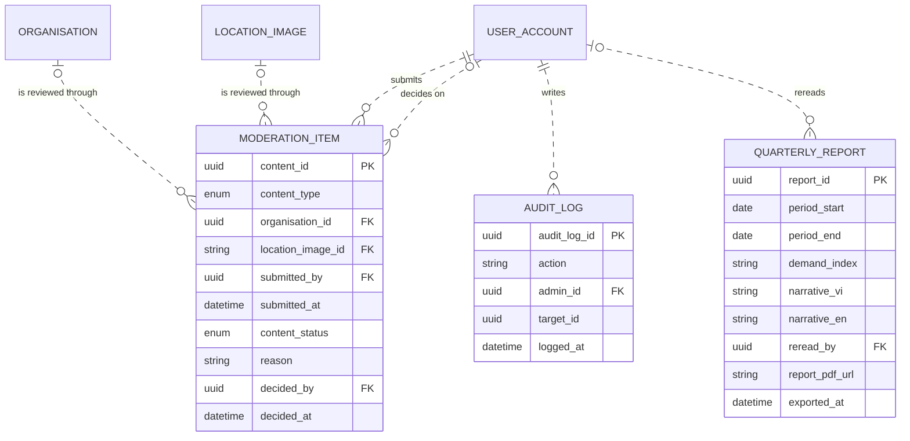

# Data Model and Mockup Data: VFDA back office — moderation, demand index, quarterly report, audit log (M10)

> Layout reconstructed from the Session 5 lecture (*Building an ERD with AI*, steps S0–S6 and human gates 1–6) and the Session 7 rubric (C3, C4, G2–G4), because the course template file was not available to the team. Sections marked *(mandatory)* are all filled. Generated by `tools/build_dm_docs.py` from the same sources as `data/01`–`05`, `data/schema/` and `data/seed/`; the numbers below are computed, not typed.

| Field | Value |
|---|---|
| Module | M10 — VFDA back office — moderation, demand index, quarterly report, audit log |
| Spec Document | `docs/spec/spec-M10.md` |
| Schema | `data/schema/schema-M10.sql` |
| Seed files | `44_moderation_item.csv`, `45_audit_log.csv`, `46_quarterly_report.csv` |
| Version / date | v1.0 — 01/10/2026 |
| Prepared by | Group C (draft by an AI agent, see `docs/ai-use-log.md`) |
| Status | Ready for the human gates in section 13 |

## 1. Sources and input map (mandatory)

The model of this module is derived from `docs/spec/spec-M10.md` only — no entity, column or relationship was invented. The input map below is the one used for the whole product (`data/01-entity-dictionary.md`); citations use the scheme `<MODULE> §<section> <ID>`.

```text
INPUT MAP
I am providing the following slots. Treat every slot not listed here as ABSENT, and apply the
degradation rules rather than inventing the missing material.

  FUNCTIONS = section 5 FR tables of the 9 module Spec Documents in docs/spec/
              (spec-SYS, spec-M1, spec-M0, spec-M2, spec-M3, spec-M4, spec-M5, spec-M7, spec-M10),
              104 rows (Spec Documents of 30/09/2026)
  FIELDS    = section 5.1 "Input / Output contract" of the same documents
              (every field typed, inputs marked Req / Opt), plus section 6.1
              "Attribute types" (types of the section 6 attributes no 5.1 field declares)
  ENTITIES  = section 6 "Key entities" of the same documents, 51 declared entities
  RULES     = section 5.2 "Business rules" of the same documents (BR-001 ... per module)
  SCENARIOS = section 3 user stories US-n with Given / When / Then, plus "Edge cases"
  FLOWS     = section 4 Mermaid blocks (usage flows 4.1, sequence diagrams 4.2+)
  SCREENS   = section 7 tables + docs/screens/screen-spec-<ID>.md (41 Screen Specs)
  BOUNDARY  = section 1 "Depends on" (external: Supabase Auth / PostgreSQL / Storage,
              Resend email, language-model API, PDF rendering, OpenStreetMap tiles, PostGIS)

  Out of this input: M6, M8, M9 are Won't for this release (docs/prd.md §4.4).

CITATION SCHEME = <MODULE> §<section> <ID>
  e.g. "M3 §5.1 FR-008" (field row of F-M3-08) | "M3 §5.2 BR-004" | "M3 §3 US-2" | "M3 §6"
```

## 2. Entity catalogue (mandatory)

4 entities owned by M10: 3 stored, 1 derived. Every entity is declared in §6 of the Spec Document (*discovered here* would mark one that is not). Each entity has exactly one owner module.

| Entity | Definition (one sentence) | Kind | Owner | Source | Table | Seed file (rows) |
|---|---|---|---|---|---|---|
| `MODERATION_ITEM` | A partner's published content (profile text or location photo) waiting for, or carrying, VFDA staff's approve-or-hide decision. | EVENT | M10 | spec §6 — M10 §6; M10 §5.1 FR-001, FR-002; M10 §5.2 BR-001 | `moderation_item` | `44_moderation_item.csv` (4) |
| `AUDIT_LOG` | A permanent record of one administrative action: who did what to which record, and when. | EVENT | M10 | spec §6 — M10 §6; M10 §5.1 FR-008; M10 §5.2 BR-005 | `audit_log` | `45_audit_log.csv` (14) |
| `DEMAND_INDEX` | The six demand indicators of a reporting period, each with its sample size, computed from platform data. | DERIVED (computed on read, not stored) | M10 | spec §6 — M10 §6 ("not stored"); M10 §5.1 FR-003; M10 §5.2 BR-003 | — | — |
| `QUARTERLY_REPORT` | A quarterly demand report with its bilingual commentary, reread by a staff member before it is exported. | THING | M10 | spec §6 — M10 §6; M10 §5.1 FR-006, FR-007; M10 §5.2 BR-004 | `quarterly_report` | `46_quarterly_report.csv` (1) |

**Entities of other modules referenced here** (drawn without attributes in §5): `LOCATION_IMAGE` (M3), `ORGANISATION` (M4), `USER_ACCOUNT` (SYS).

## 3. Attributes (mandatory)

Every attribute traces to a §5.1 field, a §6.1 declared type, a key, or a deliberate audit column (*Source kind*). *Req* = required by the function; *Opt* = optional; *system-set* = filled by the system.

### MODERATION_ITEM

| Column | Type | Required | Key | Source kind | Citation |
|---|---|---|---|---|---|
| `content_id` | `UUID` | Req | PK | §5.1 field | M10 §5.1 FR-002; FR-001 (OUT moderation_queue) |
| `content_type` | `ENUM(org_profile, location_image, showcase)` | system-set |  | §5.1 field | M10 §5.1 FR-001; M10 §9 (showcase waits for M8, phase 2) |
| `organisation_id` | `UUID` | Opt (CHECK) | FK → `ORGANISATION` | §5.1 field | M10 §6 ("refers to Organisation"); type of org_id, M4 §5.1 FR-001 — CHECK: exactly one of organisation_id, location_image_id (modelling choice) |
| `location_image_id` | `TEXT` | Opt (CHECK) | FK → `LOCATION_IMAGE` | §5.1 field | M10 §6 ("or LocationImage"); holds image_url, the only key of LOCATION_IMAGE (M3 §5.1 FR-003) — CHECK: exactly one of the two (modelling choice) |
| `submitted_by` | `UUID` | system-set | FK → `USER_ACCOUNT` | §5.1 field | M10 §5.1 FR-001 (OUT) |
| `submitted_at` | `TIMESTAMPTZ` | system-set |  | §5.1 field | M10 §5.1 FR-001 (OUT) |
| `content_status` | `ENUM(pending, approved, hidden)` | system-set |  | §5.1 field | M10 §5.1 FR-002 (OUT); M10 §5.2 BR-001 |
| `reason` | `TEXT` | Opt |  | §5.1 field | M10 §5.1 FR-002; M10 §5.2 BR-002 (required when hidden) |
| `decided_by` | `UUID` | Opt | FK → `USER_ACCOUNT` | §6.1 declared type | M10 §6; M10 §6.1 |
| `decided_at` | `TIMESTAMPTZ` | Opt |  | §6.1 declared type | M10 §6; M10 §6.1 |

**Natural key:** organisation_id or location_image_id + submitted_at; one pending item per content (M10 §3 Edge cases: the queue keeps only the latest version).

### AUDIT_LOG

| Column | Type | Required | Key | Source kind | Citation |
|---|---|---|---|---|---|
| `audit_log_id` | `UUID` | system-set | PK | §5.1 field | M10 §5.1 FR-008 (OUT) |
| `action` | `VARCHAR(60)` | Req |  | §5.1 field | M10 §5.1 FR-008; M10 §3 US-4 (location.publish) |
| `admin_id` | `UUID` | Req | FK → `USER_ACCOUNT` | §5.1 field | M10 §5.1 FR-008 (= actor_id in FR-009) |
| `target_id` | `UUID` | Opt |  | §5.1 field | M10 §5.1 FR-008 (any table — no foreign key, see Structural findings) |
| `logged_at` | `TIMESTAMPTZ` | system-set |  | §5.1 field | M10 §5.1 FR-008 (OUT); M10 §5.2 BR-005 (append-only) |

**Natural key:** None (append-only event, M10 BR-005); admin_id + action + target_id + logged_at in practice.

### QUARTERLY_REPORT

| Column | Type | Required | Key | Source kind | Citation |
|---|---|---|---|---|---|
| `report_id` | `UUID` | Req | PK | §5.1 field | M10 §5.1 FR-007 |
| `period_start` | `DATE` | Req |  | §5.1 field | M10 §6 (period) = M10 §5.1 FR-003 period_start |
| `period_end` | `DATE` | Req |  | §5.1 field | M10 §6 (period) = M10 §5.1 FR-003 period_end |
| `demand_index` | `JSONB` | Req |  | §5.1 field | M10 §5.1 FR-007 (the indicators the report was drafted from) |
| `narrative_vi` | `TEXT` | Req |  | §5.1 field | M10 §5.1 FR-006 (OUT), FR-007 |
| `narrative_en` | `TEXT` | system-set |  | §5.1 field | M10 §5.1 FR-006 (OUT) |
| `reread_by` | `UUID` | Req | FK → `USER_ACCOUNT` | §5.1 field | M10 §5.1 FR-007; M10 §5.2 BR-004 |
| `report_pdf_url` | `TEXT` | system-set |  | §5.1 field | M10 §5.1 FR-007 (OUT) |
| `exported_at` | `TIMESTAMPTZ` | Opt |  | §6.1 declared type | M10 §6; M10 §6.1 |

**Natural key:** period_start + period_end.

## 4. Relationships (mandatory)

Each relationship is read in both directions; the citation is the spec line it comes from. **No many-to-many relationship is left unresolved**: every many-to-many need of this module is an associative entity (e.g. PROJECT_SHORTLIST, PROJECT_PROVINCE, PROJECT_MEMBER).

| Relationship | Forward reading | Reverse reading | Side that may be zero | Type | Citation |
|---|---|---|---|---|---|
| `ORGANISATION` \|o..o{ `MODERATION_ITEM` | Each organisation is reviewed through zero or more moderation items | Each moderation item concerns zero or one organisation (exactly one of organisation or location image) | both sides | non-identifying (`..`) | M10 §6 ("refers to Organisation or LocationImage"); M10 §3 US-1 (content type org_profile) |
| `LOCATION_IMAGE` \|o..o{ `MODERATION_ITEM` | Each location image is reviewed through zero or more moderation items | Each moderation item concerns zero or one location image (exactly one of organisation or location image) | both sides | non-identifying (`..`) | M10 §6 ("refers to Organisation or LocationImage"); M10 §5.1 FR-001 (content type location_image) |
| `USER_ACCOUNT` \|\|..o{ `MODERATION_ITEM` | Each user account submits zero or more moderation items | Each moderation item is submitted by exactly one user account | MODERATION_ITEM side | non-identifying (`..`) | M10 §5.1 FR-001 (OUT submitted_by UUID) |
| `USER_ACCOUNT` \|o..o{ `MODERATION_ITEM` | Each user account decides on zero or more moderation items | Each moderation item is decided by zero or one user account (none while pending) | both sides | non-identifying (`..`) | M10 §6 ("decided by UserAccount"); M10 §5.1 FR-002 (content_status pending) |
| `USER_ACCOUNT` \|\|..o{ `AUDIT_LOG` | Each user account writes zero or more audit log records | Each audit log record is written for exactly one user account | AUDIT_LOG side | non-identifying (`..`) | M10 §6 ("belongs to UserAccount"); M10 §5.1 FR-008 admin_id Req |
| `USER_ACCOUNT` \|o..o{ `QUARTERLY_REPORT` | Each user account rereads zero or more quarterly reports | Each quarterly report is reread by zero or one user account (none until the reread is recorded) | both sides | non-identifying (`..`) | M10 §6 ("prepared by UserAccount"); M10 §5.1 FR-007 reread_by; M10 §3 US-3 (draft not yet reread) |

## 5. ERD and diagram check (mandatory)

Entities of M10 with their attributes; entities of other modules appear as names only. Relationship lines are copied from `data/03-erd.mmd`.



Renders with mermaid-cli: **yes**.

**Diagram check** — computed by the generator; the build stops if a pair differs.

| Count | Value | Compared with | Value | Agree |
|---|---|---|---|---|
| Entities owned and stored (catalogue §2) | 3 | entity blocks in the ERD (§5) | 3 | ✓ |
| Entities owned and stored (catalogue §2) | 3 | tables in `schema-M10.sql` | 3 | ✓ |
| Attributes (§3) | 24 | columns in `schema-M10.sql` | 24 | ✓ |
| Relationships with the child in this module (§4) | 6 | FOREIGN KEY constraints in `schema-M10.sql` | 6 | ✓ |
| Relationships touching this module (§4) | 6 | relationship lines in the ERD (§5) | 6 | ✓ |
| Seed files of this module (§9) | 3 | tables in `schema-M10.sql` | 3 | ✓ |

## 6. Normalization check (mandatory)

| Table | 1NF | 2NF | 3NF |
|---|---|---|---|
| `MODERATION_ITEM` | ✓ | ✓ single-column key | ✓ |
| `AUDIT_LOG` | ✓ | ✓ single-column key | ✓ |
| `QUARTERLY_REPORT` | ✓ | ✓ single-column key | exception: `demand_index` |

**Deliberate exceptions and their upkeep rules**

| Column | Breaks | Why it is kept | Upkeep rule |
|---|---|---|---|
| `QUARTERLY_REPORT.demand_index` | derived value | a reread report must not change afterwards | frozen at drafting time (M10 FR-007) |


## 7. Business rules and where they are enforced (mandatory)

*SCHEMA* = a constraint in `data/schema/schema-M10.sql` today. *SEED CHECK* = `data/seed/seed_rules.py`, run by the generator before it writes and by `check_seed.py`. *TRIGGER / RLS / VIEW / APP* = built at the Plan step; the named object is the brief for the agent. *NOT DATA* = a rule about wording or an external service. The last column names the seed rows that demonstrate the rule.

| Rule | Statement | Enforced in | Named object | Seed rows that show it |
|---|---|---|---|---|
| BR-001 | Content published by partners (profile text, photos) is shown to the public only after VFDA staff approve it; until then the last approved version stays public. | SCHEMA + RLS (Plan step) | `ck_moderation_item_content_status`; policy `rls_public_reads_approved_only` | `44_moderation_item.csv` — org_profile · pending; location_image · pending — waiting: the public sees the last approved version |
| BR-002 | Hiding content requires a written reason, which is sent to the author. | SCHEMA | `ck_moderation_item_hidden_needs_reason` | `44_moderation_item.csv` — location_image · hidden — hidden with a reason |
| BR-003 | Every indicator shows the number of records it was computed from; below 5 records it shows *Not enough data* instead of a value. | SEED CHECK + VIEW | seed_rules: indicators below 5 records carry no value; view `v_demand_index` | `46_quarterly_report.csv` — 2026-07-01 · 2026-09-30 — Q3 2026: indicators 4–6 below 5 records → *not enough data* |
| BR-004 | A quarterly report can be exported only after a named staff member has marked it reread; the draft commentary is never sent as written by the model. | SCHEMA | `ck_quarterly_report_reread_before_export` | `46_quarterly_report.csv` — 2026-07-01 · 2026-09-30 — reread by Nguyễn Thị Thu Hà, then exported |
| BR-005 | Audit records are append-only: no role, including admin, can update or delete them, and the admin action and its record are committed together or not at all. | TRIGGER (Plan step) | trigger `trg_audit_log_append_only`; the admin action and its record in one transaction | `45_audit_log.csv` — location.availability · 2026-09-25T15:05:00+07:00; location.unpublish · 2026-09-19T16:40:00+07:00 (+12) — 14 records; none edited |

## 8. Schema (mandatory)

`data/schema/schema-M10.sql` — 3 tables in load order: `moderation_item`, `audit_log`, `quarterly_report`; 6 foreign keys; 7 CHECK constraints. Portable SQL (SQLite 3 and PostgreSQL 14+).

Load test: `python3 data/schema/load_check.py` runs every schema file, then every seed file in filename order with foreign keys on — **PASS** (also on PostgreSQL 16 with `--postgres`).

## 9. Mockup data (mandatory)

| Item | Value |
|---|---|
| Generator | `data/seed/generate_seed.py` (writes nothing unless `seed_rules.validate` passes) |
| Regenerate | `python3 data/seed/generate_seed.py && python3 data/seed/check_seed.py` (must print PASS; `git status` stays clean) |
| Random seed | none — no randomness and no clock: keys are UUIDv5 of readable names (namespace `6f1c2a8e-3b4d-5e6f-8a9b-0c1d2e3f4a5b`), so every run is byte-identical |
| Business-rule values | computed by the generator, never typed: attention level (M2 BR-004), quote span (M2 §6.1), latest readiness (M0 §9), is_active, published |
| Files | 3 files of this module, 19 rows (product: 46 files, 427 rows) |

**Rows per file and row kinds** (1 = ordinary rows in every file)

| File | Rows | (2) Boundary | (3) Empty case | (4) Exceptional state |
|---|---|---|---|---|
| `44_moderation_item.csv` | 4 | — | organisations and photos never moderated | `pending`, `approved`, `hidden` with reason |
| `45_audit_log.csv` | 14 | — | accounts with no admin action | `rule.retire`, `location.unpublish`, `location.availability` (2 changes) |
| `46_quarterly_report.csv` | 1 | — | only one quarter reported | indicators 4–6 below 5 records: *not enough data* (M10 BR-003) |

## 10. Edge case register (mandatory)

Computed from the seed files. (a) every enumerated value has a row; (b) empty states; (c) one boundary per numeric or date rule; (d) one row per business rule — the last column of section 7.

**(a) Enumerated values**

| Column | Value | Seed rows |
|---|---|---|
| `MODERATION_ITEM.content_type` | `org_profile` | 2 row(s), e.g. org_profile · pending |
| `MODERATION_ITEM.content_type` | `location_image` | 2 row(s), e.g. location_image · hidden |
| `MODERATION_ITEM.content_type` | `showcase` | not used — phase 2 (M8) |
| `MODERATION_ITEM.content_status` | `pending` | 2 row(s), e.g. org_profile · pending |
| `MODERATION_ITEM.content_status` | `approved` | 1 row(s), e.g. org_profile · approved |
| `MODERATION_ITEM.content_status` | `hidden` | 1 row(s), e.g. location_image · hidden |

**(b) Empty states**

No optional child relationship starts in this module.

**(c) Boundaries of numeric and date rules**

| Rule | Seed row |
|---|---|
| Below 5 records → not enough data (M10 BR-003) | `46_quarterly_report.csv` — 2026-07-01 · 2026-09-30 — indicator 5: 3 records, no value |
| Period end ≥ start (ck_quarterly_report_period) | `46_quarterly_report.csv` — 2026-07-01 · 2026-09-30 — 01/07–30/09/2026 |

**(d) Business rules** — 5 of 5 rules have their rows named in section 7.

## 11. Privacy declaration (mandatory)

- [x] No row describes a real person: every name is invented for this project (the persona list in `data/seed/README.md`).
- [x] Every e-mail address is on an `example` domain (`*.example.*`, `anonymised.example`) — checked by `seed_rules.py`.
- [x] Every phone number has the form `+84 000 000 1xx`, which cannot be a real Vietnamese number, and is used once — checked by `seed_rules.py`.
- [x] No identity document, passport, tax or bank number is stored anywhere in the model.
- [x] No real script is stored: pre-checks keep only a hash of the summary (M2 FR-007); synopsis texts in the seed are invented.
- [x] Organisations, producer companies and projects are fictional; locations and provinces are real public places, described with mock text.
- [x] Sensitive columns (authority contacts, partner private layer, project documents) are protected by Row Level Security (SYS BR-001) — listed in section 7.
- [x] Nobody in the team knows of a real value in the seed files.

Personal or sensitive columns in this module: none.

## 12. Open questions (mandatory)

Data questions raised in `data/01`–`04` whose owner includes M10. All other open points of the module are in `docs/spec/spec-M10.md` §10.

| Question | Blocking? | Owner | Status |
|---|---|---|---|
| [NEEDS CLARIFICATION: Where does the audit log live before M10 has a Spec Document?] | Yes | Nam (M10) | Resolved 30/09/2026 — M10 now has a Spec Document: AUDIT_LOG is modelled from M10 §6 and §5.1 FR-008, append-only (M10 §5.2 BR-005). |
| [NEEDS CLARIFICATION: Where is the submitted version of a partner's content kept while the last approved version stays public (M10 BR-001)?] | Yes | M10 + M4 owners | Open |
| [NEEDS CLARIFICATION: Add a creation time to PROJECT and LOCATION_QUERY so the demand index can be filtered by period (M10 FR-003, FR-005)?] | No | M0, M3, M10 owners | Open |
| [NEEDS CLARIFICATION: Which function lets a partner submit a location photo for moderation? F-M3-03 is for VFDA staff only.] | No | M3 + M10 owners | Open |
| [NEEDS CLARIFICATION: AUDIT_LOG.target_id is a UUID; how are actions on rows keyed by text (image_url, rule_version, doc_code) recorded?] | No | M10 owner | Open |

## 13. Human gates and sign-off

The gates of the Session 5 process. The agent prepared every section above; a person checks and signs.

| Gate | What the person checks | Checked by | Date |
|---|---|---|---|
| 1 — Entity authority and naming | §2: names, one owner per entity, definitions rewritten in own words | pending | pending |
| 2 — CRUD anomalies | `data/02-crud-matrix.md` rows of this module | pending | pending |
| 3 — Relationships | §4: each relationship read aloud in both directions | pending | pending |
| 4 — Logical model | §3 types and keys; type decisions in `data/04-data-model.md` | pending | pending |
| 5 — Seed | `check_seed.py` and `load_check.py` print PASS on your laptop | pending | pending |
| 6 — Review | §6, §7 and `data/05-review.md`; challenge at least one result | pending | pending |
