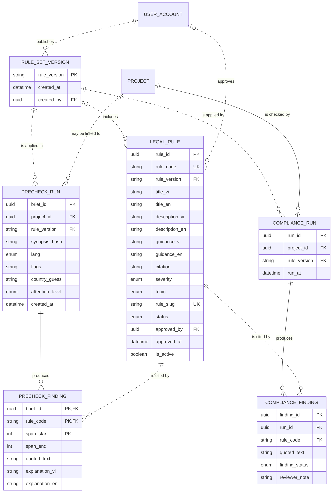

# Data Model and Mockup Data: Content pre-check and Article 13 dossier check (M2)

> Layout reconstructed from the Session 5 lecture (*Building an ERD with AI*, steps S0–S6 and human gates 1–6) and the Session 7 rubric (C3, C4, G2–G4), because the course template file was not available to the team. Sections marked *(mandatory)* are all filled. Generated by `tools/build_dm_docs.py` from the same sources as `data/01`–`05`, `data/schema/` and `data/seed/`; the numbers below are computed, not typed.

| Field | Value |
|---|---|
| Module | M2 — Content pre-check and Article 13 dossier check |
| Spec Document | `docs/spec/spec-M2.md` |
| Schema | `data/schema/schema-M2.sql` |
| Seed files | `16_legal_rule.csv`, `15_rule_set_version.csv`, `17_precheck_run.csv`, `18_precheck_finding.csv`, `19_compliance_run.csv`, `20_compliance_finding.csv` |
| Version / date | v1.0 — 01/10/2026 |
| Prepared by | Group C (draft by an AI agent, see `docs/ai-use-log.md`) |
| Status | Ready for the human gates in section 13 |

## 1. Sources and input map (mandatory)

The model of this module is derived from `docs/spec/spec-M2.md` only — no entity, column or relationship was invented. The input map below is the one used for the whole product (`data/01-entity-dictionary.md`); citations use the scheme `<MODULE> §<section> <ID>`.

```text
INPUT MAP
I am providing the following slots. Treat every slot not listed here as ABSENT, and apply the
degradation rules rather than inventing the missing material.

  FUNCTIONS = section 5 FR tables of the 9 module Spec Documents in docs/spec/
              (spec-SYS, spec-M1, spec-M0, spec-M2, spec-M3, spec-M4, spec-M5, spec-M7, spec-M10),
              104 rows (Spec Documents of 30/09/2026)
  FIELDS    = section 5.1 "Input / Output contract" of the same documents
              (every field typed, inputs marked Req / Opt), plus section 6.1
              "Attribute types" (types of the section 6 attributes no 5.1 field declares)
  ENTITIES  = section 6 "Key entities" of the same documents, 51 declared entities
  RULES     = section 5.2 "Business rules" of the same documents (BR-001 ... per module)
  SCENARIOS = section 3 user stories US-n with Given / When / Then, plus "Edge cases"
  FLOWS     = section 4 Mermaid blocks (usage flows 4.1, sequence diagrams 4.2+)
  SCREENS   = section 7 tables + docs/screens/screen-spec-<ID>.md (41 Screen Specs)
  BOUNDARY  = section 1 "Depends on" (external: Supabase Auth / PostgreSQL / Storage,
              Resend email, language-model API, PDF rendering, OpenStreetMap tiles, PostGIS)

  Out of this input: M6, M8, M9 are Won't for this release (docs/prd.md §4.4).

CITATION SCHEME = <MODULE> §<section> <ID>
  e.g. "M3 §5.1 FR-008" (field row of F-M3-08) | "M3 §5.2 BR-004" | "M3 §3 US-2" | "M3 §6"
```

## 2. Entity catalogue (mandatory)

8 entities owned by M2: 6 stored, 2 derived. Every entity is declared in §6 of the Spec Document (*discovered here* would mark one that is not). Each entity has exactly one owner module.

| Entity | Definition (one sentence) | Kind | Owner | Source | Table | Seed file (rows) |
|---|---|---|---|---|---|---|
| `LEGAL_RULE` | A content or dossier rule written and signed by the VFDA Legal Board, with its legal citation. | THING | M2 | spec §6 — M2 §6; M2 §5.1 FR-001, FR-002; M2 §5.2 BR-008 | `legal_rule` | `16_legal_rule.csv` (9) |
| `RULE_SET_VERSION` | A numbered edition of the active rule set, created each time a rule is activated. | EVENT | M2 | spec §6 — M2 §6; M2 §5.1 FR-004 | `rule_set_version` | `15_rule_set_version.csv` (3) |
| `PRECHECK_RUN` | One 200-word content pre-check, kept as a demand data point. | EVENT | M2 | spec §6 — M2 §6; M2 §5.1 FR-007 | `precheck_run` | `17_precheck_run.csv` (7) |
| `PRECHECK_FINDING` | One passage of a pre-checked summary that matches an approved rule. | EVENT | M2 | spec §6 — M2 §6; M2 §5.1 FR-006 | `precheck_finding` | `18_precheck_finding.csv` (6) |
| `COMPLIANCE_RUN` | One content check of a project against the active rule set. | EVENT | M2 | spec §6 — M2 §6 | `compliance_run` | `19_compliance_run.csv` (6) |
| `COMPLIANCE_FINDING` | One finding of a project content check that a member can mark as reviewed. | EVENT | M2 | spec §6 — M2 §6; M2 §5.1 FR-014 | `compliance_finding` | `20_compliance_finding.csv` (6) |
| `DOSSIER_CHECK` | The Article 13 completeness result of a project, computed from its document slots. | DERIVED (computed on read, not stored) | M2 | spec §6 — M2 §6 ("derived from DocumentSlots (M5)") | — | — |
| `LICENSING_TIMELINE` | The safe and latest submission dates of a project, computed from its first shooting day. | DERIVED (computed on read, not stored) | M2 | spec §6 — M2 §6 ("derived from Project.shoot_date"); M2 §5.2 BR-006 | — | — |

**Entities of other modules referenced here** (drawn without attributes in §5): `PROJECT` (M0), `USER_ACCOUNT` (SYS).

## 3. Attributes (mandatory)

Every attribute traces to a §5.1 field, a §6.1 declared type, a key, or a deliberate audit column (*Source kind*). *Req* = required by the function; *Opt* = optional; *system-set* = filled by the system.

### LEGAL_RULE

| Column | Type | Required | Key | Source kind | Citation |
|---|---|---|---|---|---|
| `rule_id` | `UUID` | system-set | PK | §5.1 field | M2 §5.1 FR-002 (OUT) |
| `rule_code` | `VARCHAR(40)` | Req | UK | §5.1 field | M2 §5.1 FR-002 |
| `rule_version` | `VARCHAR(20)` | system-set | FK → `RULE_SET_VERSION` | §5.1 field | M2 §6; M2 §5.1 FR-002 (OUT version INTEGER) — see Type conflicts |
| `title_vi` | `VARCHAR(200)` | Req |  | §5.1 field | M2 §5.1 FR-002 |
| `title_en` | `VARCHAR(200)` | Req |  | §5.1 field | M2 §5.1 FR-002 |
| `description_vi` | `TEXT` | Req |  | §5.1 field | M2 §5.1 FR-002 |
| `description_en` | `TEXT` | Req |  | §5.1 field | M2 §5.1 FR-002 |
| `guidance_vi` | `TEXT` | Req |  | §5.1 field | M2 §5.1 FR-002 |
| `guidance_en` | `TEXT` | Req |  | §5.1 field | M2 §5.1 FR-002 |
| `citation` | `VARCHAR(200)` | Req |  | §5.1 field | M2 §5.1 FR-002; M2 §5.2 BR-002 (CHECK) |
| `severity` | `ENUM(notice, action)` | Req |  | §5.1 field | M2 §5.1 FR-002 |
| `topic` | `ENUM(security, history, religion, privacy, dossier, public_order, heritage)` | Req |  | §5.1 field | M2 §5.1 FR-002 (Req), FR-001 (filter_topic) — FR-015 declares VARCHAR(60), see Type conflicts |
| `rule_slug` | `VARCHAR(120)` | Req | UK | §5.1 field | M2 §5.1 FR-016 |
| `status` | `ENUM(draft, approved, retired)` | Opt |  | §5.1 field | M2 §5.1 FR-001 (filter_status); M2 §6; M2 §5.2 BR-008 (retired, never deleted) |
| `approved_by` | `UUID` | Req | FK → `USER_ACCOUNT` | §5.1 field | M2 §5.1 FR-003 (approver_id); M2 §5.2 BR-002 (CHECK) |
| `approved_at` | `TIMESTAMPTZ` | system-set |  | §5.1 field | M2 §5.1 FR-003 (OUT) |
| `is_active` | `BOOLEAN` | system-set |  | §5.1 field | M2 §5.1 FR-003 (OUT) |

**Natural key:** rule_code today; rule_code + rule_version once one text per version is kept, as M2 BR-008 now requires (OQ-04-24).

### RULE_SET_VERSION

| Column | Type | Required | Key | Source kind | Citation |
|---|---|---|---|---|---|
| `rule_version` | `VARCHAR(20)` | system-set | PK | §5.1 field | M2 §5.1 FR-004 (OUT) — see Type conflicts |
| `created_at` | `TIMESTAMPTZ` | Req |  | §6.1 declared type | M2 §6; M2 §6.1 |
| `created_by` | `UUID` | Req | FK → `USER_ACCOUNT` | §6.1 declared type | M2 §6; M2 §6.1 |

**Natural key:** rule_version.

### PRECHECK_RUN

| Column | Type | Required | Key | Source kind | Citation |
|---|---|---|---|---|---|
| `brief_id` | `UUID` | system-set | PK | §5.1 field | M2 §5.1 FR-007 (OUT) |
| `project_id` | `UUID` | Opt | FK → `PROJECT` | §6.1 declared type | M2 §6 ("may belong to a Project"); M2 §6.1 |
| `rule_version` | `VARCHAR(20)` | system-set | FK → `RULE_SET_VERSION` | key | M2 §6; M2 §5.2 BR-007 |
| `synopsis_hash` | `TEXT` | Req |  | §5.1 field | M2 §5.1 FR-007 |
| `lang` | `ENUM(en, vi)` | Req |  | §5.1 field | M2 §5.1 FR-005 (= locale ENUM(vi, en) in FR-007) |
| `flags` | `JSONB` | Opt |  | §5.1 field | M2 §5.1 FR-005 |
| `country_guess` | `VARCHAR(2)` | Opt |  | §5.1 field | M2 §5.1 FR-007 |
| `attention_level` | `ENUM(low, medium, high)` | system-set |  | §5.1 field | M2 §5.1 FR-006 (OUT); M2 §5.2 BR-004 |
| `created_at` | `TIMESTAMPTZ` | Req |  | §6.1 declared type | M2 §6; M2 §6.1 |

**Natural key:** None — the same summary may be checked many times (synopsis_hash + created_at in practice).

### PRECHECK_FINDING

| Column | Type | Required | Key | Source kind | Citation |
|---|---|---|---|---|---|
| `brief_id` | `UUID` | Req | PK, FK → `PRECHECK_RUN` | key | M2 §6 ("belongs to PrecheckRun") |
| `rule_code` | `VARCHAR(40)` | system-set | PK, FK → `LEGAL_RULE` | §5.1 field | M2 §5.1 FR-006 (OUT findings) |
| `span_start` | `INTEGER` | Req | PK | §6.1 declared type | M2 §6; M2 §6.1 |
| `span_end` | `INTEGER` | Req |  | §6.1 declared type | M2 §6; M2 §6.1 |
| `quoted_text` | `TEXT` | system-set |  | §5.1 field | M2 §5.1 FR-006 (OUT) |
| `explanation_vi` | `TEXT` | system-set |  | §5.1 field | M2 §5.1 FR-006 (OUT); M2 §6 (explanation) |
| `explanation_en` | `TEXT` | system-set |  | §5.1 field | M2 §5.1 FR-006 (OUT) |

**Natural key:** brief_id + rule_code + span_start.

### COMPLIANCE_RUN

| Column | Type | Required | Key | Source kind | Citation |
|---|---|---|---|---|---|
| `run_id` | `UUID` | Req | PK | §6.1 declared type | M2 §6; M2 §6.1 |
| `project_id` | `UUID` | Req | FK → `PROJECT` | §6.1 declared type | M2 §6; M2 §6.1 |
| `rule_version` | `VARCHAR(20)` | not declared | FK → `RULE_SET_VERSION` | key | M2 §6; M2 §5.2 BR-007 |
| `run_at` | `TIMESTAMPTZ` | Req |  | §6.1 declared type | M2 §6; M2 §6.1 |

**Natural key:** project_id + run_at.

### COMPLIANCE_FINDING

| Column | Type | Required | Key | Source kind | Citation |
|---|---|---|---|---|---|
| `finding_id` | `UUID` | Req | PK | §5.1 field | M2 §5.1 FR-014 |
| `run_id` | `UUID` | Req | FK → `COMPLIANCE_RUN` | §6.1 declared type | M2 §6 ("belongs to ComplianceRun"); M2 §6.1 |
| `rule_code` | `VARCHAR(40)` | system-set | FK → `LEGAL_RULE` | §5.1 field | M2 §6; type from M2 §5.1 FR-006 |
| `quoted_text` | `TEXT` | system-set |  | §5.1 field | M2 §6; type from M2 §5.1 FR-006 |
| `finding_status` | `ENUM(open, reviewed)` | system-set |  | §5.1 field | M2 §5.1 FR-014 (OUT) |
| `reviewer_note` | `TEXT` | Opt |  | §5.1 field | M2 §5.1 FR-014 |

**Natural key:** run_id + rule_code + quoted_text.

## 4. Relationships (mandatory)

Each relationship is read in both directions; the citation is the spec line it comes from. **No many-to-many relationship is left unresolved**: every many-to-many need of this module is an associative entity (e.g. PROJECT_SHORTLIST, PROJECT_PROVINCE, PROJECT_MEMBER).

| Relationship | Forward reading | Reverse reading | Side that may be zero | Type | Citation |
|---|---|---|---|---|---|
| `RULE_SET_VERSION` \|o..\|{ `LEGAL_RULE` | Each rule set version includes one or more legal rules | Each legal rule is included in zero or one rule set version | LEGAL_RULE's version (draft rules have none) | non-identifying (`..`) | M2 §6 ("has many LegalRules"); M2 §5.1 FR-004 (version created on activation) |
| `USER_ACCOUNT` \|\|..o{ `RULE_SET_VERSION` | Each user account publishes zero or more rule set versions | Each rule set version is published by exactly one user account | RULE_SET_VERSION side | non-identifying (`..`) | M2 §6 (created_by); M2 §5.1 FR-004 (version created on each activation) |
| `USER_ACCOUNT` \|o..o{ `LEGAL_RULE` | Each user account approves zero or more legal rules | Each legal rule is approved by zero or one user account | both sides | non-identifying (`..`) | M2 §6 (approved_by); M2 §3 US-3 (draft rule has no approver) |
| `RULE_SET_VERSION` \|\|..o{ `PRECHECK_RUN` | Each rule set version is applied in zero or more pre-check runs | Each pre-check run applies exactly one rule set version | PRECHECK_RUN side | non-identifying (`..`) | M2 §6 (rule_version); M2 §5.2 BR-007 |
| `PROJECT` \|o..o{ `PRECHECK_RUN` | Each project is linked to zero or more pre-check runs | Each pre-check run is linked to zero or one project | both sides | non-identifying (`..`) | M2 §6 ("may belong to a Project"); M2 §3 US-1 (guest, no sign-up) |
| `PRECHECK_RUN` \|\|--o{ `PRECHECK_FINDING` | Each pre-check run produces zero or more pre-check findings | Each pre-check finding is produced by exactly one pre-check run | PRECHECK_FINDING side | identifying (`--`) | M2 §6; M2 §3 US-1 ("Given no findings") |
| `LEGAL_RULE` \|\|..o{ `PRECHECK_FINDING` | Each legal rule is cited by zero or more pre-check findings | Each pre-check finding cites exactly one legal rule | PRECHECK_FINDING side | non-identifying (`..`) | M2 §6 (rule_code); M2 §5.2 BR-001 |
| `RULE_SET_VERSION` \|\|..o{ `COMPLIANCE_RUN` | Each rule set version is applied in zero or more compliance runs | Each compliance run applies exactly one rule set version | COMPLIANCE_RUN side | non-identifying (`..`) | M2 §6 (rule_version); M2 §5.2 BR-007 |
| `PROJECT` \|\|--o{ `COMPLIANCE_RUN` | Each project is checked by zero or more compliance runs | Each compliance run checks exactly one project | COMPLIANCE_RUN side | identifying (`--`) | M2 §6 ("belongs to Project") |
| `COMPLIANCE_RUN` \|\|--o{ `COMPLIANCE_FINDING` | Each compliance run produces zero or more compliance findings | Each compliance finding is produced by exactly one compliance run | COMPLIANCE_FINDING side | identifying (`--`) | M2 §6; M2 §3 US-1 ("Given no findings") |
| `LEGAL_RULE` \|\|..o{ `COMPLIANCE_FINDING` | Each legal rule is cited by zero or more compliance findings | Each compliance finding cites exactly one legal rule | COMPLIANCE_FINDING side | non-identifying (`..`) | M2 §6 (rule_code); M2 §5.2 BR-001 |

## 5. ERD and diagram check (mandatory)

Entities of M2 with their attributes; entities of other modules appear as names only. Relationship lines are copied from `data/03-erd.mmd`.



Renders with mermaid-cli: **yes**.

**Diagram check** — computed by the generator; the build stops if a pair differs.

| Count | Value | Compared with | Value | Agree |
|---|---|---|---|---|
| Entities owned and stored (catalogue §2) | 6 | entity blocks in the ERD (§5) | 6 | ✓ |
| Entities owned and stored (catalogue §2) | 6 | tables in `schema-M2.sql` | 6 | ✓ |
| Attributes (§3) | 46 | columns in `schema-M2.sql` | 46 | ✓ |
| Relationships with the child in this module (§4) | 11 | FOREIGN KEY constraints in `schema-M2.sql` | 11 | ✓ |
| Relationships touching this module (§4) | 11 | relationship lines in the ERD (§5) | 11 | ✓ |
| Seed files of this module (§9) | 6 | tables in `schema-M2.sql` | 6 | ✓ |

## 6. Normalization check (mandatory)

| Table | 1NF | 2NF | 3NF |
|---|---|---|---|
| `LEGAL_RULE` | ✓ | ✓ single-column key | exception: `is_active` |
| `RULE_SET_VERSION` | ✓ | ✓ single-column key | ✓ |
| `PRECHECK_RUN` | ✓ | ✓ single-column key | ✓ |
| `PRECHECK_FINDING` | ✓ | ✓ composite key (brief_id, rule_code, span_start): every non-key column describes the whole key | ✓ |
| `COMPLIANCE_RUN` | ✓ | ✓ single-column key | ✓ |
| `COMPLIANCE_FINDING` | ✓ | ✓ single-column key | ✓ |

**Deliberate exceptions and their upkeep rules**

| Column | Breaks | Why it is kept | Upkeep rule |
|---|---|---|---|
| `LEGAL_RULE.is_active` | 3NF (depends on status) | read on every pre-check | CHECK `ck_legal_rule_active_matches_status` |


## 7. Business rules and where they are enforced (mandatory)

*SCHEMA* = a constraint in `data/schema/schema-M2.sql` today. *SEED CHECK* = `data/seed/seed_rules.py`, run by the generator before it writes and by `check_seed.py`. *TRIGGER / RLS / VIEW / APP* = built at the Plan step; the named object is the brief for the agent. *NOT DATA* = a rule about wording or an external service. The last column names the seed rows that demonstrate the rule.

| Rule | Statement | Enforced in | Named object | Seed rows that show it |
|---|---|---|---|---|
| BR-001 | Every finding shown to a user cites a rule written and signed by the VFDA Legal Board; findings without a valid citation are dropped by code before display. | APP (Plan step) + SCHEMA | Edge Function drops unverified findings; `fk_precheck_finding_rule_code` → `legal_rule.rule_code` | `17_precheck_run.csv` — cc6bcb72 — every finding dropped: no level shown<br>`18_precheck_finding.csv` — A9-MIL · đồn biên phòng trên núi; A9-MIL · soldiers ask him to take them across i — a kept finding cites an approved rule |
| BR-002 | A rule becomes active only when it has a citation **and** an approver; this is enforced by a database CHECK constraint. | SCHEMA | `ck_legal_rule_approved_needs_signature` | `16_legal_rule.csv` — A9-DRUG · draft · action; A9-HERIT · draft · notice — draft rules without citation and approver (cannot be active)<br>`16_legal_rule.csv` — A9-LONG · approved · action; A9-PERSON · approved · notice (+4) — approved rules carry both |
| BR-003 | The words *approved*, *accepted*, *legally compliant* and *safe* never appear in results, including when nothing is found. | NOT DATA | wording rule of the result screens (SC-48, SC-27); tested by acceptance scenario M2 US-1 | `17_precheck_run.csv` — US · low; FR · low (+2) — a *Low* result must still not say *safe* |
| BR-004 | The attention level is derived deterministically from the number and severity of verified findings, never from a model score. | SEED CHECK + APP | seed_rules.attention_level() (M2 §9 thresholds) computes the level before writing | `17_precheck_run.csv` — VN · high — 2 *action* findings → High<br>`17_precheck_run.csv` — KR · medium — 1 *action* finding → Medium<br>`17_precheck_run.csv` — US · low — 1 *notice* finding → Low (corrected 01/10/2026) |
| BR-005 | The dossier completeness check uses fixed rules, not a language model. | VIEW (Plan step) | view `v_dossier_check` counts slots in state `present` — no language model | `34_document_slot.csv` — A13_APPLICATION · present — 1 of 4 components present for The Last Ferry |
| BR-006 | Safe deadline = first shooting day − buffer − 20 − 20 days; latest deadline = first shooting day − buffer − 20 days. | VIEW (Plan step) | view `v_licensing_timeline` (shoot_date − buffer − 20 [− 20]) | `09_project.csv` — The Last Ferry · A · preparing — 15/03/2027, buffer 7 → 27/01/2027 and 16/02/2027<br>`09_project.csv` — Quiet Harbour Blues · A · preparing — safe deadline already passed |
| BR-007 | Every check stores the rule-set version it used. | SCHEMA | `fk_precheck_run_rule_version`, `fk_compliance_run_rule_version` (NOT NULL on compliance runs) | `19_compliance_run.csv` — 2026.07 · 2026-08-10T14:00:00+07:00 — older run kept with its older version |
| BR-008 | Legal rules are retired, never deleted (`status = retired`); a finding keeps showing the text of the rule version it cited. | SCHEMA + SEED CHECK | `ck_legal_rule_status`, `ck_legal_rule_active_matches_status`; no DELETE in any function | `16_legal_rule.csv` — A9-MAP · retired · action — A9-MAP retired, not active, not deleted<br>`45_audit_log.csv` — rule.retire · 2026-08-28T15:35:00+07:00 — the retirement is audited |

## 8. Schema (mandatory)

`data/schema/schema-M2.sql` — 6 tables in load order: `rule_set_version`, `legal_rule`, `precheck_run`, `precheck_finding`, `compliance_run`, `compliance_finding`; 11 foreign keys; 9 CHECK constraints. Portable SQL (SQLite 3 and PostgreSQL 14+).

Load test: `python3 data/schema/load_check.py` runs every schema file, then every seed file in filename order with foreign keys on — **PASS** (also on PostgreSQL 16 with `--postgres`).

## 9. Mockup data (mandatory)

| Item | Value |
|---|---|
| Generator | `data/seed/generate_seed.py` (writes nothing unless `seed_rules.validate` passes) |
| Regenerate | `python3 data/seed/generate_seed.py && python3 data/seed/check_seed.py` (must print PASS; `git status` stays clean) |
| Random seed | none — no randomness and no clock: keys are UUIDv5 of readable names (namespace `6f1c2a8e-3b4d-5e6f-8a9b-0c1d2e3f4a5b`), so every run is byte-identical |
| Business-rule values | computed by the generator, never typed: attention level (M2 BR-004), quote span (M2 §6.1), latest readiness (M0 §9), is_active, published |
| Files | 6 files of this module, 37 rows (product: 46 files, 427 rows) |

**Rows per file and row kinds** (1 = ordinary rows in every file)

| File | Rows | (2) Boundary | (3) Empty case | (4) Exceptional state |
|---|---|---|---|---|
| `16_legal_rule.csv` | 9 | 200-character title | `A9-RELIG`: never cited by a pre-check | `A9-DRUG`, `A9-HERIT`: draft, no citation, no approver; `A9-MAP`: retired, not active (M2 BR-008) |
| `15_rule_set_version.csv` | 3 | — | 2026.06: no run applied it | — (no status column) |
| `17_precheck_run.csv` | 7 | all flags `unsure` | `g-fr`: no finding | `g-dropped`: every finding dropped, no attention level |
| `18_precheck_finding.csv` | 6 | span starting at 0 | — | — (no status column) |
| `19_compliance_run.csv` | 6 | — | `sapa-a`: no finding | older run on an older rule-set version; `blues-a` on `Quiet Harbour Blues`: nothing flagged, so its content gauge is 100 (the 100.00 boundary snapshot) |
| `20_compliance_finding.csv` | 6 | — | — | `open` findings next to `reviewed` ones |

## 10. Edge case register (mandatory)

Computed from the seed files. (a) every enumerated value has a row; (b) empty states; (c) one boundary per numeric or date rule; (d) one row per business rule — the last column of section 7.

**(a) Enumerated values**

| Column | Value | Seed rows |
|---|---|---|
| `LEGAL_RULE.severity` | `notice` | 4 row(s), e.g. A9-PERSON · approved · notice |
| `LEGAL_RULE.severity` | `action` | 5 row(s), e.g. A9-DRUG · draft · action |
| `LEGAL_RULE.topic` | `security` | 3 row(s), e.g. A9-LONG · approved · action |
| `LEGAL_RULE.topic` | `history` | 1 row(s), e.g. A9-HIST · approved · notice |
| `LEGAL_RULE.topic` | `religion` | 1 row(s), e.g. A9-RELIG · approved · notice |
| `LEGAL_RULE.topic` | `privacy` | 1 row(s), e.g. A9-PERSON · approved · notice |
| `LEGAL_RULE.topic` | `dossier` | 1 row(s), e.g. A13-DOSSIER · approved · action |
| `LEGAL_RULE.topic` | `public_order` | 1 row(s), e.g. A9-DRUG · draft · action |
| `LEGAL_RULE.topic` | `heritage` | 1 row(s), e.g. A9-HERIT · draft · notice |
| `LEGAL_RULE.status` | `draft` | 2 row(s), e.g. A9-DRUG · draft · action |
| `LEGAL_RULE.status` | `approved` | 6 row(s), e.g. A9-LONG · approved · action |
| `LEGAL_RULE.status` | `retired` | 1 row(s), e.g. A9-MAP · retired · action |
| `PRECHECK_RUN.lang` | `en` | 6 row(s), e.g. US · low |
| `PRECHECK_RUN.lang` | `vi` | 1 row(s), e.g. VN · high |
| `PRECHECK_RUN.attention_level` | `low` | 4 row(s), e.g. US · low |
| `PRECHECK_RUN.attention_level` | `medium` | 1 row(s), e.g. KR · medium |
| `PRECHECK_RUN.attention_level` | `high` | 1 row(s), e.g. VN · high |
| `COMPLIANCE_FINDING.finding_status` | `open` | 2 row(s), e.g. A9-PERSON · open |
| `COMPLIANCE_FINDING.finding_status` | `reviewed` | 4 row(s), e.g. A9-HIST · reviewed |

**(b) Empty states**

| Empty case | Seed rows |
|---|---|
| `RULE_SET_VERSION` with no `PRECHECK_RUN` (is applied in) | 1 row(s), e.g. 2026.06 |
| `PRECHECK_RUN` with no `PRECHECK_FINDING` (produces) | 4 row(s), e.g.  |
| `LEGAL_RULE` with no `PRECHECK_FINDING` (is cited by) | 5 row(s), e.g. A9-DRUG · draft · action |
| `RULE_SET_VERSION` with no `COMPLIANCE_RUN` (is applied in) | 1 row(s), e.g. 2026.06 |
| `COMPLIANCE_RUN` with no `COMPLIANCE_FINDING` (produces) | 2 row(s), e.g. 2026.08 · 2026-09-08T14:00:00+07:00 |
| `LEGAL_RULE` with no `COMPLIANCE_FINDING` (is cited by) | 5 row(s), e.g. A9-DRUG · draft · action |

**(c) Boundaries of numeric and date rules**

| Rule | Seed row |
|---|---|
| Deadline already passed (M2 BR-006) | `09_project.csv` — Quiet Harbour Blues · A · preparing — first day 10/11/2026: safe deadline 24/09/2026 is past |
| Quote starts at character 0 (M2 §6.1) | `18_precheck_finding.csv` — A9-PERSON · Based on the life of a — span starting at 0 |
| Rule title ≤ 200 characters (M2 §5.1 FR-002) | `16_legal_rule.csv` — A9-LONG · approved · action — 200-character title |

**(d) Business rules** — 8 of 8 rules have their rows named in section 7.

## 11. Privacy declaration (mandatory)

- [x] No row describes a real person: every name is invented for this project (the persona list in `data/seed/README.md`).
- [x] Every e-mail address is on an `example` domain (`*.example.*`, `anonymised.example`) — checked by `seed_rules.py`.
- [x] Every phone number has the form `+84 000 000 1xx`, which cannot be a real Vietnamese number, and is used once — checked by `seed_rules.py`.
- [x] No identity document, passport, tax or bank number is stored anywhere in the model.
- [x] No real script is stored: pre-checks keep only a hash of the summary (M2 FR-007); synopsis texts in the seed are invented.
- [x] Organisations, producer companies and projects are fictional; locations and provinces are real public places, described with mock text.
- [x] Sensitive columns (authority contacts, partner private layer, project documents) are protected by Row Level Security (SYS BR-001) — listed in section 7.
- [x] Nobody in the team knows of a real value in the seed files.

Personal or sensitive columns in this module: none.

## 12. Open questions (mandatory)

Data questions raised in `data/01`–`04` whose owner includes M2. All other open points of the module are in `docs/spec/spec-M2.md` §10.

| Question | Blocking? | Owner | Status |
|---|---|---|---|
| [NEEDS CLARIFICATION: Which function writes COMPLIANCE_RUN? No function runs the content check on a project; F-M2-06/11/12 only speak of a synopsis.] | Yes | M2 owner | Open |
| [NEEDS CLARIFICATION: Does F-M2-12 verify findings for both the guest pre-check and the project check?] | No | M2 owner | Open |
| [NEEDS CLARIFICATION: Who reads CONSENT, RULE_SET_VERSION and EMAIL_DELIVERY? Each is written but never read by a function. (SEGMENT_DECISION and PROJECT_PROVINCE are now read by F-M10-03.)] | No | Owners of SYS, M2 | Open |
| [NEEDS CLARIFICATION: Is LEGAL_RULE ↔ RULE_SET_VERSION one-to-many (as M2 §6 says) or many-to-many (every version re-includes all active rules)?] | Yes | M2 owner | Open |
| [NEEDS CLARIFICATION: When an approved rule is edited or retired, is the old text kept so old findings still show what fired?] | Yes | M2 owner (VFDA Legal) | Resolved 30/09/2026 — M2 §5.2 BR-008: rules are retired, never deleted (`status = retired`), and a finding keeps showing the text of the version it cited. Key change follows in OQ-04-24. |
| [NEEDS CLARIFICATION: Is DOCUMENT_SLOT.state stored, or derived from documents, proofreading and partner status each time?] | Yes | M5 + M2 owners | Open |
| [NEEDS CLARIFICATION: Drop derivable columns (PROVINCE_NOTICE.province_id, LEGAL_RULE.is_active, BILINGUAL_DOCUMENT.watermark)?] | No | M7, M2, M5 owners | Resolved 01/10/2026 — watermark dropped; is_active kept with CHECK `ck_legal_rule_active_matches_status`; province_id kept as the province the notice was addressed to (M7 §6.1). See Structural findings, minimality. |
| [NEEDS CLARIFICATION: Which function sets LEGAL_RULE.status = retired (M2 BR-008)?] | No | M2 owner (VFDA Legal) | Open |
| [NEEDS CLARIFICATION: Since each rule version keeps its text (M2 BR-008), key LEGAL_RULE by rule_code + rule_version and point findings at that pair?] | Yes | M2 owner | Open |

## 13. Human gates and sign-off

The gates of the Session 5 process. The agent prepared every section above; a person checks and signs.

| Gate | What the person checks | Checked by | Date |
|---|---|---|---|
| 1 — Entity authority and naming | §2: names, one owner per entity, definitions rewritten in own words | pending | pending |
| 2 — CRUD anomalies | `data/02-crud-matrix.md` rows of this module | pending | pending |
| 3 — Relationships | §4: each relationship read aloud in both directions | pending | pending |
| 4 — Logical model | §3 types and keys; type decisions in `data/04-data-model.md` | pending | pending |
| 5 — Seed | `check_seed.py` and `load_check.py` print PASS on your laptop | pending | pending |
| 6 — Review | §6, §7 and `data/05-review.md`; challenge at least one result | pending | pending |
