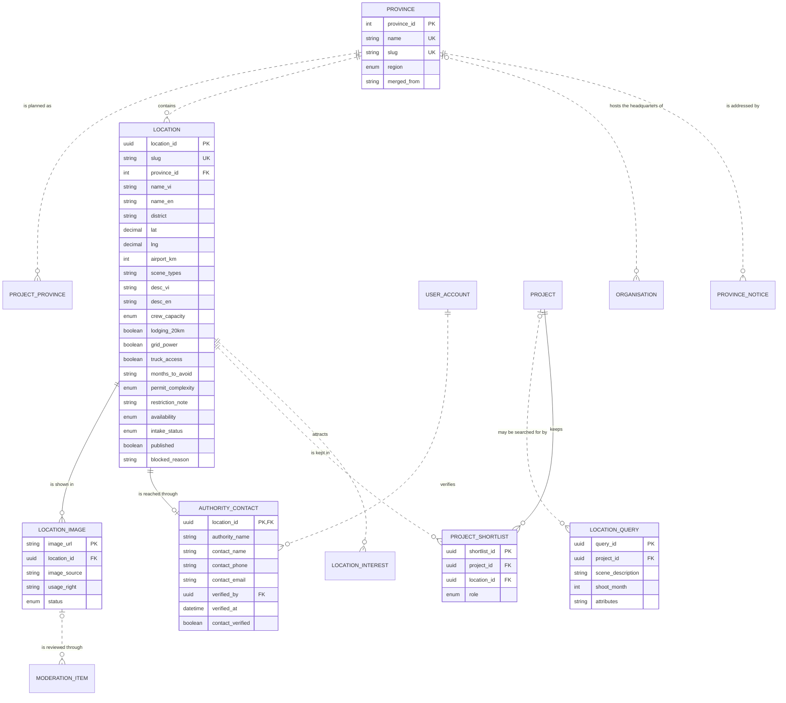

# Data Model and Mockup Data: Location discovery (M3)

> Layout reconstructed from the Session 5 lecture (*Building an ERD with AI*, steps S0–S6 and human gates 1–6) and the Session 7 rubric (C3, C4, G2–G4), because the course template file was not available to the team. Sections marked *(mandatory)* are all filled. Generated by `tools/build_dm_docs.py` from the same sources as `data/01`–`05`, `data/schema/` and `data/seed/`; the numbers below are computed, not typed.

| Field | Value |
|---|---|
| Module | M3 — Location discovery |
| Spec Document | `docs/spec/spec-M3.md` |
| Schema | `data/schema/schema-M3.sql` |
| Seed files | `21_location.csv`, `22_location_image.csv`, `23_authority_contact.csv`, `12_province.csv`, `24_location_query.csv`, `25_project_shortlist.csv` |
| Version / date | v1.0 — 01/10/2026 |
| Prepared by | Group C (draft by an AI agent, see `docs/ai-use-log.md`) |
| Status | Ready for the human gates in section 13 |

## 1. Sources and input map (mandatory)

The model of this module is derived from `docs/spec/spec-M3.md` only — no entity, column or relationship was invented. The input map below is the one used for the whole product (`data/01-entity-dictionary.md`); citations use the scheme `<MODULE> §<section> <ID>`.

```text
INPUT MAP
I am providing the following slots. Treat every slot not listed here as ABSENT, and apply the
degradation rules rather than inventing the missing material.

  FUNCTIONS = section 5 FR tables of the 9 module Spec Documents in docs/spec/
              (spec-SYS, spec-M1, spec-M0, spec-M2, spec-M3, spec-M4, spec-M5, spec-M7, spec-M10),
              104 rows (Spec Documents of 30/09/2026)
  FIELDS    = section 5.1 "Input / Output contract" of the same documents
              (every field typed, inputs marked Req / Opt), plus section 6.1
              "Attribute types" (types of the section 6 attributes no 5.1 field declares)
  ENTITIES  = section 6 "Key entities" of the same documents, 51 declared entities
  RULES     = section 5.2 "Business rules" of the same documents (BR-001 ... per module)
  SCENARIOS = section 3 user stories US-n with Given / When / Then, plus "Edge cases"
  FLOWS     = section 4 Mermaid blocks (usage flows 4.1, sequence diagrams 4.2+)
  SCREENS   = section 7 tables + docs/screens/screen-spec-<ID>.md (41 Screen Specs)
  BOUNDARY  = section 1 "Depends on" (external: Supabase Auth / PostgreSQL / Storage,
              Resend email, language-model API, PDF rendering, OpenStreetMap tiles, PostGIS)

  Out of this input: M6, M8, M9 are Won't for this release (docs/prd.md §4.4).

CITATION SCHEME = <MODULE> §<section> <ID>
  e.g. "M3 §5.1 FR-008" (field row of F-M3-08) | "M3 §5.2 BR-004" | "M3 §3 US-2" | "M3 §6"
```

## 2. Entity catalogue (mandatory)

7 entities owned by M3: 6 stored, 1 derived. Every entity is declared in §6 of the Spec Document (*discovered here* would mark one that is not). Each entity has exactly one owner module.

| Entity | Definition (one sentence) | Kind | Owner | Source | Table | Seed file (rows) |
|---|---|---|---|---|---|---|
| `LOCATION` | A filming location in Vietnam described and published by VFDA staff. | THING | M3 | spec §6 — M3 §6; M3 §5.1 FR-002; M3 §5.2 BR-008 | `location` | `21_location.csv` (11) |
| `LOCATION_IMAGE` | A photo of a location with its source and usage right. | THING | M3 | spec §6 — M3 §6; M3 §5.1 FR-003 | `location_image` | `22_location_image.csv` (10) |
| `AUTHORITY_CONTACT` | The local authority office and person to contact about filming at a location, verified by VFDA. | THING | M3 | spec §6 — M3 §6; M3 §5.1 FR-004 | `authority_contact` | `23_authority_contact.csv` (11) |
| `PROVINCE` | One of the 34 provincial-level units after the 2025 reorganisation. | THING | M3 | spec §6 — M3 §6; M3 §5.2 BR-006 | `province` | `12_province.csv` (34) |
| `LOCATION_QUERY` | A scene description a user typed and the attributes extracted from it, stored without personal data. | EVENT | M3 | spec §6 — M3 §6; M3 §5.1 FR-010, FR-011; M3 §5.2 BR-009 | `location_query` | `24_location_query.csv` (6) |
| `PROJECT_SHORTLIST` | A location a project has kept as its primary or backup choice. | THING | M3 | spec §6 — M3 §6; M3 §5.1 FR-018 | `project_shortlist` | `25_project_shortlist.csv` (9) |
| `PROVINCE_READINESS` | A province's readiness index computed from platform data, with sample sizes. | DERIVED (computed on read, not stored) | M3 | spec §6 — M3 §6 ("derived from Locations, Organisations, Notices"); M3 §5.2 BR-007 | — | — |

**Entities of other modules referenced here** (drawn without attributes in §5): `LOCATION_INTEREST` (M7), `MODERATION_ITEM` (M10), `ORGANISATION` (M4), `PROJECT` (M0), `PROJECT_PROVINCE` (M0), `PROVINCE_NOTICE` (M7), `USER_ACCOUNT` (SYS).

## 3. Attributes (mandatory)

Every attribute traces to a §5.1 field, a §6.1 declared type, a key, or a deliberate audit column (*Source kind*). *Req* = required by the function; *Opt* = optional; *system-set* = filled by the system.

### LOCATION

| Column | Type | Required | Key | Source kind | Citation |
|---|---|---|---|---|---|
| `location_id` | `UUID` | system-set | PK | §5.1 field | M3 §5.1 FR-002 (OUT) |
| `slug` | `VARCHAR(160)` | system-set | UK | §5.1 field | M3 §5.1 FR-002 (OUT) |
| `province_id` | `INTEGER` | Req | FK → `PROVINCE` | §5.1 field | M3 §5.1 FR-002; M3 §5.2 BR-006 |
| `name_vi` | `VARCHAR(200)` | Req |  | §5.1 field | M3 §5.1 FR-002 |
| `name_en` | `VARCHAR(200)` | Req |  | §5.1 field | M3 §5.1 FR-002 |
| `district` | `VARCHAR(120)` | Opt |  | §5.1 field | M3 §5.1 FR-002 |
| `lat` | `NUMERIC(9,6)` | Req |  | §5.1 field | M3 §5.1 FR-002 |
| `lng` | `NUMERIC(9,6)` | Req |  | §5.1 field | M3 §5.1 FR-002 |
| `airport_km` | `INTEGER` | Opt |  | §5.1 field | M3 §5.1 FR-002 |
| `scene_types` | `ENUM(karst, river, village, rice_field, sea, floating_village, cave, jungle, old_town, market, rice_terrace, mountain, dunes, mangrove)[]` | Req |  | §5.1 field | M3 §5.1 FR-002, FR-007 |
| `desc_vi` | `TEXT` | Req |  | §5.1 field | M3 §5.1 FR-002 |
| `desc_en` | `TEXT` | Req |  | §5.1 field | M3 §5.1 FR-002 |
| `crew_capacity` | `ENUM(u15, 15_50, o50)` | Req |  | §5.1 field | M3 §5.1 FR-002 |
| `lodging_20km` | `BOOLEAN` | Req |  | §5.1 field | M3 §5.1 FR-002 |
| `grid_power` | `BOOLEAN` | Req |  | §5.1 field | M3 §5.1 FR-002 |
| `truck_access` | `BOOLEAN` | Req |  | §5.1 field | M3 §5.1 FR-002 |
| `months_to_avoid` | `INTEGER[]` | Opt |  | §5.1 field | M3 §5.1 FR-002 |
| `permit_complexity` | `ENUM(low, medium, high)` | Req |  | §5.1 field | M3 §5.1 FR-002 |
| `restriction_note` | `TEXT` | Opt |  | §5.1 field | M3 §5.1 FR-002 |
| `availability` | `ENUM(open, survey_in_progress, paused)` | Req |  | §5.1 field | M3 §5.1 FR-002; M3 §5.2 BR-010 |
| `intake_status` | `ENUM(awaiting_contact, published, unpublished)` | system-set |  | §5.1 field | M3 §5.1 FR-002 (OUT); M3 §6; M3 §5.2 BR-008 (unpublished, never deleted) |
| `published` | `BOOLEAN` | system-set |  | §5.1 field | M3 §5.1 FR-005 (OUT); M3 §5.2 BR-004 |
| `blocked_reason` | `TEXT` | system-set |  | §5.1 field | M3 §5.1 FR-005 (OUT) |

**Natural key:** name_vi + province_id — proposed; two sites may share a name in different provinces (open question).

### LOCATION_IMAGE

| Column | Type | Required | Key | Source kind | Citation |
|---|---|---|---|---|---|
| `image_url` | `TEXT` | system-set | PK | §5.1 field | M3 §5.1 FR-003 (OUT) |
| `location_id` | `UUID` | Req | FK → `LOCATION` | §6.1 declared type | M3 §6 ("belongs to Location"); M3 §6.1 |
| `image_source` | `TEXT` | Req |  | §5.1 field | M3 §5.1 FR-003 |
| `usage_right` | `TEXT` | Req |  | §5.1 field | M3 §5.1 FR-003 |
| `status` | `ENUM(pending, approved, hidden)` | system-set |  | §5.1 field | M3 §5.1 FR-003 (OUT image_status); M10 §5.1 FR-002 (content_status) |

**Natural key:** image_url.

### AUTHORITY_CONTACT

| Column | Type | Required | Key | Source kind | Citation |
|---|---|---|---|---|---|
| `location_id` | `UUID` | Req | PK, FK → `LOCATION` | §5.1 field | M3 §5.1 FR-004; M3 §6 ("has one") |
| `authority_name` | `VARCHAR(200)` | Req |  | §5.1 field | M3 §5.1 FR-004 |
| `contact_name` | `VARCHAR(120)` | Req |  | §5.1 field | M3 §5.1 FR-004 |
| `contact_phone` | `VARCHAR(20)` | Req |  | §5.1 field | M3 §5.1 FR-004 |
| `contact_email` | `VARCHAR(254)` | Opt |  | §5.1 field | M3 §5.1 FR-004 |
| `verified_by` | `UUID` | Req | FK → `USER_ACCOUNT` | §5.1 field | M3 §5.1 FR-004 |
| `verified_at` | `TIMESTAMPTZ` | system-set |  | §5.1 field | M3 §5.1 FR-004 (OUT) |
| `contact_verified` | `BOOLEAN` | system-set |  | §5.1 field | M3 §5.1 FR-004 (OUT); M3 §5.1 FR-005 (CHECK) |

**Natural key:** location_id (one contact per location, M3 §6).

### PROVINCE

| Column | Type | Required | Key | Source kind | Citation |
|---|---|---|---|---|---|
| `province_id` | `INTEGER` | Req | PK | §5.1 field | M3 §5.1 FR-002 (province_id INTEGER) |
| `name` | `VARCHAR(80)` | Req | UK | §6.1 declared type | M3 §6; M3 §6.1 |
| `slug` | `VARCHAR(80)` | Req | UK | §5.1 field | M3 §5.1 FR-020 (province_slug) |
| `region` | `ENUM(north, central, south)` | not declared |  | §5.1 field | M3 §6; type from M3 §5.1 FR-007 (region) |
| `merged_from` | `VARCHAR(80)[]` | Opt |  | §6.1 declared type | M3 §6; M3 §5.2 BR-006; M3 §6.1 |

**Natural key:** name (one of the 34 units, M3 BR-006); slug.

### LOCATION_QUERY

| Column | Type | Required | Key | Source kind | Citation |
|---|---|---|---|---|---|
| `query_id` | `UUID` | system-set | PK | §5.1 field | M3 §5.1 FR-011 (OUT) |
| `project_id` | `UUID` | Opt | FK → `PROJECT` | §5.1 field | M3 §5.1 FR-011; M3 §6 ("may belong to Project") |
| `scene_description` | `TEXT` | Req |  | §5.1 field | M3 §5.1 FR-010, FR-011 (10–1000 characters); M3 §6 description |
| `shoot_month` | `INTEGER` | Opt |  | §5.1 field | M3 §5.1 FR-011 (1–12, FR-007); M3 §6 month |
| `attributes` | `JSONB` | system-set |  | §5.1 field | M3 §5.1 FR-011 (OUT); M3 §5.2 BR-009 (no personal data) |

**Natural key:** None (an event).

### PROJECT_SHORTLIST

| Column | Type | Required | Key | Source kind | Citation |
|---|---|---|---|---|---|
| `shortlist_id` | `UUID` | system-set | PK | §5.1 field | M3 §5.1 FR-018 (OUT) |
| `project_id` | `UUID` | Req | FK → `PROJECT` | §5.1 field | M3 §5.1 FR-018 |
| `location_id` | `UUID` | Req | FK → `LOCATION` | §5.1 field | M3 §5.1 FR-018 (location_ids ARRAY<UUID>) |
| `role` | `ENUM(primary, backup)` | Req |  | §5.1 field | M3 §5.1 FR-018 |

**Natural key:** project_id + location_id.

## 4. Relationships (mandatory)

Each relationship is read in both directions; the citation is the spec line it comes from. **No many-to-many relationship is left unresolved**: every many-to-many need of this module is an associative entity (e.g. PROJECT_SHORTLIST, PROJECT_PROVINCE, PROJECT_MEMBER).

| Relationship | Forward reading | Reverse reading | Side that may be zero | Type | Citation |
|---|---|---|---|---|---|
| `PROVINCE` \|\|..o{ `PROJECT_PROVINCE` | Each province is planned as zero or more project provinces | Each project province is exactly one province | PROJECT_PROVINCE side | non-identifying (`..`) | M0 §6 (province_id); M0 §5.1 FR-001 |
| `PROVINCE` \|\|..o{ `LOCATION` | Each province contains zero or more locations | Each location lies in exactly one province | LOCATION side | non-identifying (`..`) | M3 §6; M3 §5.1 FR-002 province_id Req; M3 §3 US-5 (province with too little data) |
| `LOCATION` \|\|--o{ `LOCATION_IMAGE` | Each location is shown in zero or more location images | Each location image shows exactly one location | LOCATION_IMAGE side | identifying (`--`) | M3 §6 ("has many LocationImages") |
| `LOCATION` \|\|--o\| `AUTHORITY_CONTACT` | Each location is reached through zero or one authority contact | Each authority contact serves exactly one location | AUTHORITY_CONTACT side | identifying (`--`) | M3 §6 ("has one AuthorityContact"); M3 §3 US-3 (location with an unverified contact) |
| `USER_ACCOUNT` \|\|..o{ `AUTHORITY_CONTACT` | Each user account verifies zero or more authority contacts | Each authority contact is verified by exactly one user account | AUTHORITY_CONTACT side | non-identifying (`..`) | M3 §5.1 FR-004 verified_by Req |
| `PROJECT` \|o..o{ `LOCATION_QUERY` | Each project may be searched for by zero or more location queries | Each location query belongs to zero or one project | both sides | non-identifying (`..`) | M3 §6 ("may belong to Project"); M3 §5.1 FR-011 project_id Opt; M3 §5.2 BR-009 (guests search without a project) |
| `PROJECT` \|\|--o{ `PROJECT_SHORTLIST` | Each project keeps zero or more shortlist entries | Each shortlist entry belongs to exactly one project | PROJECT_SHORTLIST side | identifying (`--`) | M3 §6; M3 §5.1 FR-018 |
| `LOCATION` \|\|..o{ `PROJECT_SHORTLIST` | Each location is kept in zero or more shortlist entries | Each shortlist entry keeps exactly one location | PROJECT_SHORTLIST side | non-identifying (`..`) | M3 §6 ("belongs to Project and Location") |
| `PROVINCE` \|o..o{ `ORGANISATION` | Each province hosts the headquarters of zero or more organisations | Each organisation has its headquarters in zero or one province | both sides | non-identifying (`..`) | M4 §6 (hq_province); M4 §6.1 hq_province INTEGER No |
| `LOCATION` \|\|..o{ `LOCATION_INTEREST` | Each location attracts zero or more location interests | Each location interest concerns exactly one location | LOCATION_INTEREST side | non-identifying (`..`) | M7 §6; M7 §5.1 FR-001 location_id Req |
| `PROVINCE` \|\|..o{ `PROVINCE_NOTICE` | Each province is addressed by zero or more province notices | Each province notice is addressed to exactly one province | PROVINCE_NOTICE side | non-identifying (`..`) | M7 §6 (province_id) |
| `LOCATION_IMAGE` \|o..o{ `MODERATION_ITEM` | Each location image is reviewed through zero or more moderation items | Each moderation item concerns zero or one location image (exactly one of organisation or location image) | both sides | non-identifying (`..`) | M10 §6 ("refers to Organisation or LocationImage"); M10 §5.1 FR-001 (content type location_image) |

## 5. ERD and diagram check (mandatory)

Entities of M3 with their attributes; entities of other modules appear as names only. Relationship lines are copied from `data/03-erd.mmd`.



Renders with mermaid-cli: **yes**.

**Diagram check** — computed by the generator; the build stops if a pair differs.

| Count | Value | Compared with | Value | Agree |
|---|---|---|---|---|
| Entities owned and stored (catalogue §2) | 6 | entity blocks in the ERD (§5) | 6 | ✓ |
| Entities owned and stored (catalogue §2) | 6 | tables in `schema-M3.sql` | 6 | ✓ |
| Attributes (§3) | 50 | columns in `schema-M3.sql` | 50 | ✓ |
| Relationships with the child in this module (§4) | 7 | FOREIGN KEY constraints in `schema-M3.sql` | 7 | ✓ |
| Relationships touching this module (§4) | 12 | relationship lines in the ERD (§5) | 12 | ✓ |
| Seed files of this module (§9) | 6 | tables in `schema-M3.sql` | 6 | ✓ |

## 6. Normalization check (mandatory)

| Table | 1NF | 2NF | 3NF |
|---|---|---|---|
| `LOCATION` | exception: `scene_types`, `months_to_avoid` (array) | ✓ single-column key | exception: `published` |
| `LOCATION_IMAGE` | ✓ | ✓ single-column key | ✓ |
| `AUTHORITY_CONTACT` | ✓ | ✓ single-column key | ✓ |
| `PROVINCE` | exception: `merged_from` (array) | ✓ single-column key | ✓ |
| `LOCATION_QUERY` | ✓ | ✓ single-column key | ✓ |
| `PROJECT_SHORTLIST` | ✓ | ✓ single-column key | ✓ |

**Deliberate exceptions and their upkeep rules**

| Column | Breaks | Why it is kept | Upkeep rule |
|---|---|---|---|
| `LOCATION.published` | 3NF (depends on intake_status) | M3 FR-005 output, read by every search | CHECK `ck_location_published_matches_status` |
| `LOCATION.scene_types` | 1NF (list in one column) | filtered and shown as a list | see note below |
| `LOCATION.months_to_avoid` | 1NF (list in one column) | filtered and shown as a list | see note below |
| `PROVINCE.merged_from` | 1NF (list in one column) | filtered and shown as a list | see note below |

Kept as a JSON array (1NF exception): the whole list is what functions filter and show; every value is checked against its declared set by seed_rules.py and, at the Plan step, by the input validation (01 OQ 3).

## 7. Business rules and where they are enforced (mandatory)

*SCHEMA* = a constraint in `data/schema/schema-M3.sql` today. *SEED CHECK* = `data/seed/seed_rules.py`, run by the generator before it writes and by `check_seed.py`. *TRIGGER / RLS / VIEW / APP* = built at the Plan step; the named object is the brief for the agent. *NOT DATA* = a rule about wording or an external service. The last column names the seed rows that demonstrate the rule.

| Rule | Statement | Enforced in | Named object | Seed rows that show it |
|---|---|---|---|---|
| BR-001 | The language model only extracts attributes; ranking is done by a deterministic scoring function in the database. The model never names or ranks a location. | APP (Plan step) | Edge Function returns attributes only; ranking in function `search_locations` | `24_location_query.csv` — An old wooden ferry crossing a calm ri · 3 — the query stores extracted attributes, never a ranking |
| BR-002 | A result is shown only if its score is 40 or more and it has at least one *why it matches* reason. | VIEW (Plan step) | function `search_locations` filters score ≥ 40 and ≥ 1 reason | `21_location.csv` — ca-mau-cape · published · open; ha-long · published · survey_in_progress (+7) — only published locations are scored |
| BR-003 | *Not a match* and *No data yet* are different; missing data never counts for or against a location. | APP (Plan step) | scoring treats an empty field as *No data yet* | `21_location.csv` — cai-rang · published · open — no month to avoid recorded |
| BR-004 | A location cannot be published until its local authority contact is verified; contacts are re-verified every 12 months [NEEDS CLARIFICATION]. | SCHEMA + SEED CHECK + TRIGGER (Plan step) | `ck_location_published_matches_status`; seed_rules (contact verified); trigger `trg_location_publish_needs_contact` | `21_location.csv` — mui-ne · awaiting_contact · open — contact not verified → awaiting_contact, not published<br>`23_authority_contact.csv` — Ban Quản lý Vườn quốc gia Mũi Cà Mau · true · 2016-01-04T10:00:00+07:00 — contact verified in 2016 — older than the 12-month cycle |
| BR-005 | Authority contacts are returned only to signed-in users, enforced by Row Level Security. | RLS (Plan step) | policy `rls_authority_contact_members` | `23_authority_contact.csv` — Ban Quản lý Vườn quốc gia Mũi Cà Mau · true · 2016-01-04T10:00:00+07:00; Ban Quản lý vịnh Hạ Long · true · 2026-04-12T10:00:00+07:00 (+2) — contacts with e-mail and phone that a guest must never receive |
| BR-006 | Provinces use the 34 provincial-level units after the 2025 reorganisation; old names are accepted in search and mapped to the new unit. | SCHEMA | `pk_province` (34 rows) + `merged_from` | `12_province.csv` — Ninh Bình · north — Ninh Bình also answers to Hà Nam and Nam Định |
| BR-007 | The provincial index uses only data generated on the platform and always shows its sample size. | VIEW (Plan step) | view `v_province_readiness` with sample sizes | `12_province.csv` — Hải Phòng · north — a province with no location: index shows *not enough data* |
| BR-008 | Locations are unpublished, never deleted (`intake_status = unpublished`); shortlists and provincial notices that refer to an unpublished location keep it and show *No longer published*. | SCHEMA + SEED CHECK | `ck_location_intake_status`; seed_rules: an unpublished location is still shortlisted | `21_location.csv` — cua-van · unpublished · open — Cửa Vạn unpublished, never deleted<br>`25_project_shortlist.csv` — backup — still the backup of Quiet Harbour Blues |
| BR-009 | Every confirmed scene search is stored as a location query without any personal data (description, attributes, month, and the project only when a member searches inside a project); it is used for the M10 demand index and never to train a model. | SCHEMA | LOCATION_QUERY has no user column; `project_id` optional | `24_location_query.csv` — Ruộng bậc thang mùa lúa chín, có sương · 9; Busy floating market at sunrise with d · 5 (+1) — guest queries with no project and no person |
| BR-010 | Every published location carries an availability set by VFDA staff: `open`, `survey_in_progress` (another crew is scouting it) or `paused` (not receiving crews for now). A paused location stays published and visible with its label; availability is the sixth scoring criterion; every change is written to the audit log (M10 FR-008). | SCHEMA + TRIGGER (Plan step) | `ck_location_availability`; trigger `trg_location_availability_audit` | `21_location.csv` — phong-nha · published · paused — Phong Nha paused, still published<br>`45_audit_log.csv` — location.availability · 2026-09-25T15:05:00+07:00; location.availability · 2026-09-24T08:20:00+07:00 — every change audited |

## 8. Schema (mandatory)

`data/schema/schema-M3.sql` — 6 tables in load order: `province`, `location`, `location_image`, `authority_contact`, `location_query`, `project_shortlist`; 7 foreign keys; 10 CHECK constraints. Portable SQL (SQLite 3 and PostgreSQL 14+).

Load test: `python3 data/schema/load_check.py` runs every schema file, then every seed file in filename order with foreign keys on — **PASS** (also on PostgreSQL 16 with `--postgres`).

## 9. Mockup data (mandatory)

| Item | Value |
|---|---|
| Generator | `data/seed/generate_seed.py` (writes nothing unless `seed_rules.validate` passes) |
| Regenerate | `python3 data/seed/generate_seed.py && python3 data/seed/check_seed.py` (must print PASS; `git status` stays clean) |
| Random seed | none — no randomness and no clock: keys are UUIDv5 of readable names (namespace `6f1c2a8e-3b4d-5e6f-8a9b-0c1d2e3f4a5b`), so every run is byte-identical |
| Business-rule values | computed by the generator, never typed: attention level (M2 BR-004), quote span (M2 §6.1), latest readiness (M0 §9), is_active, published |
| Files | 6 files of this module, 81 rows (product: 46 files, 427 rows) |

**Rows per file and row kinds** (1 = ordinary rows in every file)

| File | Rows | (2) Boundary | (3) Empty case | (4) Exceptional state |
|---|---|---|---|---|
| `21_location.csv` | 11 | 200-char names; Cà Mau, southernmost (8.615°) | Tam Cốc, Cà Mau Cape: no image | Mũi Né: contact unverified, publishing blocked; Cửa Vạn: `unpublished` (M3 BR-008); Hạ Long `survey_in_progress`, Phong Nha `paused` (M3 BR-010) |
| `22_location_image.csv` | 10 | — | Tam Cốc, Cà Mau Cape: no image | `hidden`: usage right unclear; `pending`: partner photo of Cái Răng |
| `23_authority_contact.csv` | 11 | verified in 2016 (older than the 12-month cycle) | contacts without e-mail | Mũi Né: not verified |
| `12_province.csv` | 34 | *Thành phố Hồ Chí Minh* (longest) | 25 provinces with no location | merged units with `merged_from` (M3 BR-006) |
| `24_location_query.csv` | 6 | 1000-character description (the maximum) and a 10-character one (the minimum) | guest queries with no project; `q5`: no shooting month | — (no status column) |
| `25_project_shortlist.csv` | 9 | — | `Monsoon Signal`, `Harbour Lights`: none | Cửa Vạn, unpublished, kept as a backup of `Quiet Harbour Blues` |

## 10. Edge case register (mandatory)

Computed from the seed files. (a) every enumerated value has a row; (b) empty states; (c) one boundary per numeric or date rule; (d) one row per business rule — the last column of section 7.

**(a) Enumerated values**

| Column | Value | Seed rows |
|---|---|---|
| `LOCATION.crew_capacity` | `u15` | 5 row(s), e.g. ca-mau-cape · published · open |
| `LOCATION.crew_capacity` | `15_50` | 5 row(s), e.g. mui-ne · awaiting_contact · open |
| `LOCATION.crew_capacity` | `o50` | 1 row(s), e.g. ha-long · published · survey_in_progress |
| `LOCATION.permit_complexity` | `low` | 2 row(s), e.g. mui-ne · awaiting_contact · open |
| `LOCATION.permit_complexity` | `medium` | 5 row(s), e.g. dong-van · published · open |
| `LOCATION.permit_complexity` | `high` | 4 row(s), e.g. ca-mau-cape · published · open |
| `LOCATION.availability` | `open` | 9 row(s), e.g. ca-mau-cape · published · open |
| `LOCATION.availability` | `survey_in_progress` | 1 row(s), e.g. ha-long · published · survey_in_progress |
| `LOCATION.availability` | `paused` | 1 row(s), e.g. phong-nha · published · paused |
| `LOCATION.intake_status` | `awaiting_contact` | 1 row(s), e.g. mui-ne · awaiting_contact · open |
| `LOCATION.intake_status` | `published` | 9 row(s), e.g. ca-mau-cape · published · open |
| `LOCATION.intake_status` | `unpublished` | 1 row(s), e.g. cua-van · unpublished · open |
| `LOCATION.scene_types` | `karst` | 4 row(s), e.g. ha-long · published · survey_in_progress |
| `LOCATION.scene_types` | `river` | 5 row(s), e.g. tam-coc · published · open |
| `LOCATION.scene_types` | `village` | 5 row(s), e.g. ca-mau-cape · published · open |
| `LOCATION.scene_types` | `rice_field` | 1 row(s), e.g. tam-coc · published · open |
| `LOCATION.scene_types` | `sea` | 4 row(s), e.g. ca-mau-cape · published · open |
| `LOCATION.scene_types` | `floating_village` | 3 row(s), e.g. ha-long · published · survey_in_progress |
| `LOCATION.scene_types` | `cave` | 1 row(s), e.g. phong-nha · published · paused |
| `LOCATION.scene_types` | `jungle` | 1 row(s), e.g. phong-nha · published · paused |
| `LOCATION.scene_types` | `old_town` | 1 row(s), e.g. hoi-an · published · open |
| `LOCATION.scene_types` | `market` | 2 row(s), e.g. hoi-an · published · open |
| `LOCATION.scene_types` | `rice_terrace` | 1 row(s), e.g. mu-cang-chai · published · open |
| `LOCATION.scene_types` | `mountain` | 2 row(s), e.g. dong-van · published · open |
| `LOCATION.scene_types` | `dunes` | 1 row(s), e.g. mui-ne · awaiting_contact · open |
| `LOCATION.scene_types` | `mangrove` | 1 row(s), e.g. ca-mau-cape · published · open |
| `LOCATION_IMAGE.status` | `pending` | 2 row(s), e.g. https://storage.cinematch.exam · pending |
| `LOCATION_IMAGE.status` | `approved` | 7 row(s), e.g. https://storage.cinematch.exam · approved |
| `LOCATION_IMAGE.status` | `hidden` | 1 row(s), e.g. https://storage.cinematch.exam · hidden |
| `PROVINCE.region` | `north` | 15 row(s), e.g. Hà Nội · north |
| `PROVINCE.region` | `central` | 11 row(s), e.g. Huế · central |
| `PROVINCE.region` | `south` | 8 row(s), e.g. Thành phố Hồ Chí Minh · south |
| `PROJECT_SHORTLIST.role` | `primary` | 6 row(s), e.g. primary |
| `PROJECT_SHORTLIST.role` | `backup` | 3 row(s), e.g. backup |

**(b) Empty states**

| Empty case | Seed rows |
|---|---|
| `PROVINCE` with no `PROJECT_PROVINCE` (is planned as) | 26 row(s), e.g. Hà Nội · north |
| `PROVINCE` with no `LOCATION` (contains) | 25 row(s), e.g. Hà Nội · north |
| `LOCATION` with no `LOCATION_IMAGE` (is shown in) | 3 row(s), e.g. ca-mau-cape · published · open |
| `LOCATION` with no `PROJECT_SHORTLIST` (is kept in) | 3 row(s), e.g. dong-van · published · open |
| `PROVINCE` with no `ORGANISATION` (hosts the headquarters of) | 28 row(s), e.g. Lai Châu · north |
| `LOCATION` with no `LOCATION_INTEREST` (attracts) | 5 row(s), e.g. ca-mau-cape · published · open |
| `PROVINCE` with no `PROVINCE_NOTICE` (is addressed by) | 29 row(s), e.g. Hà Nội · north |
| `LOCATION_IMAGE` with no `MODERATION_ITEM` (is reviewed through) | 8 row(s), e.g. https://storage.cinematch.exam · approved |

**(c) Boundaries of numeric and date rules**

| Rule | Seed row |
|---|---|
| Contact re-verified every 12 months (M3 BR-004) | `23_authority_contact.csv` — Ban Quản lý Vườn quốc gia Mũi Cà Mau · true · 2016-01-04T10:00:00+07:00 — verified 04/01/2016 |
| Scene description 10–1000 characters (M3 §5.1 FR-010) | `24_location_query.csv` — A long journey south along the coast:  · 12 — 1000 characters |
| Scene description 10–1000 characters (M3 §5.1 FR-010) | `24_location_query.csv` — Cave river — 10 characters |
| Shooting month 1–12 (M3 §5.1 FR-007) | `24_location_query.csv` — A long journey south along the coast:  · 12 — month 12 |
| Coordinates inside Vietnam (ck_location_in_vietnam) | `21_location.csv` — ca-mau-cape · published · open — southernmost point, lat 8.615 |
| Name ≤ 200 characters (M3 §5.1 FR-002) | `21_location.csv` — ca-mau-cape · published · open — 200-character name |

**(d) Business rules** — 10 of 10 rules have their rows named in section 7.

## 11. Privacy declaration (mandatory)

- [x] No row describes a real person: every name is invented for this project (the persona list in `data/seed/README.md`).
- [x] Every e-mail address is on an `example` domain (`*.example.*`, `anonymised.example`) — checked by `seed_rules.py`.
- [x] Every phone number has the form `+84 000 000 1xx`, which cannot be a real Vietnamese number, and is used once — checked by `seed_rules.py`.
- [x] No identity document, passport, tax or bank number is stored anywhere in the model.
- [x] No real script is stored: pre-checks keep only a hash of the summary (M2 FR-007); synopsis texts in the seed are invented.
- [x] Organisations, producer companies and projects are fictional; locations and provinces are real public places, described with mock text.
- [x] Sensitive columns (authority contacts, partner private layer, project documents) are protected by Row Level Security (SYS BR-001) — listed in section 7.
- [x] Nobody in the team knows of a real value in the seed files.

Personal or sensitive columns in this module: `AUTHORITY_CONTACT.contact_email`, `AUTHORITY_CONTACT.contact_name`, `AUTHORITY_CONTACT.contact_phone`, `LOCATION_QUERY.scene_description`.

## 12. Open questions (mandatory)

Data questions raised in `data/01`–`04` whose owner includes M3. All other open points of the module are in `docs/spec/spec-M3.md` §10.

| Question | Blocking? | Owner | Status |
|---|---|---|---|
| [NEEDS CLARIFICATION: Is LOCATION_QUERY stored (F-M3-10/11), and for how long?] | No | M3 owner | Resolved 30/09/2026 — stored by F-M3-11 without personal data and used for the M10 demand index (M3 §5.2 BR-009; M3 §5.1 FR-011 query_id). How long it is kept is still not stated. |
| [NEEDS CLARIFICATION: Does unpublishing a location remove it from shortlists and open notices?] | No | M3 owner | Resolved 30/09/2026 — M3 §5.2 BR-008: `intake_status = unpublished` (M3 §5.1 FR-002); shortlists and notices keep the location and show *No longer published*. |
| [NEEDS CLARIFICATION: The location data-entry template has "18 fields" (M3 FR-002) but the I/O contract lists 17. Which field is missing?] | No | M3 owner | Open |
| [NEEDS CLARIFICATION: Add a creation time to PROJECT and LOCATION_QUERY so the demand index can be filtered by period (M10 FR-003, FR-005)?] | No | M0, M3, M10 owners | Open |
| [NEEDS CLARIFICATION: Which function lets a partner submit a location photo for moderation? F-M3-03 is for VFDA staff only.] | No | M3 + M10 owners | Open |

## 13. Human gates and sign-off

The gates of the Session 5 process. The agent prepared every section above; a person checks and signs.

| Gate | What the person checks | Checked by | Date |
|---|---|---|---|
| 1 — Entity authority and naming | §2: names, one owner per entity, definitions rewritten in own words | pending | pending |
| 2 — CRUD anomalies | `data/02-crud-matrix.md` rows of this module | pending | pending |
| 3 — Relationships | §4: each relationship read aloud in both directions | pending | pending |
| 4 — Logical model | §3 types and keys; type decisions in `data/04-data-model.md` | pending | pending |
| 5 — Seed | `check_seed.py` and `load_check.py` print PASS on your laptop | pending | pending |
| 6 — Review | §6, §7 and `data/05-review.md`; challenge at least one result | pending | pending |
