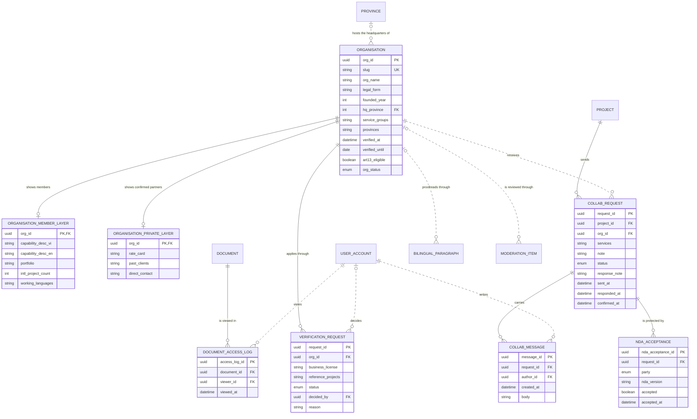

# Data Model and Mockup Data: Vietnamese service partners (M4)

> Layout reconstructed from the Session 5 lecture (*Building an ERD with AI*, steps S0–S6 and human gates 1–6) and the Session 7 rubric (C3, C4, G2–G4), because the course template file was not available to the team. Sections marked *(mandatory)* are all filled. Generated by `tools/build_dm_docs.py` from the same sources as `data/01`–`05`, `data/schema/` and `data/seed/`; the numbers below are computed, not typed.

| Field | Value |
|---|---|
| Module | M4 — Vietnamese service partners |
| Spec Document | `docs/spec/spec-M4.md` |
| Schema | `data/schema/schema-M4.sql` |
| Seed files | `26_organisation.csv`, `27_organisation_member_layer.csv`, `28_organisation_private_layer.csv`, `29_verification_request.csv`, `30_collab_request.csv`, `31_collab_message.csv`, `32_nda_acceptance.csv`, `36_document_access_log.csv` |
| Version / date | v1.0 — 01/10/2026 |
| Prepared by | Group C (draft by an AI agent, see `docs/ai-use-log.md`) |
| Status | Ready for the human gates in section 13 |

## 1. Sources and input map (mandatory)

The model of this module is derived from `docs/spec/spec-M4.md` only — no entity, column or relationship was invented. The input map below is the one used for the whole product (`data/01-entity-dictionary.md`); citations use the scheme `<MODULE> §<section> <ID>`.

```text
INPUT MAP
I am providing the following slots. Treat every slot not listed here as ABSENT, and apply the
degradation rules rather than inventing the missing material.

  FUNCTIONS = section 5 FR tables of the 9 module Spec Documents in docs/spec/
              (spec-SYS, spec-M1, spec-M0, spec-M2, spec-M3, spec-M4, spec-M5, spec-M7, spec-M10),
              104 rows (Spec Documents of 30/09/2026)
  FIELDS    = section 5.1 "Input / Output contract" of the same documents
              (every field typed, inputs marked Req / Opt), plus section 6.1
              "Attribute types" (types of the section 6 attributes no 5.1 field declares)
  ENTITIES  = section 6 "Key entities" of the same documents, 51 declared entities
  RULES     = section 5.2 "Business rules" of the same documents (BR-001 ... per module)
  SCENARIOS = section 3 user stories US-n with Given / When / Then, plus "Edge cases"
  FLOWS     = section 4 Mermaid blocks (usage flows 4.1, sequence diagrams 4.2+)
  SCREENS   = section 7 tables + docs/screens/screen-spec-<ID>.md (41 Screen Specs)
  BOUNDARY  = section 1 "Depends on" (external: Supabase Auth / PostgreSQL / Storage,
              Resend email, language-model API, PDF rendering, OpenStreetMap tiles, PostGIS)

  Out of this input: M6, M8, M9 are Won't for this release (docs/prd.md §4.4).

CITATION SCHEME = <MODULE> §<section> <ID>
  e.g. "M3 §5.1 FR-008" (field row of F-M3-08) | "M3 §5.2 BR-004" | "M3 §3 US-2" | "M3 §6"
```

## 2. Entity catalogue (mandatory)

8 entities owned by M4: 8 stored, 0 derived. Every entity is declared in §6 of the Spec Document (*discovered here* would mark one that is not). Each entity has exactly one owner module.

| Entity | Definition (one sentence) | Kind | Owner | Source | Table | Seed file (rows) |
|---|---|---|---|---|---|---|
| `ORGANISATION` | A Vietnamese service company listed in the partner directory. | THING | M4 | spec §6 — M4 §6; M4 §5.1 FR-001; M4 §5.2 BR-008 | `organisation` | `26_organisation.csv` (10) |
| `ORGANISATION_MEMBER_LAYER` | The part of a partner profile visible to signed-in members. | THING | M4 | spec §6 — M4 §6; M4 §5.2 BR-001 | `organisation_member_layer` | `27_organisation_member_layer.csv` (8) |
| `ORGANISATION_PRIVATE_LAYER` | The part of a partner profile visible only after an accepted request and NDA. | THING | M4 | spec §6 — M4 §6; M4 §5.2 BR-001 | `organisation_private_layer` | `28_organisation_private_layer.csv` (8) |
| `VERIFICATION_REQUEST` | A partner's application for the VFDA Verified badge and VFDA's decision on it. | EVENT | M4 | spec §6 — M4 §6; M4 §5.1 FR-008 | `verification_request` | `29_verification_request.csv` (8) |
| `COLLAB_REQUEST` | A producer's request to a partner to work on one project, followed to confirmation. | EVENT | M4 | spec §6 — M4 §6; M4 §5.1 FR-012 | `collab_request` | `30_collab_request.csv` (9) |
| `COLLAB_MESSAGE` | A message written inside a collaboration request, including every response note; never edited once sent. | EVENT | M4 | spec §6 — M4 §6; M4 §5.1 FR-014; M4 §5.2 BR-009 | `collab_message` | `31_collab_message.csv` (4) |
| `NDA_ACCEPTANCE` | One party's acceptance of a given NDA version for one collaboration request. | EVENT | M4 | spec §6 — M4 §6; M4 §5.1 FR-017 | `nda_acceptance` | `32_nda_acceptance.csv` (6) |
| `DOCUMENT_ACCESS_LOG` | A record that one person viewed one shared document at one time. | EVENT | M4 | spec §6 — M4 §6; M4 §5.1 FR-018 | `document_access_log` | `36_document_access_log.csv` (5) |

**Entities of other modules referenced here** (drawn without attributes in §5): `BILINGUAL_PARAGRAPH` (M5), `DOCUMENT` (M5), `MODERATION_ITEM` (M10), `PROJECT` (M0), `PROVINCE` (M3), `USER_ACCOUNT` (SYS).

## 3. Attributes (mandatory)

Every attribute traces to a §5.1 field, a §6.1 declared type, a key, or a deliberate audit column (*Source kind*). *Req* = required by the function; *Opt* = optional; *system-set* = filled by the system.

### ORGANISATION

| Column | Type | Required | Key | Source kind | Citation |
|---|---|---|---|---|---|
| `org_id` | `UUID` | system-set | PK | §5.1 field | M4 §5.1 FR-001 (OUT) |
| `slug` | `VARCHAR(160)` | system-set | UK | §5.1 field | M4 §5.1 FR-001 (OUT) |
| `org_name` | `VARCHAR(200)` | Req |  | §5.1 field | M4 §5.1 FR-001 |
| `legal_form` | `VARCHAR(60)` | Req |  | §6.1 declared type | M4 §6; M4 §6.1 |
| `founded_year` | `INTEGER` | Opt |  | §6.1 declared type | M4 §6; M4 §6.1 |
| `hq_province` | `INTEGER` | Opt | FK → `PROVINCE` | §6.1 declared type | M4 §6 (a province — see Type conflicts); M4 §6.1 |
| `service_groups` | `ENUM(full_production, permits_paperwork, casting, crew, camera_lighting, studios_interiors, location_management, transport_logistics, lodging_catering, interpreting, insurance_legal, post_production)[]` | Req |  | §5.1 field | M4 §5.1 FR-001; M4 §5.2 BR-002 (12 fixed values) |
| `provinces` | `INTEGER[]` | Req |  | §5.1 field | M4 §5.1 FR-001 |
| `verified_at` | `TIMESTAMPTZ` | system-set |  | §5.1 field | M4 §5.1 FR-010 (OUT) |
| `verified_until` | `DATE` | Opt |  | §6.1 declared type | M4 §6; M4 §5.2 BR-004 (12 months); M4 §6.1 |
| `art13_eligible` | `BOOLEAN` | Req |  | §6.1 declared type | M4 §6; M4 §6.1 |
| `org_status` | `ENUM(active, deactivated)` | Opt |  | §5.1 field | M4 §5.1 FR-001; M4 §5.2 BR-008 (deactivated, never deleted) |

**Natural key:** org_name + hq_province — proposed; a business registration number is not declared (open question).

### ORGANISATION_MEMBER_LAYER

| Column | Type | Required | Key | Source kind | Citation |
|---|---|---|---|---|---|
| `org_id` | `UUID` | Req | PK, FK → `ORGANISATION` | key | M4 §6 ("belongs to Organisation") |
| `capability_desc_vi` | `TEXT` | Opt |  | §5.1 field | M4 §5.1 FR-001 (§6 capability_desc) |
| `capability_desc_en` | `TEXT` | Opt |  | §5.1 field | M4 §5.1 FR-001 |
| `portfolio` | `VARCHAR(200)[]` | Opt |  | §6.1 declared type | M4 §6; M4 §6.1 |
| `intl_project_count` | `INTEGER` | Req |  | §6.1 declared type | M4 §6; M4 §6.1 |
| `working_languages` | `CHAR(2)[]` | Opt |  | §5.1 field | M4 §5.1 FR-001; M4 §6 |

**Natural key:** org_id.

### ORGANISATION_PRIVATE_LAYER

| Column | Type | Required | Key | Source kind | Citation |
|---|---|---|---|---|---|
| `org_id` | `UUID` | Req | PK, FK → `ORGANISATION` | key | M4 §6 |
| `rate_card` | `JSONB` | Opt |  | §5.1 field | M4 §5.1 FR-001 |
| `past_clients` | `TEXT[]` | Opt |  | §5.1 field | M4 §5.1 FR-001 |
| `direct_contact` | `VARCHAR(200)` | Opt |  | §6.1 declared type | M4 §6; M4 §6.1 |

**Natural key:** org_id.

### VERIFICATION_REQUEST

| Column | Type | Required | Key | Source kind | Citation |
|---|---|---|---|---|---|
| `request_id` | `UUID` | system-set | PK | §5.1 field | M4 §5.1 FR-008 (OUT verification_request_id) |
| `org_id` | `UUID` | Req | FK → `ORGANISATION` | §5.1 field | M4 §5.1 FR-008 |
| `business_license` | `FILE` | Req |  | §5.1 field | M4 §5.1 FR-008 (PDF max 25 MB) |
| `reference_projects` | `TEXT[]` | Req |  | §5.1 field | M4 §5.1 FR-008 (≥ 2) |
| `status` | `ENUM(pending, approved, rejected)` | Opt |  | §5.1 field | M4 §5.1 FR-009, FR-010 |
| `decided_by` | `UUID` | Opt | FK → `USER_ACCOUNT` | §6.1 declared type | M4 §6; M4 §6.1 |
| `reason` | `TEXT` | Opt |  | §5.1 field | M4 §5.1 FR-010 (required when rejected) |

**Natural key:** org_id + submission time (not declared).

### COLLAB_REQUEST

| Column | Type | Required | Key | Source kind | Citation |
|---|---|---|---|---|---|
| `request_id` | `UUID` | system-set | PK | §5.1 field | M4 §5.1 FR-012 (OUT) |
| `project_id` | `UUID` | Req | FK → `PROJECT` | §5.1 field | M4 §5.1 FR-012 |
| `org_id` | `UUID` | Req | FK → `ORGANISATION` | §5.1 field | M4 §5.1 FR-012 |
| `services` | `ENUM[]` | Req |  | §5.1 field | M4 §5.1 FR-012 |
| `note` | `TEXT` | Opt |  | §5.1 field | M4 §5.1 FR-012 (max 1000 characters) |
| `status` | `ENUM(pending, under_review, info_requested, accepted, declined, confirmed, withdrawn)` | system-set |  | §5.1 field | M4 §5.1 FR-012 (pending), FR-014; M4 §5.2 BR-005 |
| `response_note` | `TEXT` | Opt |  | §5.1 field | M4 §5.1 FR-014 |
| `sent_at` | `TIMESTAMPTZ` | Req |  | §6.1 declared type | M4 §6; M4 §6.1 |
| `responded_at` | `TIMESTAMPTZ` | system-set |  | §5.1 field | M4 §5.1 FR-014 (OUT) |
| `confirmed_at` | `TIMESTAMPTZ` | Opt |  | §6.1 declared type | M4 §6; M4 §6.1 |

**Natural key:** project_id + org_id while the request is open (M4 §3 Edge cases: a second open request is refused).

### COLLAB_MESSAGE

| Column | Type | Required | Key | Source kind | Citation |
|---|---|---|---|---|---|
| `message_id` | `UUID` | system-set | PK | §5.1 field | M4 §5.1 FR-014 (OUT) |
| `request_id` | `UUID` | Req | FK → `COLLAB_REQUEST` | §5.1 field | M4 §5.1 FR-014; M4 §6 |
| `author_id` | `UUID` | Req | FK → `USER_ACCOUNT` | §6.1 declared type | M4 §6; M4 §6.1 |
| `created_at` | `TIMESTAMPTZ` | Req |  | §6.1 declared type | M4 §6; M4 §6.1 |
| `body` | `TEXT` | not declared |  | §5.1 field | M4 §6; type of response_note, M4 §5.1 FR-014; M4 §5.2 BR-009 (never edited) |

**Natural key:** request_id + author_id + created_at (message_id is the declared key, M4 FR-014).

### NDA_ACCEPTANCE

| Column | Type | Required | Key | Source kind | Citation |
|---|---|---|---|---|---|
| `nda_acceptance_id` | `UUID` | system-set | PK | §5.1 field | M4 §5.1 FR-017 (OUT) |
| `request_id` | `UUID` | Req | FK → `COLLAB_REQUEST` | §5.1 field | M4 §5.1 FR-017 |
| `party` | `ENUM(producer, partner)` | Req |  | §5.1 field | M4 §5.1 FR-017 |
| `nda_version` | `VARCHAR(20)` | Req |  | §5.1 field | M4 §5.1 FR-017 |
| `accepted` | `BOOLEAN` | Req |  | §5.1 field | M4 §5.1 FR-017 |
| `accepted_at` | `TIMESTAMPTZ` | system-set |  | §5.1 field | M4 §5.1 FR-017 (OUT) |

**Natural key:** request_id + party (+ nda_version).

### DOCUMENT_ACCESS_LOG

| Column | Type | Required | Key | Source kind | Citation |
|---|---|---|---|---|---|
| `access_log_id` | `UUID` | system-set | PK | §5.1 field | M4 §5.1 FR-018 (OUT) |
| `document_id` | `UUID` | Req | FK → `DOCUMENT` | §5.1 field | M4 §5.1 FR-018 |
| `viewer_id` | `UUID` | Req | FK → `USER_ACCOUNT` | §5.1 field | M4 §5.1 FR-018 |
| `viewed_at` | `TIMESTAMPTZ` | system-set |  | §5.1 field | M4 §5.1 FR-018 (OUT); M4 §5.2 BR-007 (append-only) |

**Natural key:** None (append-only event, M4 BR-007).

## 4. Relationships (mandatory)

Each relationship is read in both directions; the citation is the spec line it comes from. **No many-to-many relationship is left unresolved**: every many-to-many need of this module is an associative entity (e.g. PROJECT_SHORTLIST, PROJECT_PROVINCE, PROJECT_MEMBER).

| Relationship | Forward reading | Reverse reading | Side that may be zero | Type | Citation |
|---|---|---|---|---|---|
| `ORGANISATION` \|\|--o\| `ORGANISATION_MEMBER_LAYER` | Each organisation shows members zero or one member layer | Each member layer belongs to exactly one organisation | ORGANISATION_MEMBER_LAYER side | identifying (`--`) | M4 §6; M4 §5.1 FR-001 (capability fields Opt) |
| `ORGANISATION` \|\|--o\| `ORGANISATION_PRIVATE_LAYER` | Each organisation shows confirmed partners zero or one private layer | Each private layer belongs to exactly one organisation | ORGANISATION_PRIVATE_LAYER side | identifying (`--`) | M4 §6; M4 §5.1 FR-001 (rate_card, past_clients Opt) |
| `PROVINCE` \|o..o{ `ORGANISATION` | Each province hosts the headquarters of zero or more organisations | Each organisation has its headquarters in zero or one province | both sides | non-identifying (`..`) | M4 §6 (hq_province); M4 §6.1 hq_province INTEGER No |
| `ORGANISATION` \|\|--o{ `VERIFICATION_REQUEST` | Each organisation applies through zero or more verification requests | Each verification request is made by exactly one organisation | VERIFICATION_REQUEST side | identifying (`--`) | M4 §6; M4 §5.1 FR-008 |
| `USER_ACCOUNT` \|o..o{ `VERIFICATION_REQUEST` | Each user account decides zero or more verification requests | Each verification request is decided by zero or one user account | both sides | non-identifying (`..`) | M4 §6 (decided_by); M4 §5.1 FR-009 (status pending) |
| `PROJECT` \|\|--o{ `COLLAB_REQUEST` | Each project sends zero or more collaboration requests | Each collaboration request is sent for exactly one project | COLLAB_REQUEST side | identifying (`--`) | M4 §6; M4 §5.1 FR-012 project_id Req |
| `ORGANISATION` \|\|..o{ `COLLAB_REQUEST` | Each organisation receives zero or more collaboration requests | Each collaboration request goes to exactly one organisation | COLLAB_REQUEST side | non-identifying (`..`) | M4 §6; M4 §5.1 FR-012 org_id Req |
| `COLLAB_REQUEST` \|\|--o{ `COLLAB_MESSAGE` | Each collaboration request carries zero or more messages | Each message belongs to exactly one collaboration request | COLLAB_MESSAGE side | identifying (`--`) | M4 §6 ("has many CollabMessages"); M4 §5.2 BR-009 |
| `USER_ACCOUNT` \|\|..o{ `COLLAB_MESSAGE` | Each user account writes zero or more messages | Each message is written by exactly one user account | COLLAB_MESSAGE side | non-identifying (`..`) | M4 §6 (author_id) |
| `COLLAB_REQUEST` \|\|--o{ `NDA_ACCEPTANCE` | Each collaboration request is protected by zero or more NDA acceptances | Each NDA acceptance protects exactly one collaboration request | NDA_ACCEPTANCE side | identifying (`--`) | M4 §6; M4 §3 US-4 ("When the member accepts the NDA") |
| `DOCUMENT` \|\|--o{ `DOCUMENT_ACCESS_LOG` | Each document is viewed in zero or more access-log entries | Each access-log entry records exactly one document | DOCUMENT_ACCESS_LOG side | identifying (`--`) | M4 §6 ("belongs to Document (M5)"); M4 §5.1 FR-018 |
| `USER_ACCOUNT` \|\|..o{ `DOCUMENT_ACCESS_LOG` | Each user account views documents in zero or more access-log entries | Each access-log entry records exactly one viewer | DOCUMENT_ACCESS_LOG side | non-identifying (`..`) | M4 §5.1 FR-018 viewer_id Req |
| `ORGANISATION` \|o..o{ `BILINGUAL_PARAGRAPH` | Each organisation proofreads zero or more paragraphs through its staff | Each paragraph is proofread on behalf of zero or one organisation | both sides | non-identifying (`..`) | M5 §5.1 FR-006 (reviewer_org_id Opt) |
| `ORGANISATION` \|o..o{ `MODERATION_ITEM` | Each organisation is reviewed through zero or more moderation items | Each moderation item concerns zero or one organisation (exactly one of organisation or location image) | both sides | non-identifying (`..`) | M10 §6 ("refers to Organisation or LocationImage"); M10 §3 US-1 (content type org_profile) |

## 5. ERD and diagram check (mandatory)

Entities of M4 with their attributes; entities of other modules appear as names only. Relationship lines are copied from `data/03-erd.mmd`.



Renders with mermaid-cli: **yes**.

**Diagram check** — computed by the generator; the build stops if a pair differs.

| Count | Value | Compared with | Value | Agree |
|---|---|---|---|---|
| Entities owned and stored (catalogue §2) | 8 | entity blocks in the ERD (§5) | 8 | ✓ |
| Entities owned and stored (catalogue §2) | 8 | tables in `schema-M4.sql` | 8 | ✓ |
| Attributes (§3) | 54 | columns in `schema-M4.sql` | 54 | ✓ |
| Relationships with the child in this module (§4) | 12 | FOREIGN KEY constraints in `schema-M4.sql` | 12 | ✓ |
| Relationships touching this module (§4) | 14 | relationship lines in the ERD (§5) | 14 | ✓ |
| Seed files of this module (§9) | 8 | tables in `schema-M4.sql` | 8 | ✓ |

## 6. Normalization check (mandatory)

| Table | 1NF | 2NF | 3NF |
|---|---|---|---|
| `ORGANISATION` | exception: `service_groups`, `provinces` (array) | ✓ single-column key | exception: `verified_until` |
| `ORGANISATION_MEMBER_LAYER` | exception: `portfolio`, `working_languages` (array) | ✓ single-column key | ✓ |
| `ORGANISATION_PRIVATE_LAYER` | exception: `past_clients` (array) | ✓ single-column key | ✓ |
| `VERIFICATION_REQUEST` | exception: `reference_projects` (array) | ✓ single-column key | ✓ |
| `COLLAB_REQUEST` | exception: `services` (array) | ✓ single-column key | ✓ |
| `COLLAB_MESSAGE` | ✓ | ✓ single-column key | ✓ |
| `NDA_ACCEPTANCE` | ✓ | ✓ single-column key | ✓ |
| `DOCUMENT_ACCESS_LOG` | ✓ | ✓ single-column key | ✓ |

**Deliberate exceptions and their upkeep rules**

| Column | Breaks | Why it is kept | Upkeep rule |
|---|---|---|---|
| `ORGANISATION.verified_until` | 3NF (verified_at + 12 months) | read by every directory filter | seed_rules check; set with verified_at in the same update |
| `ORGANISATION.service_groups` | 1NF (list in one column) | filtered and shown as a list | see note below |
| `ORGANISATION.provinces` | 1NF (list in one column) | filtered and shown as a list | see note below |
| `ORGANISATION_MEMBER_LAYER.portfolio` | 1NF (list in one column) | filtered and shown as a list | see note below |
| `ORGANISATION_MEMBER_LAYER.working_languages` | 1NF (list in one column) | filtered and shown as a list | see note below |
| `ORGANISATION_PRIVATE_LAYER.past_clients` | 1NF (list in one column) | filtered and shown as a list | see note below |
| `VERIFICATION_REQUEST.reference_projects` | 1NF (list in one column) | filtered and shown as a list | see note below |
| `COLLAB_REQUEST.services` | 1NF (list in one column) | filtered and shown as a list | see note below |

Kept as a JSON array (1NF exception): the whole list is what functions filter and show; every value is checked against its declared set by seed_rules.py and, at the Plan step, by the input validation (01 OQ 3).

## 7. Business rules and where they are enforced (mandatory)

*SCHEMA* = a constraint in `data/schema/schema-M4.sql` today. *SEED CHECK* = `data/seed/seed_rules.py`, run by the generator before it writes and by `check_seed.py`. *TRIGGER / RLS / VIEW / APP* = built at the Plan step; the named object is the brief for the agent. *NOT DATA* = a rule about wording or an external service. The last column names the seed rows that demonstrate the rule.

| Rule | Statement | Enforced in | Named object | Seed rows that show it |
|---|---|---|---|---|
| BR-001 | The three visibility layers are three tables with separate Row Level Security policies, not hidden columns. | SCHEMA + RLS (Plan step) | three tables `organisation`, `organisation_member_layer`, `organisation_private_layer`; policies `rls_org_member_layer_members`, `rls_org_private_after_nda` | `28_organisation_private_layer.csv` — Office · +84 000 000 126; Huỳnh Minh Tuấn · +84 000 000 123 (+6) — rate cards and direct contacts live in their own table |
| BR-002 | The 12 service groups are a fixed enum; organisations cannot invent groups. | SEED CHECK + APP | seed_rules: every service group in the declared set of 12 | `26_organisation.csv` — Công ty Cổ phần Dịch vụ Sản xuất Phim, · active · 2027-09-01 — boundary organisation with all 12 groups |
| BR-003 | Supplier accounts are created only by VFDA invitation in the first phase. | RLS (Plan step) | partner accounts created by admin only (policy `rls_user_account_role_grant`) | `45_audit_log.csv` — role.grant · 2026-06-10T10:30:00+07:00 — Bến Xưa's account was granted by the admin |
| BR-004 | A VFDA Verified badge is valid for 12 months and states what was checked and what was not (quality and prices are not). | SCHEMA + SEED CHECK | `ck_organisation_badge_dates`; seed_rules: verified_until = verified_at + 12 months | `26_organisation.csv` — Sông Hậu Film Services · active · 2026-08-15 — badge expired 15/08/2026 |
| BR-005 | Only the producer can confirm a partnership; only the partner can accept or decline. Declined, withdrawn and confirmed are final. | SCHEMA + SEED CHECK | `ck_collab_request_status`, `ck_collab_request_confirmed_at` | `30_collab_request.csv` — confirmed · 2026-08-20T09:30:00+07:00 — confirmed by the producer<br>`30_collab_request.csv` — declined · 2026-09-10T09:30:00+07:00 — declined (final)<br>`30_collab_request.csv` — withdrawn · 2026-09-05T09:30:00+07:00; withdrawn · 2026-09-01T09:30:00+07:00 — withdrawn (final) |
| BR-006 | Confirming a partnership does not by itself mark Article 13 component c as present; the signed service agreement must be uploaded. | SEED CHECK + VIEW | seed_rules: a slot is `present` only with an uploaded document | `34_document_slot.csv` — A13_SERVICE_AGREEMENT · pending — Bến Xưa accepted, agreement still *pending* |
| BR-007 | Document access log entries are append-only. | TRIGGER (Plan step) | trigger `trg_document_access_log_append_only` refuses UPDATE and DELETE | `36_document_access_log.csv` — 2026-09-23T20:05:00+07:00; 2026-09-22T20:05:00+07:00 (+3) — 5 view records, never edited |
| BR-008 | Organisations are deactivated, never deleted (`org_status = deactivated`); open collaboration requests to a deactivated organisation are closed as *withdrawn* and the producer is notified; its document access log is kept. | SCHEMA + SEED CHECK | `ck_organisation_org_status`; seed_rules: no open request to a deactivated organisation | `26_organisation.csv` — Cửu Long Drone Works · deactivated — Cửu Long Drone Works deactivated<br>`30_collab_request.csv` — withdrawn · 2026-09-05T09:30:00+07:00 — its request closed as withdrawn |
| BR-009 | Every response note and every reply in a request thread is stored as a message of that request (`collab_message`); messages cannot be edited after they are sent. | TRIGGER (Plan step) | trigger `trg_collab_message_no_update` | `31_collab_message.csv` — 2026-09-22T15:10:00+07:00; 2026-09-22T18:05:00+07:00 (+2) — messages of the Bến Xưa request thread |

## 8. Schema (mandatory)

`data/schema/schema-M4.sql` — 8 tables in load order: `organisation`, `organisation_member_layer`, `organisation_private_layer`, `verification_request`, `collab_request`, `collab_message`, `nda_acceptance`, `document_access_log`; 12 foreign keys; 6 CHECK constraints. Portable SQL (SQLite 3 and PostgreSQL 14+).

Load test: `python3 data/schema/load_check.py` runs every schema file, then every seed file in filename order with foreign keys on — **PASS** (also on PostgreSQL 16 with `--postgres`).

## 9. Mockup data (mandatory)

| Item | Value |
|---|---|
| Generator | `data/seed/generate_seed.py` (writes nothing unless `seed_rules.validate` passes) |
| Regenerate | `python3 data/seed/generate_seed.py && python3 data/seed/check_seed.py` (must print PASS; `git status` stays clean) |
| Random seed | none — no randomness and no clock: keys are UUIDv5 of readable names (namespace `6f1c2a8e-3b4d-5e6f-8a9b-0c1d2e3f4a5b`), so every run is byte-identical |
| Business-rule values | computed by the generator, never typed: attention level (M2 BR-004), quote span (M2 §6.1), latest readiness (M0 §9), is_active, published |
| Files | 8 files of this module, 58 rows (product: 46 files, 427 rows) |

**Rows per file and row kinds** (1 = ordinary rows in every file)

| File | Rows | (2) Boundary | (3) Empty case | (4) Exceptional state |
|---|---|---|---|---|
| `26_organisation.csv` | 10 | 200-char name, all 12 groups, all 34 provinces, founded 1990 | Hanoi Grip & Light: no layers, no request, no badge | Sông Hậu: badge expired 2026-08-15; Cửu Long Drone Works: `deactivated` (M4 BR-008) |
| `27_organisation_member_layer.csv` | 8 | 6 working languages | Hội An Casting House: 0 international projects | — (no status column) |
| `28_organisation_private_layer.csv` | 8 | — | Hội An Casting House: no rate card | — (no status column) |
| `29_verification_request.csv` | 8 | 3 references | — | `rejected` with reason; `pending` |
| `30_collab_request.csv` | 9 | 1000-character note (the maximum) | Hanoi Grip & Light receives none | `declined`, `withdrawn`; `c9` withdrawn because its organisation was deactivated |
| `31_collab_message.csv` | 4 | — | requests with no message | — (messages are never edited, M4 BR-009) |
| `32_nda_acceptance.csv` | 6 | — | `c3`: request with no NDA | `n5`: NDA declined (`accepted = false`) |
| `36_document_access_log.csv` | 5 | — | documents never viewed | view of an old, replaced version |

## 10. Edge case register (mandatory)

Computed from the seed files. (a) every enumerated value has a row; (b) empty states; (c) one boundary per numeric or date rule; (d) one row per business rule — the last column of section 7.

**(a) Enumerated values**

| Column | Value | Seed rows |
|---|---|---|
| `ORGANISATION.org_status` | `active` | 9 row(s), e.g. Hội An Casting House · active |
| `ORGANISATION.org_status` | `deactivated` | 1 row(s), e.g. Cửu Long Drone Works · deactivated |
| `ORGANISATION.service_groups` | `full_production` | 5 row(s), e.g. Mekong Frame Co. · active |
| `ORGANISATION.service_groups` | `permits_paperwork` | 2 row(s), e.g. Bến Xưa Production Services · active · 2027-06-12 |
| `ORGANISATION.service_groups` | `casting` | 2 row(s), e.g. Hội An Casting House · active |
| `ORGANISATION.service_groups` | `crew` | 3 row(s), e.g. Bến Xưa Production Services · active · 2027-06-12 |
| `ORGANISATION.service_groups` | `camera_lighting` | 4 row(s), e.g. Công ty Cổ phần Dịch vụ Sản xu · active · 2027-09-01 |
| `ORGANISATION.service_groups` | `studios_interiors` | 2 row(s), e.g. Công ty Cổ phần Dịch vụ Sản xu · active · 2027-09-01 |
| `ORGANISATION.service_groups` | `location_management` | 3 row(s), e.g. Đò Ngang Film Services · active · 2027-03-20 |
| `ORGANISATION.service_groups` | `transport_logistics` | 3 row(s), e.g. Mekong Frame Co. · active |
| `ORGANISATION.service_groups` | `lodging_catering` | 2 row(s), e.g. Công ty Cổ phần Dịch vụ Sản xu · active · 2027-09-01 |
| `ORGANISATION.service_groups` | `interpreting` | 2 row(s), e.g. Hội An Casting House · active |
| `ORGANISATION.service_groups` | `insurance_legal` | 1 row(s), e.g. Công ty Cổ phần Dịch vụ Sản xu · active · 2027-09-01 |
| `ORGANISATION.service_groups` | `post_production` | 2 row(s), e.g. Công ty Cổ phần Dịch vụ Sản xu · active · 2027-09-01 |
| `VERIFICATION_REQUEST.status` | `pending` | 1 row(s), e.g. pending |
| `VERIFICATION_REQUEST.status` | `approved` | 6 row(s), e.g. approved |
| `VERIFICATION_REQUEST.status` | `rejected` | 1 row(s), e.g. rejected · Only one reference project; tw |
| `COLLAB_REQUEST.status` | `pending` | 2 row(s), e.g. pending · 2026-09-26T09:30:00+07:00 |
| `COLLAB_REQUEST.status` | `under_review` | 1 row(s), e.g. under_review · 2026-09-20T09:30:00+07:00 |
| `COLLAB_REQUEST.status` | `info_requested` | 1 row(s), e.g. info_requested · 2026-09-12T09:30:00+07:00 |
| `COLLAB_REQUEST.status` | `accepted` | 1 row(s), e.g. accepted · 2026-09-18T09:30:00+07:00 |
| `COLLAB_REQUEST.status` | `declined` | 1 row(s), e.g. declined · 2026-09-10T09:30:00+07:00 |
| `COLLAB_REQUEST.status` | `confirmed` | 1 row(s), e.g. confirmed · 2026-08-20T09:30:00+07:00 |
| `COLLAB_REQUEST.status` | `withdrawn` | 2 row(s), e.g. withdrawn · 2026-09-05T09:30:00+07:00 |
| `NDA_ACCEPTANCE.party` | `producer` | 4 row(s), e.g. producer · true |
| `NDA_ACCEPTANCE.party` | `partner` | 2 row(s), e.g. partner · true |

**(b) Empty states**

| Empty case | Seed rows |
|---|---|
| `ORGANISATION` with no `ORGANISATION_MEMBER_LAYER` (shows members) | 2 row(s), e.g. Hanoi Grip & Light · active |
| `ORGANISATION` with no `ORGANISATION_PRIVATE_LAYER` (shows confirmed partners) | 2 row(s), e.g. Hanoi Grip & Light · active |
| `ORGANISATION` with no `VERIFICATION_REQUEST` (applies through) | 2 row(s), e.g. Hanoi Grip & Light · active |
| `ORGANISATION` with no `COLLAB_REQUEST` (receives) | 2 row(s), e.g. Mekong Frame Co. · active |
| `COLLAB_REQUEST` with no `COLLAB_MESSAGE` (carries) | 7 row(s), e.g. declined · 2026-09-10T09:30:00+07:00 |
| `COLLAB_REQUEST` with no `NDA_ACCEPTANCE` (is protected by) | 5 row(s), e.g. declined · 2026-09-10T09:30:00+07:00 |
| `ORGANISATION` with no `BILINGUAL_PARAGRAPH` (proofreads through) | 9 row(s), e.g. Hội An Casting House · active |
| `ORGANISATION` with no `MODERATION_ITEM` (is reviewed through) | 9 row(s), e.g. Hội An Casting House · active |

**(c) Boundaries of numeric and date rules**

| Rule | Seed row |
|---|---|
| Badge valid 12 months (M4 BR-004) | `26_organisation.csv` — Sông Hậu Film Services · active · 2026-08-15 — expired 15/08/2026 |
| At least 2 reference projects (M4 §5.1 FR-008) | `29_verification_request.csv` — rejected · Only one reference project; two are re — 1 reference → rejected with a reason |
| Request note ≤ 1000 characters (M4 §5.1 FR-012) | `30_collab_request.csv` — pending · 2026-09-26T09:30:00+07:00 — 1000-character note |
| Founded year (M4 §6.1) | `26_organisation.csv` — Công ty Cổ phần Dịch vụ Sản xuất Phim, · active · 2027-09-01 — founded 1990, all 34 provinces |

**(d) Business rules** — 9 of 9 rules have their rows named in section 7.

## 11. Privacy declaration (mandatory)

- [x] No row describes a real person: every name is invented for this project (the persona list in `data/seed/README.md`).
- [x] Every e-mail address is on an `example` domain (`*.example.*`, `anonymised.example`) — checked by `seed_rules.py`.
- [x] Every phone number has the form `+84 000 000 1xx`, which cannot be a real Vietnamese number, and is used once — checked by `seed_rules.py`.
- [x] No identity document, passport, tax or bank number is stored anywhere in the model.
- [x] No real script is stored: pre-checks keep only a hash of the summary (M2 FR-007); synopsis texts in the seed are invented.
- [x] Organisations, producer companies and projects are fictional; locations and provinces are real public places, described with mock text.
- [x] Sensitive columns (authority contacts, partner private layer, project documents) are protected by Row Level Security (SYS BR-001) — listed in section 7.
- [x] Nobody in the team knows of a real value in the seed files.

Personal or sensitive columns in this module: `ORGANISATION_PRIVATE_LAYER.direct_contact`, `ORGANISATION_PRIVATE_LAYER.past_clients`, `ORGANISATION_PRIVATE_LAYER.rate_card`.

## 12. Open questions (mandatory)

Data questions raised in `data/01`–`04` whose owner includes M4. All other open points of the module are in `docs/spec/spec-M4.md` §10.

| Question | Blocking? | Owner | Status |
|---|---|---|---|
| [NEEDS CLARIFICATION: Declare ORGANISATION_SERVICE and ORGANISATION_PROVINCE, or keep arrays on ORGANISATION?] | No | M4 owner | Open |
| [NEEDS CLARIFICATION: Which entity records that a partner account may edit an organisation?] | Yes | M4 owner | Open |
| [NEEDS CLARIFICATION: Is COLLAB_MESSAGE in scope? No function writes or reads messages (SC-25 shows none).] | No | M4 owner | Resolved 30/09/2026 — in scope: F-M4-14 stores every response note and reply as a message (M4 §5.1 FR-014 message_id; M4 §5.2 BR-009). No function reads messages yet (02 anomaly kind 2). |
| [NEEDS CLARIFICATION: Can an organisation be removed from the directory, and what happens to its open requests?] | No | M4 owner | Resolved 30/09/2026 — M4 §5.2 BR-008: deactivated, never deleted (`org_status = deactivated`, M4 §5.1 FR-001); open requests closed as `withdrawn`, producer notified, access log kept. |
| [NEEDS CLARIFICATION: After how many days does an unanswered collaboration request expire, and is `expired` a status?] | No | M4 owner | Open |
| [NEEDS CLARIFICATION: Where is the submitted version of a partner's content kept while the last approved version stays public (M10 BR-001)?] | Yes | M10 + M4 owners | Open |

## 13. Human gates and sign-off

The gates of the Session 5 process. The agent prepared every section above; a person checks and signs.

| Gate | What the person checks | Checked by | Date |
|---|---|---|---|
| 1 — Entity authority and naming | §2: names, one owner per entity, definitions rewritten in own words | pending | pending |
| 2 — CRUD anomalies | `data/02-crud-matrix.md` rows of this module | pending | pending |
| 3 — Relationships | §4: each relationship read aloud in both directions | pending | pending |
| 4 — Logical model | §3 types and keys; type decisions in `data/04-data-model.md` | pending | pending |
| 5 — Seed | `check_seed.py` and `load_check.py` print PASS on your laptop | pending | pending |
| 6 — Review | §6, §7 and `data/05-review.md`; challenge at least one result | pending | pending |
