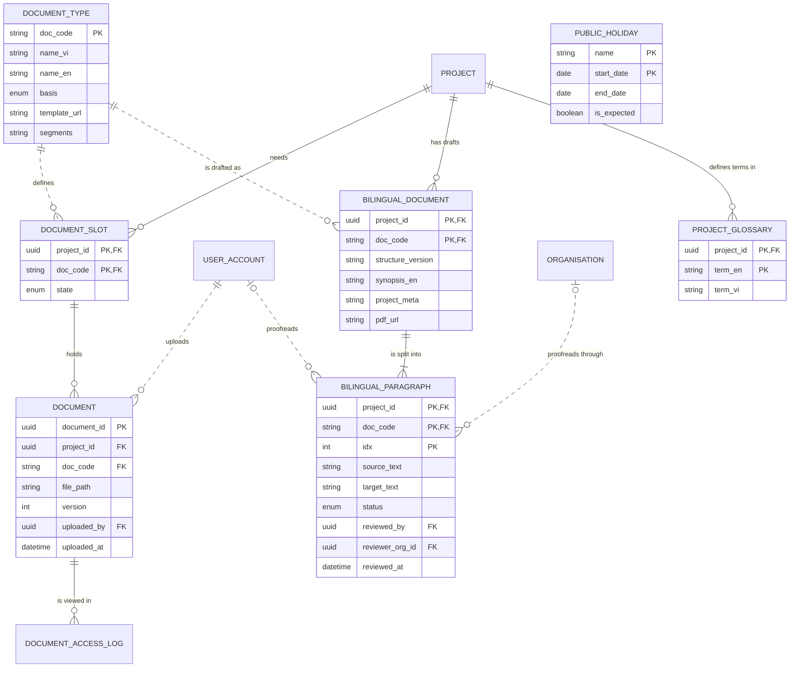

# Data Model and Mockup Data: Dossier kit, bilingual drafts and countdown (M5)

> Layout reconstructed from the Session 5 lecture (*Building an ERD with AI*, steps S0–S6 and human gates 1–6) and the Session 7 rubric (C3, C4, G2–G4), because the course template file was not available to the team. Sections marked *(mandatory)* are all filled. Generated by `tools/build_dm_docs.py` from the same sources as `data/01`–`05`, `data/schema/` and `data/seed/`; the numbers below are computed, not typed.

| Field | Value |
|---|---|
| Module | M5 — Dossier kit, bilingual drafts and countdown |
| Spec Document | `docs/spec/spec-M5.md` |
| Schema | `data/schema/schema-M5.sql` |
| Seed files | `33_document_type.csv`, `34_document_slot.csv`, `35_document.csv`, `37_bilingual_document.csv`, `38_bilingual_paragraph.csv`, `39_project_glossary.csv`, `40_public_holiday.csv` |
| Version / date | v1.0 — 01/10/2026 |
| Prepared by | Group C (draft by an AI agent, see `docs/ai-use-log.md`) |
| Status | Ready for the human gates in section 13 |

## 1. Sources and input map (mandatory)

The model of this module is derived from `docs/spec/spec-M5.md` only — no entity, column or relationship was invented. The input map below is the one used for the whole product (`data/01-entity-dictionary.md`); citations use the scheme `<MODULE> §<section> <ID>`.

```text
INPUT MAP
I am providing the following slots. Treat every slot not listed here as ABSENT, and apply the
degradation rules rather than inventing the missing material.

  FUNCTIONS = section 5 FR tables of the 9 module Spec Documents in docs/spec/
              (spec-SYS, spec-M1, spec-M0, spec-M2, spec-M3, spec-M4, spec-M5, spec-M7, spec-M10),
              104 rows (Spec Documents of 30/09/2026)
  FIELDS    = section 5.1 "Input / Output contract" of the same documents
              (every field typed, inputs marked Req / Opt), plus section 6.1
              "Attribute types" (types of the section 6 attributes no 5.1 field declares)
  ENTITIES  = section 6 "Key entities" of the same documents, 51 declared entities
  RULES     = section 5.2 "Business rules" of the same documents (BR-001 ... per module)
  SCENARIOS = section 3 user stories US-n with Given / When / Then, plus "Edge cases"
  FLOWS     = section 4 Mermaid blocks (usage flows 4.1, sequence diagrams 4.2+)
  SCREENS   = section 7 tables + docs/screens/screen-spec-<ID>.md (41 Screen Specs)
  BOUNDARY  = section 1 "Depends on" (external: Supabase Auth / PostgreSQL / Storage,
              Resend email, language-model API, PDF rendering, OpenStreetMap tiles, PostGIS)

  Out of this input: M6, M8, M9 are Won't for this release (docs/prd.md §4.4).

CITATION SCHEME = <MODULE> §<section> <ID>
  e.g. "M3 §5.1 FR-008" (field row of F-M3-08) | "M3 §5.2 BR-004" | "M3 §3 US-2" | "M3 §6"
```

## 2. Entity catalogue (mandatory)

7 entities owned by M5: 7 stored, 0 derived. Every entity is declared in §6 of the Spec Document (*discovered here* would mark one that is not). Each entity has exactly one owner module.

| Entity | Definition (one sentence) | Kind | Owner | Source | Table | Seed file (rows) |
|---|---|---|---|---|---|---|
| `DOCUMENT_TYPE` | A kind of dossier document, with its legal basis and template. | THING | M5 | spec §6 — M5 §6; M5 §5.1 FR-001 | `document_type` | `33_document_type.csv` (8) |
| `DOCUMENT_SLOT` | The place for one document type in one project, with its status. | THING | M5 | spec §6 — M5 §6; M5 §5.1 FR-003 | `document_slot` | `34_document_slot.csv` (19) |
| `DOCUMENT` | One uploaded file version in a project's document slot. | THING | M5 | spec §6 — M5 §6; M5 §5.1 FR-002 | `document` | `35_document.csv` (9) |
| `BILINGUAL_DOCUMENT` | A generated English–Vietnamese draft of one document of a project. | THING | M5 | spec §6 — M5 §6; M5 §5.1 FR-004 | `bilingual_document` | `37_bilingual_document.csv` (3) |
| `BILINGUAL_PARAGRAPH` | One aligned source/Vietnamese paragraph pair of a bilingual draft, with its proofreading status. | THING | M5 | spec §6 — M5 §6; M5 §5.1 FR-004, FR-006 | `bilingual_paragraph` | `38_bilingual_paragraph.csv` (16) |
| `PROJECT_GLOSSARY` | A project's agreed translation of one term, applied to every later draft of that project. | THING | M5 | spec §6 — M5 §6; M5 §5.1 FR-004; M5 §5.2 BR-006 | `project_glossary` | `39_project_glossary.csv` (4) |
| `PUBLIC_HOLIDAY` | A public holiday period shown on the licensing timeline, official or expected. | THING | M5 | spec §6 — M5 §6; M5 §5.1 FR-008 | `public_holiday` | `40_public_holiday.csv` (7) |

**Entities of other modules referenced here** (drawn without attributes in §5): `DOCUMENT_ACCESS_LOG` (M4), `ORGANISATION` (M4), `PROJECT` (M0), `USER_ACCOUNT` (SYS).

## 3. Attributes (mandatory)

Every attribute traces to a §5.1 field, a §6.1 declared type, a key, or a deliberate audit column (*Source kind*). *Req* = required by the function; *Opt* = optional; *system-set* = filled by the system.

### DOCUMENT_TYPE

| Column | Type | Required | Key | Source kind | Citation |
|---|---|---|---|---|---|
| `doc_code` | `VARCHAR(40)` | system-set | PK | §5.1 field | M5 §5.1 FR-001 (OUT) |
| `name_vi` | `TEXT` | system-set |  | §5.1 field | M5 §5.1 FR-001 (OUT) |
| `name_en` | `TEXT` | system-set |  | §5.1 field | M5 §5.1 FR-001 (OUT) |
| `basis` | `ENUM(law, common, location)` | system-set |  | §5.1 field | M5 §5.1 FR-001 (OUT); M5 §5.2 BR-003 |
| `template_url` | `TEXT` | system-set |  | §5.1 field | M5 §5.1 FR-001 (OUT) |
| `segments` | `ENUM(A, B, C)[]` | Req |  | §6.1 declared type | M5 §6; M5 §6.1 |

**Natural key:** doc_code.

### DOCUMENT_SLOT

| Column | Type | Required | Key | Source kind | Citation |
|---|---|---|---|---|---|
| `project_id` | `UUID` | Req | PK, FK → `PROJECT` | §5.1 field | M5 §5.1 FR-002; M5 §6 |
| `doc_code` | `VARCHAR(40)` | Req | PK, FK → `DOCUMENT_TYPE` | §5.1 field | M5 §5.1 FR-002; M5 §6 |
| `state` | `ENUM(present, needs_fix, pending, missing)` | system-set |  | §5.1 field | M5 §5.1 FR-003 (OUT); M2 §5.1 FR-009 |

**Natural key:** project_id + doc_code.

### DOCUMENT

| Column | Type | Required | Key | Source kind | Citation |
|---|---|---|---|---|---|
| `document_id` | `UUID` | system-set | PK | §5.1 field | M5 §5.1 FR-002 (OUT) |
| `project_id` | `UUID` | Req | FK → `DOCUMENT_SLOT` | §5.1 field | M5 §5.1 FR-002 (with doc_code: the slot) |
| `doc_code` | `VARCHAR(40)` | Req | FK → `DOCUMENT_SLOT` | §5.1 field | M5 §5.1 FR-002 |
| `file_path` | `TEXT` | Req |  | §6.1 declared type | M5 §6 (FR-002 declares file BYTEA — see Type conflicts); M5 §6.1 |
| `version` | `INTEGER` | Req |  | §6.1 declared type | M5 §6; M5 §5.1 FR-002 (previous versions kept); M5 §6.1 |
| `uploaded_by` | `UUID` | Req | FK → `USER_ACCOUNT` | §6.1 declared type | M5 §6; M5 §6.1 |
| `uploaded_at` | `TIMESTAMPTZ` | Req |  | §6.1 declared type | M5 §6; M5 §6.1 |

**Natural key:** project_id + doc_code + version.

### BILINGUAL_DOCUMENT

| Column | Type | Required | Key | Source kind | Citation |
|---|---|---|---|---|---|
| `project_id` | `UUID` | not declared | PK, FK → `PROJECT` | key | M5 §6 |
| `doc_code` | `VARCHAR(40)` | not declared | PK, FK → `DOCUMENT_TYPE` | key | M5 §6 |
| `structure_version` | `VARCHAR(20)` | system-set |  | §5.1 field | M5 §5.1 FR-004 (OUT) |
| `synopsis_en` | `TEXT` | Req |  | §5.1 field | M5 §5.1 FR-004, FR-005 |
| `project_meta` | `JSONB` | Req |  | §5.1 field | M5 §5.1 FR-004 (copy of project data — see Structural findings) |
| `pdf_url` | `TEXT` | system-set |  | §5.1 field | M5 §5.1 FR-005 (OUT) |

**Natural key:** project_id + doc_code.

### BILINGUAL_PARAGRAPH

| Column | Type | Required | Key | Source kind | Citation |
|---|---|---|---|---|---|
| `project_id` | `UUID` | not declared | PK, FK → `BILINGUAL_DOCUMENT` | key | M5 §6 (belongs to BilingualDocument) |
| `doc_code` | `VARCHAR(40)` | not declared | PK, FK → `BILINGUAL_DOCUMENT` | key | M5 §6 |
| `idx` | `INTEGER` | system-set | PK | §5.1 field | M5 §5.1 FR-004 (OUT) |
| `source_text` | `TEXT` | system-set |  | §5.1 field | M5 §5.1 FR-004 (OUT) |
| `target_text` | `TEXT` | system-set |  | §5.1 field | M5 §5.1 FR-004 (OUT) |
| `status` | `ENUM(machine, reviewed)` | system-set |  | §5.1 field | M5 §5.1 FR-004 (OUT); M5 §5.2 BR-002 |
| `reviewed_by` | `UUID` | Req | FK → `USER_ACCOUNT` | §5.1 field | M5 §5.1 FR-006 (reviewer_id); M5 §6 |
| `reviewer_org_id` | `UUID` | Opt | FK → `ORGANISATION` | §5.1 field | M5 §5.1 FR-006 (which organisation — see 01 conflicts) |
| `reviewed_at` | `TIMESTAMPTZ` | system-set |  | §5.1 field | M5 §5.1 FR-006 (OUT proofread_at); M5 §6 |

**Natural key:** project_id + doc_code + idx.

### PROJECT_GLOSSARY

| Column | Type | Required | Key | Source kind | Citation |
|---|---|---|---|---|---|
| `project_id` | `UUID` | Req | PK, FK → `PROJECT` | §6.1 declared type | M5 §6; M5 §5.2 BR-006; M5 §6.1 |
| `term_en` | `VARCHAR(120)` | not declared | PK | §5.1 field | M5 §5.1 FR-004 (glossary Opt); M5 §6 source_term |
| `term_vi` | `VARCHAR(120)` | not declared |  | §5.1 field | M5 §5.1 FR-004 (glossary Opt); M5 §6 target_term |

**Natural key:** project_id + term_en.

### PUBLIC_HOLIDAY

| Column | Type | Required | Key | Source kind | Citation |
|---|---|---|---|---|---|
| `name` | `VARCHAR(120)` | Req | PK | §6.1 declared type | M5 §6; M5 §6.1 |
| `start_date` | `DATE` | Req | PK | §6.1 declared type | M5 §6; M5 §6.1 |
| `end_date` | `DATE` | Req |  | §6.1 declared type | M5 §6; M5 §6.1 |
| `is_expected` | `BOOLEAN` | Req |  | §6.1 declared type | M5 §6; M5 §3 US-3 (band marked *expected*); M5 §6.1 |

**Natural key:** name + start_date.

## 4. Relationships (mandatory)

Each relationship is read in both directions; the citation is the spec line it comes from. **No many-to-many relationship is left unresolved**: every many-to-many need of this module is an associative entity (e.g. PROJECT_SHORTLIST, PROJECT_PROVINCE, PROJECT_MEMBER).

| Relationship | Forward reading | Reverse reading | Side that may be zero | Type | Citation |
|---|---|---|---|---|---|
| `DOCUMENT` \|\|--o{ `DOCUMENT_ACCESS_LOG` | Each document is viewed in zero or more access-log entries | Each access-log entry records exactly one document | DOCUMENT_ACCESS_LOG side | identifying (`--`) | M4 §6 ("belongs to Document (M5)"); M4 §5.1 FR-018 |
| `DOCUMENT_TYPE` \|\|..o{ `DOCUMENT_SLOT` | Each document type defines zero or more document slots | Each document slot is of exactly one document type | DOCUMENT_SLOT side | non-identifying (`..`) | M5 §6 ("has many DocumentSlots") |
| `PROJECT` \|\|--o{ `DOCUMENT_SLOT` | Each project needs zero or more document slots | Each document slot belongs to exactly one project | DOCUMENT_SLOT side | identifying (`--`) | M5 §6 ("belongs to Project"); M5 §10 (document list for segment C open) |
| `DOCUMENT_SLOT` \|\|--o{ `DOCUMENT` | Each document slot holds zero or more document versions | Each document is held by exactly one document slot | DOCUMENT side | identifying (`--`) | M5 §6 ("has many Documents"); M5 §5.1 FR-003 (state missing) |
| `USER_ACCOUNT` \|\|..o{ `DOCUMENT` | Each user account uploads zero or more documents | Each document is uploaded by exactly one user account | DOCUMENT side | non-identifying (`..`) | M5 §6 (uploaded_by) |
| `PROJECT` \|\|--o{ `BILINGUAL_DOCUMENT` | Each project has zero or more bilingual drafts | Each bilingual draft belongs to exactly one project | BILINGUAL_DOCUMENT side | identifying (`--`) | M5 §6 (project_id) |
| `DOCUMENT_TYPE` \|\|..o{ `BILINGUAL_DOCUMENT` | Each document type is drafted as zero or more bilingual drafts | Each bilingual draft is of exactly one document type | BILINGUAL_DOCUMENT side | non-identifying (`..`) | M5 §6 (doc_code) |
| `BILINGUAL_DOCUMENT` \|\|--\|{ `BILINGUAL_PARAGRAPH` | Each bilingual draft is split into one or more paragraphs | Each paragraph belongs to exactly one bilingual draft | neither | identifying (`--`) | M5 §6; M5 §5.1 FR-004; M5 §3 US-2 (14 paragraphs) |
| `USER_ACCOUNT` \|o..o{ `BILINGUAL_PARAGRAPH` | Each user account proofreads zero or more paragraphs | Each paragraph is proofread by zero or one user account | both sides | non-identifying (`..`) | M5 §6 (reviewed_by); M5 §3 US-2 ("not proofread") |
| `ORGANISATION` \|o..o{ `BILINGUAL_PARAGRAPH` | Each organisation proofreads zero or more paragraphs through its staff | Each paragraph is proofread on behalf of zero or one organisation | both sides | non-identifying (`..`) | M5 §5.1 FR-006 (reviewer_org_id Opt) |
| `PROJECT` \|\|--o{ `PROJECT_GLOSSARY` | Each project defines zero or more glossary terms | Each glossary term belongs to exactly one project | PROJECT_GLOSSARY side | identifying (`--`) | M5 §6 ("belongs to Project"); M5 §5.2 BR-006 ("stored with the project") |

## 5. ERD and diagram check (mandatory)

Entities of M5 with their attributes; entities of other modules appear as names only. Relationship lines are copied from `data/03-erd.mmd`.



Renders with mermaid-cli: **yes**.

**Diagram check** — computed by the generator; the build stops if a pair differs.

| Count | Value | Compared with | Value | Agree |
|---|---|---|---|---|
| Entities owned and stored (catalogue §2) | 7 | entity blocks in the ERD (§5) | 7 | ✓ |
| Entities owned and stored (catalogue §2) | 7 | tables in `schema-M5.sql` | 7 | ✓ |
| Attributes (§3) | 38 | columns in `schema-M5.sql` | 38 | ✓ |
| Relationships with the child in this module (§4) | 10 | FOREIGN KEY constraints in `schema-M5.sql` | 10 | ✓ |
| Relationships touching this module (§4) | 11 | relationship lines in the ERD (§5) | 11 | ✓ |
| Seed files of this module (§9) | 7 | tables in `schema-M5.sql` | 7 | ✓ |

## 6. Normalization check (mandatory)

| Table | 1NF | 2NF | 3NF |
|---|---|---|---|
| `DOCUMENT_TYPE` | exception: `segments` (array) | ✓ single-column key | ✓ |
| `DOCUMENT_SLOT` | ✓ | ✓ composite key (project_id, doc_code): every non-key column describes the whole key | ✓ |
| `DOCUMENT` | ✓ | ✓ single-column key | ✓ |
| `BILINGUAL_DOCUMENT` | ✓ | ✓ composite key (project_id, doc_code): every non-key column describes the whole key | exception: `project_meta` |
| `BILINGUAL_PARAGRAPH` | ✓ | ✓ composite key (project_id, doc_code, idx): every non-key column describes the whole key | ✓ |
| `PROJECT_GLOSSARY` | ✓ | ✓ composite key (project_id, term_en): every non-key column describes the whole key | ✓ |
| `PUBLIC_HOLIDAY` | ✓ | ✓ composite key (name, start_date): every non-key column describes the whole key | ✓ |

**Deliberate exceptions and their upkeep rules**

| Column | Breaks | Why it is kept | Upkeep rule |
|---|---|---|---|
| `BILINGUAL_DOCUMENT.project_meta` | copy of PROJECT data | the draft states the project as it was when drafted | regenerated only when the member asks (OQ-04-5 default) |
| `DOCUMENT_TYPE.segments` | 1NF (list in one column) | filtered and shown as a list | see note below |

Kept as a JSON array (1NF exception): the whole list is what functions filter and show; every value is checked against its declared set by seed_rules.py and, at the Plan step, by the input validation (01 OQ 3).

## 7. Business rules and where they are enforced (mandatory)

*SCHEMA* = a constraint in `data/schema/schema-M5.sql` today. *SEED CHECK* = `data/seed/seed_rules.py`, run by the generator before it writes and by `check_seed.py`. *TRIGGER / RLS / VIEW / APP* = built at the Plan step; the named object is the brief for the agent. *NOT DATA* = a rule about wording or an external service. The last column names the seed rows that demonstrate the rule.

| Rule | Statement | Enforced in | Named object | Seed rows that show it |
|---|---|---|---|---|
| BR-001 | Every generated document is a draft: the PDF carries *DRAFT — REQUIRES PROOFREADING* on every page; CINEMATCH never submits anything. | NOT DATA | the PDF renderer stamps every page (column `watermark` dropped, 04 minimality) | `37_bilingual_document.csv` — A13_SCRIPT_VI · https://storage.cinematch.example/priv; A13_SCRIPT_VI · https://storage.cinematch.example/priv — drafts with a PDF |
| BR-002 | Article 13 component b counts as present only when every paragraph of the Vietnamese version has been proofread by a person. | SEED CHECK + VIEW | seed_rules: component b is `present` only when every paragraph is reviewed | `38_bilingual_paragraph.csv` — 7 · machine; 8 · machine (+6) — 8 of 14 paragraphs not proofread<br>`34_document_slot.csv` — A13_SCRIPT_VI · needs_fix — so the script is *needs_fix* |
| BR-003 | Each document item carries its basis: *Required by law*, *Commonly requested* or *Location-specific*; nothing is presented as mandatory without a legal basis. | SCHEMA | `ck_document_type_basis` (law, common, location) | `33_document_type.csv` — HERITAGE_SITE_PERMIT · location — a location-specific document |
| BR-004 | The document list is generated from `segment_requirements` plus shortlisted locations; it is never hard-coded. | VIEW (Plan step) | kit = `segment_requirement` + shortlisted locations | `34_document_slot.csv` — HERITAGE_SITE_PERMIT · missing — heritage consent added because Tràng An is shortlisted |
| BR-005 | The countdown uses the same calculation as M2 (F-M2-17) and the dashboard. | VIEW (Plan step) | one view `v_licensing_timeline` used by M2, M5 and M0 | `09_project.csv` — The Last Ferry · A · preparing — same dates on SC-12, SC-27, SC-29 |
| BR-006 | Glossary terms a project adds (SC-28) are stored with the project (`project_glossary`) and applied to every later draft of that project. | SCHEMA | `pk_project_glossary` (project_id, term_en) | `39_project_glossary.csv` — ferry · đò — ferry → đò, kept for every later draft |

## 8. Schema (mandatory)

`data/schema/schema-M5.sql` — 7 tables in load order: `document_type`, `document_slot`, `document`, `bilingual_document`, `bilingual_paragraph`, `project_glossary`, `public_holiday`; 10 foreign keys; 6 CHECK constraints. Portable SQL (SQLite 3 and PostgreSQL 14+).

Load test: `python3 data/schema/load_check.py` runs every schema file, then every seed file in filename order with foreign keys on — **PASS** (also on PostgreSQL 16 with `--postgres`).

## 9. Mockup data (mandatory)

| Item | Value |
|---|---|
| Generator | `data/seed/generate_seed.py` (writes nothing unless `seed_rules.validate` passes) |
| Regenerate | `python3 data/seed/generate_seed.py && python3 data/seed/check_seed.py` (must print PASS; `git status` stays clean) |
| Random seed | none — no randomness and no clock: keys are UUIDv5 of readable names (namespace `6f1c2a8e-3b4d-5e6f-8a9b-0c1d2e3f4a5b`), so every run is byte-identical |
| Business-rule values | computed by the generator, never typed: attention level (M2 BR-004), quote span (M2 §6.1), latest readiness (M0 §9), is_active, published |
| Files | 7 files of this module, 66 rows (product: 46 files, 427 rows) |

**Rows per file and row kinds** (1 = ordinary rows in every file)

| File | Rows | (2) Boundary | (3) Empty case | (4) Exceptional state |
|---|---|---|---|---|
| `33_document_type.csv` | 8 | 76-character Vietnamese name | `PROVINCIAL_NOTICE_COPY`: no slot | segment C only type |
| `34_document_slot.csv` | 19 | — | slots with no document (`missing`) | `needs_fix`, `pending` |
| `35_document.csv` | 9 | version 2 | — | version 1 replaced by version 2 |
| `37_bilingual_document.csv` | 3 | — | `Rice and Salt`: no PDF yet | — (no status column) |
| `38_bilingual_paragraph.csv` | 16 | 14 paragraphs in one draft | — | `Rice and Salt` paragraph: translation failed (empty target) |
| `39_project_glossary.csv` | 4 | — | projects with no glossary | — (no status column) |
| `40_public_holiday.csv` | 7 | 2023 (far past) | — | `is_expected = true` (Tết 2027, 05–10/02 as on SC-29) |

## 10. Edge case register (mandatory)

Computed from the seed files. (a) every enumerated value has a row; (b) empty states; (c) one boundary per numeric or date rule; (d) one row per business rule — the last column of section 7.

**(a) Enumerated values**

| Column | Value | Seed rows |
|---|---|---|
| `DOCUMENT_TYPE.basis` | `law` | 4 row(s), e.g. A13_APPLICATION · law |
| `DOCUMENT_TYPE.basis` | `common` | 3 row(s), e.g. FOREIGN_CREW_LIST · common |
| `DOCUMENT_TYPE.basis` | `location` | 1 row(s), e.g. HERITAGE_SITE_PERMIT · location |
| `DOCUMENT_TYPE.segments` | `A` | 7 row(s), e.g. A13_APPLICATION · law |
| `DOCUMENT_TYPE.segments` | `B` | 7 row(s), e.g. A13_APPLICATION · law |
| `DOCUMENT_TYPE.segments` | `C` | 1 row(s), e.g. SERVICE_CONTRACT_C · common |
| `DOCUMENT_SLOT.state` | `present` | 7 row(s), e.g. A13_APPLICATION · present |
| `DOCUMENT_SLOT.state` | `needs_fix` | 2 row(s), e.g. A13_APPLICATION · needs_fix |
| `DOCUMENT_SLOT.state` | `pending` | 1 row(s), e.g. A13_SERVICE_AGREEMENT · pending |
| `DOCUMENT_SLOT.state` | `missing` | 9 row(s), e.g. A13_ART9_COMMITMENT · missing |
| `BILINGUAL_PARAGRAPH.status` | `machine` | 9 row(s), e.g. 1 · machine |
| `BILINGUAL_PARAGRAPH.status` | `reviewed` | 7 row(s), e.g. 1 · reviewed |

**(b) Empty states**

| Empty case | Seed rows |
|---|---|
| `DOCUMENT` with no `DOCUMENT_ACCESS_LOG` (is viewed in) | 5 row(s), e.g. private/projects/blues/a13_ser · 1 |
| `DOCUMENT_TYPE` with no `DOCUMENT_SLOT` (defines) | 1 row(s), e.g. PROVINCIAL_NOTICE_COPY · common |
| `DOCUMENT_SLOT` with no `DOCUMENT` (holds) | 1 row(s), e.g. SERVICE_CONTRACT_C · missing |
| `DOCUMENT_TYPE` with no `BILINGUAL_DOCUMENT` (is drafted as) | 7 row(s), e.g. A13_APPLICATION · law |

**(c) Boundaries of numeric and date rules**

| Rule | Seed row |
|---|---|
| Document versions from 1 (M5 §6.1) | `35_document.csv` — private/projects/ferry/a13_application · 2 — version 2 replaces version 1, both kept |
| Holiday far in the past (M5 §6.1) | `40_public_holiday.csv` — Tết Nguyên đán 2023 · false — Tết 2023 |
| Expected, not yet official holiday (M5 §3 US-3) | `40_public_holiday.csv` — Giỗ Tổ Hùng Vương 2027 · true; Quốc khánh 2027 · true (+1) — expected dates |

**(d) Business rules** — 6 of 6 rules have their rows named in section 7.

## 11. Privacy declaration (mandatory)

- [x] No row describes a real person: every name is invented for this project (the persona list in `data/seed/README.md`).
- [x] Every e-mail address is on an `example` domain (`*.example.*`, `anonymised.example`) — checked by `seed_rules.py`.
- [x] Every phone number has the form `+84 000 000 1xx`, which cannot be a real Vietnamese number, and is used once — checked by `seed_rules.py`.
- [x] No identity document, passport, tax or bank number is stored anywhere in the model.
- [x] No real script is stored: pre-checks keep only a hash of the summary (M2 FR-007); synopsis texts in the seed are invented.
- [x] Organisations, producer companies and projects are fictional; locations and provinces are real public places, described with mock text.
- [x] Sensitive columns (authority contacts, partner private layer, project documents) are protected by Row Level Security (SYS BR-001) — listed in section 7.
- [x] Nobody in the team knows of a real value in the seed files.

Personal or sensitive columns in this module: `BILINGUAL_DOCUMENT.synopsis_en`, `DOCUMENT.file_path`.

## 12. Open questions (mandatory)

Data questions raised in `data/01`–`04` whose owner includes M5. All other open points of the module are in `docs/spec/spec-M5.md` §10.

| Question | Blocking? | Owner | Status |
|---|---|---|---|
| [NEEDS CLARIFICATION: Which function creates DOCUMENT_SLOT rows, and which sets their state?] | Yes | M5 owner | Open |
| [NEEDS CLARIFICATION: Is PROJECT_GLOSSARY in scope? No function writes or reads it.] | No | M5 owner | Resolved 30/09/2026 — in scope: F-M5-04 stores and applies the project's glossary (M5 §5.1 FR-004 glossary; M5 §5.2 BR-006). |
| [NEEDS CLARIFICATION: Which entity links SEGMENT_REQUIREMENT to DOCUMENT_TYPE (M5 BR-004 builds the kit from segment_requirements)?] | Yes | M1 + M5 owners | Open |
| [NEEDS CLARIFICATION: Does a bilingual draft refresh its project_meta when the project changes?] | No | M5 owner | Open |
| [NEEDS CLARIFICATION: Is DOCUMENT_SLOT.state stored, or derived from documents, proofreading and partner status each time?] | Yes | M5 + M2 owners | Open |
| [NEEDS CLARIFICATION: Which function edits a paragraph (and so clears its proofread status)?] | No | M5 owner | Open |
| [NEEDS CLARIFICATION: Drop derivable columns (PROVINCE_NOTICE.province_id, LEGAL_RULE.is_active, BILINGUAL_DOCUMENT.watermark)?] | No | M7, M2, M5 owners | Resolved 01/10/2026 — watermark dropped; is_active kept with CHECK `ck_legal_rule_active_matches_status`; province_id kept as the province the notice was addressed to (M7 §6.1). See Structural findings, minimality. |

## 13. Human gates and sign-off

The gates of the Session 5 process. The agent prepared every section above; a person checks and signs.

| Gate | What the person checks | Checked by | Date |
|---|---|---|---|
| 1 — Entity authority and naming | §2: names, one owner per entity, definitions rewritten in own words | pending | pending |
| 2 — CRUD anomalies | `data/02-crud-matrix.md` rows of this module | pending | pending |
| 3 — Relationships | §4: each relationship read aloud in both directions | pending | pending |
| 4 — Logical model | §3 types and keys; type decisions in `data/04-data-model.md` | pending | pending |
| 5 — Seed | `check_seed.py` and `load_check.py` print PASS on your laptop | pending | pending |
| 6 — Review | §6, §7 and `data/05-review.md`; challenge at least one result | pending | pending |
