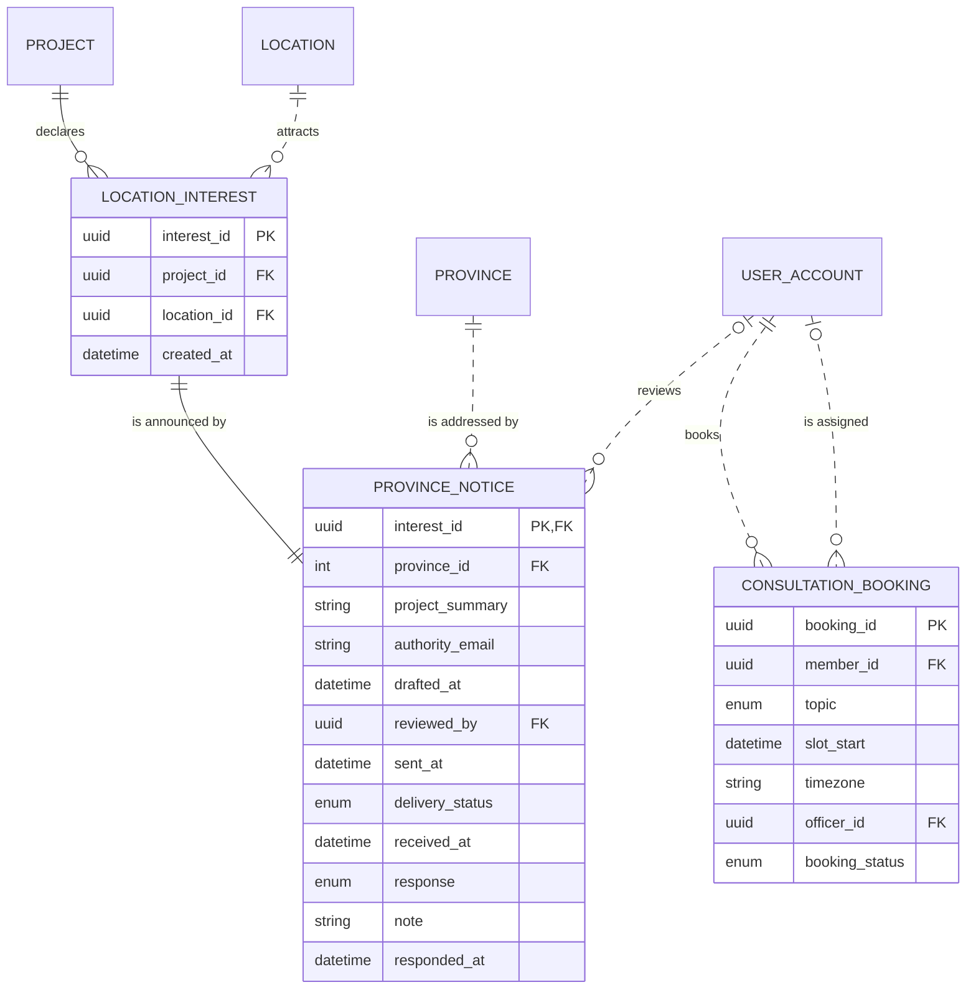

# Data Model and Mockup Data: VFDA support — provincial notices and consultations (M7)

> Layout reconstructed from the Session 5 lecture (*Building an ERD with AI*, steps S0–S6 and human gates 1–6) and the Session 7 rubric (C3, C4, G2–G4), because the course template file was not available to the team. Sections marked *(mandatory)* are all filled. Generated by `tools/build_dm_docs.py` from the same sources as `data/01`–`05`, `data/schema/` and `data/seed/`; the numbers below are computed, not typed.

| Field | Value |
|---|---|
| Module | M7 — VFDA support — provincial notices and consultations |
| Spec Document | `docs/spec/spec-M7.md` |
| Schema | `data/schema/schema-M7.sql` |
| Seed files | `41_location_interest.csv`, `42_province_notice.csv`, `43_consultation_booking.csv` |
| Version / date | v1.0 — 01/10/2026 |
| Prepared by | Group C (draft by an AI agent, see `docs/ai-use-log.md`) |
| Status | Ready for the human gates in section 13 |

## 1. Sources and input map (mandatory)

The model of this module is derived from `docs/spec/spec-M7.md` only — no entity, column or relationship was invented. The input map below is the one used for the whole product (`data/01-entity-dictionary.md`); citations use the scheme `<MODULE> §<section> <ID>`.

```text
INPUT MAP
I am providing the following slots. Treat every slot not listed here as ABSENT, and apply the
degradation rules rather than inventing the missing material.

  FUNCTIONS = section 5 FR tables of the 9 module Spec Documents in docs/spec/
              (spec-SYS, spec-M1, spec-M0, spec-M2, spec-M3, spec-M4, spec-M5, spec-M7, spec-M10),
              104 rows (Spec Documents of 30/09/2026)
  FIELDS    = section 5.1 "Input / Output contract" of the same documents
              (every field typed, inputs marked Req / Opt), plus section 6.1
              "Attribute types" (types of the section 6 attributes no 5.1 field declares)
  ENTITIES  = section 6 "Key entities" of the same documents, 51 declared entities
  RULES     = section 5.2 "Business rules" of the same documents (BR-001 ... per module)
  SCENARIOS = section 3 user stories US-n with Given / When / Then, plus "Edge cases"
  FLOWS     = section 4 Mermaid blocks (usage flows 4.1, sequence diagrams 4.2+)
  SCREENS   = section 7 tables + docs/screens/screen-spec-<ID>.md (41 Screen Specs)
  BOUNDARY  = section 1 "Depends on" (external: Supabase Auth / PostgreSQL / Storage,
              Resend email, language-model API, PDF rendering, OpenStreetMap tiles, PostGIS)

  Out of this input: M6, M8, M9 are Won't for this release (docs/prd.md §4.4).

CITATION SCHEME = <MODULE> §<section> <ID>
  e.g. "M3 §5.1 FR-008" (field row of F-M3-08) | "M3 §5.2 BR-004" | "M3 §3 US-2" | "M3 §6"
```

## 2. Entity catalogue (mandatory)

3 entities owned by M7: 3 stored, 0 derived. Every entity is declared in §6 of the Spec Document (*discovered here* would mark one that is not). Each entity has exactly one owner module.

| Entity | Definition (one sentence) | Kind | Owner | Source | Table | Seed file (rows) |
|---|---|---|---|---|---|---|
| `LOCATION_INTEREST` | A member's statement that a project is interested in a location. | EVENT | M7 | spec §6 — M7 §6; M7 §5.1 FR-001 | `location_interest` | `41_location_interest.csv` (8) |
| `PROVINCE_NOTICE` | The notice VFDA sends a province about a project's interest, and the province's reply. | EVENT | M7 | spec §6 — M7 §6; M7 §5.1 FR-002, FR-003 | `province_notice` | `42_province_notice.csv` (8) |
| `CONSULTATION_BOOKING` | A member's booked consultation slot with a VFDA officer. | EVENT | M7 | spec §6 — M7 §6; M7 §5.1 FR-005 | `consultation_booking` | `43_consultation_booking.csv` (6) |

**Entities of other modules referenced here** (drawn without attributes in §5): `LOCATION` (M3), `PROJECT` (M0), `PROVINCE` (M3), `USER_ACCOUNT` (SYS).

## 3. Attributes (mandatory)

Every attribute traces to a §5.1 field, a §6.1 declared type, a key, or a deliberate audit column (*Source kind*). *Req* = required by the function; *Opt* = optional; *system-set* = filled by the system.

### LOCATION_INTEREST

| Column | Type | Required | Key | Source kind | Citation |
|---|---|---|---|---|---|
| `interest_id` | `UUID` | system-set | PK | §5.1 field | M7 §5.1 FR-001 (OUT) |
| `project_id` | `UUID` | Req | FK → `PROJECT` | §5.1 field | M7 §5.1 FR-001 |
| `location_id` | `UUID` | Req | FK → `LOCATION` | §5.1 field | M7 §5.1 FR-001 |
| `created_at` | `TIMESTAMPTZ` | Req |  | §6.1 declared type | M7 §6; M7 §6.1 |

**Natural key:** project_id + location_id — proposed (open question: may a project declare interest twice?).

### PROVINCE_NOTICE

| Column | Type | Required | Key | Source kind | Citation |
|---|---|---|---|---|---|
| `interest_id` | `UUID` | Req | PK, FK → `LOCATION_INTEREST` | §5.1 field | M7 §5.1 FR-002; M7 §6 |
| `province_id` | `INTEGER` | Req | FK → `PROVINCE` | §6.1 declared type | M7 §6 (derivable from the location — see Structural findings); M7 §6.1 |
| `project_summary` | `TEXT` | Req |  | §5.1 field | M7 §5.1 FR-002 |
| `authority_email` | `VARCHAR(254)` | Req |  | §5.1 field | M7 §5.1 FR-002 (copied from AUTHORITY_CONTACT) |
| `drafted_at` | `TIMESTAMPTZ` | Req |  | §6.1 declared type | M7 §6; M7 §6.1 |
| `reviewed_by` | `UUID` | Req | FK → `USER_ACCOUNT` | §5.1 field | M7 §5.1 FR-002 |
| `sent_at` | `TIMESTAMPTZ` | Opt |  | §6.1 declared type | M7 §6; M7 §6.1 |
| `delivery_status` | `ENUM(queued, sent, bounced)` | system-set |  | §5.1 field | M7 §5.1 FR-002 (OUT) |
| `received_at` | `TIMESTAMPTZ` | Opt |  | §6.1 declared type | M7 §6; M7 §6.1 |
| `response` | `ENUM(received, info_needed, cannot_support)` | Req |  | §5.1 field | M7 §5.1 FR-003; M7 §5.2 BR-003 |
| `note` | `TEXT` | Opt |  | §5.1 field | M7 §5.1 FR-003 |
| `responded_at` | `TIMESTAMPTZ` | system-set |  | §5.1 field | M7 §5.1 FR-003 (OUT) |

**Natural key:** interest_id (one notice per interest).

### CONSULTATION_BOOKING

| Column | Type | Required | Key | Source kind | Citation |
|---|---|---|---|---|---|
| `booking_id` | `UUID` | system-set | PK | §5.1 field | M7 §5.1 FR-005 (OUT) |
| `member_id` | `UUID` | Req | FK → `USER_ACCOUNT` | §6.1 declared type | M7 §6; M7 §6.1 |
| `topic` | `ENUM(dossier, locations, partners, provincial_notice, general)` | Req |  | §5.1 field | M7 §5.1 FR-005 |
| `slot_start` | `TIMESTAMPTZ` | Req |  | §5.1 field | M7 §5.1 FR-005 |
| `timezone` | `VARCHAR(40)` | Req |  | §5.1 field | M7 §5.1 FR-005 (IANA) |
| `officer_id` | `UUID` | Req | FK → `USER_ACCOUNT` | §5.1 field | M7 §5.1 FR-006 |
| `booking_status` | `ENUM(confirmed, rescheduled)` | system-set |  | §5.1 field | M7 §5.1 FR-006 (OUT) |

**Natural key:** member_id + slot_start.

## 4. Relationships (mandatory)

Each relationship is read in both directions; the citation is the spec line it comes from. **No many-to-many relationship is left unresolved**: every many-to-many need of this module is an associative entity (e.g. PROJECT_SHORTLIST, PROJECT_PROVINCE, PROJECT_MEMBER).

| Relationship | Forward reading | Reverse reading | Side that may be zero | Type | Citation |
|---|---|---|---|---|---|
| `PROJECT` \|\|--o{ `LOCATION_INTEREST` | Each project declares zero or more location interests | Each location interest belongs to exactly one project | LOCATION_INTEREST side | identifying (`--`) | M7 §6; M7 §5.1 FR-001 project_id Req |
| `LOCATION` \|\|..o{ `LOCATION_INTEREST` | Each location attracts zero or more location interests | Each location interest concerns exactly one location | LOCATION_INTEREST side | non-identifying (`..`) | M7 §6; M7 §5.1 FR-001 location_id Req |
| `LOCATION_INTEREST` \|\|--\|\| `PROVINCE_NOTICE` | Each location interest is announced by exactly one province notice | Each province notice announces exactly one location interest | neither | identifying (`--`) | M7 §6 ("belongs to LocationInterest"); M7 §3 US-1 ("a notice ... is drafted" when interest is saved) |
| `PROVINCE` \|\|..o{ `PROVINCE_NOTICE` | Each province is addressed by zero or more province notices | Each province notice is addressed to exactly one province | PROVINCE_NOTICE side | non-identifying (`..`) | M7 §6 (province_id) |
| `USER_ACCOUNT` \|o..o{ `PROVINCE_NOTICE` | Each user account reviews zero or more province notices | Each province notice is reviewed by zero or one user account | both sides | non-identifying (`..`) | M7 §6 (reviewed_by); M7 §3 US-1 (notice drafted before review) |
| `USER_ACCOUNT` \|\|..o{ `CONSULTATION_BOOKING` | Each user account books zero or more consultations | Each consultation is booked by exactly one user account | CONSULTATION_BOOKING side | non-identifying (`..`) | M7 §6 (member_id; "belongs to UserAccount") |
| `USER_ACCOUNT` \|o..o{ `CONSULTATION_BOOKING` | Each user account is assigned zero or more consultations as officer | Each consultation is assigned to zero or one officer | both sides | non-identifying (`..`) | M7 §6 (officer_id); M7 §5.1 FR-006 (officer assigned after booking) |

## 5. ERD and diagram check (mandatory)

Entities of M7 with their attributes; entities of other modules appear as names only. Relationship lines are copied from `data/03-erd.mmd`.



Renders with mermaid-cli: **yes**.

**Diagram check** — computed by the generator; the build stops if a pair differs.

| Count | Value | Compared with | Value | Agree |
|---|---|---|---|---|
| Entities owned and stored (catalogue §2) | 3 | entity blocks in the ERD (§5) | 3 | ✓ |
| Entities owned and stored (catalogue §2) | 3 | tables in `schema-M7.sql` | 3 | ✓ |
| Attributes (§3) | 23 | columns in `schema-M7.sql` | 23 | ✓ |
| Relationships with the child in this module (§4) | 7 | FOREIGN KEY constraints in `schema-M7.sql` | 7 | ✓ |
| Relationships touching this module (§4) | 7 | relationship lines in the ERD (§5) | 7 | ✓ |
| Seed files of this module (§9) | 3 | tables in `schema-M7.sql` | 3 | ✓ |

## 6. Normalization check (mandatory)

| Table | 1NF | 2NF | 3NF |
|---|---|---|---|
| `LOCATION_INTEREST` | ✓ | ✓ single-column key | ✓ |
| `PROVINCE_NOTICE` | ✓ | ✓ single-column key | exception: `province_id`; `authority_email, project_summary` |
| `CONSULTATION_BOOKING` | ✓ | ✓ single-column key | ✓ |

**Deliberate exceptions and their upkeep rules**

| Column | Breaks | Why it is kept | Upkeep rule |
|---|---|---|---|
| `PROVINCE_NOTICE.province_id` | 3NF (derivable through the interest's location) | records the province the notice was addressed to, even after a merger | set once when drafted, never updated (M7 §6.1) |
| `PROVINCE_NOTICE.authority_email, project_summary` | copies of AUTHORITY_CONTACT / PROJECT data | what was actually sent must stay readable | copied at send time, never updated (OQ-04-1, OQ-04-2 defaults) |


## 7. Business rules and where they are enforced (mandatory)

*SCHEMA* = a constraint in `data/schema/schema-M7.sql` today. *SEED CHECK* = `data/seed/seed_rules.py`, run by the generator before it writes and by `check_seed.py`. *TRIGGER / RLS / VIEW / APP* = built at the Plan step; the named object is the brief for the agent. *NOT DATA* = a rule about wording or an external service. The last column names the seed rows that demonstrate the rule.

| Rule | Statement | Enforced in | Named object | Seed rows that show it |
|---|---|---|---|---|
| BR-001 | Notices are sent in VFDA's name, never directly by the producer. | SCHEMA + APP | `reviewed_by` on PROVINCE_NOTICE; sending only from the VFDA domain | `42_province_notice.csv` — sent · received; sent · cannot_support (+2) — sent after a VFDA review |
| BR-002 | Every notice states that it does not replace the filming licence from the Ministry of Culture, Sports and Tourism. | NOT DATA | fixed sentence in the notice template | `42_province_notice.csv` — sent · received; sent · cannot_support (+2) — every sent notice uses the template |
| BR-003 | The province's reply is one of three final values; the free-text note is kept as entered. | SCHEMA | `ck_province_notice_response` (received, info_needed, cannot_support) | `42_province_notice.csv` — sent · cannot_support — a *cannot support* reply |
| BR-004 | Reply times feed the provincial readiness index (M3). | VIEW (Plan step) | `v_province_readiness` reads responded_at − sent_at | `42_province_notice.csv` — sent · received — a reply with its time |
| BR-005 | Consultation booking (SC-33) is offered only after VFDA has declared its staffed hours and reply time; until then SC-33 shows VFDA's contact email instead of the booking form. | APP (Plan step) | configuration flag *booking open* set by VFDA; no stored entity | `43_consultation_booking.csv` — general · confirmed · Europe/London; locations · rescheduled · Europe/Paris (+4) — bookings exist only once VFDA has declared its hours |

## 8. Schema (mandatory)

`data/schema/schema-M7.sql` — 3 tables in load order: `location_interest`, `province_notice`, `consultation_booking`; 7 foreign keys; 4 CHECK constraints. Portable SQL (SQLite 3 and PostgreSQL 14+).

Load test: `python3 data/schema/load_check.py` runs every schema file, then every seed file in filename order with foreign keys on — **PASS** (also on PostgreSQL 16 with `--postgres`).

## 9. Mockup data (mandatory)

| Item | Value |
|---|---|
| Generator | `data/seed/generate_seed.py` (writes nothing unless `seed_rules.validate` passes) |
| Regenerate | `python3 data/seed/generate_seed.py && python3 data/seed/check_seed.py` (must print PASS; `git status` stays clean) |
| Random seed | none — no randomness and no clock: keys are UUIDv5 of readable names (namespace `6f1c2a8e-3b4d-5e6f-8a9b-0c1d2e3f4a5b`), so every run is byte-identical |
| Business-rule values | computed by the generator, never typed: attention level (M2 BR-004), quote span (M2 §6.1), latest readiness (M0 §9), is_active, published |
| Files | 3 files of this module, 22 rows (product: 46 files, 427 rows) |

**Rows per file and row kinds** (1 = ordinary rows in every file)

| File | Rows | (2) Boundary | (3) Empty case | (4) Exceptional state |
|---|---|---|---|---|
| `41_location_interest.csv` | 8 | — | `Monsoon Signal`: no first shooting day | — (see notices) |
| `42_province_notice.csv` | 8 | — | `i5`, `i7`: drafted, not reviewed | `bounced`; `cannot_support`; `i8`: reviewed, `queued` |
| `43_consultation_booking.csv` | 6 | time zone `America/Argentina/ComodRivadavia` | `b4`: no officer yet | `rescheduled` |

## 10. Edge case register (mandatory)

Computed from the seed files. (a) every enumerated value has a row; (b) empty states; (c) one boundary per numeric or date rule; (d) one row per business rule — the last column of section 7.

**(a) Enumerated values**

| Column | Value | Seed rows |
|---|---|---|
| `PROVINCE_NOTICE.delivery_status` | `queued` | 1 row(s), e.g. queued |
| `PROVINCE_NOTICE.delivery_status` | `sent` | 4 row(s), e.g. sent · received |
| `PROVINCE_NOTICE.delivery_status` | `bounced` | 1 row(s), e.g. bounced |
| `PROVINCE_NOTICE.response` | `received` | 1 row(s), e.g. sent · received |
| `PROVINCE_NOTICE.response` | `info_needed` | 1 row(s), e.g. sent · info_needed |
| `PROVINCE_NOTICE.response` | `cannot_support` | 1 row(s), e.g. sent · cannot_support |
| `CONSULTATION_BOOKING.topic` | `dossier` | 2 row(s), e.g. dossier · confirmed · America/Argentina/ComodRivadav |
| `CONSULTATION_BOOKING.topic` | `locations` | 1 row(s), e.g. locations · rescheduled · Europe/Paris |
| `CONSULTATION_BOOKING.topic` | `partners` | 1 row(s), e.g. partners · Asia/Tokyo |
| `CONSULTATION_BOOKING.topic` | `provincial_notice` | 1 row(s), e.g. provincial_notice · confirmed · Australia/Sydney |
| `CONSULTATION_BOOKING.topic` | `general` | 1 row(s), e.g. general · confirmed · Europe/London |
| `CONSULTATION_BOOKING.booking_status` | `confirmed` | 4 row(s), e.g. general · confirmed · Europe/London |
| `CONSULTATION_BOOKING.booking_status` | `rescheduled` | 1 row(s), e.g. locations · rescheduled · Europe/Paris |

**(b) Empty states**

No optional child relationship starts in this module.

**(c) Boundaries of numeric and date rules**

| Rule | Seed row |
|---|---|
| Unusual time zone (M7 §5.1 FR-005, IANA) | `43_consultation_booking.csv` — dossier · confirmed · America/Argentina/ComodRivadavia — America/Argentina/ComodRivadavia |

**(d) Business rules** — 5 of 5 rules have their rows named in section 7.

## 11. Privacy declaration (mandatory)

- [x] No row describes a real person: every name is invented for this project (the persona list in `data/seed/README.md`).
- [x] Every e-mail address is on an `example` domain (`*.example.*`, `anonymised.example`) — checked by `seed_rules.py`.
- [x] Every phone number has the form `+84 000 000 1xx`, which cannot be a real Vietnamese number, and is used once — checked by `seed_rules.py`.
- [x] No identity document, passport, tax or bank number is stored anywhere in the model.
- [x] No real script is stored: pre-checks keep only a hash of the summary (M2 FR-007); synopsis texts in the seed are invented.
- [x] Organisations, producer companies and projects are fictional; locations and provinces are real public places, described with mock text.
- [x] Sensitive columns (authority contacts, partner private layer, project documents) are protected by Row Level Security (SYS BR-001) — listed in section 7.
- [x] Nobody in the team knows of a real value in the seed files.

Personal or sensitive columns in this module: `PROVINCE_NOTICE.authority_email`.

## 12. Open questions (mandatory)

Data questions raised in `data/01`–`04` whose owner includes M7. All other open points of the module are in `docs/spec/spec-M7.md` §10.

| Question | Blocking? | Owner | Status |
|---|---|---|---|
| [NEEDS CLARIFICATION: Is a province notice drafted at the moment the interest is saved (1:1), or can an interest exist without a notice?] | No | M7 owner | Open |
| [NEEDS CLARIFICATION: Must a province notice keep the authority email it was sent to, even if the contact changes later?] | No | M7 owner | Open |
| [NEEDS CLARIFICATION: Is the project summary in a sent notice frozen?] | No | M7 owner | Open |
| [NEEDS CLARIFICATION: Initial and cancelled values of CONSULTATION_BOOKING.booking_status?] | No | M7 owner | Open |
| [NEEDS CLARIFICATION: Drop derivable columns (PROVINCE_NOTICE.province_id, LEGAL_RULE.is_active, BILINGUAL_DOCUMENT.watermark)?] | No | M7, M2, M5 owners | Resolved 01/10/2026 — watermark dropped; is_active kept with CHECK `ck_legal_rule_active_matches_status`; province_id kept as the province the notice was addressed to (M7 §6.1). See Structural findings, minimality. |

## 13. Human gates and sign-off

The gates of the Session 5 process. The agent prepared every section above; a person checks and signs.

| Gate | What the person checks | Checked by | Date |
|---|---|---|---|
| 1 — Entity authority and naming | §2: names, one owner per entity, definitions rewritten in own words | pending | pending |
| 2 — CRUD anomalies | `data/02-crud-matrix.md` rows of this module | pending | pending |
| 3 — Relationships | §4: each relationship read aloud in both directions | pending | pending |
| 4 — Logical model | §3 types and keys; type decisions in `data/04-data-model.md` | pending | pending |
| 5 — Seed | `check_seed.py` and `load_check.py` print PASS on your laptop | pending | pending |
| 6 — Review | §6, §7 and `data/05-review.md`; challenge at least one result | pending | pending |
