# Data Model and Mockup Data: Platform foundation — accounts, roles, bilingual UI, notifications, search (SYS)

> Layout reconstructed from the Session 5 lecture (*Building an ERD with AI*, steps S0–S6 and human gates 1–6) and the Session 7 rubric (C3, C4, G2–G4), because the course template file was not available to the team. Sections marked *(mandatory)* are all filled. Generated by `tools/build_dm_docs.py` from the same sources as `data/01`–`05`, `data/schema/` and `data/seed/`; the numbers below are computed, not typed.

| Field | Value |
|---|---|
| Module | SYS — Platform foundation — accounts, roles, bilingual UI, notifications, search |
| Spec Document | `docs/spec/spec-SYS.md` |
| Schema | `data/schema/schema-SYS.sql` |
| Seed files | `01_user_account.csv`, `03_profile.csv`, `02_producer_organisation.csv`, `04_consent.csv`, `05_notification.csv`, `06_email_delivery.csv` |
| Version / date | v1.0 — 01/10/2026 |
| Prepared by | Group C (draft by an AI agent, see `docs/ai-use-log.md`) |
| Status | Ready for the human gates in section 13 |

## 1. Sources and input map (mandatory)

The model of this module is derived from `docs/spec/spec-SYS.md` only — no entity, column or relationship was invented. The input map below is the one used for the whole product (`data/01-entity-dictionary.md`); citations use the scheme `<MODULE> §<section> <ID>`.

```text
INPUT MAP
I am providing the following slots. Treat every slot not listed here as ABSENT, and apply the
degradation rules rather than inventing the missing material.

  FUNCTIONS = section 5 FR tables of the 9 module Spec Documents in docs/spec/
              (spec-SYS, spec-M1, spec-M0, spec-M2, spec-M3, spec-M4, spec-M5, spec-M7, spec-M10),
              104 rows (Spec Documents of 30/09/2026)
  FIELDS    = section 5.1 "Input / Output contract" of the same documents
              (every field typed, inputs marked Req / Opt), plus section 6.1
              "Attribute types" (types of the section 6 attributes no 5.1 field declares)
  ENTITIES  = section 6 "Key entities" of the same documents, 51 declared entities
  RULES     = section 5.2 "Business rules" of the same documents (BR-001 ... per module)
  SCENARIOS = section 3 user stories US-n with Given / When / Then, plus "Edge cases"
  FLOWS     = section 4 Mermaid blocks (usage flows 4.1, sequence diagrams 4.2+)
  SCREENS   = section 7 tables + docs/screens/screen-spec-<ID>.md (41 Screen Specs)
  BOUNDARY  = section 1 "Depends on" (external: Supabase Auth / PostgreSQL / Storage,
              Resend email, language-model API, PDF rendering, OpenStreetMap tiles, PostGIS)

  Out of this input: M6, M8, M9 are Won't for this release (docs/prd.md §4.4).

CITATION SCHEME = <MODULE> §<section> <ID>
  e.g. "M3 §5.1 FR-008" (field row of F-M3-08) | "M3 §5.2 BR-004" | "M3 §3 US-2" | "M3 §6"
```

## 2. Entity catalogue (mandatory)

6 entities owned by SYS: 6 stored, 0 derived. Every entity is declared in §6 of the Spec Document (*discovered here* would mark one that is not). Each entity has exactly one owner module.

| Entity | Definition (one sentence) | Kind | Owner | Source | Table | Seed file (rows) |
|---|---|---|---|---|---|---|
| `USER_ACCOUNT` | A person's sign-in identity on CINEMATCH, carrying exactly one of six roles. | THING | SYS | spec §6 — SYS §6; SYS §5.1 FR-001, FR-004; SYS §5.2 BR-005 | `user_account` | `01_user_account.csv` (16) |
| `PROFILE` | The personal details shown for an account: name, crew role and preferred language. | THING | SYS | spec §6 — SYS §6; SYS §5.1 FR-001 | `profile` | `03_profile.csv` (16) |
| `PRODUCER_ORGANISATION` | The production company a producer signs up on behalf of. | THING | SYS | spec §6 — SYS §6; SYS §5.1 FR-001 | `producer_organisation` | `02_producer_organisation.csv` (7) |
| `CONSENT` | A record that an account accepted a given version of the terms at a given time. | EVENT | SYS | spec §6 — SYS §6; SYS §5.2 BR-003 | `consent` | `04_consent.csv` (18) |
| `NOTIFICATION` | An in-app message addressed to one account about one event. | EVENT | SYS | spec §6 — SYS §6; SYS §5.1 FR-007 | `notification` | `05_notification.csv` (9) |
| `EMAIL_DELIVERY` | One transactional email handed to the email provider, with its delivery outcome. | EVENT | SYS | spec §6 — SYS §6; SYS §5.1 FR-008 | `email_delivery` | `06_email_delivery.csv` (7) |

**Entities of other modules referenced here** (drawn without attributes in §5): `AUDIT_LOG` (M10), `AUTHORITY_CONTACT` (M3), `BILINGUAL_PARAGRAPH` (M5), `COLLAB_MESSAGE` (M4), `CONSULTATION_BOOKING` (M7), `DOCUMENT` (M5), `DOCUMENT_ACCESS_LOG` (M4), `LEGAL_RULE` (M2), `MODERATION_ITEM` (M10), `PROJECT` (M0), `PROJECT_MEMBER` (M0), `PROVINCE_NOTICE` (M7), `QUARTERLY_REPORT` (M10), `RULE_SET_VERSION` (M2), `VERIFICATION_REQUEST` (M4).

## 3. Attributes (mandatory)

Every attribute traces to a §5.1 field, a §6.1 declared type, a key, or a deliberate audit column (*Source kind*). *Req* = required by the function; *Opt* = optional; *system-set* = filled by the system.

### USER_ACCOUNT

| Column | Type | Required | Key | Source kind | Citation |
|---|---|---|---|---|---|
| `user_id` | `UUID` | system-set | PK | §5.1 field | SYS §5.1 FR-001 (OUT) |
| `email` | `VARCHAR(254)` | Req | UK | §5.1 field | SYS §5.1 FR-001; SYS §3 US-1 (one account per email) |
| `email_verified` | `BOOLEAN` | system-set |  | §5.1 field | SYS §5.1 FR-001 (OUT) |
| `role` | `ENUM(guest, member, partner, vfda_staff, vfda_legal, admin)` | Req |  | §5.1 field | SYS §5.1 FR-004; SYS §5.2 BR-002 (new account = member) |
| `account_status` | `ENUM(active, deactivated)` | Opt |  | §5.1 field | SYS §5.1 FR-004; SYS §5.2 BR-005 (deactivated and anonymised, never hard-deleted) |
| `created_at` | `TIMESTAMPTZ` | Req |  | §6.1 declared type | SYS §6; SYS §6.1 |

**Natural key:** email — one account per email (SYS §3 US-1, third criterion).

### PROFILE

| Column | Type | Required | Key | Source kind | Citation |
|---|---|---|---|---|---|
| `user_id` | `UUID` | Req | PK, FK → `USER_ACCOUNT` | key | SYS §6 ("belongs to UserAccount") |
| `full_name` | `VARCHAR(120)` | Req |  | §5.1 field | SYS §5.1 FR-001 |
| `crew_role` | `ENUM(producer, director, production_coordinator, line_producer, other)` | Req |  | §5.1 field | SYS §5.1 FR-001 |
| `locale` | `ENUM(vi, en)` | Req |  | §5.1 field | SYS §5.1 FR-005 (also said to live in a cookie — see Type conflicts) |
| `producer_org_id` | `UUID` | Opt | FK → `PRODUCER_ORGANISATION` | §6.1 declared type | SYS §6; SYS §6.1 |

**Natural key:** user_id — one profile per account (SYS §6).

### PRODUCER_ORGANISATION

| Column | Type | Required | Key | Source kind | Citation |
|---|---|---|---|---|---|
| `producer_org_id` | `UUID` | Req | PK | §6.1 declared type | SYS §6 (Profile.producer_org_id); SYS §6.1 |
| `org_name` | `VARCHAR(200)` | Req |  | §5.1 field | SYS §5.1 FR-001 |
| `country` | `CHAR(2)` | Req |  | §5.1 field | SYS §5.1 FR-001 |
| `website` | `VARCHAR(300)` | Opt |  | §5.1 field | SYS §5.1 FR-001 |

**Natural key:** org_name + country — proposed; not stated in the spec (open question).

### CONSENT

| Column | Type | Required | Key | Source kind | Citation |
|---|---|---|---|---|---|
| `user_id` | `UUID` | Req | PK, FK → `USER_ACCOUNT` | key | SYS §6 |
| `consent_version` | `VARCHAR(20)` | Req | PK | §5.1 field | SYS §5.1 FR-001; SYS §5.2 BR-003 |
| `accepted_at` | `TIMESTAMPTZ` | Req |  | §6.1 declared type | SYS §6; SYS §5.2 BR-003 (timestamp); SYS §6.1 |

**Natural key:** user_id + consent_version.

### NOTIFICATION

| Column | Type | Required | Key | Source kind | Citation |
|---|---|---|---|---|---|
| `notification_id` | `UUID` | system-set | PK | §5.1 field | SYS §5.1 FR-007 (OUT) |
| `recipient_id` | `UUID` | Req | FK → `USER_ACCOUNT` | §5.1 field | SYS §5.1 FR-007 |
| `event_type` | `VARCHAR(60)` | Req |  | §5.1 field | SYS §5.1 FR-007 |
| `payload` | `JSONB` | Req |  | §5.1 field | SYS §5.1 FR-007 |
| `created_at` | `TIMESTAMPTZ` | system-set |  | §5.1 field | SYS §5.1 FR-007 (OUT) |
| `read_at` | `TIMESTAMPTZ` | Opt |  | §6.1 declared type | SYS §6; SYS §5.1 FR-009 (mark as read); SYS §6.1 |

**Natural key:** None in the real world (an event); recipient_id + event_type + created_at identifies it in practice.

### EMAIL_DELIVERY

| Column | Type | Required | Key | Source kind | Citation |
|---|---|---|---|---|---|
| `email_delivery_id` | `UUID` | Req | PK | §6.1 declared type | SYS §6.1 |
| `notification_id` | `UUID` | Opt | FK → `NOTIFICATION` | key | SYS §6 ("may relate to a Notification") |
| `template_id` | `VARCHAR(60)` | Req |  | §5.1 field | SYS §5.1 FR-008 |
| `recipient_email` | `VARCHAR(254)` | Req |  | §5.1 field | SYS §5.1 FR-008 |
| `variables` | `JSONB` | Req |  | §5.1 field | SYS §5.1 FR-008 |
| `delivery_status` | `ENUM(queued, sent, bounced)` | system-set |  | §5.1 field | SYS §5.1 FR-008 (OUT) |
| `provider_message_id` | `TEXT` | system-set | UK | §5.1 field | SYS §5.1 FR-008 (OUT) |

**Natural key:** provider_message_id once sent; none while queued (open question).

## 4. Relationships (mandatory)

Each relationship is read in both directions; the citation is the spec line it comes from. **No many-to-many relationship is left unresolved**: every many-to-many need of this module is an associative entity (e.g. PROJECT_SHORTLIST, PROJECT_PROVINCE, PROJECT_MEMBER).

| Relationship | Forward reading | Reverse reading | Side that may be zero | Type | Citation |
|---|---|---|---|---|---|
| `USER_ACCOUNT` \|\|--\|\| `PROFILE` | Each user account has exactly one profile | Each profile belongs to exactly one user account | neither | identifying (`--`) | SYS §6 ("has one Profile"); SYS §5.1 FR-001 full_name Req |
| `PRODUCER_ORGANISATION` \|o..o{ `PROFILE` | Each producer organisation employs zero or more profiles | Each profile works for zero or one producer organisation (none for VFDA staff, Legal Board, admin and partner accounts) | both sides | non-identifying (`..`) | SYS §6 ("belongs to ProducerOrganisation"); SYS §5.1 FR-001 org_name Req; SYS §5.2 BR-002; SYS §6.1 producer_org_id No |
| `USER_ACCOUNT` \|\|--\|{ `CONSENT` | Each user account gives one or more consents | Each consent is given by exactly one user account | neither | identifying (`--`) | SYS §6; SYS §5.1 FR-001 consent_version Req |
| `USER_ACCOUNT` \|\|--o{ `NOTIFICATION` | Each user account receives zero or more notifications | Each notification is received by exactly one user account | NOTIFICATION side | identifying (`--`) | SYS §6; SYS §5.1 FR-009 (unread_only, unread_count) |
| `NOTIFICATION` \|o..o\| `EMAIL_DELIVERY` | Each notification is emailed as zero or one email delivery | Each email delivery carries zero or one notification | both sides | non-identifying (`..`) | SYS §6 ("may relate to a Notification") |
| `PRODUCER_ORGANISATION` \|\|..o{ `PROJECT` | Each producer organisation owns zero or more projects | Each project is owned by exactly one producer organisation | PROJECT side | non-identifying (`..`) | SYS §6 ("has many Projects (M0)"); M0 §6 ("belongs to ProducerOrganisation") |
| `USER_ACCOUNT` \|o..o{ `PROJECT_MEMBER` | Each user account joins zero or more projects as a project member | Each project member is zero or one user account (none while an invitation is pending) | both sides | non-identifying (`..`) | M0 §6 ("belongs to Project and UserAccount"); M0 §5.1 FR-004 (invitee_email, invite_status pending); M0 §3 US-3 |
| `USER_ACCOUNT` \|\|..o{ `RULE_SET_VERSION` | Each user account publishes zero or more rule set versions | Each rule set version is published by exactly one user account | RULE_SET_VERSION side | non-identifying (`..`) | M2 §6 (created_by); M2 §5.1 FR-004 (version created on each activation) |
| `USER_ACCOUNT` \|o..o{ `LEGAL_RULE` | Each user account approves zero or more legal rules | Each legal rule is approved by zero or one user account | both sides | non-identifying (`..`) | M2 §6 (approved_by); M2 §3 US-3 (draft rule has no approver) |
| `USER_ACCOUNT` \|\|..o{ `AUTHORITY_CONTACT` | Each user account verifies zero or more authority contacts | Each authority contact is verified by exactly one user account | AUTHORITY_CONTACT side | non-identifying (`..`) | M3 §5.1 FR-004 verified_by Req |
| `USER_ACCOUNT` \|o..o{ `VERIFICATION_REQUEST` | Each user account decides zero or more verification requests | Each verification request is decided by zero or one user account | both sides | non-identifying (`..`) | M4 §6 (decided_by); M4 §5.1 FR-009 (status pending) |
| `USER_ACCOUNT` \|\|..o{ `COLLAB_MESSAGE` | Each user account writes zero or more messages | Each message is written by exactly one user account | COLLAB_MESSAGE side | non-identifying (`..`) | M4 §6 (author_id) |
| `USER_ACCOUNT` \|\|..o{ `DOCUMENT_ACCESS_LOG` | Each user account views documents in zero or more access-log entries | Each access-log entry records exactly one viewer | DOCUMENT_ACCESS_LOG side | non-identifying (`..`) | M4 §5.1 FR-018 viewer_id Req |
| `USER_ACCOUNT` \|\|..o{ `DOCUMENT` | Each user account uploads zero or more documents | Each document is uploaded by exactly one user account | DOCUMENT side | non-identifying (`..`) | M5 §6 (uploaded_by) |
| `USER_ACCOUNT` \|o..o{ `BILINGUAL_PARAGRAPH` | Each user account proofreads zero or more paragraphs | Each paragraph is proofread by zero or one user account | both sides | non-identifying (`..`) | M5 §6 (reviewed_by); M5 §3 US-2 ("not proofread") |
| `USER_ACCOUNT` \|o..o{ `PROVINCE_NOTICE` | Each user account reviews zero or more province notices | Each province notice is reviewed by zero or one user account | both sides | non-identifying (`..`) | M7 §6 (reviewed_by); M7 §3 US-1 (notice drafted before review) |
| `USER_ACCOUNT` \|\|..o{ `CONSULTATION_BOOKING` | Each user account books zero or more consultations | Each consultation is booked by exactly one user account | CONSULTATION_BOOKING side | non-identifying (`..`) | M7 §6 (member_id; "belongs to UserAccount") |
| `USER_ACCOUNT` \|o..o{ `CONSULTATION_BOOKING` | Each user account is assigned zero or more consultations as officer | Each consultation is assigned to zero or one officer | both sides | non-identifying (`..`) | M7 §6 (officer_id); M7 §5.1 FR-006 (officer assigned after booking) |
| `USER_ACCOUNT` \|\|..o{ `MODERATION_ITEM` | Each user account submits zero or more moderation items | Each moderation item is submitted by exactly one user account | MODERATION_ITEM side | non-identifying (`..`) | M10 §5.1 FR-001 (OUT submitted_by UUID) |
| `USER_ACCOUNT` \|o..o{ `MODERATION_ITEM` | Each user account decides on zero or more moderation items | Each moderation item is decided by zero or one user account (none while pending) | both sides | non-identifying (`..`) | M10 §6 ("decided by UserAccount"); M10 §5.1 FR-002 (content_status pending) |
| `USER_ACCOUNT` \|\|..o{ `AUDIT_LOG` | Each user account writes zero or more audit log records | Each audit log record is written for exactly one user account | AUDIT_LOG side | non-identifying (`..`) | M10 §6 ("belongs to UserAccount"); M10 §5.1 FR-008 admin_id Req |
| `USER_ACCOUNT` \|o..o{ `QUARTERLY_REPORT` | Each user account rereads zero or more quarterly reports | Each quarterly report is reread by zero or one user account (none until the reread is recorded) | both sides | non-identifying (`..`) | M10 §6 ("prepared by UserAccount"); M10 §5.1 FR-007 reread_by; M10 §3 US-3 (draft not yet reread) |

## 5. ERD and diagram check (mandatory)

Entities of SYS with their attributes; entities of other modules appear as names only. Relationship lines are copied from `data/03-erd.mmd`.

```mermaid
erDiagram
    USER_ACCOUNT ||--|| PROFILE : "has"
    PRODUCER_ORGANISATION |o..o{ PROFILE : "employs"
    USER_ACCOUNT ||--|{ CONSENT : "gives"
    USER_ACCOUNT ||--o{ NOTIFICATION : "receives"
    NOTIFICATION |o..o| EMAIL_DELIVERY : "is emailed as"
    PRODUCER_ORGANISATION ||..o{ PROJECT : "owns"
    USER_ACCOUNT |o..o{ PROJECT_MEMBER : "joins projects as"
    USER_ACCOUNT ||..o{ RULE_SET_VERSION : "publishes"
    USER_ACCOUNT |o..o{ LEGAL_RULE : "approves"
    USER_ACCOUNT ||..o{ AUTHORITY_CONTACT : "verifies"
    USER_ACCOUNT |o..o{ VERIFICATION_REQUEST : "decides"
    USER_ACCOUNT ||..o{ COLLAB_MESSAGE : "writes"
    USER_ACCOUNT ||..o{ DOCUMENT_ACCESS_LOG : "views"
    USER_ACCOUNT ||..o{ DOCUMENT : "uploads"
    USER_ACCOUNT |o..o{ BILINGUAL_PARAGRAPH : "proofreads"
    USER_ACCOUNT |o..o{ PROVINCE_NOTICE : "reviews"
    USER_ACCOUNT ||..o{ CONSULTATION_BOOKING : "books"
    USER_ACCOUNT |o..o{ CONSULTATION_BOOKING : "is assigned"
    USER_ACCOUNT ||..o{ MODERATION_ITEM : "submits"
    USER_ACCOUNT |o..o{ MODERATION_ITEM : "decides on"
    USER_ACCOUNT ||..o{ AUDIT_LOG : "writes"
    USER_ACCOUNT |o..o{ QUARTERLY_REPORT : "rereads"
    USER_ACCOUNT {
        uuid user_id PK
        string email UK
        boolean email_verified
        enum role
        enum account_status
        datetime created_at
    }
    PROFILE {
        uuid user_id PK,FK
        string full_name
        enum crew_role
        enum locale
        uuid producer_org_id FK
    }
    PRODUCER_ORGANISATION {
        uuid producer_org_id PK
        string org_name
        string country
        string website
    }
    CONSENT {
        uuid user_id PK,FK
        string consent_version PK
        datetime accepted_at
    }
    NOTIFICATION {
        uuid notification_id PK
        uuid recipient_id FK
        string event_type
        string payload
        datetime created_at
        datetime read_at
    }
    EMAIL_DELIVERY {
        uuid email_delivery_id PK
        uuid notification_id FK
        string template_id
        string recipient_email
        string variables
        enum delivery_status
        string provider_message_id UK
    }
```



Renders with mermaid-cli: **yes**.

**Diagram check** — computed by the generator; the build stops if a pair differs.

| Count | Value | Compared with | Value | Agree |
|---|---|---|---|---|
| Entities owned and stored (catalogue §2) | 6 | entity blocks in the ERD (§5) | 6 | ✓ |
| Entities owned and stored (catalogue §2) | 6 | tables in `schema-SYS.sql` | 6 | ✓ |
| Attributes (§3) | 31 | columns in `schema-SYS.sql` | 31 | ✓ |
| Relationships with the child in this module (§4) | 5 | FOREIGN KEY constraints in `schema-SYS.sql` | 5 | ✓ |
| Relationships touching this module (§4) | 22 | relationship lines in the ERD (§5) | 22 | ✓ |
| Seed files of this module (§9) | 6 | tables in `schema-SYS.sql` | 6 | ✓ |

## 6. Normalization check (mandatory)

| Table | 1NF | 2NF | 3NF |
|---|---|---|---|
| `USER_ACCOUNT` | ✓ | ✓ single-column key | ✓ |
| `PROFILE` | ✓ | ✓ single-column key | ✓ |
| `PRODUCER_ORGANISATION` | ✓ | ✓ single-column key | ✓ |
| `CONSENT` | ✓ | ✓ composite key (user_id, consent_version): every non-key column describes the whole key | ✓ |
| `NOTIFICATION` | ✓ | ✓ single-column key | ✓ |
| `EMAIL_DELIVERY` | ✓ | ✓ single-column key | ✓ |

**Deliberate exceptions and their upkeep rules**

None in this module.


## 7. Business rules and where they are enforced (mandatory)

*SCHEMA* = a constraint in `data/schema/schema-SYS.sql` today. *SEED CHECK* = `data/seed/seed_rules.py`, run by the generator before it writes and by `check_seed.py`. *TRIGGER / RLS / VIEW / APP* = built at the Plan step; the named object is the brief for the agent. *NOT DATA* = a rule about wording or an external service. The last column names the seed rows that demonstrate the rule.

| Rule | Statement | Enforced in | Named object | Seed rows that show it |
|---|---|---|---|---|
| BR-001 | Sensitive data (authority contacts, partner private layer, project documents) is filtered by Row Level Security in the database. Hiding it in the interface does not count. | RLS (Plan step) | policies `rls_authority_contact_members`, `rls_org_private_after_nda`, `rls_document_project_members` | `23_authority_contact.csv` — Ban Quản lý Vườn quốc gia Mũi Cà Mau · true · 2016-01-04T10:00:00+07:00; Ban Quản lý vịnh Hạ Long · true · 2026-04-12T10:00:00+07:00 (+9) — contacts exist for 11 locations; a guest session must read 0 of them (SYS US-2) |
| BR-002 | A new account is always `member`. The roles `partner`, `vfda_staff`, `vfda_legal` and `admin` are granted only by an admin, and every grant is written to the audit log. | SEED CHECK + TRIGGER (Plan step) | seed_rules: staff, Legal Board, admin and partner profiles have no producer organisation; trigger `trg_role_grant_audit` writes `role.grant` | `01_user_account.csv` — lan.pham@benxua.example.vn · partner · active — a partner account granted by the admin<br>`45_audit_log.csv` — role.grant · 2026-06-10T10:30:00+07:00 — the grant is in the audit log |
| BR-003 | Acceptance of the terms is stored with the document version and timestamp. | SCHEMA | primary key `pk_consent` (user_id, consent_version) + `accepted_at NOT NULL` | `04_consent.csv` — 2026.2 — Lena Park re-consents to a new terms version: a second row, the first is kept |
| BR-004 | Passwords, password hashing and tokens are handled only by Supabase Auth. | NOT DATA | no password, hash or token column exists in any table (Supabase Auth keeps them) | `01_user_account.csv` — yui.tanaka@sakuralane.example.jp · member · active; tuan.huynh@mekongframe.example.vn · partner · active (+14) — USER_ACCOUNT has no password column |
| BR-005 | An account is never hard-deleted. When its owner deletes it (SC-08), it is deactivated at once, loses all access, and its name, email and phone are replaced by anonymous values within 30 days; projects, uploads, access logs and approvals it created stay and are shown as *Former member*. | SCHEMA + SEED CHECK | `ck_user_account_account_status`; seed_rules: a deactivated account is anonymised | `01_user_account.csv` — former-member-2e513ee3@anonymised.exam · member · deactivated — deactivated, e-mail anonymised<br>`11_project_member.csv` — former-member-2e513ee3@anonymised.exam · view · accepted — its project membership is kept |

## 8. Schema (mandatory)

`data/schema/schema-SYS.sql` — 6 tables in load order: `user_account`, `producer_organisation`, `profile`, `consent`, `notification`, `email_delivery`; 5 foreign keys; 5 CHECK constraints. Portable SQL (SQLite 3 and PostgreSQL 14+).

Load test: `python3 data/schema/load_check.py` runs every schema file, then every seed file in filename order with foreign keys on — **PASS** (also on PostgreSQL 16 with `--postgres`).

## 9. Mockup data (mandatory)

| Item | Value |
|---|---|
| Generator | `data/seed/generate_seed.py` (writes nothing unless `seed_rules.validate` passes) |
| Regenerate | `python3 data/seed/generate_seed.py && python3 data/seed/check_seed.py` (must print PASS; `git status` stays clean) |
| Random seed | none — no randomness and no clock: keys are UUIDv5 of readable names (namespace `6f1c2a8e-3b4d-5e6f-8a9b-0c1d2e3f4a5b`), so every run is byte-identical |
| Business-rule values | computed by the generator, never typed: attention level (M2 BR-004), quote span (M2 §6.1), latest readiness (M0 §9), is_active, published |
| Files | 6 files of this module, 73 rows (product: 46 files, 427 rows) |

**Rows per file and row kinds** (1 = ordinary rows in every file)

| File | Rows | (2) Boundary | (3) Empty case | (4) Exceptional state |
|---|---|---|---|---|
| `01_user_account.csv` | 16 | 254-character e-mail (64-character local part) | `okafor`: no project he owns, no notification | `rossi`: e-mail not verified; `former`: deactivated and anonymised (SYS BR-005) |
| `03_profile.csv` | 16 | 120-character full name | staff and partner profiles: no producer organisation | unverified account's profile; *Former member* (anonymised name) |
| `02_producer_organisation.csv` | 7 | 200-character name, 300-character website | Kestrel Pictures: no project | Rossi Film: only member unverified |
| `04_consent.csv` | 18 | version `2026.2-rev-a-final-1` (20 chars, the maximum) | — (every account consents at sign-up) | `park`: re-consent to a new version |
| `05_notification.csv` | 9 | payload with nested JSON | `okafor`: none | `n7`: alert about a bounced e-mail |
| `06_email_delivery.csv` | 7 | — | `e5`: no linked notification | `e4`: bounced |

## 10. Edge case register (mandatory)

Computed from the seed files. (a) every enumerated value has a row; (b) empty states; (c) one boundary per numeric or date rule; (d) one row per business rule — the last column of section 7.

**(a) Enumerated values**

| Column | Value | Seed rows |
|---|---|---|
| `USER_ACCOUNT.role` | `guest` | not used — a guest has no account (SYS BR-002) |
| `USER_ACCOUNT.role` | `member` | 9 row(s), e.g. yui.tanaka@sakuralane.example. · member · active |
| `USER_ACCOUNT.role` | `partner` | 3 row(s), e.g. tuan.huynh@mekongframe.example · partner · active |
| `USER_ACCOUNT.role` | `vfda_staff` | 2 row(s), e.g. thuha.nguyen@vfda-demo.example · vfda_staff · active |
| `USER_ACCOUNT.role` | `vfda_legal` | 1 row(s), e.g. quan.tran@vfda-demo.example.vn · vfda_legal · active |
| `USER_ACCOUNT.role` | `admin` | 1 row(s), e.g. ducanh.vu@vfda-demo.example.vn · admin · active |
| `USER_ACCOUNT.account_status` | `active` | 15 row(s), e.g. yui.tanaka@sakuralane.example. · member · active |
| `USER_ACCOUNT.account_status` | `deactivated` | 1 row(s), e.g. former-member-2e513ee3@anonymi · member · deactivated |
| `PROFILE.crew_role` | `producer` | 3 row(s), e.g. Liam Walsh |
| `PROFILE.crew_role` | `director` | 1 row(s), e.g. Daniel Okafor |
| `PROFILE.crew_role` | `production_coordinator` | 3 row(s), e.g. Tanaka Yui |
| `PROFILE.crew_role` | `line_producer` | 3 row(s), e.g. Huỳnh Minh Tuấn |
| `PROFILE.crew_role` | `other` | 6 row(s), e.g. Nguyễn Thị Thu Hà |
| `PROFILE.locale` | `vi` | 8 row(s), e.g. Huỳnh Minh Tuấn |
| `PROFILE.locale` | `en` | 8 row(s), e.g. Tanaka Yui |
| `EMAIL_DELIVERY.delivery_status` | `queued` | 2 row(s), e.g. consultation_reminder · queued |
| `EMAIL_DELIVERY.delivery_status` | `sent` | 4 row(s), e.g. collab_request_new · sent |
| `EMAIL_DELIVERY.delivery_status` | `bounced` | 1 row(s), e.g. province_notice · bounced |

**(b) Empty states**

| Empty case | Seed rows |
|---|---|
| `PRODUCER_ORGANISATION` with no `PROFILE` (employs) | 1 row(s), e.g. International Documentary and  |
| `USER_ACCOUNT` with no `NOTIFICATION` (receives) | 10 row(s), e.g. tuan.huynh@mekongframe.example · partner · active |
| `NOTIFICATION` with no `EMAIL_DELIVERY` (is emailed as) | 4 row(s), e.g. verification.expiring |
| `PRODUCER_ORGANISATION` with no `PROJECT` (owns) | 2 row(s), e.g. Kestrel Pictures |
| `USER_ACCOUNT` with no `PROJECT_MEMBER` (joins projects as) | 8 row(s), e.g. tuan.huynh@mekongframe.example · partner · active |
| `USER_ACCOUNT` with no `RULE_SET_VERSION` (publishes) | 15 row(s), e.g. yui.tanaka@sakuralane.example. · member · active |
| `USER_ACCOUNT` with no `LEGAL_RULE` (approves) | 15 row(s), e.g. yui.tanaka@sakuralane.example. · member · active |
| `USER_ACCOUNT` with no `AUTHORITY_CONTACT` (verifies) | 14 row(s), e.g. yui.tanaka@sakuralane.example. · member · active |
| `USER_ACCOUNT` with no `VERIFICATION_REQUEST` (decides) | 13 row(s), e.g. yui.tanaka@sakuralane.example. · member · active |
| `USER_ACCOUNT` with no `COLLAB_MESSAGE` (writes) | 13 row(s), e.g. yui.tanaka@sakuralane.example. · member · active |
| `USER_ACCOUNT` with no `DOCUMENT_ACCESS_LOG` (views) | 14 row(s), e.g. yui.tanaka@sakuralane.example. · member · active |
| `USER_ACCOUNT` with no `DOCUMENT` (uploads) | 12 row(s), e.g. tuan.huynh@mekongframe.example · partner · active |
| `USER_ACCOUNT` with no `BILINGUAL_PARAGRAPH` (proofreads) | 14 row(s), e.g. yui.tanaka@sakuralane.example. · member · active |
| `USER_ACCOUNT` with no `PROVINCE_NOTICE` (reviews) | 14 row(s), e.g. yui.tanaka@sakuralane.example. · member · active |
| `USER_ACCOUNT` with no `CONSULTATION_BOOKING` (books) | 10 row(s), e.g. tuan.huynh@mekongframe.example · partner · active |
| `USER_ACCOUNT` with no `CONSULTATION_BOOKING` (is assigned) | 10 row(s), e.g. tuan.huynh@mekongframe.example · partner · active |
| `USER_ACCOUNT` with no `MODERATION_ITEM` (submits) | 15 row(s), e.g. yui.tanaka@sakuralane.example. · member · active |
| `USER_ACCOUNT` with no `MODERATION_ITEM` (decides on) | 15 row(s), e.g. yui.tanaka@sakuralane.example. · member · active |
| `USER_ACCOUNT` with no `AUDIT_LOG` (writes) | 12 row(s), e.g. yui.tanaka@sakuralane.example. · member · active |
| `USER_ACCOUNT` with no `QUARTERLY_REPORT` (rereads) | 15 row(s), e.g. yui.tanaka@sakuralane.example. · member · active |

**(c) Boundaries of numeric and date rules**

| Rule | Seed row |
|---|---|
| E-mail ≤ 254 characters (SYS §5.1 FR-001) | `01_user_account.csv` — international.coproductions.and.locati · member · active — e-mail of exactly 254 characters |
| Full name ≤ 120 characters (SYS §5.1 FR-001) | `03_profile.csv` — Alexandria Konstantinopoulou-Nguyễn Th — name of exactly 120 characters |
| Anonymised within 30 days (SYS BR-005) | `01_user_account.csv` — former-member-2e513ee3@anonymised.exam · member · deactivated — deactivated and already anonymised |

**(d) Business rules** — 5 of 5 rules have their rows named in section 7.

## 11. Privacy declaration (mandatory)

- [x] No row describes a real person: every name is invented for this project (the persona list in `data/seed/README.md`).
- [x] Every e-mail address is on an `example` domain (`*.example.*`, `anonymised.example`) — checked by `seed_rules.py`.
- [x] Every phone number has the form `+84 000 000 1xx`, which cannot be a real Vietnamese number, and is used once — checked by `seed_rules.py`.
- [x] No identity document, passport, tax or bank number is stored anywhere in the model.
- [x] No real script is stored: pre-checks keep only a hash of the summary (M2 FR-007); synopsis texts in the seed are invented.
- [x] Organisations, producer companies and projects are fictional; locations and provinces are real public places, described with mock text.
- [x] Sensitive columns (authority contacts, partner private layer, project documents) are protected by Row Level Security (SYS BR-001) — listed in section 7.
- [x] Nobody in the team knows of a real value in the seed files.

Personal or sensitive columns in this module: `EMAIL_DELIVERY.email_delivery_id`, `EMAIL_DELIVERY.recipient_email`, `PROFILE.full_name`, `USER_ACCOUNT.email_verified`, `USER_ACCOUNT.email`.

## 12. Open questions (mandatory)

Data questions raised in `data/01`–`04` whose owner includes SYS. All other open points of the module are in `docs/spec/spec-SYS.md` §10.

| Question | Blocking? | Owner | Status |
|---|---|---|---|
| [NEEDS CLARIFICATION: Who reads CONSENT, RULE_SET_VERSION and EMAIL_DELIVERY? Each is written but never read by a function. (SEGMENT_DECISION and PROJECT_PROVINCE are now read by F-M10-03.)] | No | Owners of SYS, M2 | Open |
| [NEEDS CLARIFICATION: Do VFDA staff, partner and admin accounts also need a PRODUCER_ORGANISATION? The diagram says every profile works for exactly one.] | Yes | SYS owner | Resolved 01/10/2026 — zero or one: SYS §6.1 declares producer_org_id optional for accounts not created through sign-up (SYS BR-002); 03 and 04 corrected together. |
| [NEEDS CLARIFICATION: Is an email delivery linked to at most one notification, or can one digest email carry several?] | No | SYS owner | Open |
| [NEEDS CLARIFICATION: Declare identifiers for EMAIL_DELIVERY and SEGMENT_DECISION (none in the spec; LOCATION_QUERY now has query_id, M3 FR-011).] | No | SYS, M1 owners | Resolved 01/10/2026 — email_delivery_id UUID (SYS §6.1) and segment_decision_id UUID (M1 §6.1). |

## 13. Human gates and sign-off

The gates of the Session 5 process. The agent prepared every section above; a person checks and signs.

| Gate | What the person checks | Checked by | Date |
|---|---|---|---|
| 1 — Entity authority and naming | §2: names, one owner per entity, definitions rewritten in own words | pending | pending |
| 2 — CRUD anomalies | `data/02-crud-matrix.md` rows of this module | pending | pending |
| 3 — Relationships | §4: each relationship read aloud in both directions | pending | pending |
| 4 — Logical model | §3 types and keys; type decisions in `data/04-data-model.md` | pending | pending |
| 5 — Seed | `check_seed.py` and `load_check.py` print PASS on your laptop | pending | pending |
| 6 — Review | §6, §7 and `data/05-review.md`; challenge at least one result | pending | pending |
