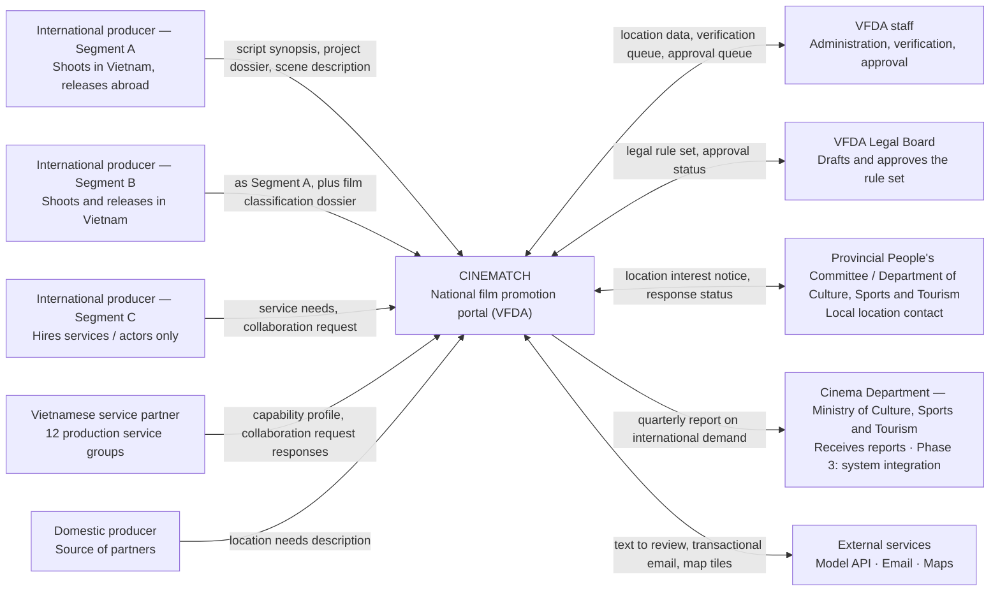

# Context Diagram — CINEMATCH

> Source: System Design v2.0, sheet *1. Schematic*, section 1.3, Figure 1.
> Diagram image: `diagrams/CTX-01_Context-diagram.png` (to be redrawn from the Mermaid source below).
> Rule applied (Pattern 1): the system is **one** node; everything else is an actor or an external system;
> the labels on the arrows are **the information that moves**, not verbs.

## System boundary

CINEMATCH is **not** an official submission channel. Dossiers are prepared on the system and submitted
through the competent authority's procedure. Integration with the licensing system is a **phase 3** goal
and is outside this scope.

---

## Verification (Step 3, section 5.6)

| # | Check | Result |
|---|---|---|
| 1 | Count the nodes: original image and Mermaid block | Original image 10 actors + 1 system = 11; Mermaid 11 nodes — **match** |
| 2 | Trace every arrow, including direction | Original image 10 arrows; Mermaid 10 edges — **match** (5 one-way inbound, 1 one-way outbound, 4 two-way) |
| 3 | Every decision keeps all its branches with the original labels | Not applicable — the context diagram has no decision branches |
| 4 | Labels translated, nothing renamed or "tidied up" | Labels translated into English from the Vietnamese original; nodes, edges and branch labels otherwise unchanged. |
| 5 | Render the Mermaid block and place it next to the original image | Diagram image: `diagrams/CTX-01_Context-diagram.png` |
| 6 | Ask what is missing | The original image does not draw error flows. The Mermaid block does not either. Recorded as a known gap. |

**Verified by:** _(not signed yet — a Group C member must compare the diagram with the original image node by node and sign here)_

> The figures in rows 1–3 come from a script that automatically compares the image drawing data with the Mermaid block.
> Under the Step 3 guidance, section 5.6, **a human must still give final confirmation** before this counts as verified.
