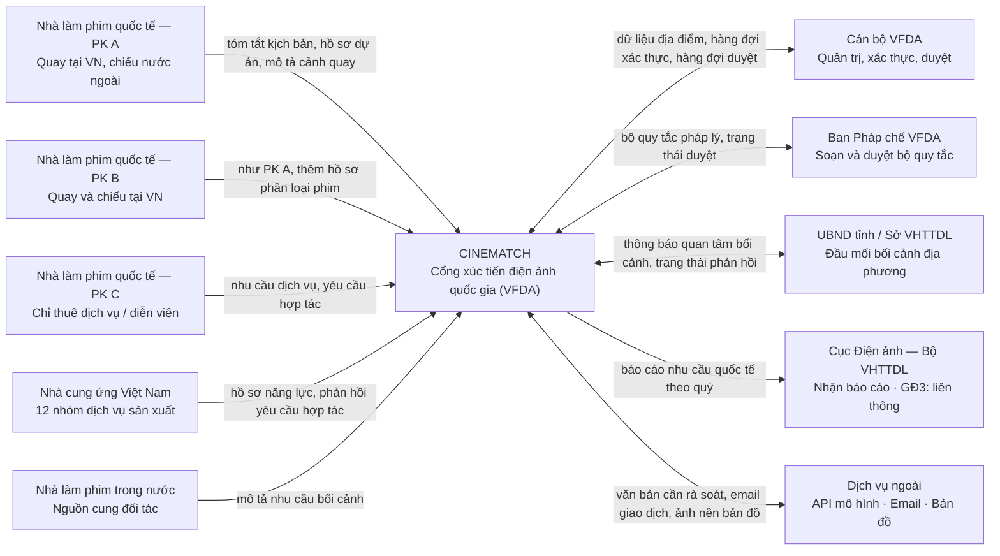

# Context Diagram — CINEMATCH

> Nguồn: System Design v2.0, sheet *1. Schematic*, mục 1.3, Hình 1.
> Ảnh gốc: `diagrams/CTX-01_Context-diagram.png`.
> Quy tắc áp dụng (Pattern 1): hệ thống là **một** node; mọi thứ còn lại là actor hoặc hệ thống ngoài;
> nhãn trên mũi tên là **thông tin di chuyển**, không phải động từ.

## Ranh giới hệ thống

CINEMATCH **không phải** kênh nộp hồ sơ chính thức. Hồ sơ được chuẩn bị trên hệ thống và nộp
theo quy trình của cơ quan có thẩm quyền. Liên thông với hệ thống cấp phép là mục tiêu **giai đoạn 3**,
không nằm trong phạm vi này.

---

## Kiểm chứng (Step 3, mục 5.6)

| # | Kiểm tra | Kết quả |
|---|---|---|
| 1 | Đếm số node: ảnh gốc và khối Mermaid | Ảnh gốc 10 actor + 1 hệ thống = 11; Mermaid 11 node — **khớp** |
| 2 | Truy vết từng mũi tên, kể cả chiều | Ảnh gốc 10 mũi tên; Mermaid 10 cạnh — **khớp** (5 một chiều vào, 1 một chiều ra, 4 hai chiều) |
| 3 | Mọi nhánh quyết định giữ đủ nhánh và đúng nhãn gốc | Không áp dụng — sơ đồ ngữ cảnh không có nhánh quyết định |
| 4 | Không đổi tên, không dịch, không "dọn dẹp" | Đạt — tên node lấy nguyên văn từ ảnh gốc |
| 5 | Render khối Mermaid và đặt cạnh ảnh gốc | Ảnh gốc: `diagrams/CTX-01_Context-diagram.png` |
| 6 | Hỏi cái gì còn thiếu | Ảnh gốc không vẽ luồng lỗi. Mermaid cũng không có. Ghi nhận là câu hỏi mở, xem mục 10 của Spec Document tương ứng ở Step 5. |

**Người kiểm chứng:** _(chưa ký — cần một thành viên nhóm C đối chiếu node-by-node với ảnh gốc rồi ghi tên vào đây)_

> Các con số ở dòng 1–3 do script đối chiếu tự động giữa dữ liệu vẽ ảnh và khối Mermaid.
> Theo hướng dẫn Step 3 mục 5.6, **một con người vẫn phải xác nhận lần cuối** trước khi coi là đã kiểm chứng.
