# Sequence Diagrams — CINEMATCH

> Source: System Design v2.0. Diagram images: `diagrams/SEQ-01_Sign-up-and-log-in.png` to `diagrams/SEQ-12_Demand-index-and-quarterly-report.png` (see `diagrams/README.md`).
> Rule applied (Pattern 4): **a participant must be a real part of the system, not a job title**.
> A solid arrow `->>` is a call, a dashed arrow `-->>` is a return value, and `Note over` is a rule attached to a step.
>
> Step 3 guidance, section 5.4, requires `alt / else` for error branches. The sequences below **keep the
> sequential structure of the original images** because the original images do not draw error branches. Where error
> branches are missing, this is recorded in the verification table at the end of this file so it can go into
> section 10 of the Spec Document in Step 5.

---

## SEQ-01 — Sign up and log in

*Diagram image: `diagrams/SEQ-01_Sign-up-and-log-in.png` (to be redrawn from the Mermaid source below). DBIZ2 Figure 4. Participants: 5 · Messages: 11.*

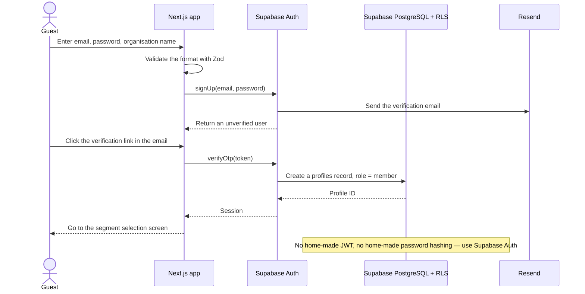

> The role is assigned at the database layer and enforced with RLS, not controlled in the user interface.

---

## SEQ-02 — 200-word content pre-check (no sign-up needed)

*Diagram image: `diagrams/SEQ-02_200-word-pre-check.png` (to be redrawn from the Mermaid source below). DBIZ2 Figure 5. Participants: 5 · Messages: 11.*

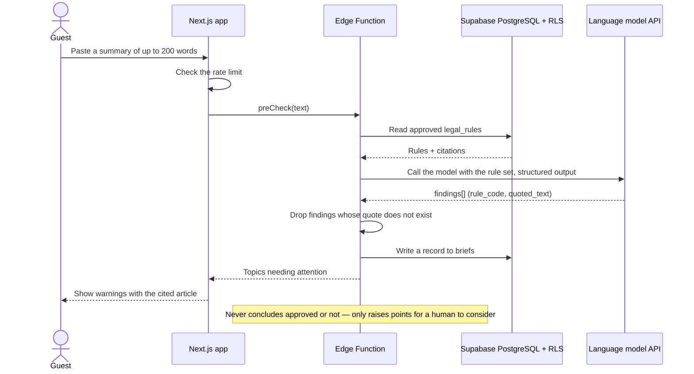

> Every pre-check is a data point for VFDA's demand index.

---

## SEQ-03 — Find locations from a scene description

*Diagram image: `diagrams/SEQ-03_Find-locations-from-scene-description.png` (to be redrawn from the Mermaid source below). DBIZ2 Figure 6. Participants: 5 · Messages: 10.*

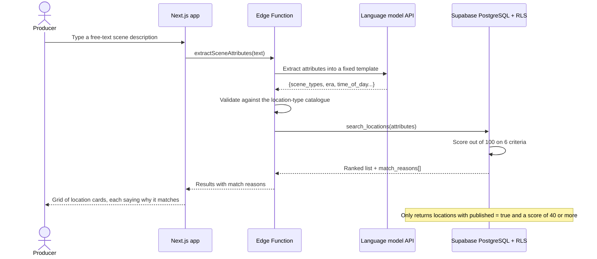

> The AI parses the input; the deterministic scorer in the database decides the ranking.

---

## SEQ-04 — View the local authority contact — gated by RLS

*Diagram image: `diagrams/SEQ-04_View-local-authority-contact.png` (to be redrawn from the Mermaid source below). DBIZ2 Figure 7. Participants: 4 · Messages: 12.*

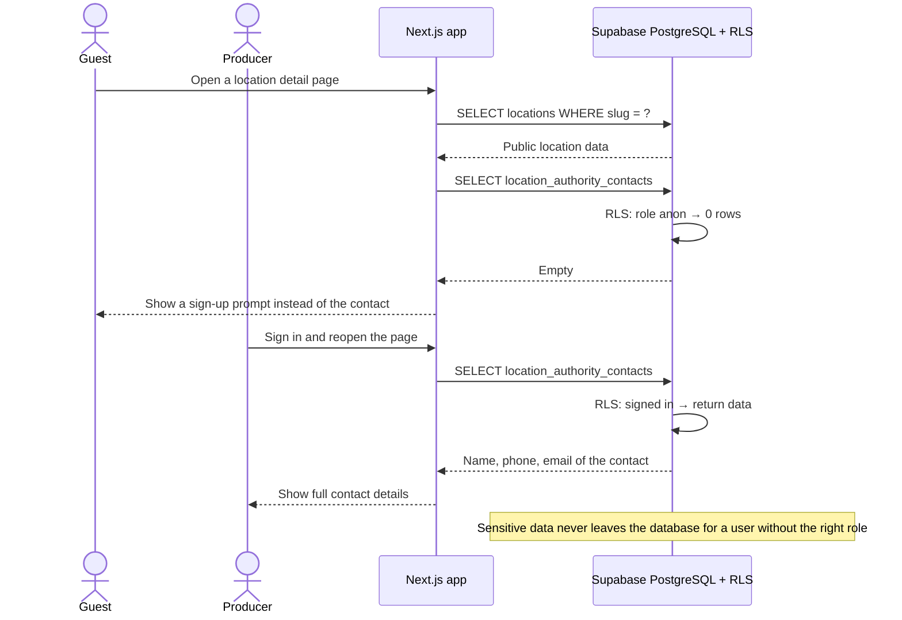

> Verification: view the page source in a private window — no phone number may be found.

---

## SEQ-05 — Compare locations and confirm the shortlist

*Diagram image: `diagrams/SEQ-05_Compare-and-shortlist.png` (to be redrawn from the Mermaid source below). DBIZ2 Figure 8. Participants: 3 · Messages: 10.*

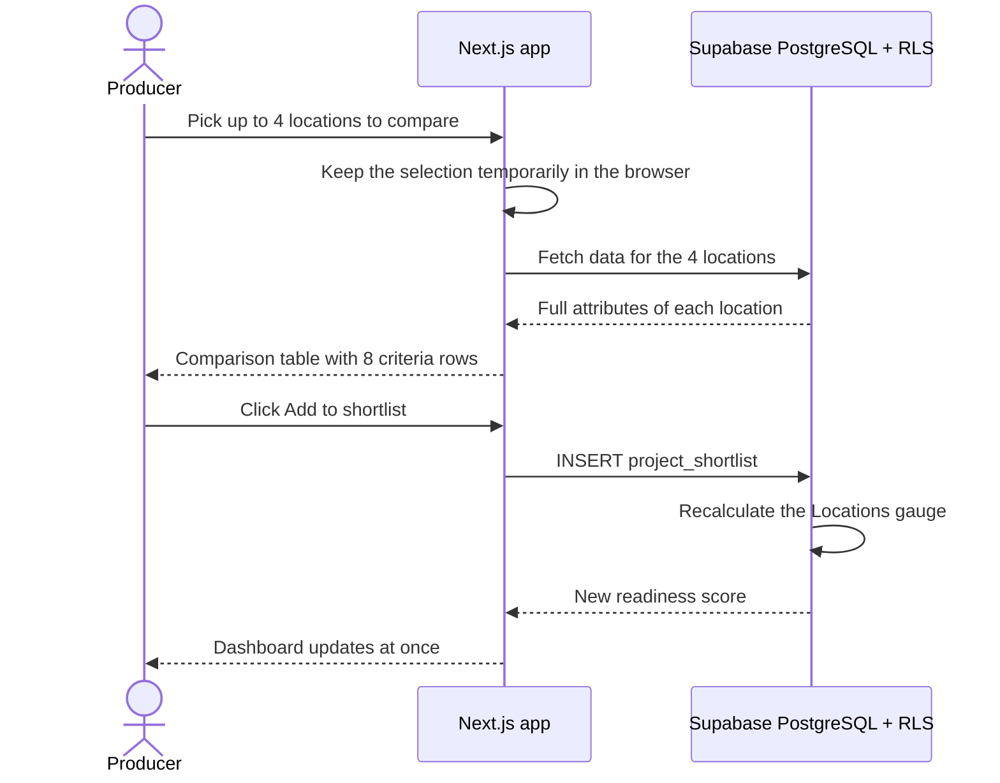

> Every cell in the comparison table is pass, warning or needs checking — never left blank.

---

## SEQ-06 — Collaboration request and two-way response

*Diagram image: `diagrams/SEQ-06_Collaboration-request.png` (to be redrawn from the Mermaid source below). DBIZ2 Figure 9. Participants: 5 · Messages: 13.*

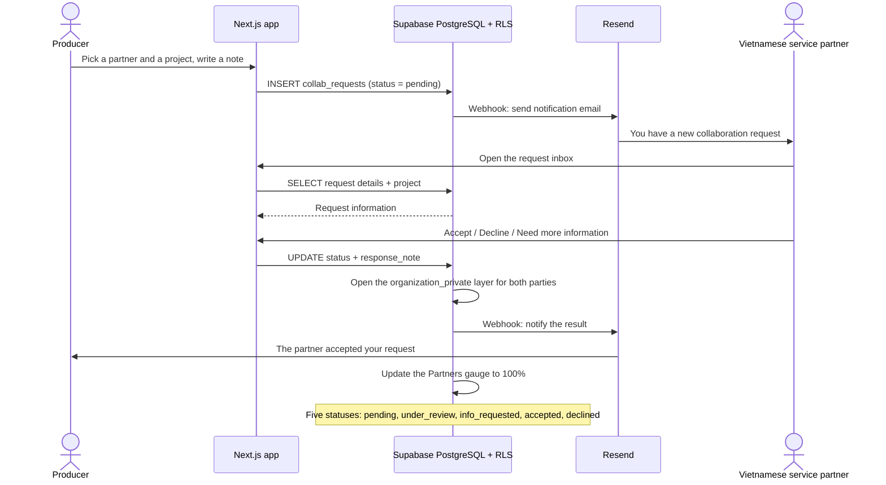

> Under Article 13 of the Cinema Law 2022, the dossier must include an agreement with a Vietnamese entity.

---

## SEQ-07 — VFDA Verified verification process

*Diagram image: `diagrams/SEQ-07_VFDA-Verified.png` (to be redrawn from the Mermaid source below). DBIZ2 Figure 10. Participants: 6 · Messages: 14.*

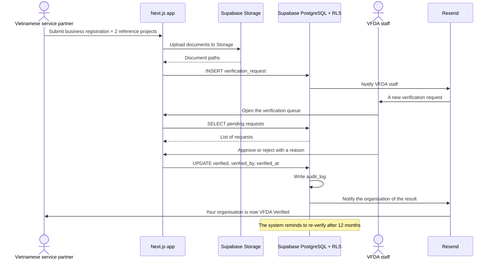

> This is the mechanism that makes VFDA the industry's verifying body without any new legal instrument.

---

## SEQ-08 — Dossier completeness check under Article 13

*Diagram image: `diagrams/SEQ-08_Dossier-completeness-check.png` (to be redrawn from the Mermaid source below). DBIZ2 Figure 11. Participants: 4 · Messages: 12.*

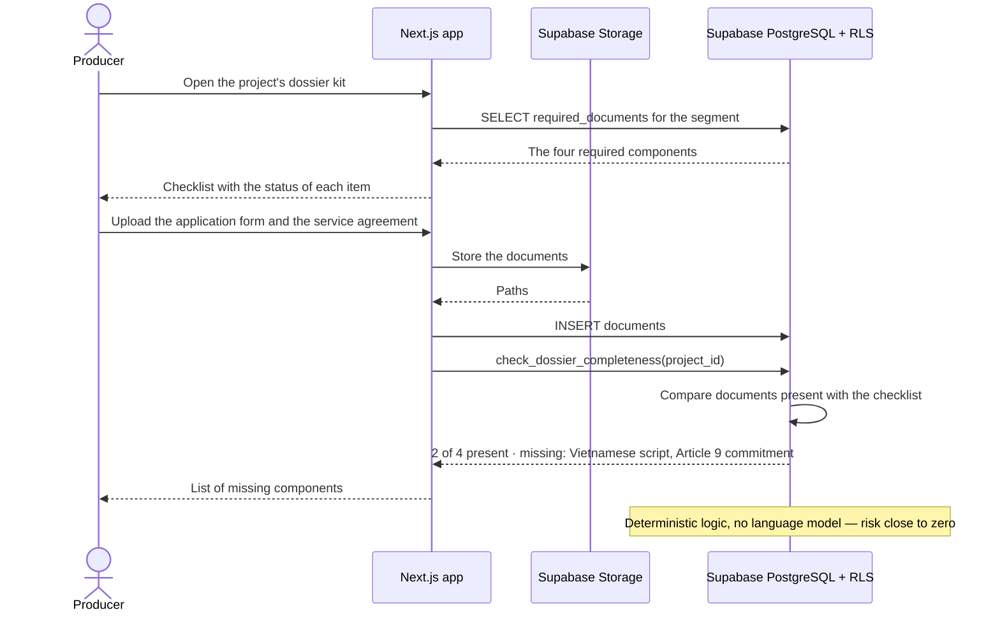

> The four components under Article 13, clause 3 of the Cinema Law 2022 (Law No. 05/2022/QH15).

---

## SEQ-09 — Topic screening against VFDA's rule set

*Diagram image: `diagrams/SEQ-09_Topic-screening.png` (to be redrawn from the Mermaid source below). DBIZ2 Figure 12. Participants: 5 · Messages: 12.*

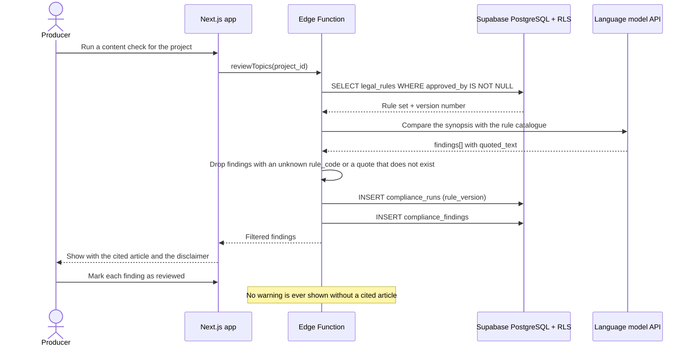

> The system does not interpret the law — it only runs the rule set written and signed off by VFDA.

---

## SEQ-10 — Bilingual dossier generation

*Diagram image: `diagrams/SEQ-10_Bilingual-dossier-generation.png` (to be redrawn from the Mermaid source below). DBIZ2 Figure 13. Participants: 6 · Messages: 12.*

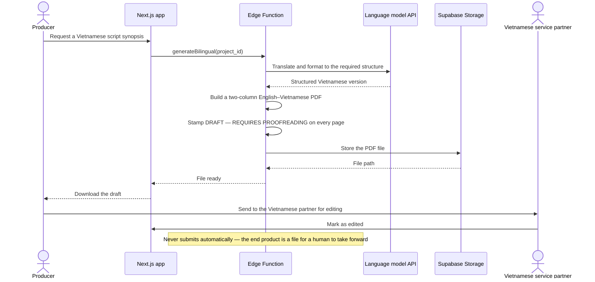

> The law requires the script synopsis and the detailed script of the parts shot in Vietnam to be in Vietnamese.

---

## SEQ-11 — Notify the Provincial People's Committee of interest in a location

*Diagram image: `diagrams/SEQ-11_Provincial-committee-notice.png` (to be redrawn from the Mermaid source below). DBIZ2 Figure 14. Participants: 5 · Messages: 11.*

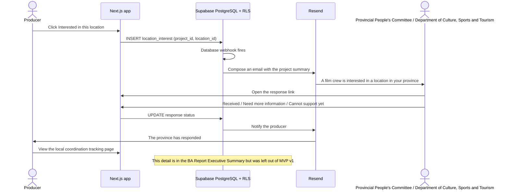

> This is the one function a private marketplace cannot copy.

---

## SEQ-12 — Demand index and quarterly report

*Diagram image: `diagrams/SEQ-12_Demand-index-and-quarterly-report.png` (to be redrawn from the Mermaid source below). DBIZ2 Figure 15. Participants: 5 · Messages: 13.*

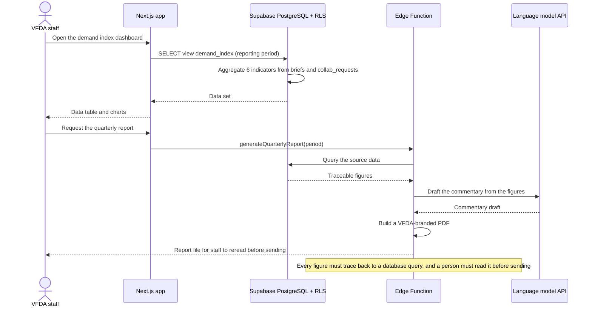

> This is an institutional asset VFDA has never had — evidence to support recognition of its role as focal point.

---

## Verification (Step 3, section 5.6)

| # | Check | Result |
|---|---|---|
| 1 | Count participants | 58 participants in total across 12 sequences — generated directly from the same data source used to draw the images, **exact match** |
| 2 | Count and trace messages, including direction | 141 messages in total — generated directly from the same data source, **exact match** |
| 3 | Decision branches | The original images draw no `alt / else` branches. The Mermaid version has none either — **keeping to the rule of not adding anything** |
| 4 | Participant names | Labels translated into English from the Vietnamese original; participants, messages and their order unchanged. Job titles were already replaced by system parts in the original images |
| 5 | Render and place next to the original image | Diagram images in `diagrams/` (`SEQ-01_Sign-up-and-log-in.png` to `SEQ-12_Demand-index-and-quarterly-report.png`) |
| 6 | What is missing | **All 12 sequences lack error branches.** For example: SEQ-02 does not draw the case where the model API returns an error, SEQ-06 does not draw the case where the email cannot be sent, SEQ-08 does not draw the case where an uploaded file exceeds the size limit. Recorded as a known gap. |

**Verified by:** _(not signed yet — a Group C member must compare the diagrams with the original images and sign here)_

> The Mermaid blocks in this file were **generated automatically from the same data structure used to draw the PNG images**,
> so the risk of "the AI reads an image and misses a step" is zero at the conversion step.
> The remaining risk lies elsewhere: **whether the original images are correct**. That is what a human must check.
