# Sequence Diagrams — CINEMATCH

> Nguồn: System Design v2.0. Ảnh gốc: `diagrams/SEQ-01..SEQ-12`.
> Quy tắc áp dụng (Pattern 4): **participant phải là bộ phận thật của hệ thống, không phải chức danh**.
> Mũi tên liền `->>` là lời gọi, mũi tên đứt `-->>` là giá trị trả về, `Note over` là quy tắc gắn với một bước.
>
> Hướng dẫn Step 3 mục 5.4 yêu cầu dùng `alt / else` cho nhánh lỗi. Các sequence dưới đây **giữ nguyên
> cấu trúc tuần tự của ảnh gốc** vì ảnh gốc không vẽ nhánh lỗi. Chỗ nào thiếu nhánh lỗi đã được ghi
> vào bảng kiểm chứng ở cuối file để đưa vào mục 10 của Spec Document ở Step 5.

---

## SEQ-01 — Đăng ký và đăng nhập

*Ảnh gốc: `diagrams/SEQ-01_Dang-ky-Dang-nhap.png` (Hình 4). Participant: 5 · Message: 11.*

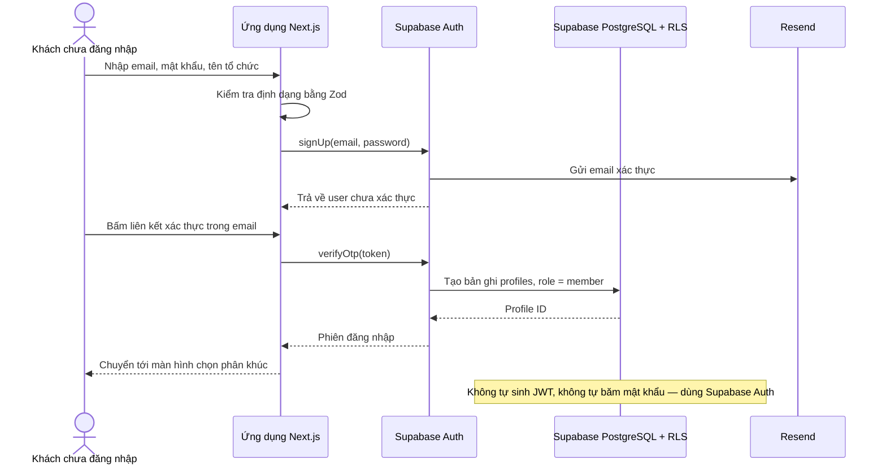

> Vai trò được gán ở tầng CSDL và thực thi bằng RLS, không kiểm soát ở giao diện.

---

## SEQ-02 — Tiền kiểm nội dung 200 chữ (không cần đăng ký)

*Ảnh gốc: `diagrams/SEQ-02_Tien-kiem-200-chu.png` (Hình 5). Participant: 5 · Message: 11.*

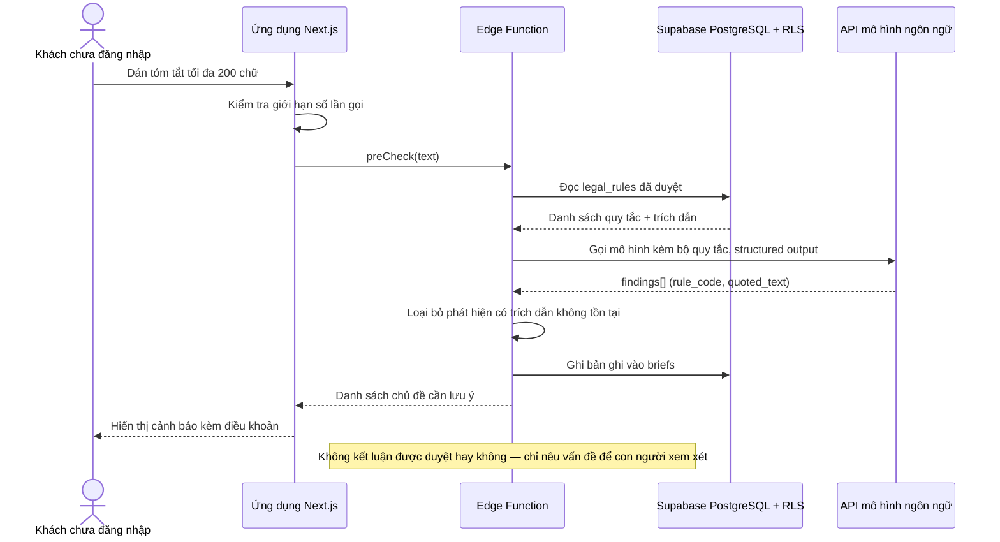

> Mỗi lượt tiền kiểm là một điểm dữ liệu cho chỉ số nhu cầu của VFDA.

---

## SEQ-03 — Tìm bối cảnh từ mô tả cảnh quay

*Ảnh gốc: `diagrams/SEQ-03_Tim-boi-canh-tu-mo-ta.png` (Hình 6). Participant: 5 · Message: 10.*

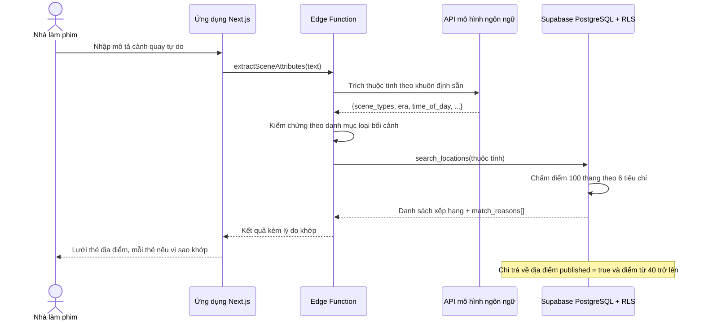

> AI là bộ phân tích đầu vào; bộ chấm điểm tất định trong CSDL mới quyết định thứ hạng.

---

## SEQ-04 — Xem đầu mối chính quyền — kiểm soát bằng RLS

*Ảnh gốc: `diagrams/SEQ-04_Xem-dau-moi-chinh-quyen.png` (Hình 7). Participant: 4 · Message: 12.*

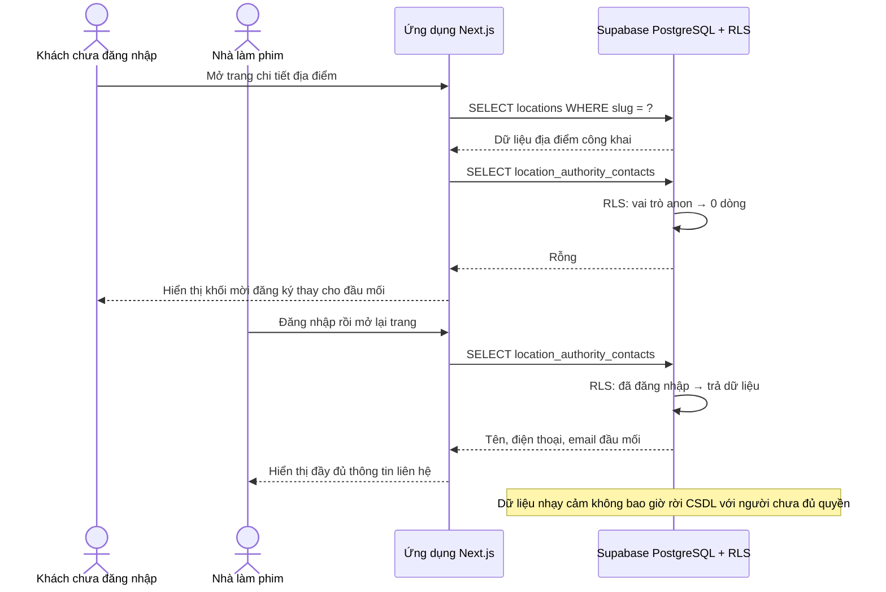

> Kiểm chứng: xem nguồn trang ở cửa sổ ẩn danh, không được tìm thấy số điện thoại.

---

## SEQ-05 — So sánh bối cảnh và chốt danh sách rút gọn

*Ảnh gốc: `diagrams/SEQ-05_So-sanh-chot-shortlist.png` (Hình 8). Participant: 3 · Message: 10.*

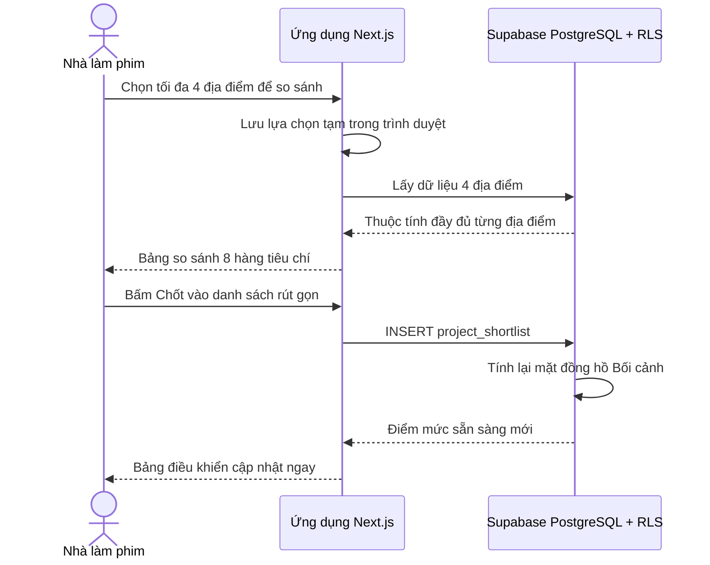

> Mỗi ô trong bảng so sánh là đạt, cảnh báo, hoặc cần kiểm tra — không để trống.

---

## SEQ-06 — Yêu cầu hợp tác và vòng phản hồi hai chiều

*Ảnh gốc: `diagrams/SEQ-06_Yeu-cau-hop-tac.png` (Hình 9). Participant: 5 · Message: 13.*

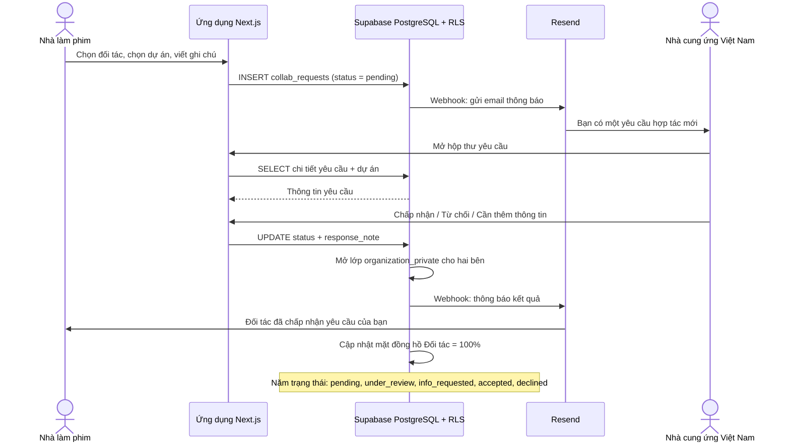

> Theo Điều 13 Luật Điện ảnh 2022, hồ sơ bắt buộc kèm thỏa thuận với đơn vị Việt Nam.

---

## SEQ-07 — Quy trình xác thực VFDA Verified

*Ảnh gốc: `diagrams/SEQ-07_VFDA-Verified.png` (Hình 10). Participant: 6 · Message: 14.*

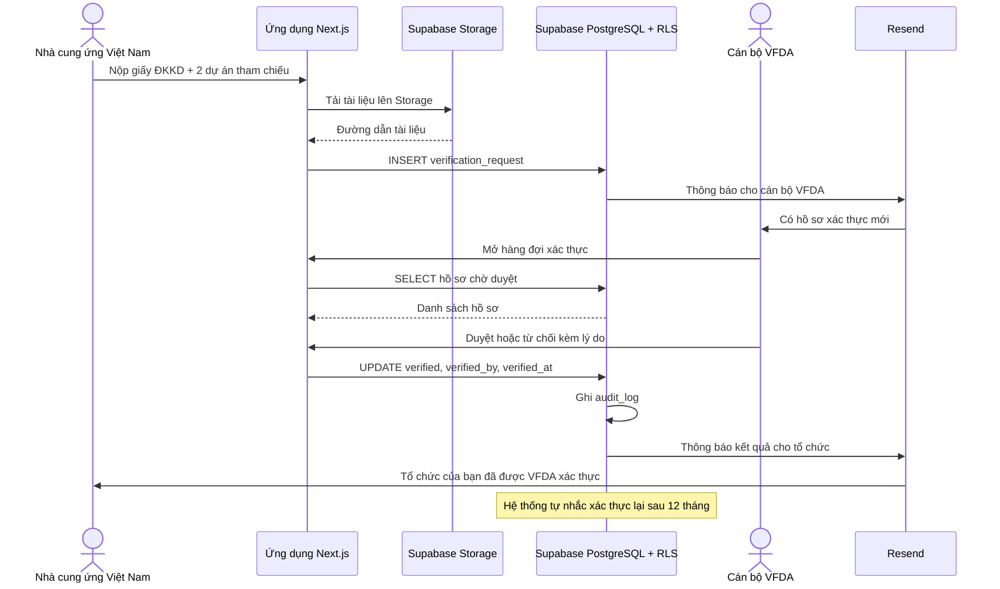

> Đây là cơ chế biến VFDA thành bên kiểm định của ngành mà không cần văn bản pháp lý mới.

---

## SEQ-08 — Kiểm tra tính đầy đủ hồ sơ theo Điều 13

*Ảnh gốc: `diagrams/SEQ-08_Kiem-tra-day-du-ho-so.png` (Hình 11). Participant: 4 · Message: 12.*

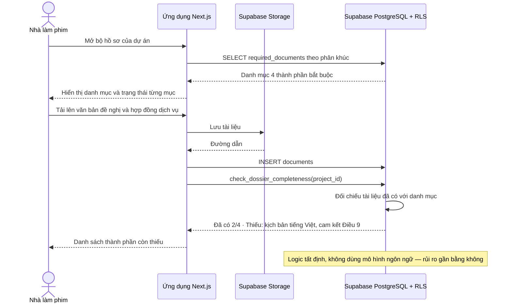

> Bốn thành phần theo Điều 13 khoản 3 Luật Điện ảnh 2022 (Luật số 05/2022/QH15).

---

## SEQ-09 — Rà soát chủ đề theo bộ quy tắc của VFDA

*Ảnh gốc: `diagrams/SEQ-09_Ra-soat-chu-de.png` (Hình 12). Participant: 5 · Message: 12.*

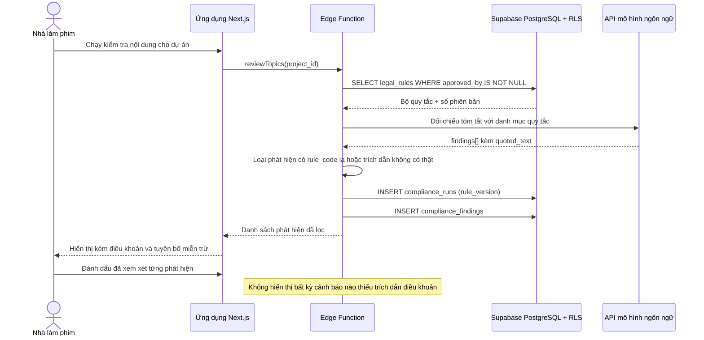

> Hệ thống không diễn giải luật — chỉ vận hành bộ quy tắc do VFDA soạn và ký duyệt.

---

## SEQ-10 — Sinh hồ sơ song ngữ

*Ảnh gốc: `diagrams/SEQ-10_Sinh-ho-so-song-ngu.png` (Hình 13). Participant: 6 · Message: 12.*

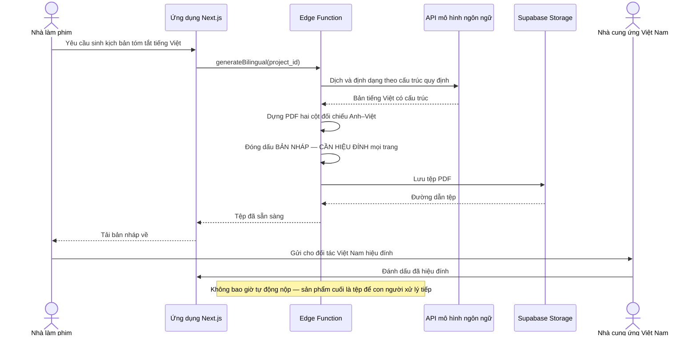

> Luật yêu cầu kịch bản tóm tắt và kịch bản chi tiết phần quay tại Việt Nam bằng tiếng Việt.

---

## SEQ-11 — Thông báo UBND tỉnh khi có quan tâm bối cảnh

*Ảnh gốc: `diagrams/SEQ-11_Thong-bao-UBND-tinh.png` (Hình 14). Participant: 5 · Message: 11.*

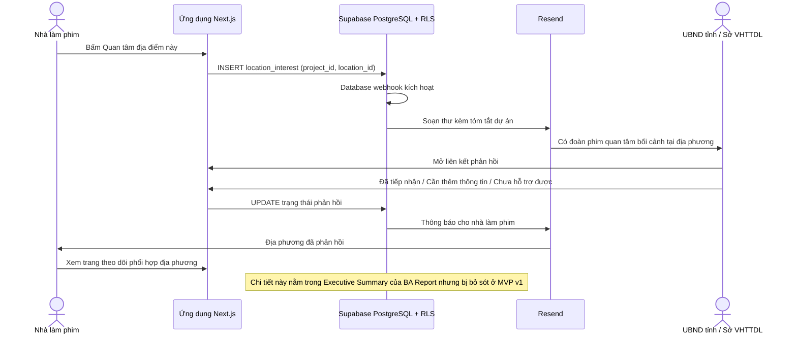

> Đây là chức năng duy nhất mà một sàn giao dịch tư nhân không thể sao chép.

---

## SEQ-12 — Chỉ số nhu cầu và báo cáo quý

*Ảnh gốc: `diagrams/SEQ-12_Chi-so-nhu-cau-Bao-cao-quy.png` (Hình 15). Participant: 5 · Message: 13.*

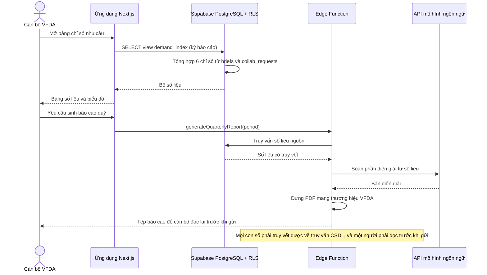

> Đây là tài sản thể chế VFDA chưa từng có — bằng chứng để đề nghị công nhận vai trò đầu mối.

---

## Kiểm chứng (Step 3, mục 5.6)

| # | Kiểm tra | Kết quả |
|---|---|---|
| 1 | Đếm participant | Tổng 58 participant trên 12 sequence — sinh trực tiếp từ cùng nguồn dữ liệu vẽ ảnh, **khớp tuyệt đối** |
| 2 | Đếm và truy vết message, kể cả chiều | Tổng 141 message — sinh trực tiếp từ cùng nguồn dữ liệu, **khớp tuyệt đối** |
| 3 | Nhánh quyết định | Ảnh gốc không vẽ nhánh `alt / else`. Bản Mermaid cũng không có — **giữ đúng nguyên tắc không tự thêm** |
| 4 | Tên participant | Không đổi tên, không dịch. Chức danh đã được thay bằng bộ phận hệ thống ngay từ ảnh gốc |
| 5 | Render và đặt cạnh ảnh gốc | Ảnh gốc trong thư mục `diagrams/` |
| 6 | Cái gì còn thiếu | **Toàn bộ 12 sequence đều thiếu nhánh lỗi.** Ví dụ: SEQ-02 không vẽ trường hợp API mô hình trả lỗi; SEQ-06 không vẽ trường hợp email không gửi được; SEQ-08 không vẽ trường hợp tệp tải lên vượt dung lượng. Đây là **câu hỏi mở**, phải vào mục 10 của Spec Document ở Step 5 |

**Người kiểm chứng:** _(chưa ký — cần một thành viên nhóm C đối chiếu rồi ghi tên vào đây)_

> Khối Mermaid ở file này được **sinh tự động từ đúng cấu trúc dữ liệu đã dùng để vẽ ảnh PNG**,
> nên rủi ro "AI đọc ảnh rồi bỏ sót một bước" bằng không ở bước chuyển đổi.
> Rủi ro còn lại nằm ở chỗ khác: **ảnh gốc có đúng không**. Đó mới là thứ con người phải kiểm.
