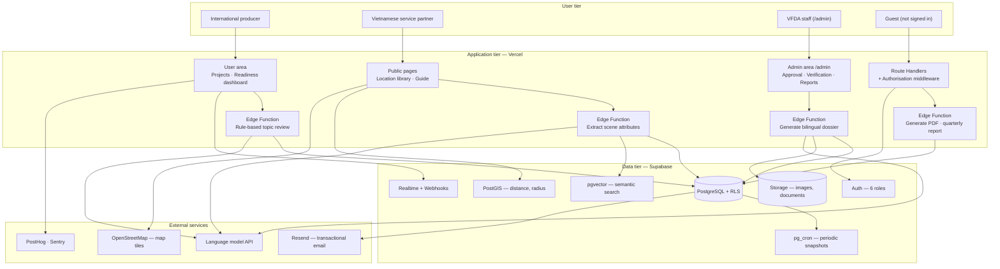

# System Configuration Diagram — CINEMATCH

> Source: System Design v2.0, sheet *1. Schematic*, section 1.4, Figure 2.
> Diagram image: `diagrams/CFG-01_System-configuration.png` (to be redrawn from the Mermaid source below).
> Rule applied (Pattern 2): **one subgraph per tier**. Do not add any component
> that is not in the original image, even if it looks as though it is missing.

## Architecture notes

* External services are **called outbound only** and accept no inbound connections — this reduces the risk surface.
* Authorisation is enforced with Row Level Security inside PostgreSQL itself, not in the interface layer.
* Deployment and rollback go through Vercel; automated checks run on GitHub Actions. These two components
  sit outside the runtime diagram, so they are **not** drawn as nodes.

---

## Verification (Step 3, section 5.6)

| # | Check | Result |
|---|---|---|
| 1 | Count the nodes: original image and Mermaid block | Original image 4 tiers / 23 components; Mermaid 4 subgraphs / 23 nodes — **match** |
| 2 | Trace every arrow, including direction | The original image draws 12 grouped arrows between tiers; Mermaid splits them into 24 more detailed edges — **deliberate difference**, see the note below |
| 3 | Every decision keeps all its branches with the original labels | Not applicable — the configuration diagram has no decision branches |
| 4 | Labels translated, nothing renamed or "tidied up" | Labels translated into English from the Vietnamese original; nodes, edges and branch labels otherwise unchanged. |
| 5 | Render the Mermaid block and place it next to the original image | Diagram image: `diagrams/CFG-01_System-configuration.png` |
| 6 | Ask what is missing | The original image does not draw the background job queue or the backup mechanism. Both exist in operation. Recorded as a known gap. |

**Verified by:** _(not signed yet — a Group C member must compare the diagram with the original image node by node and sign here)_

> The figures in rows 1–3 come from a script that automatically compares the image drawing data with the Mermaid block.
> Under the Step 3 guidance, section 5.6, **a human must still give final confirmation** before this counts as verified.

> **On the difference in arrow count:** the original image draws grouped arrows between tiers to keep it readable.
> The Mermaid block splits them by component pair because the coding agent needs to know which component calls which.
> This is **clarification**, not the addition of new components — the node count still matches exactly.
