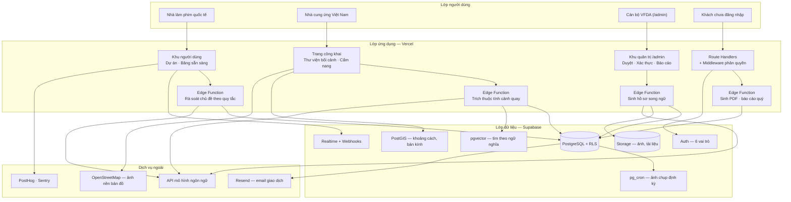

# System Configuration Diagram — CINEMATCH

> Nguồn: System Design v2.0, sheet *1. Schematic*, mục 1.4, Hình 2.
> Ảnh gốc: `diagrams/CFG-01_System-configuration.png`.
> Quy tắc áp dụng (Pattern 2): **một subgraph cho mỗi tier**. Không thêm bất kỳ thành phần nào
> không có trong ảnh gốc, kể cả khi trông như đang thiếu.

## Ghi chú kiến trúc

* Dịch vụ ngoài **chỉ được gọi ra**, không nhận kết nối vào — giảm bề mặt rủi ro.
* Phân quyền thực thi bằng Row Level Security ngay tại PostgreSQL, không phải ở tầng giao diện.
* Triển khai và quay lui qua Vercel; kiểm tra tự động qua GitHub Actions. Hai thành phần này
  nằm ngoài sơ đồ runtime nên **không** vẽ thành node.

---

## Kiểm chứng (Step 3, mục 5.6)

| # | Kiểm tra | Kết quả |
|---|---|---|
| 1 | Đếm số node: ảnh gốc và khối Mermaid | Ảnh gốc 4 tier / 23 thành phần; Mermaid 4 subgraph / 23 node — **khớp** |
| 2 | Truy vết từng mũi tên, kể cả chiều | Ảnh gốc vẽ 12 mũi tên gộp giữa các tier; Mermaid tách thành 22 cạnh chi tiết hơn — **có chênh lệch có chủ đích**, xem ghi chú bên dưới |
| 3 | Mọi nhánh quyết định giữ đủ nhánh và đúng nhãn gốc | Không áp dụng — sơ đồ cấu hình không có nhánh quyết định |
| 4 | Không đổi tên, không dịch, không "dọn dẹp" | Đạt — tên node lấy nguyên văn từ ảnh gốc |
| 5 | Render khối Mermaid và đặt cạnh ảnh gốc | Ảnh gốc: `diagrams/CFG-01_System-configuration.png` |
| 6 | Hỏi cái gì còn thiếu | Ảnh gốc không vẽ hàng đợi công việc nền và cơ chế sao lưu. Cả hai đều tồn tại trong vận hành. Ghi nhận là câu hỏi mở. |

**Người kiểm chứng:** _(chưa ký — cần một thành viên nhóm C đối chiếu node-by-node với ảnh gốc rồi ghi tên vào đây)_

> Các con số ở dòng 1–3 do script đối chiếu tự động giữa dữ liệu vẽ ảnh và khối Mermaid.
> Theo hướng dẫn Step 3 mục 5.6, **một con người vẫn phải xác nhận lần cuối** trước khi coi là đã kiểm chứng.

> **Về chênh lệch số mũi tên:** ảnh gốc vẽ mũi tên gộp giữa các tier cho dễ nhìn.
> Khối Mermaid tách ra theo từng cặp thành phần vì coding agent cần biết thành phần nào gọi thành phần nào.
> Đây là **làm rõ**, không phải thêm thành phần mới — số node vẫn khớp tuyệt đối.
