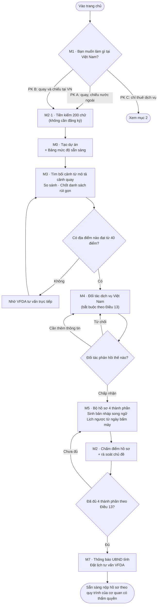
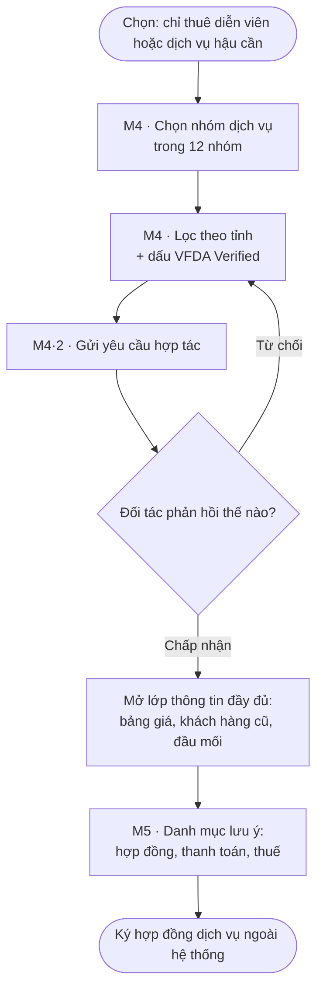
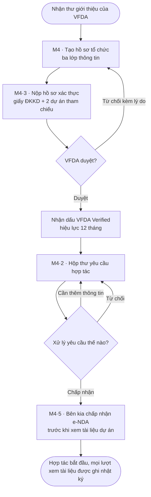
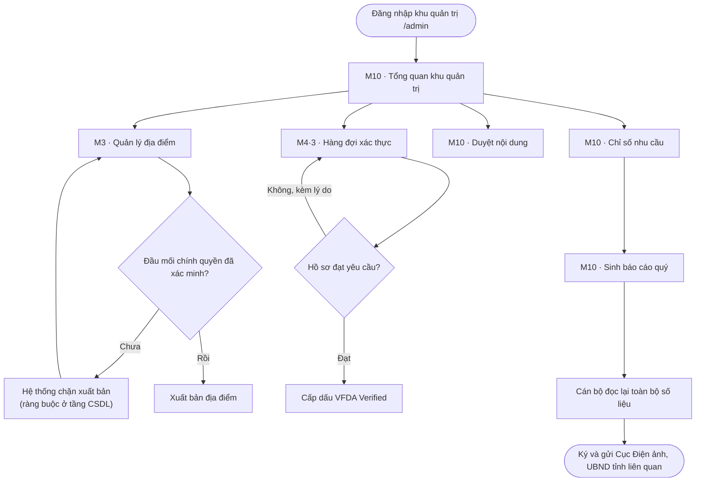
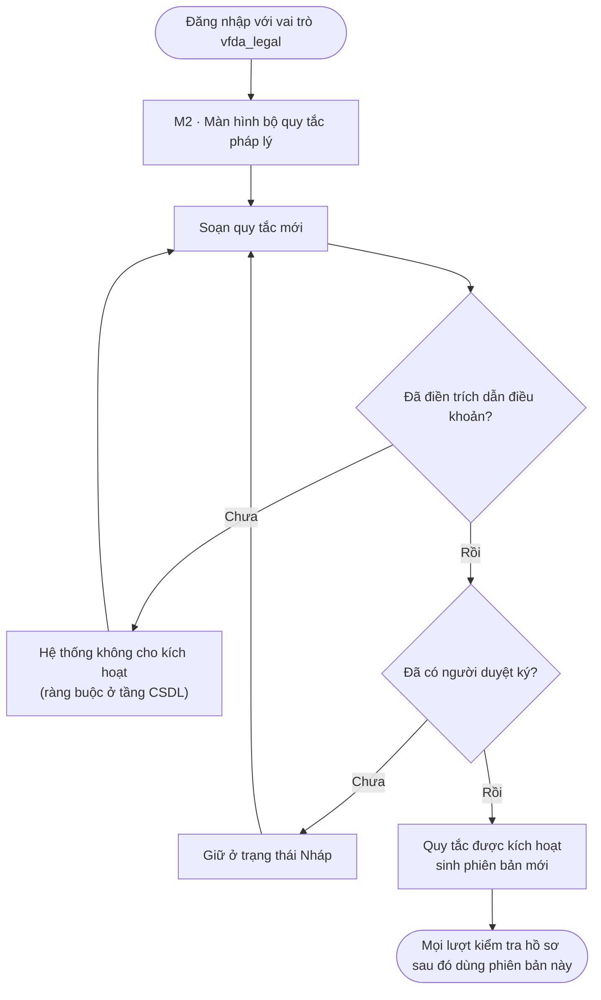
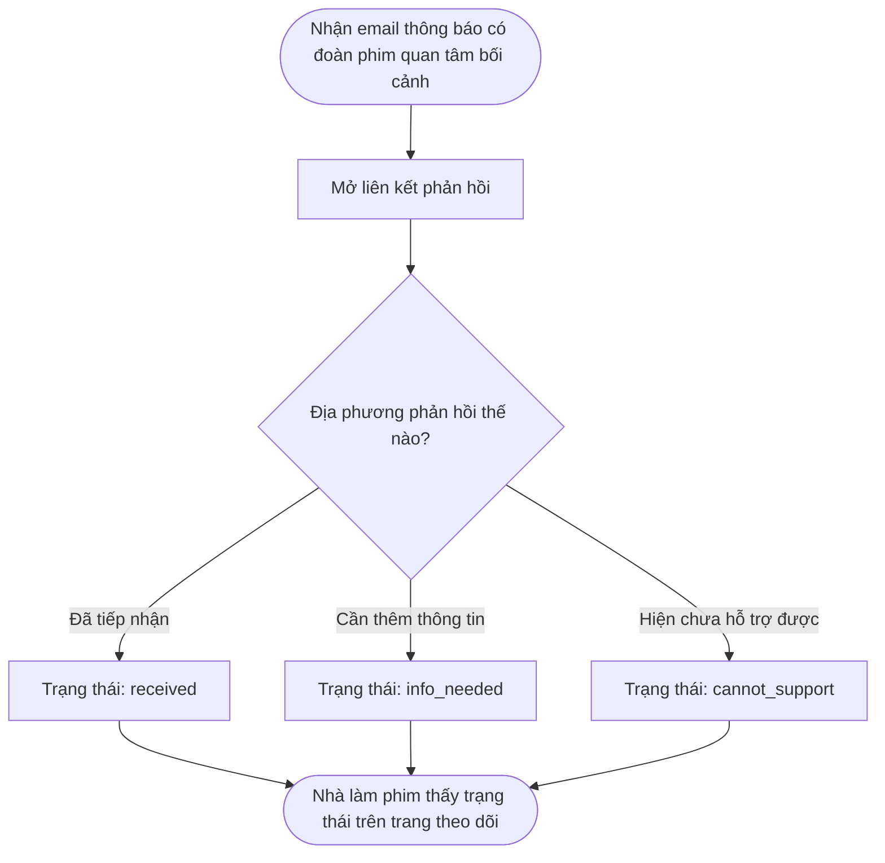

# Usage Flow — CINEMATCH

> Nguồn: System Design v2.0, sheet *2. Usage Flow*, mục 2.3, Hình 3.
> Ảnh gốc: `diagrams/FLOW-01_System-usage-flow.png`.
> Quy tắc áp dụng (Pattern 3): **một flowchart cho mỗi actor**, mỗi cái một mục riêng.
> Mọi hình thoi quyết định trong ảnh gốc giữ nguyên nhãn nhánh gốc.

## 1. Nhà làm phim quốc tế — phân khúc A và B

## 2. Nhà làm phim quốc tế — phân khúc C

## 3. Nhà cung ứng Việt Nam

## 4. Cán bộ VFDA

## 5. Ban Pháp chế VFDA

## 6. UBND tỉnh / Sở VHTTDL

---

## Kiểm chứng (Step 3, mục 5.6)

| # | Kiểm tra | Kết quả |
|---|---|---|
| 1 | Đếm số node: ảnh gốc và khối Mermaid | Ảnh gốc vẽ 1 luồng gộp cho PK A/B/C; bản Mermaid tách thành 6 flowchart theo actor đúng quy tắc Pattern 3. Tổng node ảnh gốc 17; tổng node Mermaid 6 luồng = 48 — **có chênh lệch có chủ đích**, xem ghi chú |
| 2 | Truy vết từng mũi tên, kể cả chiều | Mọi mũi tên trong ảnh gốc đều xuất hiện trong luồng 1 và luồng 2 — **khớp** |
| 3 | Mọi nhánh quyết định giữ đủ nhánh và đúng nhãn gốc | Ảnh gốc có 1 hình thoi (M1 chọn phân khúc) với 3 nhánh. Bản Mermaid giữ nguyên hình thoi đó với đúng 3 nhãn, và **bổ sung 8 hình thoi mới** cho các nhánh quyết định vốn có trong Function List nhưng chưa được vẽ ra ở ảnh gốc |
| 4 | Không đổi tên, không dịch, không "dọn dẹp" | Đạt — tên node lấy nguyên văn từ ảnh gốc |
| 5 | Render khối Mermaid và đặt cạnh ảnh gốc | Ảnh gốc: `diagrams/FLOW-01_System-usage-flow.png` |
| 6 | Hỏi cái gì còn thiếu | Ảnh gốc chỉ vẽ luồng thuận lợi. Các nhánh từ chối, chưa đủ điều kiện, không có kết quả đều đã tồn tại trong Function List nhưng chưa được vẽ. Đã bổ sung vào Mermaid và **phải đưa vào mục 10 của Spec Document ở Step 5 để Client xác nhận**. |

**Người kiểm chứng:** _(chưa ký — cần một thành viên nhóm C đối chiếu node-by-node với ảnh gốc rồi ghi tên vào đây)_

> Các con số ở dòng 1–3 do script đối chiếu tự động giữa dữ liệu vẽ ảnh và khối Mermaid.
> Theo hướng dẫn Step 3 mục 5.6, **một con người vẫn phải xác nhận lần cuối** trước khi coi là đã kiểm chứng.

> **Cảnh báo trung thực về mục 3 và 6 của bảng kiểm chứng.** Hướng dẫn Step 3 nói: nếu ảnh gốc không có
> đường lỗi thì bản Mermaid cũng không được có. Ở đây bản Mermaid **có nhiều nhánh hơn ảnh gốc**.
> Lý do: các nhánh đó không phải thiết kế mới — chúng đã nằm trong Function List v2.0
> (ví dụ `F-M4-14` có 5 trạng thái phản hồi, `F-M3-08` có ngưỡng 40 điểm, `F-M3-05` có ràng buộc chặn xuất bản).
> Việc chúng chưa được vẽ ra là thiếu sót của ảnh gốc, không phải quyết định thiết kế.
> Dù vậy, **đây vẫn là chênh lệch phải được Client xác nhận ở Step 5**, không được coi là đã thống nhất.
