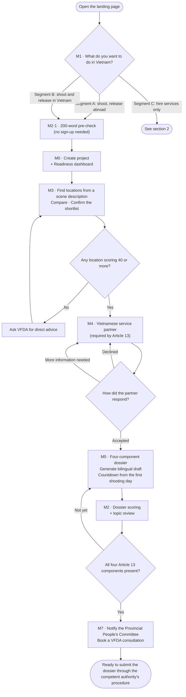
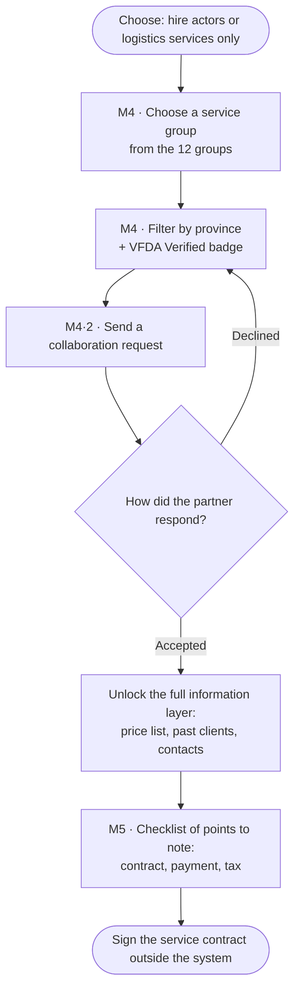
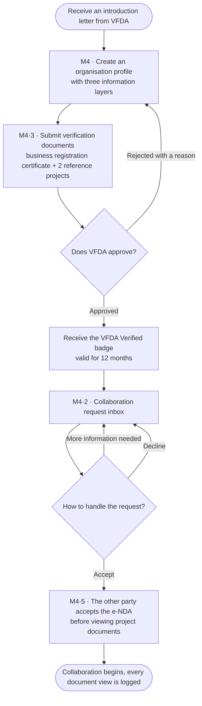
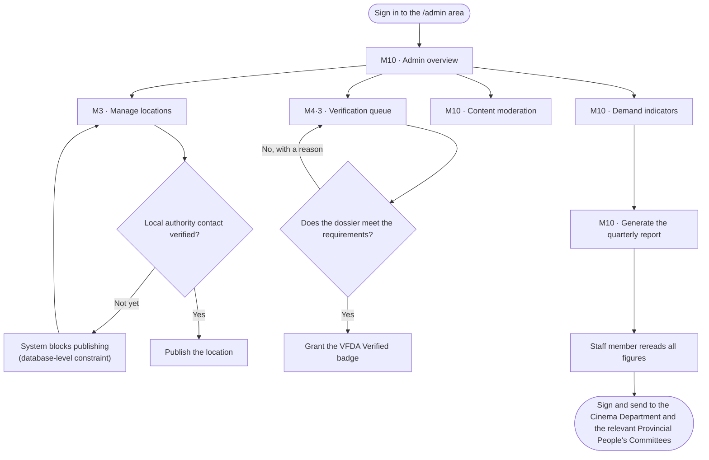
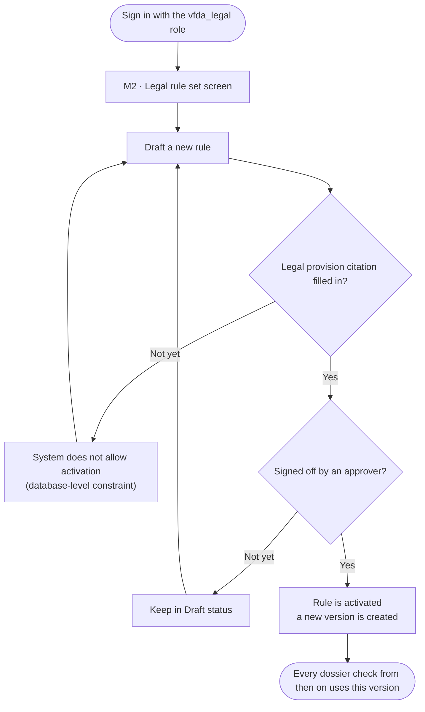
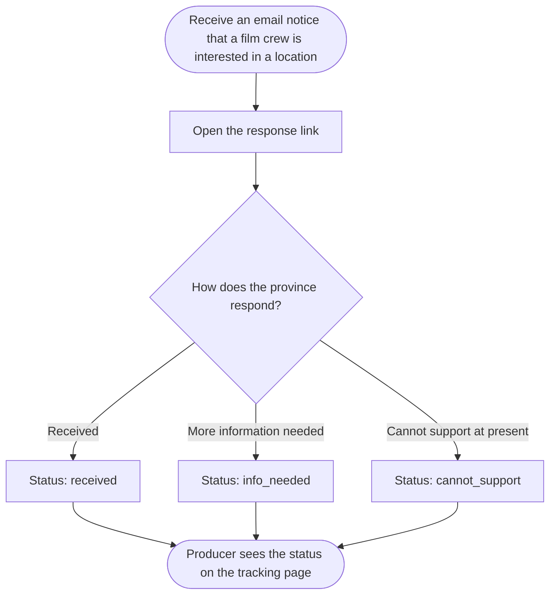

# Usage Flow — CINEMATCH

> Source: System Design v2.0, sheet *2. Usage Flow*, section 2.3, Figure 3.
> Diagram image: `diagrams/FLOW-01_System-usage-flow.png` (to be redrawn from the Mermaid source below).
> Rule applied (Pattern 3): **one flowchart per actor**, each in its own section.
> Every decision diamond in the original image keeps its original branch labels.

## 1. International producer — segments A and B

## 2. International producer — segment C

## 3. Vietnamese service partner

## 4. VFDA staff

## 5. VFDA Legal Board

## 6. Provincial People's Committee / Department of Culture, Sports and Tourism

---

## Verification (Step 3, section 5.6)

| # | Check | Result |
|---|---|---|
| 1 | Count the nodes: original image and Mermaid block | The original image draws 1 combined flow for segments A/B/C; the Mermaid version splits it into 6 flowcharts by actor, as Pattern 3 requires. Total nodes in the original image 17; total Mermaid nodes across the 6 flows = 48 — **deliberate difference**, see the note |
| 2 | Trace every arrow, including direction | Every arrow in the original image appears in flow 1 and flow 2 — **match** |
| 3 | Every decision keeps all its branches with the original labels | The original image has 1 diamond (M1 segment choice) with 3 branches. The Mermaid version keeps that diamond with the same 3 labels, and **adds 8 new diamonds** for decision branches that already exist in the Function List but were not drawn in the original image |
| 4 | Labels translated, nothing renamed or "tidied up" | Labels translated into English from the Vietnamese original; nodes, edges and branch labels otherwise unchanged. |
| 5 | Render the Mermaid block and place it next to the original image | Diagram image: `diagrams/FLOW-01_System-usage-flow.png` |
| 6 | Ask what is missing | The original image draws only the happy path. The rejection, not-yet-eligible and no-result branches all exist in the Function List but were not drawn. They have been added to the Mermaid version. Recorded as a known gap. |

**Verified by:** _(not signed yet — a Group C member must compare the diagram with the original image node by node and sign here)_

> The figures in rows 1–3 come from a script that automatically compares the image drawing data with the Mermaid block.
> Under the Step 3 guidance, section 5.6, **a human must still give final confirmation** before this counts as verified.

> **Honest warning about rows 3 and 6 of the verification table.** The Step 3 guidance says: if the original image has no
> error path, the Mermaid version must not have one either. Here the Mermaid version **has more branches than the original image**.
> Reason: these branches are not new design — they are already in Function List v2.0
> (for example `F-M4-14` has 5 response statuses, `F-M3-08` has the 40-point threshold, `F-M3-05` has the publishing block constraint).
> That they were not drawn is an omission in the original image, not a design decision.
> Even so, **this is still a difference the Client must confirm at Step 5**, and it must not be treated as agreed.
