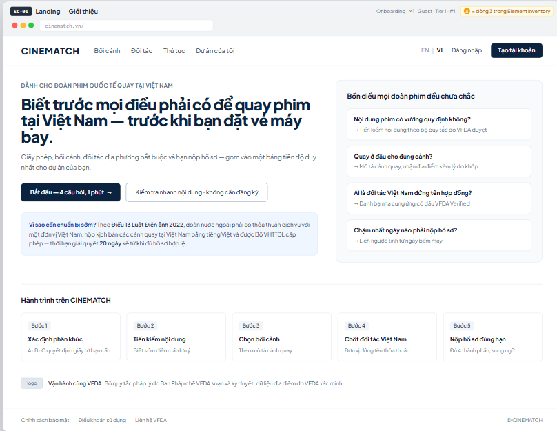

# Screen Spec: SC-01 Landing — Introduction

> DBIZ3 Session 4 template — one file per screen. The Screen ID is kept from the DBIZ2 Screen List.
> The mockup image stays an image; everything around it is text.
> **Each orange numbered badge on the mockup is the row with the same number in section 3 (Element inventory).**

| Field | Value |
|---|---|
| Screen ID | `SC-01` |
| Screen name | Landing — Introduction |
| Actor | Guest |
| Priority | Must |
| Belongs to module | `docs/spec/spec-M1.md` |
| Mockup image | `img/SC-01.png` |
| Status | Draft |

*Route:* `/` · *Screen list file:* Onboarding, item #1 (Tier 1 — Must) · *Design note from the screen list file:* Convey the positioning "removing uncertainty", not "location lookup".

## 1. Purpose

**Shown when:** The user opens `cinematch.vn` for the first time — from search, from a link sent by VFDA, or from a film promotion event.

**The user leaves this screen when:** The user clicks *Get started* (to the segment router `SC-02`) or *Quick content check* (to `SC-03`).

## 2. Mockup

> The image is the visual contract (layout, grouping, hierarchy); the tables below are the behavioural contract.
> All data in the mockup is sample data for one fictional project (*The Last Ferry*, Harbour Line Films); organisation names, people and phone numbers are examples, not real records.

## 3. Element inventory

| # | Element | Type | Content / data source | Required | Validation |
|---|---|---|---|---|---|
| 1 | Navigation bar | Header | static: CINEMATCH · Locations · Partners · Permits · My projects | — | — |
| 2 | Language switch EN \| VI | Toggle | static; value stored in the `locale` cookie | — | accepts only `en` / `vi` |
| 3 | Log in / Sign up | Button | static; shown only when not logged in | — | — |
| 4 | Positioning headline | Header | static, bilingual, from the display dictionary `F-SYS-06` | Yes | — |
| 5 | Lead sentence | Text | static, bilingual | Yes | — |
| 6 | *Get started — 4 questions, 1 minute* button | Button | static | — | — |
| 7 | *Quick content check* button | Button | static | — | — |
| 8 | *Four things every film crew is unsure about* block | List | static: 4 questions → 4 modules (M2, M3, M4, M5) | Yes | exactly 4 items, each with one question and one entry point |
| 9 | Article 13 legal basis strip | Text | static; wording approved by the VFDA Legal Board | Yes | must quote Article 13 of the Cinema Law 2022 and the 20-day deadline accurately |
| 10 | 5-step journey | List | static | — | fixed order 1→5 |
| 11 | VFDA partnership line | Text + Image | static; VFDA logo (once permitted) | — | — |
| 12 | Footer | List | static: Privacy policy · Terms · Contact VFDA | — | — |

## 4. States

| State | What the user sees | Trigger |
|---|---|---|
| Default | Positioning headline on the left, the four-uncertainties block on the right, Article 13 strip, 5-step journey, VFDA line, footer — exactly as in the mockup. | Page opens |
| Empty (no data) | **Not applicable** — all content is static and server-rendered; there is no list that can be empty. | — |
| Loading | **Not applicable** to the main content (static page). Only the button being clicked switches to a pending state during navigation. | Click a button |
| Error | If the VFDA logo fails to load: show the text *VFDA* instead of the image, no broken frame. Navigation errors use the system's generic error page. | Image error / network error |
| Success / confirmation | **Not applicable** — the page writes no data. Goes straight to `SC-02` or `SC-03`. | — |

## 5. Interactions and navigation

| # | Element | User action | System response | Goes to screen |
|---|---|---|---|---|
| 1 | *Get started* button | tap | Opens the segment router | SC-02 |
| 2 | *Quick content check* button | tap | Opens the pre-check form, no login required | SC-03 |
| 3 | *Where should we shoot each scene?* item | tap | Opens the scene description box | SC-15 |
| 4 | *Who is the Vietnamese partner…* item | tap | Opens the partner directory | SC-19 |
| 5 | *What is the latest date…* item | tap | No project yet → opens the router to create a project first | SC-02 |
| 6 | Log in / Sign up | tap | — | SC-04 |
| 7 | EN \| VI | tap | Switches language, keeps scroll position | stays |
| 8 | Footer | tap | — | SC-42 / SC-43 |

## 6. Screen-level rules

| Rule ID | Rule | Source |
|---|---|---|
| SR-011 | The first message is **removing uncertainty**, not *location lookup*. The location search box does **not** appear on the landing page. | Screen list file — note #1 |
| SR-012 | Each item in the *Four things every film crew is unsure about* block must lead to exactly one live module. Modules not yet built must not be promoted on the landing page. | No-empty-promises principle |
| SR-013 | The Article 13 strip only states the provision whose wording has been approved by the VFDA Legal Board; no further interpretation. | TL3 — division of responsibilities |
| SR-014 | Two primary buttons: one leads into the router (high commitment), one lets users try immediately without signing up (low commitment). | TL4 §3 |
| SR-015 | The page is statically pre-rendered on the server (SSG) so search engines can read it; `hreflang` tags for both languages. | TL4 §7 |

## 7. Linked requirements

| FR ID (from the module spec) | What this screen does for it |
|---|---|
| FR-001 · spec-M1.md (F-M1-01) | Entry to the segment router |
| FR-005 · spec-M2.md (F-M2-05) | Entry to the pre-check without login |
| FR-005 · spec-SYS.md (F-SYS-05) | VI/EN language switch |
| FR-006 · spec-SYS.md (F-SYS-06) | Bilingual content from the display dictionary |

## 8. Responsive and accessibility notes

- Minimum supported width: **360px**.
- Narrow screens: the *Four things every film crew is unsure about* block moves below the headline; the two buttons stack vertically at full width; the 5-step journey becomes a vertical list.
- Headline at least 28px on phones; text contrast ≥ 4.5:1.
- Both buttons are real `<a>` elements, reachable with Tab in reading order.

## 9. Open questions

| # | Question | Blocking? | Status |
|---|---|---|---|
| 1 | [NEEDS CLARIFICATION: does VFDA allow its logo and association name on the landing page, and what is the official wording] | Yes | Open |
| 2 | [NEEDS CLARIFICATION: default language on a guest's first visit — follow the browser, or always EN since the main users are international crews] | No | Open |

## Completion checklist

- [x] The mockup is a separate cropped image file, named with the Screen ID (`img/SC-01.png`).
- [x] Every visible element in the mockup appears in the element inventory — machine-checked: badge numbers on the image = row numbers in section 3.
- [x] Every input element has a validation rule or an explicit "—".
- [x] All five states are filled in, or marked "Not applicable" with a reason.
- [x] Every navigation target is a Screen ID that exists in `docs/screen-list.md` — machine-checked.
- [x] Every element that displays data names the field it displays, matching `docs/spec/spec-M1.md` section 5.1.
- [ ] **Checked by a person:** _(not signed — a Group C member compares the image with the tables and signs here)_

---
*DBIZ3 Session 4 · Group C · CINEMATCH. Built on the DBIZ2 Screen Design (Screen List and Screen Layout).*
