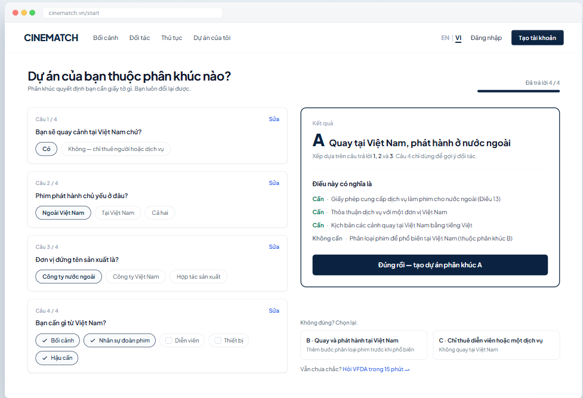

# Screen Spec: SC-02 Segment router + A/B/C result

> DBIZ3 Session 4 template — one file per screen. The Screen ID is kept from the DBIZ2 Screen List.
> The mockup image stays an image; everything around it is text.
> **Each orange numbered badge on the mockup is the row with the same number in section 3 (Element inventory).**

| Field | Value |
|---|---|
| Screen ID | `SC-02` |
| Screen name | Segment router + A/B/C result |
| Actor | Guest |
| Priority | Must |
| Belongs to module | `docs/spec/spec-M1.md` |
| Mockup image | `img/SC-02.png` |
| Status | Draft |

*Route:* `/start` · *Screen list file:* Onboarding, item #3 (Tier 1 — Must) · *Design note from the screen list file:* 3–4 short questions; the result screen lets users confirm or change.

## 1. Purpose

**Shown when:** The user clicks *Get started* on `SC-01`, or has just verified a new account on `SC-04`.

**The user leaves this screen when:** The user confirms the segment (to project creation `SC-10`) or picks a different segment and confirms.

## 2. Mockup

> The image is the visual contract (layout, grouping, hierarchy); the tables below are the behavioural contract.
> All data in the mockup is sample data for one fictional project (*The Last Ferry*, Harbour Line Films); organisation names, people and phone numbers are examples, not real records.

## 3. Element inventory

| # | Element | Type | Content / data source | Required | Validation |
|---|---|---|---|---|---|
| 1 | Navigation bar | Header | static | — | — |
| 2 | Progress indicator | Text + bar | number of questions answered / 4 | — | — |
| 3 | Question 1 — Shooting in Vietnam? | Toggle (single choice) | `segment_answers.q1_shoot_in_vn` | Yes | Yes / No |
| 4 | Question 2 — Release market | Toggle (single choice) | `segment_answers.q2_release` | Yes (if question 1 = Yes) | abroad / vietnam / both |
| 5 | Question 3 — Producing entity | Toggle (single choice) | `segment_answers.q3_producer` | Yes (if question 1 = Yes) | foreign / vietnamese / coproduction |
| 6 | Question 4 — Needs | Toggle (multiple choice) | `segment_answers.q4_needs[]` | No | subset of the 5 values |
| 7 | *Edit* answer link | Button | static; on every question | — | — |
| 8 | Segment result card | Container | computed from the decision table `segment_rules` (no language model) | Yes | exactly one of A / B / C |
| 9 | Classification reason | Text | the answers that determined the result | Yes | must cite question numbers |
| 10 | *What this means* block | List | `segment_requirements` for the segment | Yes | each line labelled Required / Not required |
| 11 | *That's right — create a segment A project* button | Button | static | — | — |
| 12 | The other two segment cards | Button | static | — | — |
| 13 | *Ask VFDA* link | Button | static | — | — |

## 4. States

| State | What the user sees | Trigger |
|---|---|---|
| Default | First visit: only question 1 is shown; answering each question reveals the next; the result block appears once the required questions are answered. The mockup shows the completed 4/4 state. | Page opens |
| Empty (no data) | No questions answered: the right column shows a faded placeholder *Your result will appear here after question 3*. | First page visit |
| Loading | **Not applicable** to segment classification (computed instantly in the browser from the preloaded decision table). The create project button has a pending state when clicked. | — |
| Error | Contradictory answers that match no rule (e.g. not shooting in VN but needing *Locations*) → *We couldn't classify this — choose directly or ask VFDA*, showing all three A/B/C cards. | No rule matches |
| Success / confirmation | Confirming while logged in → `SC-10` with the *Create new project* panel pre-filled with the segment. Not logged in → `SC-04`, selection kept in the session. | Segment confirmed |

## 5. Interactions and navigation

| # | Element | User action | System response | Goes to screen |
|---|---|---|---|---|
| 1 | Option within a question | tap | Records the answer, reveals the next question, recalculates the result | stays |
| 2 | *Edit* link | tap | Reopens that question; result recalculates immediately | stays |
| 3 | *That's right — create a segment A project* button | tap | Saves `projects.segment`; if not logged in, keeps it in the session | SC-10 (or SC-04) |
| 4 | Card B or C | tap | Switches the result to that segment, records `segment_override = true` | stays |
| 5 | *Ask VFDA* | tap | Opens booking with topic *Segment identification* | SC-33 |

## 6. Screen-level rules

| Rule ID | Rule | Source |
|---|---|---|
| SR-031 | At most **4 questions**; question 4 does not affect the segment. | Screen list file — note #3 |
| SR-032 | The segment is computed with a **deterministic decision table** (`segment_rules`), not a language model — the same answers always give the same result. | Explainability principle |
| SR-033 | The result **always** comes with the reason (which questions decided it) and a *Required / Not required* list. | No-black-box principle |
| SR-034 | Users can always change the segment; manual choices are recorded (`segment_override`) so VFDA can see where the router misclassifies. | TL4 §2 |
| SR-035 | The *Required / Not required* list is read from the VFDA-approved `segment_requirements` table, not hard-coded. | TL5 §M1 |

## 7. Linked requirements

| FR ID (from the module spec) | What this screen does for it |
|---|---|
| FR-001 · spec-M1.md (F-M1-01) | Segment selection screen |
| FR-002 · spec-M1.md (F-M1-02) | Record selection and configure the journey |
| FR-003 · spec-M1.md (F-M1-03) | Change segment |

## 8. Responsive and accessibility notes

- Minimum supported width: **360px**.
- Narrow screens: questions are shown one at a time (step by step); the result card takes the full screen when done.
- Options are real `radio` / `checkbox` groups, with a `fieldset` + `legend` per question.
- Segment letters A/B/C are always paired with their full name — users should never have to guess the meaning.

## 9. Open questions

| # | Question | Blocking? | Status |
|---|---|---|---|
| 1 | [NEEDS CLARIFICATION: decision table for the *co-production* case (question 3) — classify as A or B, and is a separate segment needed] | Yes | Open |
| 2 | [NEEDS CLARIFICATION: does segment C really need no permit at all when a foreign crew only hires Vietnamese cast to shoot abroad] | Yes | Open |

## Completion checklist

- [x] The mockup is a separate cropped image file, named with the Screen ID (`img/SC-02.png`).
- [x] Every visible element in the mockup appears in the element inventory — machine-checked: badge numbers on the image = row numbers in section 3.
- [x] Every input element has a validation rule or an explicit "—".
- [x] All five states are filled in, or marked "Not applicable" with a reason.
- [x] Every navigation target is a Screen ID that exists in `docs/screen-list.md` — machine-checked.
- [x] Every element that displays data names the field it displays, matching `docs/spec/spec-M1.md` section 5.1.
- [ ] **Checked by a person:** _(not signed — a Group C member compares the image with the tables and signs here)_

---
*DBIZ3 Session 4 · Group C · CINEMATCH. Built on the DBIZ2 Screen Design (Screen List and Screen Layout).*
