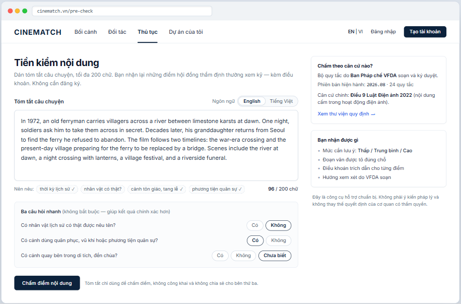

# Screen Spec: SC-03 Script content input (200-word pre-check)

> DBIZ3 Session 4 template — one file per screen. The Screen ID is kept from the DBIZ2 Screen List.
> The mockup image stays an image; everything around it is text.
> **Each orange numbered badge on the mockup is the row with the same number in section 3 (Element inventory).**

| Field | Value |
|---|---|
| Screen ID | `SC-03` |
| Screen name | Script content input (200-word pre-check) |
| Actor | Guest |
| Priority | Must |
| Belongs to module | `docs/spec/spec-M2.md` |
| Mockup image | `img/SC-03.png` |
| Status | Draft |

*Route:* `/pre-check` · *Screen list file:* M2, item #6 (Tier 1 — Must) · *Design note from the screen list file:* Simple form, quick to fill in.

**Notes against Screen List v2.0**

- In the previous Screen List, `SC-03` contained both the input and the results. Per the screen list file (#6 and #7), the results were split into a new screen `SC-48 Content check results`. `SC-03` now covers input only.

## 1. Purpose

**Shown when:** A guest clicks *Quick content check* on `SC-01`, or clicks *Edit summary and re-check* on `SC-48`.

**The user leaves this screen when:** The user clicks *Check content* and gets the results on `SC-48`.

## 2. Mockup

> The image is the visual contract (layout, grouping, hierarchy); the tables below are the behavioural contract.
> All data in the mockup is sample data for one fictional project (*The Last Ferry*, Harbour Line Films); organisation names, people and phone numbers are examples, not real records.

## 3. Element inventory

| # | Element | Type | Content / data source | Required | Validation |
|---|---|---|---|---|---|
| 1 | Navigation bar | Header | static | — | — |
| 2 | Title + description | Header + Text | static | — | — |
| 3 | Story summary box | Input (textarea) | `summary_text — input only, never stored (M2 FR-007 keeps precheck_run.synopsis_hash)` | Yes | 20–200 words (word count); trim extra whitespace |
| 4 | Word counter | Text | real-time count | — | red above 200, blocks submission |
| 5 | Summary language selector | Toggle | `precheck_run.lang` — en / vi | Yes | auto-detected from content, user can change |
| 6 | Worth-mentioning hints | List (chip) | static; chips auto-tick ✓ when the topic is detected in the text | — | hints only, never block submission |
| 7 | Three quick questions | Toggle (single choice ×3) | `precheck_run.flags` — real_person, military, heritage_site | No | Yes / No / Not sure |
| 8 | *Check content* button | Button | static | — | disabled below 20 or above 200 words |
| 9 | Privacy line | Text | static | Yes | always shown next to the button |
| 10 | *What is it checked against?* block | Text | `rule_set_version.rule_version (latest)`, count of approved `legal_rule` | Yes | must show the rule set version |
| 11 | Disclaimer line | Text | static | Yes | always shown |

## 4. States

| State | What the user sees | Trigger |
|---|---|---|
| Default | Empty summary box with placeholder text, counter at 0 / 200, check button disabled. The mockup shows a pasted 96-word summary. | Page opens |
| Empty (no data) | Empty box: placeholder *e.g. A coastal village in the 1990s…*; the basis block is still fully shown. | Page opens |
| Loading | Button changes to *Checking… (about 10–20 seconds)*; input locked; a *Cancel* button is available. | Click check |
| Error | Red line under the button: *We couldn't run the check right now. Your summary is still here — try again in a few minutes.* Per-IP limit reached: *You've used all of today's checks — create a free account to continue.* | API error / timeout / rate limit |
| Success / confirmation | Goes to `SC-48` with the results. | Check complete |

## 5. Interactions and navigation

| # | Element | User action | System response | Goes to screen |
|---|---|---|---|---|
| 1 | Summary box | type | Counts words; ticks hint chips when topics are detected | stays |
| 2 | Language chip | tap | Changes the analysis language | stays |
| 3 | Quick question | tap | Records the flag | stays |
| 4 | *Check content* button | tap | Calls `F-M2-06`, logs the run via `F-M2-07` | SC-48 |
| 5 | *View the regulations library* | tap | — | SC-30 |

## 6. Screen-level rules

| Rule ID | Rule | Source |
|---|---|---|
| SR-061 | **No sign-up needed** to use it. This is the platform's main conversion point. | TL4 §3 |
| SR-062 | The 200-word limit is deliberate: enough to identify the topics, not enough for users to paste a whole script into a public tool. | Data minimisation principle |
| SR-063 | The three quick questions are **optional**; *Not sure* is a valid answer and is treated as no information. | No-guessing principle |
| SR-064 | Always show the rule set version that will be used — results must be traceable to the exact version. | TL5 §M2 |

## 7. Linked requirements

| FR ID (from the module spec) | What this screen does for it |
|---|---|
| FR-005 · spec-M2.md (F-M2-05) | Summary input box |
| FR-006 · spec-M2.md (F-M2-06) | Submit for review |
| FR-007 · spec-M2.md (F-M2-07) | Log the pre-check run |

## 8. Responsive and accessibility notes

- Minimum supported width: **360px**.
- Narrow screens: the right column moves below the check button; the disclaimer line always sits right under the button.
- The summary box has a real `<label>`; the counter is announced via `aria-live="polite"`.
- Hint chips don't convey information by colour alone — they carry a text ✓ mark.

## 9. Open questions

| # | Question | Blocking? | Status |
|---|---|---|---|
| 1 | [NEEDS CLARIFICATION: how long are guest summaries kept, and are they used to improve the rule set — privacy policy wording needed] | Yes | Open |
| 2 | [NEEDS CLARIFICATION: daily pre-check limit per IP] | No | Open |

## Completion checklist

- [x] The mockup is a separate cropped image file, named with the Screen ID (`img/SC-03.png`).
- [x] Every visible element in the mockup appears in the element inventory — machine-checked: badge numbers on the image = row numbers in section 3.
- [x] Every input element has a validation rule or an explicit "—".
- [x] All five states are filled in, or marked "Not applicable" with a reason.
- [x] Every navigation target is a Screen ID that exists in `docs/screen-list.md` — machine-checked.
- [x] Every element that displays data names the field it displays, matching `docs/spec/spec-M2.md` section 5.1.
- [ ] **Checked by a person:** _(not signed — a Group C member compares the image with the tables and signs here)_

---
*DBIZ3 Session 4 · Group C · CINEMATCH. Built on the DBIZ2 Screen Design (Screen List and Screen Layout).*
