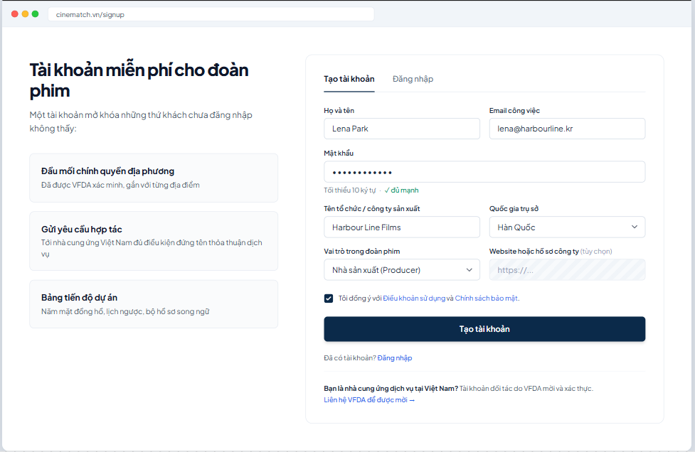

# Screen Spec: SC-04 Sign up / Log in

> DBIZ3 Session 4 template — one file per screen. The Screen ID is kept from the DBIZ2 Screen List.
> The mockup image stays an image; everything around it is text.
> **Each orange numbered badge on the mockup is the row with the same number in section 3 (Element inventory).**

| Field | Value |
|---|---|
| Screen ID | `SC-04` (also covers `SC-05`) |
| Screen name | Sign up / Log in |
| Actor | Guest |
| Priority | Must |
| Belongs to module | `docs/spec/spec-SYS.md` |
| Mockup image | `img/SC-04.png` |
| Status | Draft |

*Route:* `/signup · /login` · *Screen list file:* Onboarding, item #2 (Tier 1 — Must) · *Design note from the screen list file:* Also collect organisation / production company details.

**Notes against Screen List v2.0**

- This screen merges `SC-04 Sign up` and `SC-05 Log in` per the screen list file (#2). Both share one layout and differ only in the selected tab. Routes stay separate: `/signup` opens the *Create account* tab, `/login` opens the *Log in* tab. `SC-05` has no separate image file.

## 1. Purpose

**Shown when:** A guest clicks *Log in* / *Sign up* in the navigation bar, or is redirected here when using a feature that requires an account (viewing contacts, sending requests, saving results).

**The user leaves this screen when:** Account created and email verified, or login successful — returns to the page that led here (the `next` parameter); defaults to `SC-02` for new accounts and `SC-10` for existing ones.

## 2. Mockup

> The image is the visual contract (layout, grouping, hierarchy); the tables below are the behavioural contract.
> All data in the mockup is sample data for one fictional project (*The Last Ferry*, Harbour Line Films); organisation names, people and phone numbers are examples, not real records.

## 3. Element inventory

| # | Element | Type | Content / data source | Required | Validation |
|---|---|---|---|---|---|
| 1 | Account value block | List | static: 3 benefits | — | — |
| 2 | *Create account* / *Log in* tabs | Toggle | static; tab selected by route | — | — |
| 3 | Full name | Input | `profiles.full_name` | Yes | 2–80 characters |
| 4 | Work email | Input | `auth.users.email` | Yes | email format; not already in the system |
| 5 | Password | Input (password) | sent directly to Supabase Auth, not stored by the app | Yes | ≥ 10 characters; strength meter |
| 6 | Organisation / production company | Input | `organizations_producer.name` | Yes | 2–120 characters |
| 7 | Country of headquarters | Toggle (dropdown) | `organizations_producer.country` — ISO 3166-1 alpha-2 code | Yes | only codes from the list |
| 8 | Role in the crew | Toggle (dropdown) | `profiles.crew_role` — Producer / Director / Production coordinator / Line producer / Other | Yes | enum |
| 9 | Website or company profile | Input | `organizations_producer.website` | No | valid URL if provided |
| 10 | Terms consent checkbox | Toggle (checkbox) | `consents` — stores terms version and timestamp | Yes | must be ticked to enable the Create account button |
| 11 | *Create account* button | Button | static | — | disabled while any required field is invalid |
| 12 | Entry for Vietnamese suppliers | Text + link | static | — | — |
| 13 | *Already have an account? Log in* line | Text + link | static | — | — |

## 4. States

| State | What the user sees | Trigger |
|---|---|---|
| Default | *Create account* tab open, empty form (the mockup is pre-filled for illustration). On the *Log in* tab: Email, Password, a *Forgot password?* link (→ `SC-06`), and a *Log in* button. | Open `/signup` or `/login` |
| Empty (no data) | **Not applicable** — a form with no data list. | — |
| Loading | The *Create account* button changes to *Creating…* and is disabled; all fields are temporarily locked to prevent double submission. | Click Create account / Log in |
| Error | Errors under each field (e.g. *This email already has an account — Log in?*). Wrong password: *Email or password is incorrect* — without saying which one. Entered data is kept, except the password. | Zod validation fails / Supabase Auth returns an error |
| Success / confirmation | *Check your inbox* screen: *We've sent a verification link to lena@harbourline.kr*, with a *Resend* button (locked for 60 seconds). | Account created |

## 5. Interactions and navigation

| # | Element | User action | System response | Goes to screen |
|---|---|---|---|---|
| 1 | *Log in* tab | tap | Switches form, changes URL to `/login` | SC-05 (same layout) |
| 2 | Email field | type | Validates format on blur | stays |
| 3 | *Create account* button | tap | Calls Supabase Auth `signUp`, creates `profiles` + `organizations_producer` | stays (Check your inbox screen) |
| 4 | Verification link in the email | tap | Verifies and creates a login session | SC-02 |
| 5 | *Forgot password?* (Log in tab) | tap | — | SC-06 |
| 6 | Terms / Policy links | tap | Open in a new tab | SC-43 / SC-42 |
| 7 | *Contact VFDA for an invitation* | tap | Opens the booking form with topic *Supplier registration* | SC-33 |

## 6. Screen-level rules

| Rule ID | Rule | Source |
|---|---|---|
| SR-021 | Passwords, password hashing and JWTs are **handled by Supabase Auth**; the app does not implement them itself. | TL5 §M-SYS |
| SR-022 | The default role after sign-up is `member`. **There is no self-registration path for the `partner` role** — suppliers are invited and verified by VFDA. | TL4 §8 |
| SR-023 | Organisation details are mandatory: VFDA needs to know *which organisation* is preparing to shoot, not just *which person*. | Screen list file — note #2 |
| SR-024 | Terms consent is stored with the document **version** and timestamp, so it can be proven later. | Personal data protection |
| SR-025 | After login, return to the page that led here (`next`); accept internal paths only, to block open redirects. | Security |

## 7. Linked requirements

| FR ID (from the module spec) | What this screen does for it |
|---|---|
| FR-001 · spec-SYS.md (F-SYS-01) | Account sign-up |
| FR-002 · spec-SYS.md (F-SYS-02) | Log in |
| FR-003 · spec-SYS.md (F-SYS-03) | Forgot password entry |
| FR-004 · spec-SYS.md (F-SYS-04) | Assign default role `member` |
| FR-008 · spec-SYS.md (F-SYS-08) | Verification email |

## 8. Responsive and accessibility notes

- Minimum supported width: **360px**.
- Narrow screens: the value block on the left collapses into a one-line summary above the form; two-column field pairs stack into one column.
- Every field has a real `<label>` and the correct `autocomplete` value (`email`, `new-password`, `organization`).
- Error messages are linked via `aria-describedby` and announced when they appear.

## 9. Open questions

_Open questions are tracked outside this repository until they are resolved._

## Completion checklist

- [x] The mockup is a separate cropped image file, named with the Screen ID (`img/SC-04.png`).
- [x] Every visible element in the mockup appears in the element inventory — machine-checked: badge numbers on the image = row numbers in section 3.
- [x] Every input element has a validation rule or an explicit "—".
- [x] All five states are filled in, or marked "Not applicable" with a reason.
- [x] Every navigation target is a Screen ID that exists in `docs/screen-list.md` — machine-checked.
- [x] Every element that displays data names the field it displays, matching `docs/spec/spec-SYS.md` section 5.1.
- [ ] **Checked by a person:** _(not signed — a Group C member compares the image with the tables and signs here)_

---
*DBIZ3 Session 4 · Group C · CINEMATCH. Built on the DBIZ2 Screen Design (Screen List and Screen Layout).*
