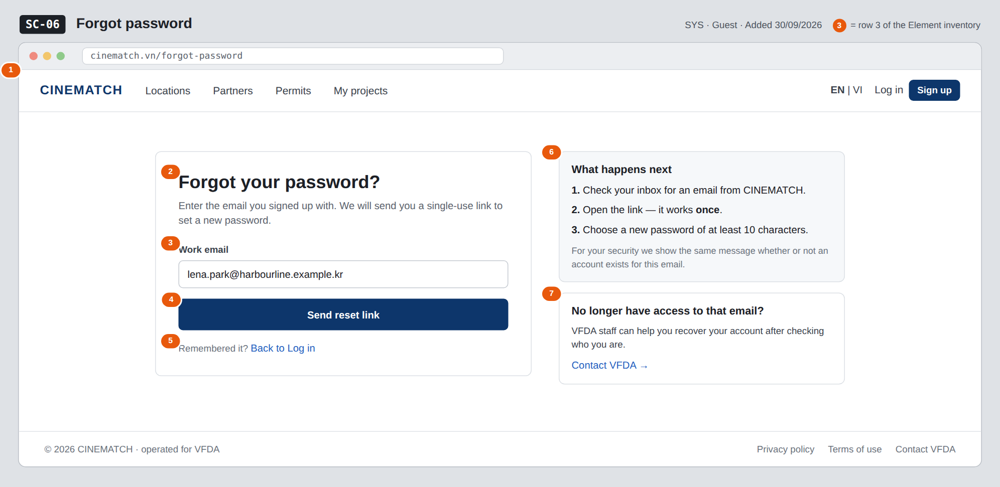

# Screen Spec: SC-06 Forgot password

> DBIZ3 Session 4 template — one file per screen. The Screen ID is kept from the DBIZ2 Screen List.
> The mockup image stays an image; everything around it is text.
> **Each orange numbered badge on the mockup is the row with the same number in section 3 (Element inventory).**

| Field | Value |
|---|---|
| Screen ID | `SC-06` |
| Screen name | Forgot password |
| Actor | Guest |
| Priority | Must |
| Belongs to module | `docs/spec/spec-SYS.md` |
| Mockup image | `img/SC-06.png` |
| Status | Draft |

*Route:* `/forgot-password` · *Screen list file:* SYS, item #21 (Added 30/09/2026 — Must) · *Design note from the screen list file:* Send a reset link.

**Notes against Screen List v2.0**

- New Screen Spec written 30/09/2026; the screen existed in Screen List v2.0 without a mockup.

## 1. Purpose

**Shown when:** A guest clicks *Forgot password?* on the *Log in* tab of `SC-04` (`SC-05`), or *Send a new link* on an expired link in `SC-07`.

**The user leaves this screen when:** The guest opens the reset link from the email (`SC-07`), goes back to `SC-04`, or asks VFDA for help on `SC-33`.

## 2. Mockup

> The image is the visual contract (layout, grouping, hierarchy); the tables below are the behavioural contract.
> All data in the mockup is sample data for one fictional project (*The Last Ferry*, Harbour Line Films); organisation names, people and phone numbers are examples, not real records.

## 3. Element inventory

| # | Element | Type | Content / data source | Required | Validation |
|---|---|---|---|---|---|
| 1 | Navigation bar (logged out) | Header | static; *EN \| VI* switch and *Log in / Sign up* | — | — |
| 2 | Title + explanation | Header | static (bilingual dictionary, F-SYS-06) | — | — |
| 3 | Work email | Input (email) | FR-003 `email` | Yes | email format; ≤ 254 characters |
| 4 | *Send reset link* button | Button | static | — | disabled while the email is empty or invalid |
| 5 | *Back to Log in* link | Link | static | — | — |
| 6 | *What happens next* block | Text | static | — | — |
| 7 | *No longer have access to that email?* help | Text + link | static | — | — |

## 4. States

| State | What the user sees | Trigger |
|---|---|---|
| Default | Empty email field, *Send reset link* disabled until a valid email is typed (the mockup is pre-filled for illustration). | Open `/forgot-password` |
| Empty (no data) | Not applicable — a one-field form with no data list. | — |
| Loading | The button changes to *Sending…* and is disabled; the field is locked to prevent a second request. | Click *Send reset link* |
| Error | Invalid format: *Enter a valid email address* under the field. Email provider down: *We couldn't send the email right now — try again in a minute*; the request is queued and retried (FR-008). | Zod validation fails / email delivery fails |
| Success / confirmation | The form is replaced by *If an account exists for lena.park@harbourline.example.kr, we've sent a reset link* (`reset_status = sent`), with *Resend* locked for 60 seconds and *Back to Log in*. | Request accepted by Supabase Auth |

## 5. Interactions and navigation

| # | Element | User action | System response | Goes to screen |
|---|---|---|---|---|
| 1 | Email field | type | Validates format on blur | stays |
| 2 | *Send reset link* | tap | Calls Supabase Auth password reset for `email`; sends the reset email (F-SYS-08) | stays (confirmation message) |
| 3 | Reset link in the email | tap | Opens the reset page with `reset_token` | SC-07 |
| 4 | *Back to Log in* | tap | — | SC-05 |
| 5 | *Contact VFDA* | tap | Opens the booking form | SC-33 |
| 6 | *EN \| VI* switch | tap | Switches all interface text, keeps the typed email (F-SYS-05) | stays |

## 6. Screen-level rules

| Rule ID | Rule | Source |
|---|---|---|
| SR-211 | The confirmation message is **the same whether or not an account exists** for the email, so the page cannot be used to find out who has an account. | Security |
| SR-212 | The reset link is **single-use**; tokens and password handling are done by Supabase Auth only. | SYS BR-004; FR-003 |
| SR-213 | A deactivated account (`account_status = deactivated`) gets the same neutral message but **no reset email** — a reset never reactivates it. | SYS BR-005 |
| SR-214 | *Resend* is locked for 60 seconds after each send, as for the verification email. | SYS §3 edge cases |

## 7. Linked requirements

| FR ID (from the module spec) | What this screen does for it |
|---|---|
| FR-003 · spec-SYS.md (F-SYS-03) | Request a single-use password reset link |
| FR-008 · spec-SYS.md (F-SYS-08) | Reset email from the authenticated domain |
| FR-005 · spec-SYS.md (F-SYS-05) | Language switch keeps the form |

## 8. Responsive and accessibility notes

- Minimum supported width: **360px**.
- Narrow screens: the help blocks move below the form card.
- Every field has a real `<label>`; errors are linked with `aria-describedby` and announced when they appear.
- The email field uses `type=email` and `autocomplete=email`.

## 9. Open questions

| # | Question | Blocking? | Status |
|---|---|---|---|
| 1 | [NEEDS CLARIFICATION: How long is a password reset link valid before it expires (e.g. 1 hour)?] | No | Open |

## Completion checklist

- [x] The mockup is a separate cropped image file, named with the Screen ID (`img/SC-06.png`).
- [x] Every visible element in the mockup appears in the element inventory — machine-checked: badge numbers on the image = row numbers in section 3.
- [x] Every input element has a validation rule or an explicit "—".
- [x] All five states are filled in, or marked "Not applicable" with a reason.
- [x] Every navigation target is a Screen ID that exists in `docs/screen-list.md` — machine-checked.
- [x] Every element that displays data names the field it displays, matching `docs/spec/spec-SYS.md` section 5.1.
- [ ] **Checked by a person:** _(not signed — a Group C member compares the image with the tables and signs here)_

---
*DBIZ3 Session 4 · Group C · CINEMATCH. Built on the DBIZ2 Screen Design (Screen List and Screen Layout).*
