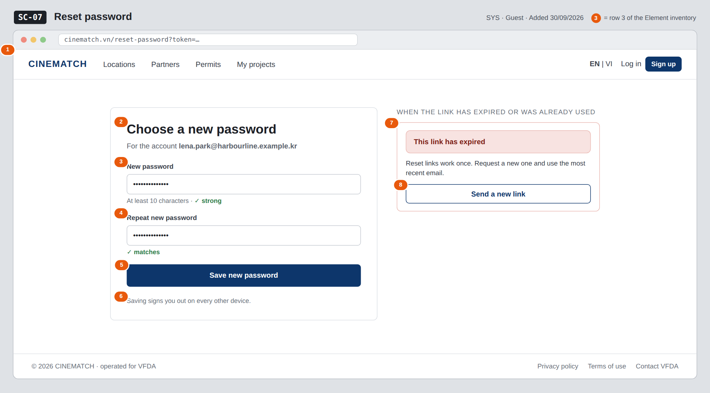

# Screen Spec: SC-07 Reset password

> DBIZ3 Session 4 template — one file per screen. The Screen ID is kept from the DBIZ2 Screen List.
> The mockup image stays an image; everything around it is text.
> **Each orange numbered badge on the mockup is the row with the same number in section 3 (Element inventory).**

| Field | Value |
|---|---|
| Screen ID | `SC-07` |
| Screen name | Reset password |
| Actor | Guest |
| Priority | Must |
| Belongs to module | `docs/spec/spec-SYS.md` |
| Mockup image | `img/SC-07.png` |
| Status | Draft |

*Route:* `/reset-password` · *Screen list file:* SYS, item #22 (Added 30/09/2026 — Must) · *Design note from the screen list file:* Enter a new password.

**Notes against Screen List v2.0**

- New Screen Spec written 30/09/2026; the mockup shows the valid-link form (left) and the expired-link panel (right) that replaces it.

## 1. Purpose

**Shown when:** A guest opens the reset link from the email sent by `SC-06`.

**The user leaves this screen when:** The new password is saved and the user is signed in (to `SC-10`), or the link has expired and the user requests a new one on `SC-06`.

## 2. Mockup

> The image is the visual contract (layout, grouping, hierarchy); the tables below are the behavioural contract.
> All data in the mockup is sample data for one fictional project (*The Last Ferry*, Harbour Line Films); organisation names, people and phone numbers are examples, not real records.

## 3. Element inventory

| # | Element | Type | Content / data source | Required | Validation |
|---|---|---|---|---|---|
| 1 | Navigation bar (logged out) | Header | static | — | — |
| 2 | Title + account email | Header | email of the account the `reset_token` belongs to | Yes | — |
| 3 | New password | Input (password) | FR-003 `new_password` — sent to Supabase Auth, never stored by the app | Yes | ≥ 10 characters, ≤ 72; strength meter |
| 4 | Repeat new password | Input (password) | client-side only | Yes | must equal row 3 |
| 5 | *Save new password* button | Button | static | — | disabled until rows 3–4 are valid |
| 6 | Sign-out note | Text | static | — | — |
| 7 | Expired-link panel | Container | FR-003 `reset_status = expired` | — | shown instead of the form |
| 8 | *Send a new link* button | Button | static | — | — |

## 4. States

| State | What the user sees | Trigger |
|---|---|---|
| Default | Form with the account email and two empty password fields (the mockup is pre-filled). | Valid `reset_token` in the link |
| Empty (no data) | Not applicable — a form with no data list. | — |
| Loading | *Checking your link…* skeleton while the token is verified; after submit the button shows *Saving…* and is disabled. | Page opens / click *Save new password* |
| Error | Token expired or already used: the form is replaced by the expired-link panel (rows 7–8). Password too short or fields differ: message under the field; nothing is sent. | `reset_status = expired` / validation fails |
| Success / confirmation | *Your password has been changed* (`reset_status = ok`); the user is signed in and taken to `SC-10` after 3 seconds, or at once with *Continue*. | Supabase Auth accepts the new password |

## 5. Interactions and navigation

| # | Element | User action | System response | Goes to screen |
|---|---|---|---|---|
| 1 | New password fields | type | Live strength meter and match check | stays |
| 2 | *Save new password* | tap | Sends `reset_token` + `new_password` to Supabase Auth; ends other sessions | SC-10 |
| 3 | *Send a new link* | tap | Opens the forgot-password form with the email pre-filled | SC-06 |
| 4 | *EN \| VI* switch | tap | Switches interface text; typed passwords are cleared for safety | stays |

## 6. Screen-level rules

| Rule ID | Rule | Source |
|---|---|---|
| SR-221 | The reset token is verified and consumed by **Supabase Auth only**; a used or expired token always shows the expired-link panel. | SYS BR-004; FR-003 |
| SR-222 | The new password follows the sign-up rule: **at least 10 characters**. | SYS §5.1 FR-003 |
| SR-223 | A deactivated account cannot be reactivated through a password reset. | SYS BR-005 |
| SR-224 | After a successful reset, all other sessions of the account are signed out. | Security |

## 7. Linked requirements

| FR ID (from the module spec) | What this screen does for it |
|---|---|
| FR-003 · spec-SYS.md (F-SYS-03) | Set a new password with the single-use token |
| FR-002 · spec-SYS.md (F-SYS-02) | Sign the user in after the reset |

## 8. Responsive and accessibility notes

- Minimum supported width: **360px**.
- Narrow screens: one column; the expired-link panel takes the place of the form.
- Every field has a real `<label>`; errors are linked with `aria-describedby` and announced when they appear.
- Password fields use `autocomplete=new-password` and have a *Show* toggle with an accessible name.

## 9. Open questions

| # | Question | Blocking? | Status |
|---|---|---|---|
| 1 | [NEEDS CLARIFICATION: SEQ-01 has no error branch (email provider down, expired link). Confirm the behaviour written in the edge cases.] | No | Open |

## Completion checklist

- [x] The mockup is a separate cropped image file, named with the Screen ID (`img/SC-07.png`).
- [x] Every visible element in the mockup appears in the element inventory — machine-checked: badge numbers on the image = row numbers in section 3.
- [x] Every input element has a validation rule or an explicit "—".
- [x] All five states are filled in, or marked "Not applicable" with a reason.
- [x] Every navigation target is a Screen ID that exists in `docs/screen-list.md` — machine-checked.
- [x] Every element that displays data names the field it displays, matching `docs/spec/spec-SYS.md` section 5.1.
- [ ] **Checked by a person:** _(not signed — a Group C member compares the image with the tables and signs here)_

---
*DBIZ3 Session 4 · Group C · CINEMATCH. Built on the DBIZ2 Screen Design (Screen List and Screen Layout).*
