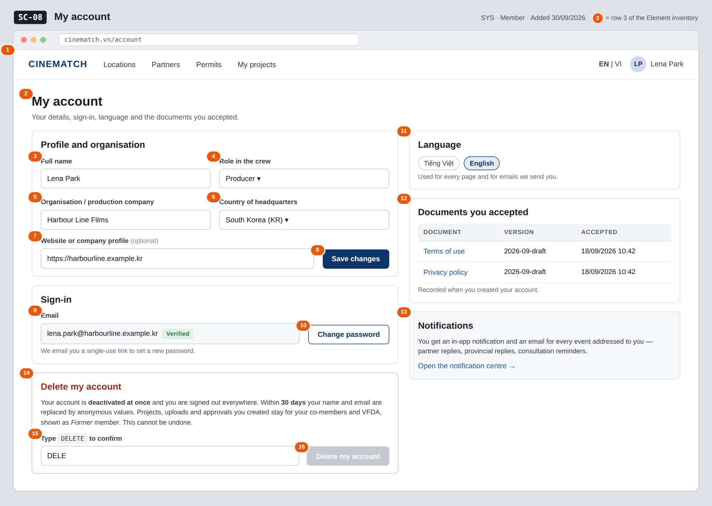

# Screen Spec: SC-08 My account

> DBIZ3 Session 4 template — one file per screen. The Screen ID is kept from the DBIZ2 Screen List.
> The mockup image stays an image; everything around it is text.
> **Each orange numbered badge on the mockup is the row with the same number in section 3 (Element inventory).**

| Field | Value |
|---|---|
| Screen ID | `SC-08` |
| Screen name | My account |
| Actor | Member |
| Priority | Must |
| Belongs to module | `docs/spec/spec-SYS.md` |
| Mockup image | `img/SC-08.png` |
| Status | Draft |

*Route:* `/account` · *Screen list file:* SYS, item #23 (Added 30/09/2026 — Must) · *Design note from the screen list file:* Details and preferences.

**Notes against Screen List v2.0**

- New Screen Spec written 30/09/2026; includes the *Delete my account* area decided on 30/09/2026 (SYS BR-005).

## 1. Purpose

**Shown when:** A signed-in user clicks their name in the navigation bar and chooses *My account*.

**The user leaves this screen when:** The user saves and stays, opens `SC-09`, `SC-42` or `SC-43`, or deletes the account and is signed out to `SC-01`.

## 2. Mockup

> The image is the visual contract (layout, grouping, hierarchy); the tables below are the behavioural contract.
> All data in the mockup is sample data for one fictional project (*The Last Ferry*, Harbour Line Films); organisation names, people and phone numbers are examples, not real records.

## 3. Element inventory

| # | Element | Type | Content / data source | Required | Validation |
|---|---|---|---|---|---|
| 1 | Navigation bar | Header | static; avatar menu | — | — |
| 2 | Title + explanation | Header | static | — | — |
| 3 | Full name | Input | `full_name` | Yes | 2–120 characters |
| 4 | Role in the crew | Toggle (dropdown) | `crew_role` — Producer / Director / Production coordinator / Line producer / Other | Yes | enum, 5 values |
| 5 | Organisation / production company | Input | `org_name` | Yes | 2–200 characters |
| 6 | Country of headquarters | Toggle (dropdown) | `country` — ISO 3166-1 alpha-2 | Yes | only codes from the list |
| 7 | Website or company profile | Input | `website` | No | valid URL if provided; ≤ 300 characters |
| 8 | *Save changes* button | Button | static | — | enabled only when a field changed and all are valid |
| 9 | Email (read-only) | Text | `email` + `email_verified` | Yes | — |
| 10 | *Change password* button | Button | static; sends a reset link (FR-003) | — | — |
| 11 | Language choice | Toggle | `locale` — vi / en | Yes | enum, 2 values |
| 12 | Documents you accepted | Table | `consent_version` + acceptance timestamp (CONSENT) | Yes | read-only |
| 13 | Notifications block | Text + link | static | — | — |
| 14 | *Delete my account* area | Container | static explanation of SYS BR-005 | — | — |
| 15 | Deletion confirmation | Input | client-side only | Yes (to delete) | must equal *DELETE* exactly |
| 16 | *Delete my account* button | Button | sets `account_status = deactivated` (FR-004) | — | disabled until row 15 matches |

## 4. States

| State | What the user sees | Trigger |
|---|---|---|
| Default | All sections filled from the account; *Save changes* disabled until something changes; *Delete my account* disabled. | Open `/account` |
| Empty (no data) | Not applicable — every required field was collected at sign-up. An account without an organisation (created before `org_name` became required) shows the field empty with *Please add your organisation*. | — |
| Loading | Grey skeleton for each card; on save the button shows *Saving…*; on delete the whole page is locked with *Deleting your account…*. | Page opens / save / delete |
| Error | Invalid field: message under it, nothing saved. Save fails: *Your changes were not saved — try again*, typed values kept. Delete fails: *Your account was not deleted* and nothing changes. | Validation / server error |
| Success / confirmation | Save: green strip *Changes saved*. Language: the page re-renders in the chosen language. Delete: signed out and taken to `SC-01` with *Your account has been deleted*. | Save / language change / delete succeeded |

## 5. Interactions and navigation

| # | Element | User action | System response | Goes to screen |
|---|---|---|---|---|
| 1 | *Save changes* | tap | Updates `full_name`, `crew_role`, `org_name`, `country`, `website` | stays |
| 2 | *Change password* | tap | Sends a single-use reset link to the account email; shows *Check your inbox* | stays |
| 3 | Language chip | tap | Saves `locale`, sets the `locale` cookie, re-renders the page | stays |
| 4 | Document link | tap | Opens the document version that was accepted | SC-43 / SC-42 |
| 5 | *Open the notification centre* | tap | — | SC-09 |
| 6 | *Delete my account* | tap | Sets `account_status = deactivated`, ends every session, schedules anonymisation within 30 days | SC-01 |

## 6. Screen-level rules

| Rule ID | Rule | Source |
|---|---|---|
| SR-231 | The email is the sign-in identity and one account per email; it is **shown read-only** here. | SYS §3 US-1 |
| SR-232 | The role is **not shown as editable**; it is set in the database and changed only by an admin. | SYS BR-002; FR-004 |
| SR-233 | *Delete my account* deactivates at once and removes all access; name, email and phone are anonymised within 30 days; projects, uploads, access logs and approvals stay and show *Former member*. **No hard delete.** | SYS BR-005 |
| SR-234 | Deletion requires typing *DELETE* exactly; the button stays disabled until it matches. | SYS BR-005 (irreversible action) |
| SR-235 | Consent records are read-only; the table lists each accepted document version with its timestamp. | SYS BR-003 |

## 7. Linked requirements

| FR ID (from the module spec) | What this screen does for it |
|---|---|
| FR-001 · spec-SYS.md (F-SYS-01) | Edit the account details collected at sign-up |
| FR-003 · spec-SYS.md (F-SYS-03) | Change password by reset link |
| FR-004 · spec-SYS.md (F-SYS-04) | Deactivate the account (`account_status`) |
| FR-005 · spec-SYS.md (F-SYS-05) | Choose and remember the interface language |

## 8. Responsive and accessibility notes

- Minimum supported width: **360px**.
- Narrow screens: one column; order is Profile, Sign-in, Language, Documents, Notifications, Delete.
- Every field has a real `<label>`; errors are linked with `aria-describedby` and announced when they appear.
- The delete area is a separate landmark with a heading; the confirmation field states the exact word in its label.

## 9. Open questions

| # | Question | Blocking? | Status |
|---|---|---|---|
| 1 | [NEEDS CLARIFICATION: SYS BR-005 anonymises name, email and phone, but SYS §5.1 has no phone field for an account — which phone field is meant?] | No | Open |
| 2 | [NEEDS CLARIFICATION: May a member turn off email notifications (per event type or all), or is every notification always emailed?] | No | Open |

## Completion checklist

- [x] The mockup is a separate cropped image file, named with the Screen ID (`img/SC-08.png`).
- [x] Every visible element in the mockup appears in the element inventory — machine-checked: badge numbers on the image = row numbers in section 3.
- [x] Every input element has a validation rule or an explicit "—".
- [x] All five states are filled in, or marked "Not applicable" with a reason.
- [x] Every navigation target is a Screen ID that exists in `docs/screen-list.md` — machine-checked.
- [x] Every element that displays data names the field it displays, matching `docs/spec/spec-SYS.md` section 5.1.
- [ ] **Checked by a person:** _(not signed — a Group C member compares the image with the tables and signs here)_

---
*DBIZ3 Session 4 · Group C · CINEMATCH. Built on the DBIZ2 Screen Design (Screen List and Screen Layout).*
