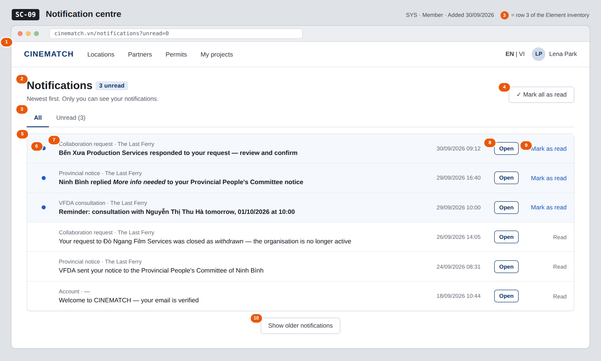

# Screen Spec: SC-09 Notification centre

> DBIZ3 Session 4 template — one file per screen. The Screen ID is kept from the DBIZ2 Screen List.
> The mockup image stays an image; everything around it is text.
> **Each orange numbered badge on the mockup is the row with the same number in section 3 (Element inventory).**

| Field | Value |
|---|---|
| Screen ID | `SC-09` |
| Screen name | Notification centre |
| Actor | Member |
| Priority | Must |
| Belongs to module | `docs/spec/spec-SYS.md` |
| Mockup image | `img/SC-09.png` |
| Status | Draft |

*Route:* `/notifications` · *Screen list file:* SYS, item #24 (Added 30/09/2026 — Must) · *Design note from the screen list file:* List of notifications.

**Notes against Screen List v2.0**

- New Screen Spec written 30/09/2026. Partner and VFDA roles use the same screen for their own notifications.

## 1. Purpose

**Shown when:** A signed-in user opens *Notifications* from the avatar menu, follows the link in a notification email, or clicks *Open the notification centre* on `SC-08`.

**The user leaves this screen when:** The user opens a notification and goes to the screen it is about (e.g. `SC-25`, `SC-32`, `SC-33`), or stays after marking notifications as read.

## 2. Mockup

> The image is the visual contract (layout, grouping, hierarchy); the tables below are the behavioural contract.
> All data in the mockup is sample data for one fictional project (*The Last Ferry*, Harbour Line Films); organisation names, people and phone numbers are examples, not real records.

## 3. Element inventory

| # | Element | Type | Content / data source | Required | Validation |
|---|---|---|---|---|---|
| 1 | Navigation bar | Header | static | — | — |
| 2 | Title + unread count | Header | FR-009 `unread_count` | Yes | — |
| 3 | *All* / *Unread* filter | Toggle | FR-009 `unread_only` | No | boolean; kept in the URL |
| 4 | *Mark all as read* button | Button | sets `read_at` on every unread notification of the user | — | hidden when `unread_count` = 0 |
| 5 | Notification row | List | FR-009 `notification`, newest first by `created_at` | Yes | only the user's own (`recipient_id`) |
| 6 | Unread marker | Icon | `read_at` is empty | — | text alternative *Unread* |
| 7 | Event label + project | Text | `event_type` (readable label) + project name from `payload` | Yes | — |
| 8 | *Open* button | Button | target screen from `payload` | — | — |
| 9 | *Mark as read* link | Link | sets `read_at` | — | shown on unread rows only |
| 10 | *Show older notifications* | Button | next page of FR-009 `notification` | — | hidden when no older rows |

## 4. States

| State | What the user sees | Trigger |
|---|---|---|
| Default | Up to 20 notifications, newest first; unread rows tinted and bold with a blue marker; unread count in the title. | Open `/notifications` |
| Empty (no data) | *No notifications yet — we'll tell you when a partner, a province or VFDA replies.* With the *Unread* filter and nothing unread: *You're all caught up*. | No notifications / no unread ones |
| Loading | Six grey skeleton rows; *Show older notifications* shows a spinner while loading. | Page opens / next page |
| Error | *We couldn't load your notifications — try again* with a *Retry* button; marking as read fails: the row returns to unread with a short message. | Query or update fails |
| Success / confirmation | After *Mark all as read*: every row turns to *Read*, the count disappears, and a short strip reads *All notifications marked as read*. | Update succeeded |

## 5. Interactions and navigation

| # | Element | User action | System response | Goes to screen |
|---|---|---|---|---|
| 1 | *Unread* tab | tap | Reloads with `unread_only = true` | stays |
| 2 | *Mark all as read* | tap | Sets `read_at` for all unread; count goes to 0 | stays |
| 3 | *Open* on a collaboration-request row | tap | Marks as read, opens the request | SC-25 |
| 4 | *Open* on a provincial-notice row | tap | Marks as read, opens the project's provinces page | SC-32 |
| 5 | *Open* on a consultation row | tap | Marks as read, opens the booking | SC-33 |
| 6 | *Mark as read* | tap | Sets `read_at` for that row | stays |
| 7 | *Show older notifications* | tap | Loads the next 20 | stays |

## 6. Screen-level rules

| Rule ID | Rule | Source |
|---|---|---|
| SR-241 | A user reads **only their own** notifications; enforced by Row Level Security on `recipient_id`. | SYS BR-001; FR-009 |
| SR-242 | Notifications are listed **newest first** with an unread count. | SYS §3 US-4 |
| SR-243 | Every event addressed to a user creates exactly one in-app notification; the matching email is sent separately and may be retried. | SYS FR-007; FR-008 |
| SR-244 | A notification about an archived project opens it **read-only**; one about a deactivated organisation still opens the closed request. | M0 BR-005; M4 BR-008 |

## 7. Linked requirements

| FR ID (from the module spec) | What this screen does for it |
|---|---|
| FR-007 · spec-SYS.md (F-SYS-07) | Show the in-app notifications created for the user |
| FR-009 · spec-SYS.md (F-SYS-09) | List newest first, unread filter, mark as read |

## 8. Responsive and accessibility notes

- Minimum supported width: **360px**.
- Narrow screens: date moves under the text; *Open* becomes a tap on the whole row; *Mark as read* moves into a row menu.
- The unread marker has a text alternative; the unread count is announced when it changes (`aria-live=polite`).
- The list is a real `<ul>`; each row is reachable with the keyboard.

## 9. Open questions

| # | Question | Blocking? | Status |
|---|---|---|---|
| 1 | [NEEDS CLARIFICATION: Which `event_type` values exist in the MVP and what readable label does each get? SYS §5.1 declares the field but not its values.] | No | Open |

## Completion checklist

- [x] The mockup is a separate cropped image file, named with the Screen ID (`img/SC-09.png`).
- [x] Every visible element in the mockup appears in the element inventory — machine-checked: badge numbers on the image = row numbers in section 3.
- [x] Every input element has a validation rule or an explicit "—".
- [x] All five states are filled in, or marked "Not applicable" with a reason.
- [x] Every navigation target is a Screen ID that exists in `docs/screen-list.md` — machine-checked.
- [x] Every element that displays data names the field it displays, matching `docs/spec/spec-SYS.md` section 5.1.
- [ ] **Checked by a person:** _(not signed — a Group C member compares the image with the tables and signs here)_

---
*DBIZ3 Session 4 · Group C · CINEMATCH. Built on the DBIZ2 Screen Design (Screen List and Screen Layout).*
