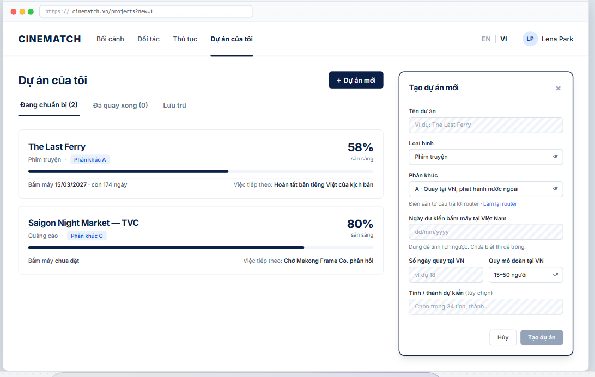

# Screen Spec: SC-10 Project list / Create new project

> DBIZ3 Session 4 template — one file per screen. The Screen ID is kept from the DBIZ2 Screen List.
> The mockup image stays an image; everything around it is text.
> **Each orange numbered badge on the mockup is the row with the same number in section 3 (Element inventory).**

| Field | Value |
|---|---|
| Screen ID | `SC-10` (also covers `SC-11`) |
| Screen name | Project list / Create new project |
| Actor | Member |
| Priority | Must |
| Belongs to module | `docs/spec/spec-M0.md` |
| Mockup image | `img/SC-10.png` |
| Status | Draft |

*Route:* `/projects · /projects?new=1` · *Screen list file:* M0, item #4 (Tier 1 — Must) · *Design note from the screen list file:* Project list and new project creation on the same screen.

**Notes against Screen List v2.0**

- This screen merges `SC-10 Project list` and `SC-11 Create project` per the screen list file (#4). Project creation is a panel that opens to the right of the list (route `?new=1`), not a separate page. `SC-11` has no separate image file.

## 1. Purpose

**Shown when:** A member clicks *My projects*, has just logged in with an account that already has projects, or has just confirmed a segment on `SC-02` (the create project panel opens automatically, pre-filled with the segment).

**The user leaves this screen when:** The member opens a project card (to `SC-12`) or successfully creates a new project (to that project's `SC-12`).

## 2. Mockup

> The image is the visual contract (layout, grouping, hierarchy); the tables below are the behavioural contract.
> All data in the mockup is sample data for one fictional project (*The Last Ferry*, Harbour Line Films); organisation names, people and phone numbers are examples, not real records.

## 3. Element inventory

| # | Element | Type | Content / data source | Required | Validation |
|---|---|---|---|---|---|
| 1 | Navigation bar | Header | static; *My projects* selected | — | — |
| 2 | Title + *+ New project* button | Header + Button | static | — | — |
| 3 | Project status tabs | Toggle | `projects.stage` — preparing / shot / archived, with counts | — | — |
| 4 | Project card | List | `projects.name`, `projects.format`, `projects.segment` | — | only projects the user is a member of (Row Level Security (RLS)) |
| 5 | Readiness on the card | Text + bar | `v_project_readiness.overall_score` | — | 0–100 |
| 6 | First shooting day and days remaining | Text | `projects.shooting_start_date` | — | none → *not set* |
| 7 | Next step on the card | Text | `F-M0-07` — highest-priority task | — | always one sentence |
| 8 | *Create new project* panel | Container | static | — | — |
| 9 | Project name | Input | `projects.name` | Yes | 2–120 characters; unique among the organisation's projects |
| 10 | Format | Toggle (dropdown) | `projects.format` — Feature film / Documentary / Commercial / TV programme / Music video | Yes | enum |
| 11 | Segment | Toggle (dropdown) | `projects.segment`, pre-filled from `SC-02` | Yes | A / B / C |
| 12 | Planned first shooting day | Input (date) | `projects.shooting_start_date` | No | must be after today |
| 13 | Shooting days in Vietnam | Input (number) | `projects.shoot_days_vn` | No | integer 1–365 |
| 14 | Crew size in Vietnam | Toggle (dropdown) | `projects.crew_size_band` — <15 / 15–50 / >50 | No | enum |
| 15 | Planned provinces / cities | Toggle (multiple choice) | `project_provinces` — list of 34 provincial-level administrative units | No | only codes from the list |
| 16 | *Cancel* / *Create project* buttons | Button | static | — | *Create project* disabled until the 3 required fields are valid |

## 4. States

| State | What the user sees | Trigger |
|---|---|---|
| Default | Project cards on the left; the create project panel is closed. The mockup shows the panel open. | Open `/projects` |
| Empty (no data) | No projects: the list is replaced by a *You have no projects yet* block and a *Create your first project* button; the panel opens automatically if the user just came through the router. | User has no projects |
| Loading | Grey skeletons sized like 2 project cards; the create project panel is usable immediately since it doesn't depend on data. | Loading list |
| Error | Project creation fails: red strip on the panel *Couldn't create the project. Your input has been kept.* Duplicate name: error right under the Name field. | DB write error / duplicate name |
| Success / confirmation | Panel closes and goes to the new project's `SC-12`; green strip *Project The Last Ferry created*. | Project created |

## 5. Interactions and navigation

| # | Element | User action | System response | Goes to screen |
|---|---|---|---|---|
| 1 | Project card | tap | — | SC-12 |
| 2 | *+ New project* button | tap | Opens the panel, adds `?new=1` to the URL | stays |
| 3 | Status tab | tap | Filters the list | stays |
| 4 | *redo the router* link | tap | — | SC-02 |
| 5 | *Create project* button | tap | Creates `projects`, assigns the creator as `owner`, generates the gauges for the segment | SC-12 |
| 6 | *Cancel* / ✕ button | tap | Closes the panel; asks for confirmation if something was typed | stays |

## 6. Screen-level rules

| Rule ID | Rule | Source |
|---|---|---|
| SR-041 | Only **3 required fields** (name, format, segment). Everything else can be added later — users aren't expected to know it all up front. | Friction-reduction principle |
| SR-042 | The province list uses the **34 provincial-level units after the 2025 merger**; old names (e.g. Quảng Nam, Hà Giang) are accepted in search and mapped to the new province. | 2025 provincial merger resolution |
| SR-043 | Project cards always show **one** next step — from the same source as the dashboard. | TL4 §4 |
| SR-044 | The project creator is the `owner`; only project members can see the project (RLS on `projects` and `project_members`). | Database-level security principle |

## 7. Linked requirements

| FR ID (from the module spec) | What this screen does for it |
|---|---|
| FR-001 · spec-M0.md (F-M0-01) | Create project |
| FR-003 · spec-M0.md (F-M0-03) | My projects list |
| FR-007 · spec-M0.md (F-M0-07) | Next step on the card |
| FR-002 · spec-M1.md (F-M1-02) | Receive segment from the router |

## 8. Responsive and accessibility notes

- Minimum supported width: **360px**.
- Narrow screens: the *Create new project* panel opens full screen instead of on the right.
- The panel is a `dialog` with a title, focus trap, and closes with Esc.
- Percentages always come with a number, not just bar length.

## 9. Open questions

_Open questions are tracked outside this repository until they are resolved._

## Completion checklist

- [x] The mockup is a separate cropped image file, named with the Screen ID (`img/SC-10.png`).
- [x] Every visible element in the mockup appears in the element inventory — machine-checked: badge numbers on the image = row numbers in section 3.
- [x] Every input element has a validation rule or an explicit "—".
- [x] All five states are filled in, or marked "Not applicable" with a reason.
- [x] Every navigation target is a Screen ID that exists in `docs/screen-list.md` — machine-checked.
- [x] Every element that displays data names the field it displays, matching `docs/spec/spec-M0.md` section 5.1.
- [ ] **Checked by a person:** _(not signed — a Group C member compares the image with the tables and signs here)_

---
*DBIZ3 Session 4 · Group C · CINEMATCH. Built on the DBIZ2 Screen Design (Screen List and Screen Layout).*
