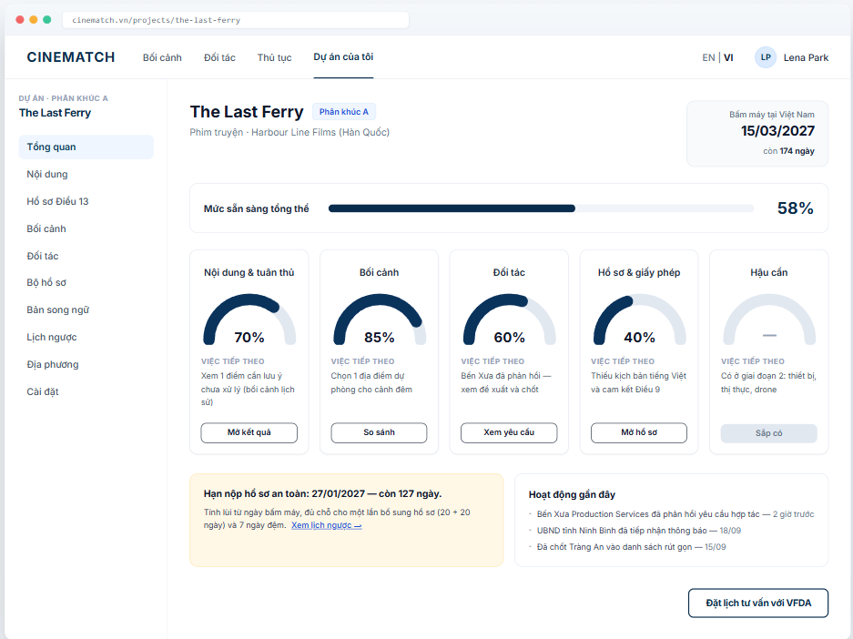

# Screen Spec: SC-12 Readiness dashboard (5 gauges)

> DBIZ3 Session 4 template — one file per screen. The Screen ID is kept from the DBIZ2 Screen List.
> The mockup image stays an image; everything around it is text.
> **Each orange numbered badge on the mockup is the row with the same number in section 3 (Element inventory).**

| Field | Value |
|---|---|
| Screen ID | `SC-12` |
| Screen name | Readiness dashboard (5 gauges) |
| Actor | Member |
| Priority | Must |
| Belongs to module | `docs/spec/spec-M0.md` |
| Mockup image | `img/SC-12.png` |
| Status | Draft |

*Route:* `/projects/[id]` · *Screen list file:* M0, item #5 (Tier 1 — Must) · *Design note from the screen list file:* The central screen; every module writes data here.

## 1. Purpose

**Shown when:** A member opens a project from `SC-10`, has just created a project, or returns from any screen within the project.

**The user leaves this screen when:** The member clicks a gauge button, the deadline strip, an activity item, or an item in the project sidebar.

## 2. Mockup

> The image is the visual contract (layout, grouping, hierarchy); the tables below are the behavioural contract.
> All data in the mockup is sample data for one fictional project (*The Last Ferry*, Harbour Line Films); organisation names, people and phone numbers are examples, not real records.

## 3. Element inventory

| # | Element | Type | Content / data source | Required | Validation |
|---|---|---|---|---|---|
| 1 | Navigation bar | Header | static | — | — |
| 2 | Project sidebar | List | static: 10 items; *Overview* selected | — | — |
| 3 | Project name + segment + organisation | Header | `projects.name`, `projects.segment`, `organizations_producer.name` | Yes | — |
| 4 | First shooting day + countdown | Text | `projects.shooting_start_date` | No | none → *not set* and a *Set date* button |
| 5 | Overall readiness | Text + bar | `v_project_readiness.overall_score` | Yes | 0–100, integer |
| 6 | Gauges (5) | Chart (gauge) | `v_project_readiness.<group>_score` | Yes | number of gauges shown depends on the segment — see SR |
| 7 | *Next step* sentence | Text | `F-M0-07` — rule-generated, no language model | Yes | always present; when done, shows *Complete* |
| 8 | Gauge action button | Button | static; target per gauge | — | — |
| 9 | *Logistics* gauge (not yet available) | Chart (gauge) | static | — | shows `—`, not 0% |
| 10 | Safe submission deadline strip | Text | `F-M5-08` — safe submission date and days remaining | No | hidden when there is no first shooting day or for segment C |
| 11 | Recent activity | List | project `activity_log`, 3 latest items | No | — |
| 12 | *Book a consultation with VFDA* button | Button | static | — | — |

## 4. States

| State | What the user sees | Trigger |
|---|---|---|
| Default | Project name, countdown, overall bar, 5 gauges with next steps, deadline strip, recent activity. | Open a project with data |
| Empty (no data) | Newly created project: all gauges at 0%, the first gauge's next step is *Start with a content pre-check*; activity shows *No activity yet*; the deadline strip is replaced by *Set a first shooting day to calculate the deadline*. | Project just created |
| Loading | Project name appears immediately; grey skeletons for the overall bar and the 5 gauges. | Loading the score view |
| Error | Scores can't be calculated: each gauge shows `—` with the line *Couldn't calculate readiness. Your project data is safe.* plus *Try again*. **Never show a fake 0%.** | View error / timeout |
| Success / confirmation | Returning after completing a task on another screen: the corresponding gauge rises with a short animation, green strip *Readiness updated*. | Score changes |

## 5. Interactions and navigation

| # | Element | User action | System response | Goes to screen |
|---|---|---|---|---|
| 1 | *Content & compliance* gauge / button | tap | — | SC-48 |
| 2 | *Locations* gauge / button | tap | — | SC-17 |
| 3 | *Partners* gauge / button | tap | — | SC-25 |
| 4 | *Dossier & permits* gauge / button | tap | — | SC-27 |
| 5 | *Logistics* gauge | tap | Not clickable; caption *Phase 2* | stays |
| 6 | Deadline strip | tap | — | SC-29 |
| 7 | Activity item | tap | Opens the related object | SC-25 / SC-32 / SC-17 |
| 8 | *Book a consultation with VFDA* button | tap | — | SC-33 |
| 9 | Sidebar item | tap | — | corresponding screen |

## 6. Screen-level rules

| Rule ID | Rule | Source |
|---|---|---|
| SR-051 | **The *Next step* sentence is the primary information**; the percentage is secondary. This sentence is never empty. | TL4 §4 |
| SR-052 | Scores are computed by the DB view `v_project_readiness`, **not in the browser** — every place shows the same number. | TL5 §M0 |
| SR-053 | Number of gauges by segment: segment C has **no** *Dossier & permits* gauge; weights are read from `segment_requirements`. | TL4 §2 |
| SR-054 | A gauge that doesn't apply shows `—`, not 0% — these are two different things. | No-guessing principle |
| SR-055 | Every module writes to the dashboard via the `readiness_changed` event; the dashboard never reads other modules' tables directly. | Screen list file — note #5 |
| SR-056 | The deadline strip uses **the same calculation function** as `SC-29`; the two screens must never show different dates. | Consistency principle |

## 7. Linked requirements

| FR ID (from the module spec) | What this screen does for it |
|---|---|
| FR-005 · spec-M0.md (F-M0-05) | Calculate the five gauge scores |
| FR-006 · spec-M0.md (F-M0-06) | Display the dashboard |
| FR-007 · spec-M0.md (F-M0-07) | Suggest the next step |
| FR-008 · spec-M0.md (F-M0-08) | Periodic readiness snapshots |
| FR-008 · spec-M5.md (F-M5-08) | Deadline from the countdown |

## 8. Responsive and accessibility notes

- Minimum supported width: **360px**.
- Narrow screens: the sidebar becomes a dropdown menu at the top of the page; the 5 gauges become a vertical list, one per row (small gauge on the left, next step on the right).
- The *Next step* sentence must never be truncated with an ellipsis.
- Each gauge has `role="meter"` with `aria-valuenow` and a full text label.

## 9. Open questions

_Open questions are tracked outside this repository until they are resolved._

## Completion checklist

- [x] The mockup is a separate cropped image file, named with the Screen ID (`img/SC-12.png`).
- [x] Every visible element in the mockup appears in the element inventory — machine-checked: badge numbers on the image = row numbers in section 3.
- [x] Every input element has a validation rule or an explicit "—".
- [x] All five states are filled in, or marked "Not applicable" with a reason.
- [x] Every navigation target is a Screen ID that exists in `docs/screen-list.md` — machine-checked.
- [x] Every element that displays data names the field it displays, matching `docs/spec/spec-M0.md` section 5.1.
- [ ] **Checked by a person:** _(not signed — a Group C member compares the image with the tables and signs here)_

---
*DBIZ3 Session 4 · Group C · CINEMATCH. Built on the DBIZ2 Screen Design (Screen List and Screen Layout).*
