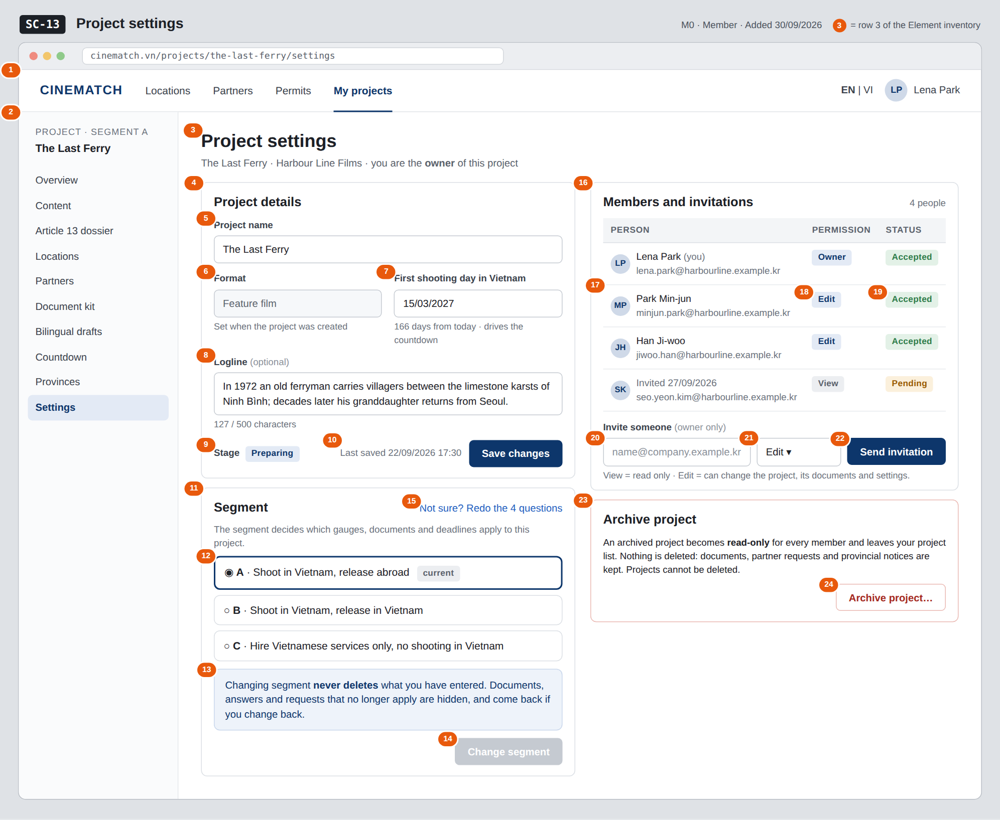

# Screen Spec: SC-13 Project settings

> DBIZ3 Session 4 template — one file per screen. The Screen ID is kept from the DBIZ2 Screen List.
> The mockup image stays an image; everything around it is text.
> **Each orange numbered badge on the mockup is the row with the same number in section 3 (Element inventory).**

| Field | Value |
|---|---|
| Screen ID | `SC-13` |
| Screen name | Project settings |
| Actor | Member (edit permission; invitations by the owner only) |
| Priority | Must |
| Belongs to module | `docs/spec/spec-M0.md` |
| Mockup image | `img/SC-13.png` |
| Status | Draft |

*Route:* `/projects/[id]/settings` · *Screen list file:* M0, item #27 (Added 30/09/2026 — Must) · *Design note from the screen list file:* Change segment, invite members.

**Notes against Screen List v2.0**

- **Screen Spec added 30/09/2026.** `SC-13` was in Screen List v2.0 but had no mockup; it now reflects M0 BR-005 (archive, never delete) and M1 BR-004 (a segment change never deletes data).

## 1. Purpose

**Shown when:** A project member clicks *Settings* in the project sidebar on any project screen (for example `SC-12` or `SC-26`).

**The user leaves this screen when:** The member goes back to another project screen through the sidebar (for example `SC-12`), redoes the segment questions on `SC-02`, or archives the project and lands on `SC-10`.

## 2. Mockup

> The image is the visual contract (layout, grouping, hierarchy); the tables below are the behavioural contract.
> All data in the mockup is sample data for one fictional project (*The Last Ferry*, Harbour Line Films); organisation names, people and phone numbers are examples, not real records.

## 3. Element inventory

| # | Element | Type | Content / data source | Required | Validation |
|---|---|---|---|---|---|
| 1 | Navigation bar | Header | static; *My projects* selected | — | — |
| 2 | Project sidebar | List | static; *Settings* selected | — | — |
| 3 | Title + project and the viewer's role | Header | `project_name`, the viewer's `permission` (owner / edit / view) | — | — |
| 4 | *Project details* card | Container | static | — | read-only for members with *view* permission and for archived projects |
| 5 | Project name | Input | `project_name` | Yes | 1–200 characters |
| 6 | Format | Text (read-only) | `format` — Feature film / Documentary / Commercial / TV programme / Music video | — | not editable here: F-M0-02 does not list `format` as an input |
| 7 | First shooting day in Vietnam | Input (date) | `shoot_date`; days remaining computed on screen for display only | No | must be after today |
| 8 | Logline | Input (multi-line) | `logline` | No | max 500 characters; live counter |
| 9 | Stage | Text | `stage` — draft / preparing / archived | — | changed to *archived* only through row 24 |
| 10 | *Save changes* button + last saved time | Button + Text | `updated_at` | — | disabled until a field changes; enabled only for *edit* permission |
| 11 | *Segment* card | Container | static | — | — |
| 12 | Segment choice A / B / C | Toggle (single choice) | current `segment`; selection becomes `new_segment` | Yes | enum A / B / C; the current value is pre-selected |
| 13 | *Nothing is deleted* note | Text | static; reflects `data_retained` (always true) | — | — |
| 14 | *Change segment* button | Button | static | — | disabled until a segment other than the current one is selected; opens a confirmation dialog |
| 15 | *Redo the 4 questions* link | Link | static | — | — |
| 16 | *Members and invitations* card | Container | project members of this project | — | — |
| 17 | Member row | List | member name and `invitee_email` | — | only members of this project (Row Level Security) |
| 18 | Permission | Text | `permission` — view / edit; the creator is shown as *Owner* | — | enum |
| 19 | Invitation status | Text | `invite_status` — pending / accepted | — | enum |
| 20 | Invitee email | Input (email) | `invitee_email` | Yes | valid email, max 254 characters; not already a member or pending invitee of this project |
| 21 | Invitee permission | Toggle (dropdown) | `permission` — View / Edit | Yes | enum; default *Edit* |
| 22 | *Send invitation* button | Button | static | — | shown to the owner only (F-M0-04); disabled until rows 20–21 are valid |
| 23 | *Archive project* card | Container | static text explaining read-only archive | — | hidden when the project is already archived |
| 24 | *Archive project…* button | Button | sets `stage` = archived after confirmation | — | *edit* permission only; confirmation dialog repeats that nothing is deleted |

## 4. States

| State | What the user sees | Trigger |
|---|---|---|
| Default | Details, segment and members for the project; the owner also sees the invite row. The mockup shows the owner's view. | Open `/projects/[id]/settings` |
| Empty (no data) | The owner is the only member: the members table shows one row and the line *Only you are on this project — invite your line producer or co-producer.* | No other members or invitations |
| Loading | Grey skeletons in the three cards; buttons disabled until the project has loaded. | Loading the project |
| Error | Invalid first shooting day: message under the field *Must be after today*. Save fails: red strip *Couldn't save — your changes are kept*. Email already invited: message under the email field. Segment change fails: the current segment stays selected and a red strip explains the change was not applied. | Validation / database write error |
| Success / confirmation | Save: green strip *Project details saved*. Invitation: new row with status *Pending* and strip *Invitation sent to …*. Segment change: strip *Segment changed to B — 3 items no longer apply and are hidden, nothing was deleted*. Archive: goes to `SC-10` with strip *The Last Ferry archived — find it under Archived*. | Save / invite / change segment / archive succeeded |

## 5. Interactions and navigation

| # | Element | User action | System response | Goes to screen |
|---|---|---|---|---|
| 1 | Project sidebar item | tap | Opens that project screen | SC-12 |
| 2 | *Save changes* button | tap | Updates the project details and `updated_at`; if another member saved in between, last write wins and a toast names who | stays |
| 3 | Segment option | tap | Selects `new_segment`; enables *Change segment* | stays |
| 4 | *Change segment* button | tap | Confirmation dialog listing what will be hidden (not deleted); on confirm sets the segment and returns the new `journey_config` | stays |
| 5 | *Redo the 4 questions* link | tap | Opens the router with this project as context | SC-02 |
| 6 | *Send invitation* button | tap | Creates a member row with `invite_status` = pending and sends the invitation email | stays |
| 7 | *Archive project…* button | tap | Confirmation dialog; on confirm sets `stage` = archived and closes the project for editing | SC-10 |

## 6. Screen-level rules

| Rule ID | Rule | Source |
|---|---|---|
| SR-271 | Only members with **edit** permission can change details, segment or stage; members with **view** permission see this screen read-only. | M0 FR-002 (F-M0-02) |
| SR-272 | Only the **owner** can invite people, with *view* or *edit* permission. | M0 FR-004 (F-M0-04) |
| SR-273 | A segment change **never deletes** documents or answers: items that no longer apply are hidden, not removed, and reappear if the segment is changed back. | M1 BR-004 |
| SR-274 | After a segment change the gauges and weights are read again from `segment_requirements`; this screen never computes scores. | M0 BR-001, M0 BR-004 |
| SR-275 | Projects are **archived, never deleted**. An archived project (`stage = archived`) is read-only for its members, leaves the project list and keeps its documents, requests and notices. There is no *Delete project* action. | M0 BR-005 |

## 7. Linked requirements

| FR ID (from the module spec) | What this screen does for it |
|---|---|
| FR-002 · spec-M0.md (F-M0-02) | Edit project details, including the first shooting day and the stage (archive) |
| FR-004 · spec-M0.md (F-M0-04) | Invite people by email with view or edit permission |
| FR-003 · spec-M1.md (F-M1-03) | Change the project's segment without deleting data |

## 8. Responsive and accessibility notes

- Minimum supported width: **360px**.
- Narrow screens: the project sidebar collapses into a menu button; the two columns stack (details, segment, members, archive).
- The members table becomes a list of cards (name, email, permission, status).
- The segment choice is a radio group with a visible label; the archive and segment confirmations are `dialog`s with a focus trap, closed with Esc.
- Permission and status labels always include text, not only colour.

## 9. Open questions

| # | Question | Blocking? | Status |
|---|---|---|---|
| 1 | [NEEDS CLARIFICATION: Can people outside the producer organisation (a lawyer, a freelance line producer) be invited to a project?] | No | Open |
| 2 | [NEEDS CLARIFICATION: can the owner change a member's permission, remove a member or cancel a pending invitation? F-M0-04 only covers inviting] | No | Open |
| 3 | [NEEDS CLARIFICATION: can an archived project be restored to *preparing*, and by whom?] | No | Open |

## Completion checklist

- [x] The mockup is a separate cropped image file, named with the Screen ID (`img/SC-13.png`).
- [x] Every visible element in the mockup appears in the element inventory — machine-checked: badge numbers on the image = row numbers in section 3.
- [x] Every input element has a validation rule or an explicit "—".
- [x] All five states are filled in, or marked "Not applicable" with a reason.
- [x] Every navigation target is a Screen ID that exists in `docs/screen-list.md` — machine-checked.
- [x] Every element that displays data names the field it displays, matching `docs/spec/spec-M0.md` section 5.1.
- [ ] **Checked by a person:** _(not signed — a Group C member compares the image with the tables and signs here)_

---
*DBIZ3 Session 4 · Group C · CINEMATCH. Built on the DBIZ2 Screen Design (Screen List and Screen Layout).*
