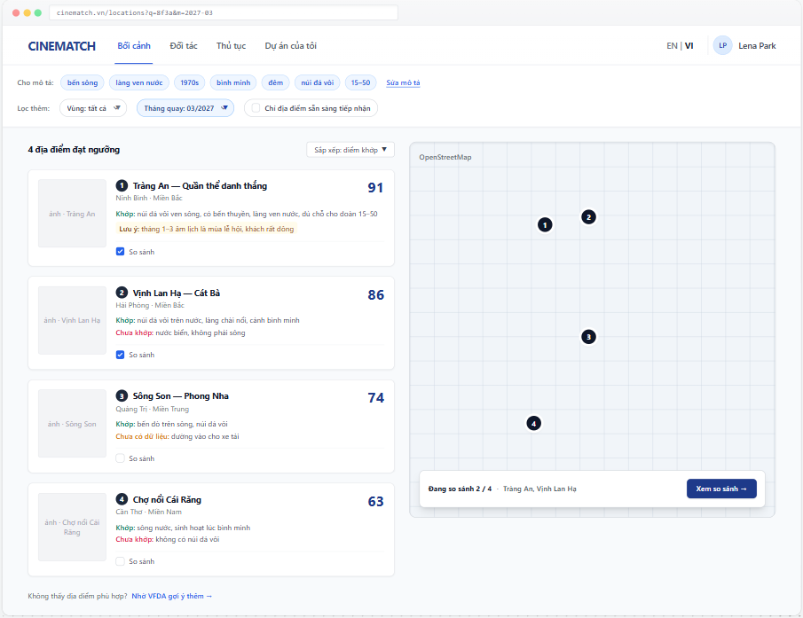

# Screen Spec: SC-14 Location suggestions (list + map)

> DBIZ3 Session 4 template — one file per screen. The Screen ID is kept from the DBIZ2 Screen List.
> The mockup image stays an image; everything around it is text.
> **Each orange numbered badge on the mockup is the row with the same number in section 3 (Element inventory).**

| Field | Value |
|---|---|
| Screen ID | `SC-14` |
| Screen name | Location suggestions (list + map) |
| Actor | Guest / Member |
| Priority | Must |
| Belongs to module | `docs/spec/spec-M3.md` |
| Mockup image | `img/SC-14.png` |
| Status | Draft |

*Route:* `/locations` · *Screen list file:* M3, item #10 (Tier 1 — Must) · *Design note from the screen list file:* Shows match score and why it matches.

**Notes against Screen List v2.0**

- `SC-14` was previously called *Location search* (filters + grid + map). It is now the **shared results** screen for two entry points: from a description (`SC-15`) or from filters. The list + map structure is unchanged.

## 1. Purpose

**Shown when:** The user clicks *Find matching locations* on `SC-15`, picks the *By filters* tab, or opens a shared results link.

**The user leaves this screen when:** The user opens a location (`SC-16`) or opens the comparison (`SC-17`).

## 2. Mockup

> The image is the visual contract (layout, grouping, hierarchy); the tables below are the behavioural contract.
> All data in the mockup is sample data for one fictional project (*The Last Ferry*, Harbour Line Films); organisation names, people and phone numbers are examples, not real records.

## 3. Element inventory

| # | Element | Type | Content / data source | Required | Validation |
|---|---|---|---|---|---|
| 1 | Navigation bar | Header | static | — | — |
| 2 | Query summary + *Edit description* | List (chip) + Link | `location_queries.attributes` | — | — |
| 3 | Additional filters | Toggle | region, shooting month, only locations open to productions | No | written to the URL (`nuqs`) |
| 4 | Result count + sort | Text + Toggle | count of results above threshold; sort by score / name / distance | — | — |
| 5 | Result card | List | `locations.name`, `provinces.name`, `provinces.region`, `locations.cover_image` | — | `published` locations only |
| 6 | Match score | Text | `F-M3-08` — 0–100 score computed in the database | — | only cards scoring ≥ 40 are shown |
| 7 | Why it matches | Text | generated from the matched criteria — not written by a language model | **Yes** | at least one reason; no reason, no card |
| 8 | Not a match / notes | Text | unmatched criteria, missing data, seasonal warnings for the shooting month | No | *No data yet* is distinct from *Not a match* |
| 9 | Compare checkbox | Toggle (checkbox) | session comparison basket | — | max 4 |
| 10 | Map | Map | Leaflet + OpenStreetMap; coordinates `locations.geom` | — | — |
| 11 | Numbered pin | Map marker | one pin per card, **same number as the card** | — | pin number = card number |
| 12 | Comparison tray | Container | comparison basket | — | hidden when the basket is empty |
| 13 | *Ask VFDA for more suggestions* link | Link | static | — | — |

## 4. States

| State | What the user sees | Trigger |
|---|---|---|
| Default | Query summary, additional filters, numbered card list on the left, map with matching numbered pins on the right, comparison tray. | Results ≥ 40 points |
| Empty (no data) | No card ≥ 40 points: show the 3 closest locations under the heading *No locations reach the threshold — here are the 3 closest*, each card stating the unmatched criteria; *Ask VFDA for suggestions* button. Never a blank page. | 0 results above threshold |
| Loading | Grey placeholders the size of the cards; the map keeps the old pins until new data arrives. | Scoring |
| Error | *Couldn't load results. Your description and filters have been kept.* + *Try again*. | Query error |
| Success / confirmation | Ticking *Compare* → tray updates to *Comparing n / 4*. Ticking a 5th: *Maximum 4 locations — remove one to add another*. | Added to basket |

## 5. Interactions and navigation

| # | Element | User action | System response | Goes to screen |
|---|---|---|---|---|
| 1 | *Edit description* | tap | Carries the current query | SC-15 |
| 2 | Additional filters | tap | Re-scores immediately, no Search button; written to the URL | stays |
| 3 | Result card | tap | — | SC-16 |
| 4 | Map pin | tap | Scrolls to and highlights the card with the same number | stays |
| 5 | *Compare* checkbox | tap | Adds to / removes from the basket | stays |
| 6 | *View comparison* | tap | — | SC-17 |
| 7 | *Ask VFDA for more suggestions* | tap | Books a session, attaching the query | SC-33 |

## 6. Screen-level rules

| Rule ID | Rule | Source |
|---|---|---|
| SR-101 | Every card **must** show a match score **and** why it matches; reasons are generated from criteria, not written by a language model. | Screen list file — note #10; anti-black-box |
| SR-102 | Three kinds of information are kept apart: *Matches* / *Not a match* / *No data yet*. Missing data is **never** counted as a match or a mismatch. | No-guessing principle |
| SR-103 | Map pins carry the **same number** as the cards — users can link a card to its location without hovering. | Fixes old mockup: unnumbered pins |
| SR-104 | Display threshold is 40 points; below it, switch to a guided empty state. | TL5 §M3 |
| SR-105 | Seasonal warnings are computed from the **project's shooting month**, not shown generically. | TL5 §M3 |
| SR-106 | Province names follow the list of **34 units after the 2025 reorganisation** (e.g. Phong Nha is in Quảng Trị, no longer Quảng Bình). | 2025 administrative reorganisation resolution |

## 7. Linked requirements

| FR ID (from the module spec) | What this screen does for it |
|---|---|
| FR-007 · spec-M3.md (F-M3-07) | Multi-criteria filters |
| FR-008 · spec-M3.md (F-M3-08) | Scoring and ranking |
| FR-009 · spec-M3.md (F-M3-09) | Results grid with why it matches |
| FR-014 · spec-M3.md (F-M3-14) | Map |
| FR-016 · spec-M3.md (F-M3-16) | Select up to four locations |

## 8. Responsive and accessibility notes

- Minimum supported width: **360px**.
- Narrow screens: the map becomes a *List | Map* toggle; the comparison tray sticks to the bottom of the screen.
- The match score is always a number, never colour alone.
- The card list is a full alternative to the map for non-mouse users.

## 9. Open questions

_Open questions are tracked outside this repository until they are resolved._

## Completion checklist

- [x] The mockup is a separate cropped image file, named with the Screen ID (`img/SC-14.png`).
- [x] Every visible element in the mockup appears in the element inventory — machine-checked: badge numbers on the image = row numbers in section 3.
- [x] Every input element has a validation rule or an explicit "—".
- [x] All five states are filled in, or marked "Not applicable" with a reason.
- [x] Every navigation target is a Screen ID that exists in `docs/screen-list.md` — machine-checked.
- [x] Every element that displays data names the field it displays, matching `docs/spec/spec-M3.md` section 5.1.
- [ ] **Checked by a person:** _(not signed — a Group C member compares the image with the tables and signs here)_

---
*DBIZ3 Session 4 · Group C · CINEMATCH. Built on the DBIZ2 Screen Design (Screen List and Screen Layout).*
