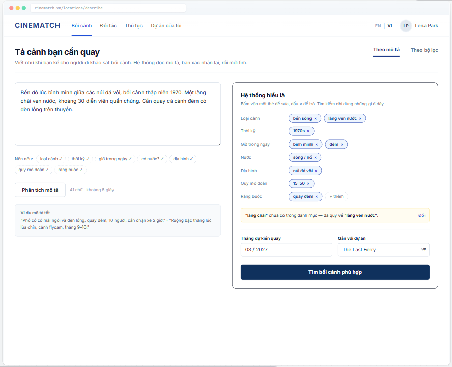

# Screen Spec: SC-15 Scene description (AI Matching input)

> DBIZ3 Session 4 template — one file per screen. The Screen ID is kept from the DBIZ2 Screen List.
> The mockup image stays an image; everything around it is text.
> **Each orange numbered badge on the mockup is the row with the same number in section 3 (Element inventory).**

| Field | Value |
|---|---|
| Screen ID | `SC-15` |
| Screen name | Scene description (AI Matching input) |
| Actor | Guest / Member |
| Priority | Must |
| Belongs to module | `docs/spec/spec-M3.md` |
| Mockup image | `img/SC-15.png` |
| Status | Draft |

*Route:* `/locations/describe` · *Screen list file:* M3, item #9 (Tier 1 — Must) · *Design note from the screen list file:* Free-text input with structure hints.

## 1. Purpose

**Shown when:** The user clicks *Where should we shoot each scene?* on `SC-01`, *Locations* in the navigation bar, or *Edit description* on `SC-14`.

**The user leaves this screen when:** The user clicks *Find matching locations* (to `SC-14`) or switches to the *By filters* tab.

## 2. Mockup

> The image is the visual contract (layout, grouping, hierarchy); the tables below are the behavioural contract.
> All data in the mockup is sample data for one fictional project (*The Last Ferry*, Harbour Line Films); organisation names, people and phone numbers are examples, not real records.

## 3. Element inventory

| # | Element | Type | Content / data source | Required | Validation |
|---|---|---|---|---|---|
| 1 | Navigation bar | Header | static | — | — |
| 2 | Title + mode switch | Header + Toggle | static: By description / By filters | — | — |
| 3 | Scene description box | Input (textarea) | `location_queries.description` | Yes | 10–1000 characters (Function List F-M3-10) |
| 4 | Structure hints (chips) | List | 7 attribute groups; a chip ticks ✓ automatically once the description covers it | — | hints only, never blocking |
| 5 | *Analyse description* button | Button | calls `F-M3-11` | — | disabled under 10 characters |
| 6 | *What the system understood* block | Container | `location_queries.attributes` (JSONB) | Yes | only values from the catalogue (`F-M3-12`) |
| 7 | Attribute tag | Toggle (edit / remove chip) | one value in `attributes` | — | accepts catalogue values only |
| 8 | Mapping warning | Text | term not in the catalogue and the value it was mapped to | — | always shown when a mapping occurs; has a *Change* button |
| 9 | Planned shooting month | Input (month/year) | `location_queries.month`; prefilled from `projects.shooting_start_date` | No | valid month, not in the past |
| 10 | Link to project | Toggle (dropdown) | `location_queries.project_id` | No | user's own projects only; hidden for guests |
| 11 | *Find matching locations* button | Button | static | — | disabled when the attribute block is empty |
| 12 | Examples of good descriptions | Text | static | — | — |

## 4. States

| State | What the user sees | Trigger |
|---|---|---|
| Default | Empty description box with examples; *What the system understood* block greyed out with the line *Analyse your description to see what the system understood*. The mockup shows the state after analysis. | Page opens |
| Empty (no data) | Analysis finished but no attributes extracted: *We couldn't understand the description — try stating the scene type and terrain* + switch to *By filters*. | Empty extraction result |
| Loading | *Analyse description* button shows a spinner; the attribute block shows 7 grey placeholder rows. | Calling `F-M3-11` |
| Error | *Couldn't analyse right now.* + *Try again* + a *Search by filters* option. The typed description is kept. | Model error / timeout |
| Success / confirmation | Attribute block filled, *Find matching locations* enabled. Clicking search → `SC-14`. | Extraction succeeded |

## 5. Interactions and navigation

| # | Element | User action | System response | Goes to screen |
|---|---|---|---|---|
| 1 | Description box | type | Ticks ✓ the matching hint chips | stays |
| 2 | *Analyse description* button | tap | Calls `F-M3-11`, validates against the `F-M3-12` catalogue | stays |
| 3 | Attribute tag | tap | Opens the list of values in the same group to change it | stays |
| 4 | × on a tag | tap | Removes the attribute from the query | stays |
| 5 | *Change* in the mapping warning | tap | Pick another catalogue value | stays |
| 6 | *By filters* tab | tap | Opens results with the filter panel | SC-14 |
| 7 | *Find matching locations* button | tap | Saves the query, runs `F-M3-08` scoring | SC-14 |

## 6. Screen-level rules

| Rule ID | Rule | Source |
|---|---|---|
| SR-091 | **Two separate steps:** the language model only *extracts attributes*; *ranking* is done by the deterministic scorer in the database. The model never proposes location names itself. | TL4 — hybrid M3 design |
| SR-092 | Users **can see and edit** every attribute before searching. The search only uses the attributes shown in the block. | Anti-black-box principle |
| SR-093 | Every attribute must come from the fixed catalogue; unknown terms are **mapped** to the nearest value and flagged clearly, never silently dropped. | F-M3-12 |
| SR-094 | Guests can use it too; the *Link to project* field is shown to members only. | TL4 §3 |

## 7. Linked requirements

| FR ID (from the module spec) | What this screen does for it |
|---|---|
| FR-010 · spec-M3.md (F-M3-10) | Scene description input |
| FR-011 · spec-M3.md (F-M3-11) | Extract structured attributes |
| FR-012 · spec-M3.md (F-M3-12) | Validate attributes against the catalogue |

## 8. Responsive and accessibility notes

- Minimum supported width: **360px**.
- Narrow screens: the *What the system understood* block moves below the description box; the *Find* button sticks to the bottom of the screen.
- Attribute tags are `<button>` elements with full labels (*Remove attribute: river landing*).
- The mapping warning is announced via `aria-live`.

## 9. Open questions

| # | Question | Blocking? | Status |
|---|---|---|---|
| 1 | [NEEDS CLARIFICATION: fixed attribute catalogue (scene type, terrain, period…) — who approves and maintains it] | Yes | Open |
| 2 | [NEEDS CLARIFICATION: do we store guest descriptions to improve the catalogue] | No | Open |

## Completion checklist

- [x] The mockup is a separate cropped image file, named with the Screen ID (`img/SC-15.png`).
- [x] Every visible element in the mockup appears in the element inventory — machine-checked: badge numbers on the image = row numbers in section 3.
- [x] Every input element has a validation rule or an explicit "—".
- [x] All five states are filled in, or marked "Not applicable" with a reason.
- [x] Every navigation target is a Screen ID that exists in `docs/screen-list.md` — machine-checked.
- [x] Every element that displays data names the field it displays, matching `docs/spec/spec-M3.md` section 5.1.
- [ ] **Checked by a person:** _(not signed — a Group C member compares the image with the tables and signs here)_

---
*DBIZ3 Session 4 · Group C · CINEMATCH. Built on the DBIZ2 Screen Design (Screen List and Screen Layout).*
