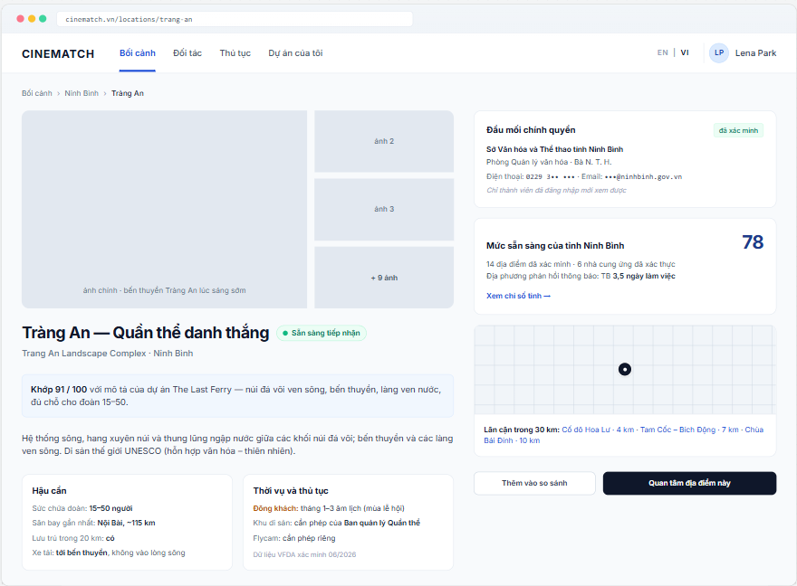

# Screen Spec: SC-16 Location detail

> DBIZ3 Session 4 template — one file per screen. The Screen ID is kept from the DBIZ2 Screen List.
> The mockup image stays an image; everything around it is text.
> **Each orange numbered badge on the mockup is the row with the same number in section 3 (Element inventory).**

| Field | Value |
|---|---|
| Screen ID | `SC-16` |
| Screen name | Location detail |
| Actor | Guest / Member |
| Priority | Must |
| Belongs to module | `docs/spec/spec-M3.md` |
| Mockup image | `img/SC-16.png` |
| Status | Draft |

*Route:* `/locations/[slug]` · *Screen list file:* M3, item #11 (Tier 1 — Must) · *Design note from the screen list file:* Location information and the province's readiness.

## 1. Purpose

**Shown when:** The user clicks a card on `SC-14`, a column on `SC-17`, a featured location on `SC-18`, or opens a shared link.

**The user leaves this screen when:** The user adds it to the comparison, clicks *I'm interested*, opens the province index, or moves to a nearby location.

## 2. Mockup

> The image is the visual contract (layout, grouping, hierarchy); the tables below are the behavioural contract.
> All data in the mockup is sample data for one fictional project (*The Last Ferry*, Harbour Line Films); organisation names, people and phone numbers are examples, not real records.

## 3. Element inventory

| # | Element | Type | Content / data source | Required | Validation |
|---|---|---|---|---|---|
| 1 | Navigation bar | Header | static | — | — |
| 2 | Breadcrumb | Text | Locations › `province.name` › `location.name_en` | — | — |
| 3 | Photo gallery | Image | `location_image.image_url (first approved)` + `location_image` (approved) | Yes | `published` photos only |
| 4 | Intake status badge | Text | `location.availability` — `open` / `survey_in_progress` / `paused`, shown as *Open* / *Scouting crew on site* / *Temporarily closed* (M3 BR-010) | Yes | updated by VFDA |
| 5 | English + Vietnamese name + province | Header | `location.name_vi`, `name_en`, `province.name` | Yes | — |
| 6 | Match score for the project | Text | `F-M3-08` for the query linked to the open project | No | shown only when arriving from search results |
| 7 | Description | Text | `location.desc_en` | Yes | — |
| 8 | *Logistics* block | List | `crew_capacity_band`, `nearest_airport_km`, `accommodation_within_20km`, `truck_access` | Yes | missing data → *no data yet* |
| 9 | *Seasons and permits* block | List | `avoid_months`, `permit_notes`, `drone_note`, `verified_at` | Yes | same as above |
| 10 | *Local authority contact* block | Container | `authority_contact` | Yes (members) | **Guests: RLS returns 0 rows, the table is not queried** |
| 11 | *Province readiness* block | Text | `v_province_readiness.readiness_index` and its 3 main components | Yes | same source as `SC-18` |
| 12 | Mini map + nearby within 30 km | Map + List | PostGIS `ST_DWithin` on `location.lat, location.lng` | No | max 5, sorted by distance |
| 13 | *Add to comparison* button | Button | static | — | disabled when the basket holds 4 |
| 14 | *I'm interested* button | Button | static | — | requires login and a project |

## 4. States

| State | What the user sees | Trigger |
|---|---|---|
| Default | The mockup shows the **member view**: the contact is shown in full. For guests, block 10 is replaced by a dashed box *Local authority contacts are visible to members only* + *Sign up free* / *Log in* buttons. | Open a published location |
| Empty (no data) | No published nearby locations: *No published locations within 30 km yet.* Province lacks index data: block 11 reads *Not enough data to calculate the province index*. | Empty query |
| Loading | Grey placeholders for photos and blocks (page is pre-rendered; only appears on in-app navigation). | Loading |
| Error | Location does not exist or is unpublished → dedicated 404 page with a button back to `SC-14`. | `status != published` |
| Success / confirmation | *I'm interested* → green banner *Saved to The Last Ferry. VFDA will notify the Ninh Bình Provincial People's Committee* + a tracking link. | Writes `F-M7-01` |

## 5. Interactions and navigation

| # | Element | User action | System response | Goes to screen |
|---|---|---|---|---|
| 1 | Thumbnail / *+ 9 photos* | tap | Swaps the main photo / opens the full-screen gallery | stays |
| 2 | Province name in breadcrumb / *View province index* | tap | — | SC-18 |
| 3 | Nearby location | tap | — | SC-16 (another location) |
| 4 | *Add to comparison* button | tap | Adds to the basket | stays |
| 5 | *I'm interested* button | tap | Not logged in → `SC-04`; logged in → pick a project, record interest, create a local notification request | SC-32 |
| 6 | *Sign up free* (guest) | tap | Remembers the page to return to | SC-04 |

## 6. Screen-level rules

| Rule ID | Rule | Source |
|---|---|---|
| SR-111 | **The contact block must not be hidden by the UI alone.** For guests, the app does not query `authority_contact`; RLS returns 0 rows. Verification: the page source in a private window shows no phone number. | Database-layer security principle |
| SR-112 | The province readiness block uses the **same view** `v_province_readiness` as `SC-18`. | Screen list file — note #11 |
| SR-113 | Every logistics and seasonal fact shows *when VFDA verified it*; if missing, show *no data yet*. | No-guessing principle |
| SR-114 | The mockup uses sample organisation names; phone numbers / emails in the image are masked — not real data. | Mockup note |

## 7. Linked requirements

| FR ID (from the module spec) | What this screen does for it |
|---|---|
| FR-013 · spec-M3.md (F-M3-13) | Location profile display |
| FR-014 · spec-M3.md (F-M3-14) | Map and nearby locations |
| FR-015 · spec-M3.md (F-M3-15) | Local authority contact block |
| FR-019 · spec-M3.md (F-M3-19) | Province index from platform data |
| FR-001 · spec-M7.md (F-M7-01) | Express interest in a location |

## 8. Responsive and accessibility notes

- Minimum supported width: **360px**.
- Narrow screens: thumbnails become a horizontal scroll strip; the right column moves below; the two buttons stick to the bottom of the screen.
- Photos have `alt` text describing the location.
- The status badge has text, not just a coloured dot.

## 9. Open questions

| # | Question | Blocking? | Status |
|---|---|---|---|
| 1 | [NEEDS CLARIFICATION: procedure for filming permits inside the Tràng An heritage area — VFDA to confirm the contact and displayed wording] | No | Open |
| 2 | [NEEDS CLARIFICATION: re-verification cycle for local authority contacts — proposed 12 months] | No | Open |

## Completion checklist

- [x] The mockup is a separate cropped image file, named with the Screen ID (`img/SC-16.png`).
- [x] Every visible element in the mockup appears in the element inventory — machine-checked: badge numbers on the image = row numbers in section 3.
- [x] Every input element has a validation rule or an explicit "—".
- [x] All five states are filled in, or marked "Not applicable" with a reason.
- [x] Every navigation target is a Screen ID that exists in `docs/screen-list.md` — machine-checked.
- [x] Every element that displays data names the field it displays, matching `docs/spec/spec-M3.md` section 5.1.
- [ ] **Checked by a person:** _(not signed — a Group C member compares the image with the tables and signs here)_

---
*DBIZ3 Session 4 · Group C · CINEMATCH. Built on the DBIZ2 Screen Design (Screen List and Screen Layout).*
