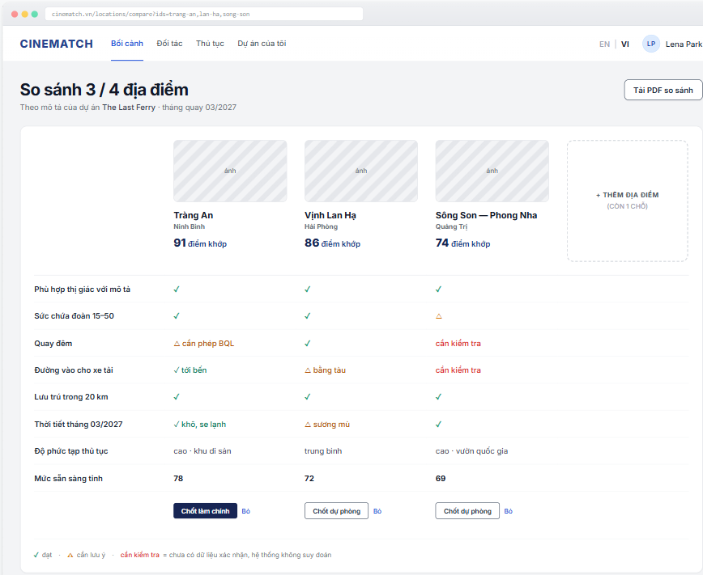

# Screen Spec: SC-17 Location comparison (up to 4)

> DBIZ3 Session 4 template — one file per screen. The Screen ID is kept from the DBIZ2 Screen List.
> The mockup image stays an image; everything around it is text.
> **Each orange numbered badge on the mockup is the row with the same number in section 3 (Element inventory).**

| Field | Value |
|---|---|
| Screen ID | `SC-17` |
| Screen name | Location comparison (up to 4) |
| Actor | Guest / Member |
| Priority | Should |
| Belongs to module | `docs/spec/spec-M3.md` |
| Mockup image | `img/SC-17.png` |
| Status | Draft |

*Route:* `/locations/compare` · *Screen list file:* Tier 2, item #18 (Tier 2 — Should) · *Design note from the screen list file:* Source M3·2.

**Notes against Screen List v2.0**

- Screen List v2.0 puts `SC-17` at **Must**; the function list places it in **Tier 2 — Should**. This spec follows the function list.

## 1. Purpose

**Shown when:** User clicks *View comparison* on `SC-14`, or the *Locations* gauge on `SC-12`.

**The user leaves this screen when:** User sets a primary / backup location, downloads the PDF, or opens a location's details.

## 2. Mockup

> The image is the visual contract (layout, grouping, hierarchy); the tables below are the behavioural contract.
> All data in the mockup is sample data for one fictional project (*The Last Ferry*, Harbour Line Films); organisation names, people and phone numbers are examples, not real records.

## 3. Element inventory

| # | Element | Type | Content / data source | Required | Validation |
|---|---|---|---|---|---|
| 1 | Navigation bar | Header | static | — | — |
| 2 | *Compare n / 4* title + context | Header | number of columns; current query and shooting month | — | — |
| 3 | Location column | List | `locations.name`, `provinces.name`, `cover_image` | — | 2–4 columns |
| 4 | Match score | Text | `F-M3-08` for the current query | — | — |
| 5 | Add-location slot | Button | static | — | hidden when 4 columns are filled |
| 6 | Criteria row | List | 8 fixed criteria | — | fixed order |
| 7 | Value cell | Text | `✓` / `△` / *to verify* + short note | **Yes** | never blank — missing data shows *to verify* |
| 8 | *Provincial readiness* row | Text | `v_province_readiness.score` | — | same source as `SC-18` |
| 9 | Symbol legend | Text | static | Yes | — |
| 10 | *Set as primary* / *Set as backup* button | Button | writes `project_shortlist.role` = primary / backup | — | at most 1 primary location per scene; login required |
| 11 | *Download comparison PDF* button | Button | generates PDF | — | login required |
| 12 | *Remove* link | Link | removes from the basket | — | — |

## 4. States

| State | What the user sees | Trigger |
|---|---|---|
| Default | Table of 8 criteria × 2–4 columns, an empty 4th slot to add one, set buttons under each column. | Basket has ≥ 2 locations |
| Empty (no data) | Basket has 0–1 locations: *You need at least two locations to compare* + button back to `SC-14`. | Basket < 2 |
| Loading | Grey skeleton in the shape of the table. | Loading |
| Error | *Couldn't load comparison data. Your basket is still saved.* + *Try again*. | Query error |
| Success / confirmation | Set → green strip *Tràng An set as primary location* and the *Locations* gauge goes up. | Writes `F-M3-18` |

## 5. Interactions and navigation

| # | Element | User action | System response | Goes to screen |
|---|---|---|---|---|
| 1 | Location name at top of column | tap | — | SC-16 |
| 2 | *+ Add location* slot | tap | Back to results to pick more | SC-14 |
| 3 | *Set as primary* / *backup* button | tap | Not logged in → `SC-04`; logged in → saved to the project | SC-12 |
| 4 | *Download comparison PDF* button | tap | Generate PDF | stays |
| 5 | *Remove* | tap | Remove column | stays |
| 6 | *Provincial readiness* row value | tap | — | SC-18 |

## 6. Screen-level rules

| Rule ID | Rule | Source |
|---|---|---|
| SR-181 | At most **4 locations**; the basket is kept for the session. | Function list — Tier 2 #18 |
| SR-182 | **Every cell is meets, caution, or to verify — never blank.** *To verify* = no data yet; the system does not guess. | No-guessing principle |
| SR-183 | Weather is based on the project's **shooting month**, not the annual average. | TL5 §M3 |
| SR-184 | Primary and **backup** are set separately — productions always need a plan B for outdoor locations. | Production practice |
| SR-185 | The table scrolls horizontally in its own frame; the criteria column is pinned. | Layout |

## 7. Linked requirements

| FR ID (from the module spec) | What this screen does for it |
|---|---|
| FR-016 · spec-M3.md (F-M3-16) | Select up to four locations |
| FR-017 · spec-M3.md (F-M3-17) | Comparison table by criteria |
| FR-018 · spec-M3.md (F-M3-18) | Add to shortlist |

## 8. Responsive and accessibility notes

- Minimum supported width: **360px**.
- Narrow screens: the table scrolls horizontally in its own frame, with the criteria column pinned on the left.
- ✓ / △ symbols always come with a text legend; the three states remain distinguishable in black-and-white print.
- The table uses `<table>` with `<th scope>`.

## 9. Open questions

| # | Question | Blocking? | Status |
|---|---|---|---|
| 1 | [NEEDS CLARIFICATION: data source for the *Night shooting* and *Weather by month* criteria — no matching field in `locations` yet] | Yes | Open |

## Completion checklist

- [x] The mockup is a separate cropped image file, named with the Screen ID (`img/SC-17.png`).
- [x] Every visible element in the mockup appears in the element inventory — machine-checked: badge numbers on the image = row numbers in section 3.
- [x] Every input element has a validation rule or an explicit "—".
- [x] All five states are filled in, or marked "Not applicable" with a reason.
- [x] Every navigation target is a Screen ID that exists in `docs/screen-list.md` — machine-checked.
- [x] Every element that displays data names the field it displays, matching `docs/spec/spec-M3.md` section 5.1.
- [ ] **Checked by a person:** _(not signed — a Group C member compares the image with the tables and signs here)_

---
*DBIZ3 Session 4 · Group C · CINEMATCH. Built on the DBIZ2 Screen Design (Screen List and Screen Layout).*
