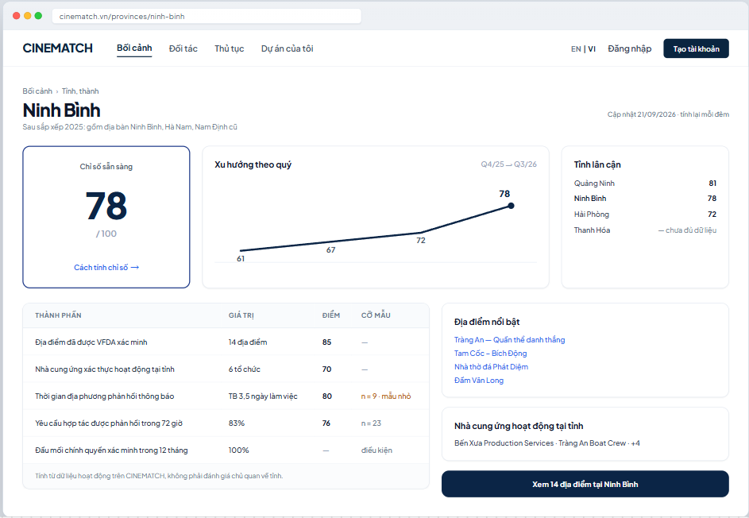

# Screen Spec: SC-18 Provincial readiness index

> DBIZ3 Session 4 template — one file per screen. The Screen ID is kept from the DBIZ2 Screen List.
> The mockup image stays an image; everything around it is text.
> **Each orange numbered badge on the mockup is the row with the same number in section 3 (Element inventory).**

| Field | Value |
|---|---|
| Screen ID | `SC-18` |
| Screen name | Provincial readiness index |
| Actor | Guest / VFDA Staff |
| Priority | Should |
| Belongs to module | `docs/spec/spec-M3.md` |
| Mockup image | `img/SC-18.png` |
| Status | Draft |

*Route:* `/provinces/[slug]` · *Screen list file:* Tier 2, item #19 (Tier 2 — Should) · *Design note from the screen list file:* Source M3·3.

**Notes against Screen List v2.0**

- Screen List v2.0 puts `SC-18` at **Must**; the function list places it in **Tier 2 — Should**. This spec follows the function list.

## 1. Purpose

**Shown when:** User clicks the *Provincial readiness* block on `SC-16`, the *Provincial readiness* row on `SC-17`, or the province name in the breadcrumb.

**The user leaves this screen when:** User views locations in the province (`SC-14` filtered), opens a location (`SC-16`) or a supplier (`SC-20`).

## 2. Mockup

> The image is the visual contract (layout, grouping, hierarchy); the tables below are the behavioural contract.
> All data in the mockup is sample data for one fictional project (*The Last Ferry*, Harbour Line Films); organisation names, people and phone numbers are examples, not real records.

## 3. Element inventory

| # | Element | Type | Content / data source | Required | Validation |
|---|---|---|---|---|---|
| 1 | Navigation bar | Header | static | — | — |
| 2 | Province name + 2025 merger note | Header | `provinces.name`, `provinces.merged_from[]` | Yes | list of 34 provinces and cities |
| 3 | Composite index | Text | `v_province_readiness.score` | Yes | 0–100; insufficient data → *—* |
| 4 | Quarterly trend | Chart (line) | `province_readiness_snapshots`, last 4 quarters | No | quarterly axis, last point emphasised |
| 5 | Components table | List | 5 components in `v_province_readiness` | Yes | each component shows raw value and score |
| 6 | Sample size / confidence | Text | number of records used in the calculation | Yes | n < 10 → *small sample* label |
| 7 | *How the index is calculated* link | Link | formula explanation page | — | — |
| 8 | Featured locations | List | province's `locations`, sorted by interest | No | max 4 |
| 9 | Suppliers active in the province | List | `organization_provinces` | No | Verified organisations only |
| 10 | Neighbouring provinces | List | `provinces.neighbors[]` + score | No | provinces lacking data show *insufficient data* |
| 11 | *View n locations in province* button | Button | static | — | — |
| 12 | Last updated line | Text | `v_province_readiness.computed_at` | Yes | — |

## 4. States

| State | What the user sees | Trigger |
|---|---|---|
| Default | Large index, trend and neighbouring provinces on the top row; components table and lists below. | Province has enough data |
| Empty (no data) | Province lacks data: index shows *—* with *Not enough data to calculate (at least 5 verified locations needed)*; the location list still shows if any. | Below data threshold |
| Loading | Grey skeleton for the index and table (page is pre-rendered, refreshed nightly). | Internal navigation |
| Error | Province doesn't exist (e.g. old name) → redirect to the new post-merger province, with the line *Quảng Nam is now part of Đà Nẵng City*. | Old / wrong slug |
| Success / confirmation | **Not applicable** — read-only screen. | — |

## 5. Interactions and navigation

| # | Element | User action | System response | Goes to screen |
|---|---|---|---|---|
| 1 | *How the index is calculated* | tap | Open the explanation page | stays |
| 2 | Featured location | tap | — | SC-16 |
| 3 | Supplier | tap | — | SC-20 |
| 4 | Neighbouring province | tap | — | SC-18 (other province) |
| 5 | *View n locations* button | tap | Open results filtered by province | SC-14 |

## 6. Screen-level rules

| Rule ID | Rule | Source |
|---|---|---|
| SR-191 | The index is **calculated only from data generated on the platform** (first-party), not a subjective rating of the province. | Team idea review — provincial index redefined |
| SR-192 | Always show the **sample size**; n < 10 gets a *small sample* label. Below the minimum threshold, no score is shown. | Data honesty principle |
| SR-193 | Formula and weights are published at *How the index is calculated*. | Anti-black-box principle |
| SR-194 | Province list follows the **34 units after the 2025 merger**; old slugs redirect to the new province. | 2025 resolution on merging administrative units |
| SR-195 | The *government contact verified in the last 12 months* component is a **condition** for having a score, not a points component. | TL5 §M3 |

## 7. Linked requirements

| FR ID (from the module spec) | What this screen does for it |
|---|---|
| FR-019 · spec-M3.md (F-M3-19) | Calculate index from platform data |
| FR-020 · spec-M3.md (F-M3-20) | Province page and navigation into search |

## 8. Responsive and accessibility notes

- Minimum supported width: **360px**.
- Narrow screens: all blocks stack vertically; the composite index sits on top.
- The trend chart has an alternative data table.
- The *small sample* label is text, not colour alone.

## 9. Open questions

_Open questions are tracked outside this repository until they are resolved._

## Completion checklist

- [x] The mockup is a separate cropped image file, named with the Screen ID (`img/SC-18.png`).
- [x] Every visible element in the mockup appears in the element inventory — machine-checked: badge numbers on the image = row numbers in section 3.
- [x] Every input element has a validation rule or an explicit "—".
- [x] All five states are filled in, or marked "Not applicable" with a reason.
- [x] Every navigation target is a Screen ID that exists in `docs/screen-list.md` — machine-checked.
- [x] Every element that displays data names the field it displays, matching `docs/spec/spec-M3.md` section 5.1.
- [ ] **Checked by a person:** _(not signed — a Group C member compares the image with the tables and signs here)_

---
*DBIZ3 Session 4 · Group C · CINEMATCH. Built on the DBIZ2 Screen Design (Screen List and Screen Layout).*
