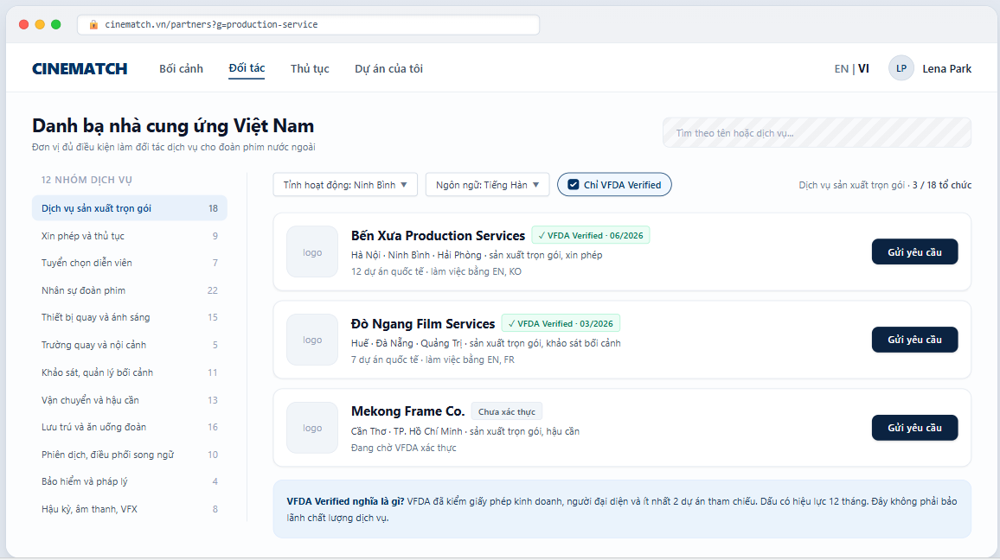

# Screen Spec: SC-19 Partner directory (12 service groups)

> DBIZ3 Session 4 template — one file per screen. The Screen ID is kept from the DBIZ2 Screen List.
> The mockup image stays an image; everything around it is text.
> **Each orange numbered badge on the mockup is the row with the same number in section 3 (Element inventory).**

| Field | Value |
|---|---|
| Screen ID | `SC-19` |
| Screen name | Partner directory (12 service groups) |
| Actor | Guest / Member |
| Priority | Must |
| Belongs to module | `docs/spec/spec-M4.md` |
| Mockup image | `img/SC-19.png` |
| Status | Draft |

*Route:* `/partners` · *Screen list file:* M4, item #12 (Tier 1 — Must) · *Design note from the screen list file:* Filters, VFDA Verified badge.

## 1. Purpose

**Shown when:** The user clicks *Partners* in the navigation bar, the *Who is the Vietnamese partner named on the contract?* item on `SC-01`, or the *Partners* gauge on `SC-12` when there are no requests yet.

**The user leaves this screen when:** The user opens an organisation profile (`SC-20`) or clicks *Send request* (`SC-23`).

## 2. Mockup

> The image is the visual contract (layout, grouping, hierarchy); the tables below are the behavioural contract.
> All data in the mockup is sample data for one fictional project (*The Last Ferry*, Harbour Line Films); organisation names, people and phone numbers are examples, not real records.

## 3. Element inventory

| # | Element | Type | Content / data source | Required | Validation |
|---|---|---|---|---|---|
| 1 | Navigation bar | Header | static | — | — |
| 2 | Title + search box | Header + Input | accent-insensitive search on `organisation.org_name`, `services` | No | max 80 characters |
| 3 | 12 service groups list | List | `organisation.service_groups` — fixed enum of 12 values, with organisation counts | Yes | groups cannot be added freely |
| 4 | Province filter | Toggle (dropdown) | `organization_provinces` — 34 provinces | No | written to the URL |
| 5 | Working language filter | Toggle (dropdown) | `organisation_member_layer.working_languages[]` | No | ISO 639-1 codes |
| 6 | *VFDA Verified only* switch | Toggle | `organisation.verified_until >= today` | No | on by default |
| 7 | Organisation card | List | `organisation.org_name`, `logo` | — | public layer |
| 8 | VFDA Verified badge + verification month | Text | `organisation.verified_at` | — | shown only while within its 12-month validity |
| 9 | Provinces and services | Text | `organization_provinces`, `organization_services` | Yes | public layer |
| 10 | International project count and languages | Text | `organisation_member_layer.intl_project_count`, `working_languages` | — | **member layer** — guests do not see this line |
| 11 | *Send request* button | Button | static | — | requires login and a project |
| 12 | *Not verified* label | Text | organisation not yet verified by VFDA | — | shown only when switch 6 is off |
| 13 | *What does VFDA Verified mean* explainer | Text | static; wording approved by VFDA | Yes | — |

## 4. States

| State | What the user sees | Trigger |
|---|---|---|
| Default | Left column with 12 groups, first group selected; filters on top; list of organisation cards; Verified explainer banner. | Page opens |
| Empty (no data) | Group/filters return no organisations: *No matching organisations in Ninh Bình yet. Try removing some filters, or ask VFDA for an introduction.* + the two corresponding buttons. | 0 results |
| Loading | The 12 groups list shows immediately (static); grey placeholders for organisation cards. | Loading |
| Error | *Couldn't load the organisation list.* + *Try again*; filters are kept. | Query error |
| Success / confirmation | No write action on this screen; sending a request happens on `SC-23`. | — |

## 5. Interactions and navigation

| # | Element | User action | System response | Goes to screen |
|---|---|---|---|---|
| 1 | A service group | tap | Re-filters, written to the URL | stays |
| 2 | Province / language filter | tap | Re-filters immediately | stays |
| 3 | *VFDA Verified only* switch | tap | Shows / hides unverified organisations | stays |
| 4 | Organisation card | tap | — | SC-20 |
| 5 | *Send request* button | tap | Not logged in → `SC-04`; logged in → compose request | SC-23 |

## 6. Screen-level rules

| Rule ID | Rule | Source |
|---|---|---|
| SR-121 | **The 12 service groups are a fixed enum** so VFDA can aggregate figures by province. The list in the mockup is a **proposal** pending VFDA's official names. | TL5 §M4 |
| SR-122 | Three information layers enforced by **RLS on three separate tables**: public (name, services, provinces, badge) / member (capabilities, project count, languages) / after acceptance (prices, past clients, contacts). | Database-layer security principle |
| SR-123 | The *VFDA Verified only* switch is **on by default**: foreign productions need an eligible entity to sign the agreement under Article 13. | Cinema Law 2022, Article 13 |
| SR-124 | The Verified badge expires after 12 months (`F-M4-11`); the explainer states clearly that it is **not a quality guarantee**. | TL5 §M4 |
| SR-125 | No open self-registration for suppliers in the early phase — VFDA invites them and enters their data. | TL4 §8 |

## 7. Linked requirements

| FR ID (from the module spec) | What this screen does for it |
|---|---|
| FR-002 · spec-M4.md (F-M4-02) | Public-level profile |
| FR-003 · spec-M4.md (F-M4-03) | Member-level profile |
| FR-005 · spec-M4.md (F-M4-05) | Browse by the twelve service groups |
| FR-006 · spec-M4.md (F-M4-06) | Filter by province and verification badge |
| FR-007 · spec-M4.md (F-M4-07) | Search |

## 8. Responsive and accessibility notes

- Minimum supported width: **360px**.
- Narrow screens: the 12 groups become a dropdown at the top of the page; filters collapse into a *Filters* button.
- The Verified badge is text, not just an icon.
- Logos have `alt` set to the organisation name.

## 9. Open questions

| # | Question | Blocking? | Status |
|---|---|---|---|
| 1 | [NEEDS CLARIFICATION: VFDA to confirm the official names of the 12 service groups (mockup uses a proposed list)] | Yes | Open |
| 2 | [NEEDS CLARIFICATION: written criteria for granting the VFDA Verified badge] | Yes | Open |

## Completion checklist

- [x] The mockup is a separate cropped image file, named with the Screen ID (`img/SC-19.png`).
- [x] Every visible element in the mockup appears in the element inventory — machine-checked: badge numbers on the image = row numbers in section 3.
- [x] Every input element has a validation rule or an explicit "—".
- [x] All five states are filled in, or marked "Not applicable" with a reason.
- [x] Every navigation target is a Screen ID that exists in `docs/screen-list.md` — machine-checked.
- [x] Every element that displays data names the field it displays, matching `docs/spec/spec-M4.md` section 5.1.
- [ ] **Checked by a person:** _(not signed — a Group C member compares the image with the tables and signs here)_

---
*DBIZ3 Session 4 · Group C · CINEMATCH. Built on the DBIZ2 Screen Design (Screen List and Screen Layout).*
