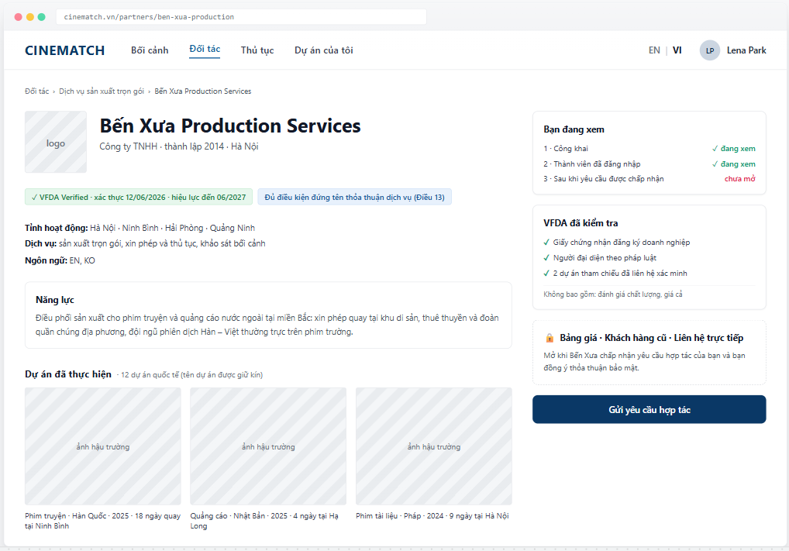

# Screen Spec: SC-20 Partner profile

> DBIZ3 Session 4 template — one file per screen. The Screen ID is kept from the DBIZ2 Screen List.
> The mockup image stays an image; everything around it is text.
> **Each orange numbered badge on the mockup is the row with the same number in section 3 (Element inventory).**

| Field | Value |
|---|---|
| Screen ID | `SC-20` |
| Screen name | Partner profile |
| Actor | Guest / Member |
| Priority | Must |
| Belongs to module | `docs/spec/spec-M4.md` |
| Mockup image | `img/SC-20.png` |
| Status | Draft |

*Route:* `/partners/[slug]` · *Screen list file:* M4, item #13 (Tier 1 — Must) · *Design note from the screen list file:* Organisation profile with three permission-based visibility layers.

**Notes against Screen List v2.0**

- In the old mockup set, the organisation profile was drawn inside the `SC-19` image. `SC-20` now has its own mockup.

## 1. Purpose

**Shown when:** The user clicks an organisation card on `SC-19`, or the partner name in a request on `SC-25`.

**The user leaves this screen when:** The user clicks *Send collaboration request* (`SC-23`) or returns to the directory.

## 2. Mockup

> The image is the visual contract (layout, grouping, hierarchy); the tables below are the behavioural contract.
> All data in the mockup is sample data for one fictional project (*The Last Ferry*, Harbour Line Films); organisation names, people and phone numbers are examples, not real records.

## 3. Element inventory

| # | Element | Type | Content / data source | Required | Validation |
|---|---|---|---|---|---|
| 1 | Navigation bar | Header | static | — | — |
| 2 | Breadcrumb | Text | Partners › service group › organisation name | — | — |
| 3 | Logo + organisation name + legal entity | Header | `organizations.name`, `legal_form`, `founded_year`, `hq_province` | Yes | public layer |
| 4 | VFDA Verified badge + validity | Text | `organizations.verified_at`, `verified_until` | — | hidden once expired |
| 5 | Provinces, services, languages | Text | `organization_provinces`, `organization_services`, `working_languages` | Yes | public layer |
| 6 | *Eligible to sign service agreements (Article 13)* badge | Text | `organizations.art13_eligible` — confirmed by VFDA | — | only VFDA can switch it on |
| 7 | *Capabilities* block | Text | `organization_profiles_member.capability` | — | **member layer** |
| 8 | Past projects (portfolio) | List + Image | `organization_portfolio` — type, country, year, days, filming place | — | **member layer**; no project titles |
| 9 | International project count | Text | `organizations.intl_project_count` | — | member layer |
| 10 | *What VFDA checked* block | List | `verification_checks` from the latest verification | Yes | also states what was **not** checked |
| 11 | Locked layer 3 block | Container | `organization_profiles_accepted` — rates, past clients, contacts | — | RLS: only unlocked with an `accepted` request and an agreed NDA |
| 12 | Three-layer indicator | List | computed from the viewer's permissions | Yes | reflects actual permissions |
| 13 | *Send collaboration request* button | Button | static | — | hidden when a request is already open — replaced by *View request* |

## 4. States

| State | What the user sees | Trigger |
|---|---|---|
| Default | The mockup shows the **member view** (layers 1 and 2 open, layer 3 locked). For guests: blocks 7, 8, 9 are replaced by a box *Log in to see capabilities and past projects*. | Open an organisation profile |
| Empty (no data) | Organisation has no portfolio: *This organisation hasn't added reference projects yet.* Empty capabilities block: hide the block, no empty box. | Missing layer 2 data |
| Loading | Grey placeholders for the capabilities and portfolio blocks; the public layer is pre-rendered. | Loading |
| Error | Organisation hidden or not found → dedicated 404 with a button back to `SC-19`. | Not found |
| Success / confirmation | Once the request is accepted and the NDA agreed: block 11 reveals rates, past clients and contacts; the layer 3 indicator switches to *✓ visible*. | Request `accepted` + NDA |

## 5. Interactions and navigation

| # | Element | User action | System response | Goes to screen |
|---|---|---|---|---|
| 1 | *Send collaboration request* button | tap | Not logged in → `SC-04`; logged in → compose request | SC-23 |
| 2 | Portfolio photo | tap | Opens a large view | stays |
| 3 | Service group in breadcrumb | tap | — | SC-19 |
| 4 | Locked layer 3 block | tap | Explains how to unlock it | stays |

## 6. Screen-level rules

| Rule ID | Rule | Source |
|---|---|---|
| SR-131 | The three information layers are enforced by **RLS on three tables**, not by hiding columns in the UI. | Database-layer security principle |
| SR-132 | The portfolio **does not name projects** at the member layer — many production contracts contain confidentiality clauses. | TL5 §M4 |
| SR-133 | The *Eligible to sign service agreements (Article 13)* badge can only be switched on by VFDA, and is decisive for segment A productions. | Cinema Law 2022, Article 13 cl.3 |
| SR-134 | The *What VFDA checked* block also states what was **not** checked (quality, pricing) to avoid it being read as a guarantee. | Accountability principle |
| SR-135 | Two-way reviews belong to phase 2 (M8) — **not** on this screen in the MVP. | MVP scope |

## 7. Linked requirements

| FR ID (from the module spec) | What this screen does for it |
|---|---|
| FR-002 · spec-M4.md (F-M4-02) | Public-level profile |
| FR-003 · spec-M4.md (F-M4-03) | Member-level profile |
| FR-004 · spec-M4.md (F-M4-04) | Accepted-level profile |
| FR-012 · spec-M4.md (F-M4-12) | Send request entry point |

## 8. Responsive and accessibility notes

- Minimum supported width: **360px**.
- Narrow screens: the right column moves below the introduction; the *Send request* button sticks to the bottom of the screen.
- The lock icon is accompanied by explanatory text.
- The three-layer indicator is a list with text statuses, not colour alone.

## 9. Open questions

_Open questions are tracked outside this repository until they are resolved._

## Completion checklist

- [x] The mockup is a separate cropped image file, named with the Screen ID (`img/SC-20.png`).
- [x] Every visible element in the mockup appears in the element inventory — machine-checked: badge numbers on the image = row numbers in section 3.
- [x] Every input element has a validation rule or an explicit "—".
- [x] All five states are filled in, or marked "Not applicable" with a reason.
- [x] Every navigation target is a Screen ID that exists in `docs/screen-list.md` — machine-checked.
- [x] Every element that displays data names the field it displays, matching `docs/spec/spec-M4.md` section 5.1.
- [ ] **Checked by a person:** _(not signed — a Group C member compares the image with the tables and signs here)_

---
*DBIZ3 Session 4 · Group C · CINEMATCH. Built on the DBIZ2 Screen Design (Screen List and Screen Layout).*
