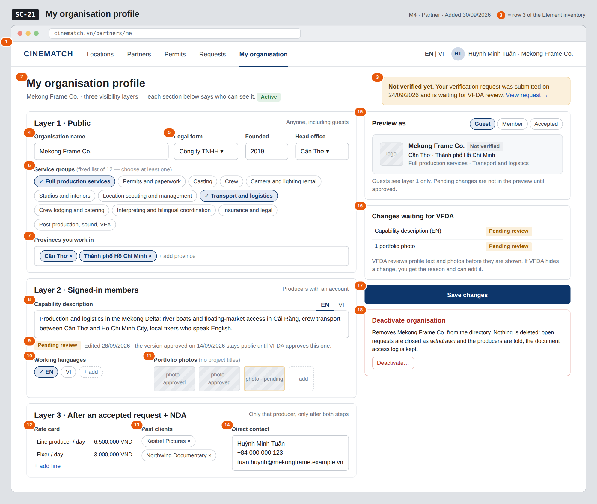

# Screen Spec: SC-21 My organisation profile

> DBIZ3 Session 4 template — one file per screen. The Screen ID is kept from the DBIZ2 Screen List.
> The mockup image stays an image; everything around it is text.
> **Each orange numbered badge on the mockup is the row with the same number in section 3 (Element inventory).**

| Field | Value |
|---|---|
| Screen ID | `SC-21` |
| Screen name | My organisation profile |
| Actor | Partner |
| Priority | Must |
| Belongs to module | `docs/spec/spec-M4.md` |
| Mockup image | `img/SC-21.png` |
| Status | Draft |

*Route:* `/partners/me` · *Screen list file:* M4, item #32 (Added 30/09/2026 — Must) · *Design note from the screen list file:* Create and edit the profile.

**Notes against Screen List v2.0**

- New Screen Spec written on 30/09/2026; SC-21 had no spec or mockup in the first set of 20.

## 1. Purpose

**Shown when:** The partner accepts VFDA's invitation and signs in for the first time, clicks *My organisation* in the navigation bar, or opens a *VFDA reviewed your profile change* notification.

**The user leaves this screen when:** The partner saves and stays, opens the verification request (`SC-22`), switches to the request inbox (`SC-25`), or deactivates the organisation.

## 2. Mockup

> The image is the visual contract (layout, grouping, hierarchy); the tables below are the behavioural contract.
> All data in the mockup is sample data for one fictional project (*The Last Ferry*, Harbour Line Films); organisation names, people and phone numbers are examples, not real records.

## 3. Element inventory

| # | Element | Type | Content / data source | Required | Validation |
|---|---|---|---|---|---|
| 1 | Navigation bar (partner) | Header | static; *My organisation* selected | — | — |
| 2 | Title + organisation status | Header + Text | `org_name`, `org_status` — active / deactivated | Yes | — |
| 3 | Verification status strip | Text + link | latest `verification_request.status` (pending / approved / rejected) and `verified_until` | — | shows the rejection reason when the last request was rejected |
| 4 | Organisation name | Input | `org_name` — layer 1 (public) | Yes | 1–200 characters |
| 5 | Legal form, founded year, head office province | Input + Toggle (dropdown) | `legal_form`, `founded_year`, `hq_province` — layer 1 | Yes | founded year 4 digits, not in the future; province from the 34-province list |
| 6 | Service groups (12) | Toggle (multi-select chips) | `service_groups` — ENUM(full_production, permits_paperwork, casting, crew, camera_lighting, studios_interiors, location_management, transport_logistics, lodging_catering, interpreting, insurance_legal, post_production)[] | Yes | at least one; only values of the fixed enum (M4 BR-002) |
| 7 | Provinces | Input (multi-select) | `province` — INTEGER[] of province IDs | Yes | at least one; IDs from the 34-province list |
| 8 | Capability description EN / VI | Input (text area, two tabs) | `capability_desc_en`, `capability_desc_vi` — layer 2 (members) | No | free text; goes to moderation when changed (M10 BR-001) |
| 9 | *Pending review* label + last approved note | Text | moderation item `content_status` = pending (content type `org_profile`) | — | shown only while a change is pending |
| 10 | Working languages | Toggle (multi-select chips) | `working_languages` — CHAR(2)[] ISO 639-1 codes | No | ISO 639-1 codes only |
| 11 | Portfolio photos | Input (image upload) + List | `portfolio` of the member layer; each photo carries its moderation status | No | JPG / PNG; no project titles in captions (member layer rule on `SC-20`) |
| 12 | Rate card | Input (table) | `rate_card` — JSONB, layer 3 | No | amount ≥ 0, currency VND |
| 13 | Past clients | Input (tags) | `past_clients` — TEXT[], layer 3 | No | — |
| 14 | Direct contact | Input (text area) | `direct_contact` — layer 3 | No | — |
| 15 | *Preview as* Guest / Member / Accepted | Toggle + Container | `public_profile`, `member_profile`, `private_profile` outputs of F-M4-02..04 | — | shows approved content only |
| 16 | *Changes waiting for VFDA* list | List | moderation items of this organisation with `content_status` | — | empty list is hidden |
| 17 | *Save changes* button | Button | static | — | disabled until something changed and fields 4–7 are valid |
| 18 | *Deactivate organisation* block | Button + Text | sets `org_status = deactivated` | — | confirmation dialog: type the organisation name |

## 4. States

| State | What the user sees | Trigger |
|---|---|---|
| Default | Three layer sections on the left, preview, pending-changes list, save button and deactivate block on the right, as in the mockup (capability text and one photo pending review). | Page opens |
| Empty (no data) | First visit after the VFDA invitation: only the organisation name entered by VFDA is filled; every other section shows a short hint of what to add, the preview shows the name only, the pending list is hidden. | New organisation |
| Loading | Grey placeholders in the three sections; *Save changes* shows *Saving…* and is disabled while a save runs. | Page load / save |
| Error | Field errors under each field (e.g. *Choose at least one service group*). Save failure: *Couldn't save — your edits are kept on this page, try again*. Upload failure on a photo: error on that thumbnail only. | Validation / write error |
| Success / confirmation | Green strip *Saved. Structured fields are live; text and photo changes are waiting for VFDA review — the last approved version stays public.* After deactivation: red banner *Mekong Frame Co. is deactivated*, all fields read-only, organisation no longer listed on `SC-19`. | Saved / deactivated |

## 5. Interactions and navigation

| # | Element | User action | System response | Goes to screen |
|---|---|---|---|---|
| 1 | *View request* in the verification strip | tap | Opens the verification request (new request if none or rejected) | SC-22 |
| 2 | Service group chip | tap | Selects / deselects the group | stays |
| 3 | *Preview as* chip | tap | Switches the preview to that layer | stays |
| 4 | *Save changes* button | tap | Saves layer fields; text and photo changes create moderation items (F-M10-01) | stays |
| 5 | *Deactivate…* button | tap | Confirmation dialog explaining BR-008; on confirm `org_status = deactivated`, open requests closed as *withdrawn*, producers notified | stays |
| 6 | *Requests* in the navigation bar | tap | Opens the request inbox | SC-25 |
| 7 | *Partners* in the navigation bar | tap | Opens the directory to see how the profile is listed | SC-19 |

## 6. Screen-level rules

| Rule ID | Rule | Source |
|---|---|---|
| SR-321 | The three layers are three tables with separate RLS policies; the form mirrors them as three sections and says who can see each. | M4 BR-001 |
| SR-322 | Service groups come only from the fixed 12-value enum; an organisation cannot add its own group. | M4 BR-002 |
| SR-323 | Profile text and photos wait in moderation; until VFDA approves, the last approved version stays public and the change shows *Pending review*. | M10 BR-001 |
| SR-324 | If VFDA hides a change, the reason is shown to the partner next to the item. | M10 BR-002 |
| SR-325 | *Deactivate organisation* never deletes: `org_status = deactivated`, open requests are closed as *withdrawn* with the producer notified, the document access log is kept. | M4 BR-008 |
| SR-326 | The Verified badge and the Article 13 eligibility flag are not editable here; only VFDA sets them (`SC-36`). | M4 BR-004 |

## 7. Linked requirements

| FR ID (from the module spec) | What this screen does for it |
|---|---|
| FR-001 · spec-M4.md (F-M4-01) | Create and edit the organisation profile across the three layers |
| FR-002 · spec-M4.md (F-M4-02) | Preview of the public layer |
| FR-003 · spec-M4.md (F-M4-03) | Preview of the member layer |
| FR-004 · spec-M4.md (F-M4-04) | Preview of the accepted layer |
| FR-001 · spec-M10.md (F-M10-01) | Text and photo changes enter the moderation queue |

## 8. Responsive and accessibility notes

- Minimum supported width: **360px**.
- Narrow screens: the right column moves below the form; the preview collapses into a *Preview* button; *Save changes* sticks to the bottom.
- Each layer section is a `<fieldset>` whose `<legend>` names the layer and who can see it.
- *Pending review* is text, not only a colour; the deactivate dialog traps focus and needs typed confirmation.

## 9. Open questions

| # | Question | Blocking? | Status |
|---|---|---|---|
| 1 | [NEEDS CLARIFICATION: Official names of the 12 service groups (the mockup uses a proposed list).] | Yes | Open |
| 2 | [NEEDS CLARIFICATION: Do changes to structured fields (service groups, provinces, rate card) also wait in moderation, or only profile text and photos?] | No | Open |

## Completion checklist

- [x] The mockup is a separate cropped image file, named with the Screen ID (`img/SC-21.png`).
- [x] Every visible element in the mockup appears in the element inventory — machine-checked: badge numbers on the image = row numbers in section 3.
- [x] Every input element has a validation rule or an explicit "—".
- [x] All five states are filled in, or marked "Not applicable" with a reason.
- [x] Every navigation target is a Screen ID that exists in `docs/screen-list.md` — machine-checked.
- [x] Every element that displays data names the field it displays, matching `docs/spec/spec-M4.md` section 5.1.
- [ ] **Checked by a person:** _(not signed — a Group C member compares the image with the tables and signs here)_

---
*DBIZ3 Session 4 · Group C · CINEMATCH. Built on the DBIZ2 Screen Design (Screen List and Screen Layout).*
