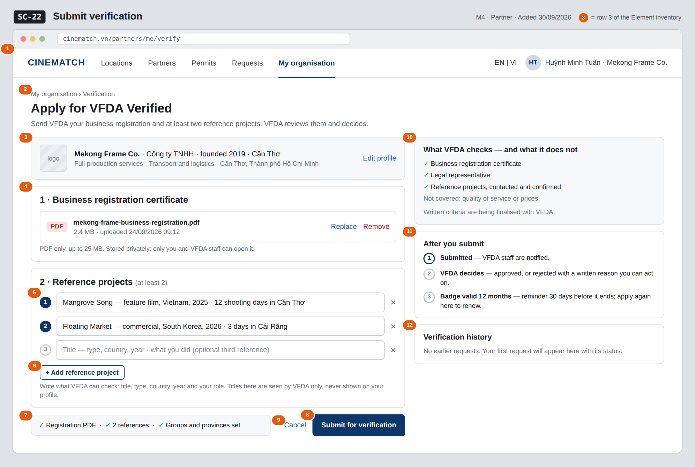

# Screen Spec: SC-22 Submit verification

> DBIZ3 Session 4 template — one file per screen. The Screen ID is kept from the DBIZ2 Screen List.
> The mockup image stays an image; everything around it is text.
> **Each orange numbered badge on the mockup is the row with the same number in section 3 (Element inventory).**

| Field | Value |
|---|---|
| Screen ID | `SC-22` |
| Screen name | Submit verification |
| Actor | Partner |
| Priority | Must |
| Belongs to module | `docs/spec/spec-M4.md` |
| Mockup image | `img/SC-22.png` |
| Status | Draft |

*Route:* `/partners/me/verify` · *Screen list file:* M4, item #33 (Added 30/09/2026 — Must) · *Design note from the screen list file:* Upload documents and reference projects.

**Notes against Screen List v2.0**

- New Screen Spec written on 30/09/2026; SC-22 had no spec or mockup in the first set of 20.

## 1. Purpose

**Shown when:** The partner clicks the verification strip on `SC-21`, opens a *your badge expires in 30 days* reminder (F-M4-11), or opens a *verification rejected* notification to apply again.

**The user leaves this screen when:** The partner submits the request (and stays on the page, now read-only with status *Pending*) or cancels back to `SC-21`.

## 2. Mockup

> The image is the visual contract (layout, grouping, hierarchy); the tables below are the behavioural contract.
> All data in the mockup is sample data for one fictional project (*The Last Ferry*, Harbour Line Films); organisation names, people and phone numbers are examples, not real records.

## 3. Element inventory

| # | Element | Type | Content / data source | Required | Validation |
|---|---|---|---|---|---|
| 1 | Navigation bar (partner) | Header | static; *My organisation* selected | — | — |
| 2 | Breadcrumb + title + purpose | Header + Text | static | — | — |
| 3 | Organisation summary | Text | `org_id` with `org_name`, `legal_form`, `founded_year`, `hq_province`, `service_groups`, `province` (read-only) | Yes | — |
| 4 | Business registration certificate | Input (file) | `business_license` — FILE, private storage | Yes | PDF only, ≤ 25 MB |
| 5 | Reference project rows | Input (list) | `reference_projects` — TEXT[] | Yes | at least 2 non-empty rows; empty rows are ignored |
| 6 | *+ Add reference project* button | Button | static | — | — |
| 7 | Submission checklist | Text | computed from fields 3–5 | — | each item turns green when met |
| 8 | *Submit for verification* button | Button | creates the request; returns `verification_request_id` | — | disabled until checklist 7 is complete or while a request is pending |
| 9 | *Cancel* link | Link | static | — | — |
| 10 | *What VFDA checks — and what it does not* block | Text | static; wording approved by VFDA | Yes | must state that quality and prices are not checked |
| 11 | *After you submit* steps | List | static | — | — |
| 12 | Verification history | List | earlier `verification_request` rows of this organisation: `status`, decision date, `reason` | — | newest first |

## 4. States

| State | What the user sees | Trigger |
|---|---|---|
| Default | Organisation summary, upload, reference rows, checklist and submit button on the left; what VFDA checks, next steps and history on the right, as in the mockup. | Page opens with no pending request |
| Empty (no data) | No file and no references yet: upload area shows *Drop the PDF here or choose a file*, two empty reference rows, checklist items grey, submit disabled; history shows *No earlier requests*. | First application |
| Loading | Upload shows a progress bar on the file row; *Submit* shows *Submitting…* and the form is locked. | Uploading / submitting |
| Error | Wrong type or over 25 MB: error on the file row stating the limit. Fewer than two references: *Add at least two reference projects*. Submit failure: *Couldn't send — nothing was submitted, try again*. | Validation / upload / write error |
| Success / confirmation | Banner *Sent to VFDA on 24/09/2026. You'll be notified of the decision.*; the form turns read-only with status *Pending*; the request appears in the history and on `SC-21`. After a rejection, the reason is shown at the top and the form opens again pre-filled. | Request created / previous request rejected |

## 5. Interactions and navigation

| # | Element | User action | System response | Goes to screen |
|---|---|---|---|---|
| 1 | Business registration file row | tap / drop | Uploads the PDF to private storage | stays |
| 2 | *+ Add reference project* | tap | Adds an empty row | stays |
| 3 | ✕ on a reference row | tap | Removes the row | stays |
| 4 | *Submit for verification* | tap | Creates the request with status `pending`; VFDA staff are notified | stays |
| 5 | *Edit profile* / *Cancel* | tap | — | SC-21 |

## 6. Screen-level rules

| Rule ID | Rule | Source |
|---|---|---|
| SR-331 | A request needs a business registration PDF (≤ 25 MB) and at least two reference projects; the submit button stays disabled until both are present. | M4 FR-008 |
| SR-332 | Only one request per organisation can be *pending* at a time; while it is pending the form is read-only. | M4 §4.3 (SEQ-07) |
| SR-333 | The block *What VFDA checks* also states what is not checked (quality, prices) so the badge is not read as a guarantee. | M4 BR-004 |
| SR-334 | The badge, once granted, is valid 12 months; the renewal reminder 30 days before expiry leads back to this screen. | M4 BR-004 |
| SR-335 | Documents are stored privately: only the organisation's partner users and VFDA staff can open them. | M4 BR-001 |

## 7. Linked requirements

| FR ID (from the module spec) | What this screen does for it |
|---|---|
| FR-008 · spec-M4.md (F-M4-08) | Submit the verification request with documents and references |
| FR-011 · spec-M4.md (F-M4-11) | Renewal entry point after the expiry reminder |

## 8. Responsive and accessibility notes

- Minimum supported width: **360px**.
- Narrow screens: the right column moves below the submit button; reference rows take full width.
- The upload area has a *Choose file* button for keyboard users; progress is announced with `aria-live`.
- Checklist items use a text tick plus the words, not colour alone.

## 9. Open questions

| # | Question | Blocking? | Status |
|---|---|---|---|
| 1 | [NEEDS CLARIFICATION: Written criteria for awarding VFDA Verified.] | Yes | Open |
| 2 | [NEEDS CLARIFICATION: Does VFDA need a named contact person for each reference project to confirm it, and may the partner share that person's details with VFDA?] | No | Open |

## Completion checklist

- [x] The mockup is a separate cropped image file, named with the Screen ID (`img/SC-22.png`).
- [x] Every visible element in the mockup appears in the element inventory — machine-checked: badge numbers on the image = row numbers in section 3.
- [x] Every input element has a validation rule or an explicit "—".
- [x] All five states are filled in, or marked "Not applicable" with a reason.
- [x] Every navigation target is a Screen ID that exists in `docs/screen-list.md` — machine-checked.
- [x] Every element that displays data names the field it displays, matching `docs/spec/spec-M4.md` section 5.1.
- [ ] **Checked by a person:** _(not signed — a Group C member compares the image with the tables and signs here)_

---
*DBIZ3 Session 4 · Group C · CINEMATCH. Built on the DBIZ2 Screen Design (Screen List and Screen Layout).*
