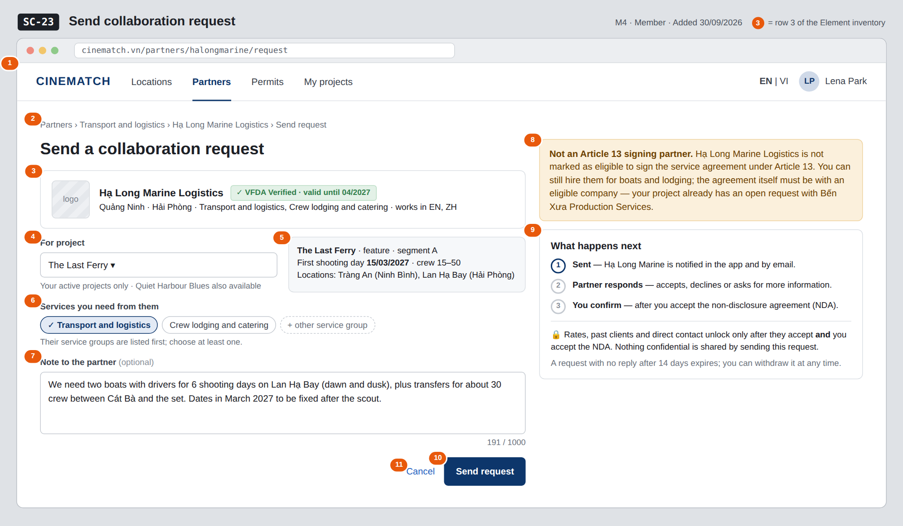

# Screen Spec: SC-23 Send collaboration request

> DBIZ3 Session 4 template — one file per screen. The Screen ID is kept from the DBIZ2 Screen List.
> The mockup image stays an image; everything around it is text.
> **Each orange numbered badge on the mockup is the row with the same number in section 3 (Element inventory).**

| Field | Value |
|---|---|
| Screen ID | `SC-23` |
| Screen name | Send collaboration request |
| Actor | Member |
| Priority | Must |
| Belongs to module | `docs/spec/spec-M4.md` |
| Mockup image | `img/SC-23.png` |
| Status | Draft |

*Route:* `/partners/[slug]/request` · *Screen list file:* M4, item #34 (Added 30/09/2026 — Must) · *Design note from the screen list file:* Choose a project and write a note.

**Notes against Screen List v2.0**

- New Screen Spec written on 30/09/2026; SC-23 had no spec or mockup in the first set of 20. It is also opened by *Propose changes* on `SC-25`.

## 1. Purpose

**Shown when:** A signed-in member clicks *Send request* on an organisation card in `SC-19`, *Send collaboration request* on `SC-20`, or *Propose changes* on `SC-25`.

**The user leaves this screen when:** The member sends the request and lands on its tracking page (`SC-25`), or cancels back to the partner profile (`SC-20`).

## 2. Mockup

> The image is the visual contract (layout, grouping, hierarchy); the tables below are the behavioural contract.
> All data in the mockup is sample data for one fictional project (*The Last Ferry*, Harbour Line Films); organisation names, people and phone numbers are examples, not real records.

## 3. Element inventory

| # | Element | Type | Content / data source | Required | Validation |
|---|---|---|---|---|---|
| 1 | Navigation bar | Header | static; *Partners* selected | — | — |
| 2 | Breadcrumb | Text | Partners › service group › organisation › Send request | — | — |
| 3 | Recipient organisation summary | Text | `org_id` → public layer: `org_name`, Verified badge (`verified_until`), provinces, `service_groups`, `working_languages` | Yes | — |
| 4 | Project selector | Toggle (dropdown) | `project_id` — the member's projects that are not archived | Yes | must be a project the member belongs to; archived projects are not listed (M0 BR-005) |
| 5 | Project summary | Text | project name, format, segment, first shooting day, crew size band, shortlisted locations (read-only) | — | — |
| 6 | Requested service groups | Toggle (multi-select chips) | `services` — ENUM[] from the 12 service groups | Yes | at least one; the organisation's own groups listed first |
| 7 | Note to the partner | Input (text area) | `note` — TEXT | No | max 1000 characters, live counter |
| 8 | Article 13 eligibility notice | Text | `art13_eligible` of the organisation + open requests of the project | — | shown only when the organisation is not eligible |
| 9 | *What happens next* block | List + Text | static: 3 steps, NDA and unlock explanation, expiry note | Yes | — |
| 10 | *Send request* button | Button | creates the request; returns `request_id`, `status` = pending | — | disabled until 4 and 6 are valid |
| 11 | *Cancel* link | Link | static | — | — |

## 4. States

| State | What the user sees | Trigger |
|---|---|---|
| Default | Recipient summary, project selector with the first active project pre-selected, services, note, and the side blocks, as in the mockup. | Page opens |
| Empty (no data) | The member has no active project: the form is replaced by *A request is tied to a project. Create a project first.* with a button to create one (`SC-11`). | 0 active projects |
| Loading | *Send request* shows *Sending…* and the form is locked; project summary shows a grey placeholder while the selected project loads. | Sending / switching project |
| Error | Duplicate: *You already have an open request with this partner for The Last Ferry* + *View request* link (`SC-25`). Note over 1000 characters: counter turns red, send disabled. Write failure: *Couldn't send — nothing was sent, try again*. | Duplicate / validation / write error |
| Success / confirmation | Redirect to the new request on `SC-25` at step 1 *Sent* with the toast *Request sent to Hạ Long Marine Logistics*; the partner gets an in-app notification and an email. | Request created |

## 5. Interactions and navigation

| # | Element | User action | System response | Goes to screen |
|---|---|---|---|---|
| 1 | Project selector | tap | Lists the member's active projects; changes the project summary | stays |
| 2 | Service group chip | tap | Selects / deselects | stays |
| 3 | *Send request* button | tap | Creates the request (`status = pending`), notifies the partner in-app and by email | SC-25 |
| 4 | *View request* in the duplicate error | tap | Opens the open request | SC-25 |
| 5 | *Cancel* / organisation name in breadcrumb | tap | — | SC-20 |
| 6 | Service group in breadcrumb | tap | — | SC-19 |
| 7 | *Create a project* (empty state) | tap | — | SC-11 |

## 6. Screen-level rules

| Rule ID | Rule | Source |
|---|---|---|
| SR-341 | Every request is tied to exactly one project of the member; guests are sent to `SC-04` first. | M4 FR-012 |
| SR-342 | Only one open request per project and partner: a second one is refused with *You already have an open request with this partner*. | M4 §3 Edge cases |
| SR-343 | Archived projects cannot send requests; they are read-only. | M0 BR-005 |
| SR-344 | Sending shares nothing confidential; the accepted layer and project documents open only after acceptance and the NDA (`SC-25`). | M4 BR-001 |
| SR-345 | A confirmed request with a non-eligible organisation does not complete Article 13 component c; the notice says so up front. | M4 BR-006 |
| SR-346 | Deactivated organisations cannot receive requests; the profile shows *No longer active* instead of this form. | M4 BR-008 |

## 7. Linked requirements

| FR ID (from the module spec) | What this screen does for it |
|---|---|
| FR-012 · spec-M4.md (F-M4-12) | Create the collaboration request with project, services and note |
| FR-015 · spec-M4.md (F-M4-15) | Notify the partner in-app and by email on sending |

## 8. Responsive and accessibility notes

- Minimum supported width: **360px**.
- Narrow screens: the side column moves below the form; *Send request* sticks to the bottom of the screen.
- The note counter is announced with `aria-live="polite"` when the limit is near.
- Service chips are real checkboxes with labels.

## 9. Open questions

| # | Question | Blocking? | Status |
|---|---|---|---|
| 1 | [NEEDS CLARIFICATION: After how many days does an unanswered request expire?] | No | Open |

## Completion checklist

- [x] The mockup is a separate cropped image file, named with the Screen ID (`img/SC-23.png`).
- [x] Every visible element in the mockup appears in the element inventory — machine-checked: badge numbers on the image = row numbers in section 3.
- [x] Every input element has a validation rule or an explicit "—".
- [x] All five states are filled in, or marked "Not applicable" with a reason.
- [x] Every navigation target is a Screen ID that exists in `docs/screen-list.md` — machine-checked.
- [x] Every element that displays data names the field it displays, matching `docs/spec/spec-M4.md` section 5.1.
- [ ] **Checked by a person:** _(not signed — a Group C member compares the image with the tables and signs here)_

---
*DBIZ3 Session 4 · Group C · CINEMATCH. Built on the DBIZ2 Screen Design (Screen List and Screen Layout).*
