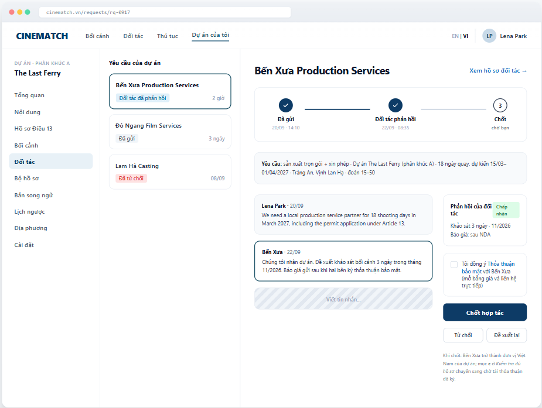

# Screen Spec: SC-25 Collaboration request + status tracking

> DBIZ3 Session 4 template — one file per screen. The Screen ID is kept from the DBIZ2 Screen List.
> The mockup image stays an image; everything around it is text.
> **Each orange numbered badge on the mockup is the row with the same number in section 3 (Element inventory).**

| Field | Value |
|---|---|
| Screen ID | `SC-25` (also covers `SC-24`) |
| Screen name | Collaboration request + status tracking |
| Actor | Member / Partner |
| Priority | Must |
| Belongs to module | `docs/spec/spec-M4.md` |
| Mockup image | `img/SC-25.png` |
| Status | Draft |

*Route:* `/requests/[id]` · *Screen list file:* M4, item #14 (Tier 1 — Must) · *Design note from the screen list file:* Statuses: Sent → Partner responded → Confirmed.

**Notes against Screen List v2.0**

- This screen uses a list–detail layout: the left column is the project's request inbox (`SC-24`), the rest is the detail of one request (`SC-25`). The mockup is filed under `SC-25`; `SC-24` has no separate image.

## 1. Purpose

**Shown when:** The member clicks the *Partners* gauge on `SC-12`, the *Partners* item in the sidebar, a *partner responded* notification, or has just sent a request on `SC-23`.

**The user leaves this screen when:** The member confirms, declines, proposes changes, or switches to another request in the left column.

## 2. Mockup

> The image is the visual contract (layout, grouping, hierarchy); the tables below are the behavioural contract.
> All data in the mockup is sample data for one fictional project (*The Last Ferry*, Harbour Line Films); organisation names, people and phone numbers are examples, not real records.

## 3. Element inventory

| # | Element | Type | Content / data source | Required | Validation |
|---|---|---|---|---|---|
| 1 | Navigation bar | Header | static | — | — |
| 2 | Project sidebar | List | static; *Partners* item selected | — | — |
| 3 | Project request list | List | `collab_requests` by `project_id` | — | sorted by most recently updated |
| 4 | Status on each request | Text | `collab_requests.status` — sent / responded / closed / declined / withdrawn | Yes | always with text |
| 5 | 3-step bar | Chart (stepper) | timestamps `sent_at`, `responded_at`, `closed_at` | Yes | exactly 3 steps: Sent → Partner responded → Confirmed |
| 6 | Request summary | Text | `collab_requests.services[]`, project, dates, locations, crew size | Yes | — |
| 7 | Message thread | List | `collab_messages` | — | shown in the author's original language |
| 8 | Partner response card | Container | `collab_requests.partner_response` — accepted / counter-proposal / declined + message | — | shown from step 2 onwards |
| 9 | NDA consent checkbox | Toggle (checkbox) | `nda_acceptances` — NDA version, timestamp | Yes (to confirm) | must be ticked to enable *Confirm partnership* |
| 10 | *Confirm partnership* button | Button | static | — | enabled only when the partner has accepted and the NDA is ticked |
| 11 | *Decline* / *Propose changes* buttons | Button | static | — | *Decline* asks for a reason (optional) |
| 12 | Message composer | Input | `collab_messages.body` | No | 1–2000 characters |
| 13 | Note on consequences of confirming | Text | static | — | always shown next to the confirm button |

## 4. States

| State | What the user sees | Trigger |
|---|---|---|
| Default | The mockup shows step 2 (*Partner responded*, accepted). At step 1: the response card is replaced by *Waiting for Bến Xưa to respond — usually within 72 hours*, confirm button hidden. | Open a request |
| Empty (no data) | The project has sent no requests: left column shows *No requests yet*; the detail area is replaced by a *Find a partner in the directory* link (`SC-19`). | 0 requests |
| Loading | Grey placeholders for the message thread; the 3-step bar shows immediately. | Loading |
| Error | Message failed to send: the message is greyed out with *Not sent — Try again*. Confirmation failed: *Couldn't confirm; the request keeps its previous status*. | Write error |
| Success / confirmation | Clicking *Confirm partnership* → step 3 fills in, green banner *Confirmed with Bến Xưa. Upload the signed service agreement to the document kit to complete item c under Article 13.* The *Partners* gauge goes to 100%. | Confirmed successfully |

## 5. Interactions and navigation

| # | Element | User action | System response | Goes to screen |
|---|---|---|---|---|
| 1 | A request in the left column | tap | Opens that request's details | SC-25 (another request) |
| 2 | *View partner profile* | tap | — | SC-20 |
| 3 | Message composer | type + Enter | Sends the message, notifies the partner (`F-M4-15`) | stays |
| 4 | *Non-disclosure agreement* link | tap | Opens the full NDA text | stays |
| 5 | *Confirm partnership* button | tap | `status = closed`, updates the gauge, updates item c on `SC-27` | stays |
| 6 | *Decline* button | tap | Asks for a reason, `status = declined` | stays |
| 7 | *Propose changes* button | tap | Opens the form to change services / dates | SC-23 |

## 6. Screen-level rules

| Rule ID | Rule | Source |
|---|---|---|
| SR-141 | Exactly **3 steps** are shown: *Sent → Partner responded → Confirmed*. Declined / withdrawn are end states, not steps. | Screen list file — note #14 |
| SR-142 | Only the **sender** (the production) can click *Confirm*; the partner only responds. Every status change notifies the other side. | TL5 §M4 |
| SR-143 | Confirming **requires** NDA consent; only after the NDA is agreed is layer 3 of the partner profile unlocked (RLS). | F-M4-17 |
| SR-144 | Confirming a partnership does **not** automatically mark Article 13 item c as *Present* — the signed agreement must still be uploaded. | No-guessing principle |
| SR-145 | Every view of an attached document is recorded in the access log (`F-M4-18`). | TL5 §M4 |

## 7. Linked requirements

| FR ID (from the module spec) | What this screen does for it |
|---|---|
| FR-013 · spec-M4.md (F-M4-13) | Request inbox |
| FR-014 · spec-M4.md (F-M4-14) | Respond to a request |
| FR-015 · spec-M4.md (F-M4-15) | Notify both sides of the outcome |
| FR-016 · spec-M4.md (F-M4-16) | Update the partner gauge |
| FR-017 · spec-M4.md (F-M4-17) | Display and accept the agreement |

## 8. Responsive and accessibility notes

- Minimum supported width: **360px**.
- Narrow screens: the list column becomes its own screen; the detail opens when a request is selected; the confirm button sticks to the bottom.
- The 3-step bar is an ordered list (`<ol>`) with `aria-current="step"`.
- The NDA consent is a real `checkbox` with a clickable label.

## 9. Open questions

| # | Question | Blocking? | Status |
|---|---|---|---|
| 1 | [NEEDS CLARIFICATION: will VFDA provide a standard NDA template, or does each partner use its own NDA] | Yes | Open |
| 2 | [NEEDS CLARIFICATION: after how many days without a response does a request expire automatically] | No | Open |

## Completion checklist

- [x] The mockup is a separate cropped image file, named with the Screen ID (`img/SC-25.png`).
- [x] Every visible element in the mockup appears in the element inventory — machine-checked: badge numbers on the image = row numbers in section 3.
- [x] Every input element has a validation rule or an explicit "—".
- [x] All five states are filled in, or marked "Not applicable" with a reason.
- [x] Every navigation target is a Screen ID that exists in `docs/screen-list.md` — machine-checked.
- [x] Every element that displays data names the field it displays, matching `docs/spec/spec-M4.md` section 5.1.
- [ ] **Checked by a person:** _(not signed — a Group C member compares the image with the tables and signs here)_

---
*DBIZ3 Session 4 · Group C · CINEMATCH. Built on the DBIZ2 Screen Design (Screen List and Screen Layout).*
