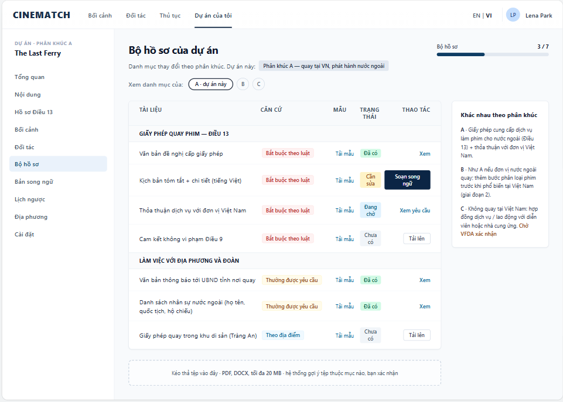

# Screen Spec: SC-26 Document kit by segment

> DBIZ3 Session 4 template — one file per screen. The Screen ID is kept from the DBIZ2 Screen List.
> The mockup image stays an image; everything around it is text.
> **Each orange numbered badge on the mockup is the row with the same number in section 3 (Element inventory).**

| Field | Value |
|---|---|
| Screen ID | `SC-26` |
| Screen name | Document kit by segment |
| Actor | Member |
| Priority | Must |
| Belongs to module | `docs/spec/spec-M5.md` |
| Mockup image | `img/SC-26.png` |
| Status | Draft |

*Route:* `/projects/[id]/dossier` · *Screen list file:* M5, item #15 (Tier 1 — Must) · *Design note from the screen list file:* Checklist changes by A/B/C.

## 1. Purpose

**Shown when:** Member clicks *Document kit* in the sidebar, *Upload* on `SC-27`, or *Continue your dossier* on the dashboard.

**The user leaves this screen when:** Member uploads documents, opens the bilingual editor (`SC-28`), or views the partnership request (`SC-25`).

## 2. Mockup

> The image is the visual contract (layout, grouping, hierarchy); the tables below are the behavioural contract.
> All data in the mockup is sample data for one fictional project (*The Last Ferry*, Harbour Line Films); organisation names, people and phone numbers are examples, not real records.

## 3. Element inventory

| # | Element | Type | Content / data source | Required | Validation |
|---|---|---|---|---|---|
| 1 | Navigation bar | Header | static | — | — |
| 2 | Project sidebar | List | static; *Document kit* selected | — | — |
| 3 | Title + project segment | Header | `projects.segment` | Yes | — |
| 4 | Switch checklist view A / B / C | Toggle | `segment_requirements` for the selected segment | — | view only; does not change the project's segment |
| 5 | Document group | Container | `document_types.group` | — | — |
| 6 | Document row | List | `document_slots` generated from `segment_requirements` + confirmed locations | Yes | — |
| 7 | Basis label | Text | `document_types.basis` — Required by law / Commonly requested / Location-specific | Yes | enum, 3 values |
| 8 | *Download template* link | Link | `document_templates` provided by VFDA | — | hidden when no template exists |
| 9 | Document status | Text | `document_slots.status` — Present / Needs fixing / Pending / Missing | Yes | same status set as `SC-27` |
| 10 | Row action | Button / Link | View / Upload / Draft bilingual / View request | — | — |
| 11 | *Differences by segment* block | Text | `segment_requirements.summary` approved by VFDA | Yes | — |
| 12 | Document kit progress | Text + bar | count of *Present* rows / total rows | Yes | — |
| 13 | Drag-and-drop upload area | Input (file) | Supabase Storage, private bucket per project | — | PDF / DOCX, ≤ 25 MB; suggests item, user confirms |

## 4. States

| State | What the user sees | Trigger |
|---|---|---|
| Default | Two document groups with basis, template, status and action; segment differences block; upload area. | Screen opens |
| Empty (no data) | New project: every row *Missing*; *Location-specific* rows not shown yet because no location is confirmed — a note reads *Added once you confirm a location*. | No documents yet |
| Loading | Grey skeleton for the table; an upload shows a progress bar on its own row. | Loading / uploading a file |
| Error | Wrong file type or over 25 MB: error right at the upload area, stating the limit. Upload fails midway: *Upload incomplete — try again*, no empty row is created. | File check failed |
| Success / confirmation | Upload done: row status changes, green strip *Added to document kit — rechecking against Article 13* and `SC-27` is re-run. | Upload succeeded |

## 5. Interactions and navigation

| # | Element | User action | System response | Goes to screen |
|---|---|---|---|---|
| 1 | Chip A / B / C | tap | View another segment's checklist (read-only) | stays |
| 2 | *Download template* | tap | Download bilingual template | stays |
| 3 | *Draft bilingual* | tap | — | SC-28 |
| 4 | *View request* | tap | — | SC-25 |
| 5 | *Upload* / drag-and-drop area | tap / drop | Upload, suggest item, user confirms | stays |
| 6 | Document kit progress | tap | — | SC-27 |

## 6. Screen-level rules

| Rule ID | Rule | Source |
|---|---|---|
| SR-151 | The checklist is **generated from the `segment_requirements` table** by segment, plus *location-specific* documents for confirmed locations — nothing hard-coded. | Function list — note #15 |
| SR-152 | Every document carries a **basis label**: *Required by law* / *Commonly requested* / *Location-specific*. Never present everything as mandatory. | Honesty principle |
| SR-153 | Status set shared with `SC-27`; the 4 Article 13 rows always match across both screens. | Consistency principle |
| SR-154 | Files are stored in a private bucket; only project members can read them; every download is logged. | Security |
| SR-155 | The suggested item for a file is only a suggestion — **the user confirms** before it is assigned. | Human-decides principle |

## 7. Linked requirements

| FR ID (from the module spec) | What this screen does for it |
|---|---|
| FR-001 · spec-M5.md (F-M5-01) | Document checklist by segment |
| FR-002 · spec-M5.md (F-M5-02) | Upload and replace documents |
| FR-003 · spec-M5.md (F-M5-03) | Per-item status |

## 8. Responsive and accessibility notes

- Minimum supported width: **360px**.
- Narrow screens: the table becomes a list of cards; the segment differences block collapses into an expandable section.
- The drag-and-drop area has a *Choose file* button for users who don't use a mouse.
- Basis and status labels always include text.

## 9. Open questions

_Open questions are tracked outside this repository until they are resolved._

## Completion checklist

- [x] The mockup is a separate cropped image file, named with the Screen ID (`img/SC-26.png`).
- [x] Every visible element in the mockup appears in the element inventory — machine-checked: badge numbers on the image = row numbers in section 3.
- [x] Every input element has a validation rule or an explicit "—".
- [x] All five states are filled in, or marked "Not applicable" with a reason.
- [x] Every navigation target is a Screen ID that exists in `docs/screen-list.md` — machine-checked.
- [x] Every element that displays data names the field it displays, matching `docs/spec/spec-M5.md` section 5.1.
- [ ] **Checked by a person:** _(not signed — a Group C member compares the image with the tables and signs here)_

---
*DBIZ3 Session 4 · Group C · CINEMATCH. Built on the DBIZ2 Screen Design (Screen List and Screen Layout).*
