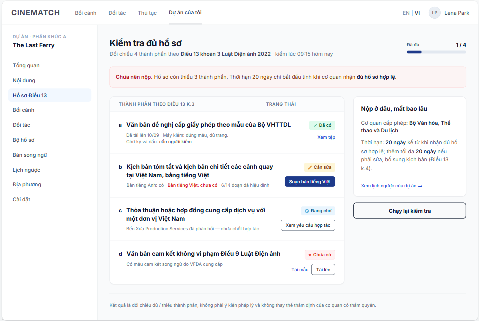

# Screen Spec: SC-27 Article 13 dossier completeness check

> DBIZ3 Session 4 template — one file per screen. The Screen ID is kept from the DBIZ2 Screen List.
> The mockup image stays an image; everything around it is text.
> **Each orange numbered badge on the mockup is the row with the same number in section 3 (Element inventory).**

| Field | Value |
|---|---|
| Screen ID | `SC-27` |
| Screen name | Article 13 dossier completeness check |
| Actor | Member |
| Priority | Must |
| Belongs to module | `docs/spec/spec-M2.md` |
| Mockup image | `img/SC-27.png` |
| Status | Draft |

*Route:* `/projects/[id]/dossier-check` · *Screen list file:* M2, item #8 (Tier 1 — Must) · *Design note from the screen list file:* Checklist with a status for each item.

**Notes against Screen List v2.0**

- In the previous Screen List, `SC-27` covered both *dossier completeness* and *content review*. Content review has moved to `SC-48`. `SC-27` now only checks the 4 components under Article 13 clause 3.

## 1. Purpose

**Shown when:** The member clicks the *Dossier & permits* gauge on `SC-12`, the *Article 13 dossier* item in the sidebar, or has just uploaded a document on `SC-26`.

**The user leaves this screen when:** The member clicks a component's action (draft the Vietnamese version, view the collaboration request, upload) or opens the countdown.

## 2. Mockup

> The image is the visual contract (layout, grouping, hierarchy); the tables below are the behavioural contract.
> All data in the mockup is sample data for one fictional project (*The Last Ferry*, Harbour Line Films); organisation names, people and phone numbers are examples, not real records.

## 3. Element inventory

| # | Element | Type | Content / data source | Required | Validation |
|---|---|---|---|---|---|
| 1 | Navigation bar | Header | static | — | — |
| 2 | Project sidebar | List | static; *Article 13 dossier* item selected | — | — |
| 3 | Title + legal basis + check time | Header + Text | static + `dossier_checks.checked_at` | Yes | — |
| 4 | Progress x / 4 | Text + bar | count of components with status *Present* | Yes | 0–4 |
| 5 | Verdict banner | Text | derived from progress: 4/4 → *All components present*; any missing → *Not ready to submit* | Yes | never use the words *passed* or *approved* |
| 6 | Component rows (a, b, c, d) | List | the project's `document_slots` of type `art13_*` | Yes | exactly 4 rows, ordered a–d as in Article 13 cl.3 |
| 7 | Status label | Text | `document_slots.status` — `present` / `needs_fix` / `pending` / `missing` | Yes | always icon plus text |
| 8 | Check details | Text | `document_slots.auto_checks` + `needs_human_review` | — | must clearly separate *auto-checked* from *needs human review* |
| 9 | Component action | Button / Link | by status: View file / Draft Vietnamese version / View collaboration request / Download template + Upload | — | — |
| 10 | *Where to submit, how long it takes* block | Text | static; wording approved by the VFDA Legal Board | Yes | quotes Article 13 cl.4 accurately |
| 11 | *Re-run check* button | Button | static | — | — |
| 12 | Disclaimer | Text | static | Yes | always shown |

## 4. States

| State | What the user sees | Trigger |
|---|---|---|
| Default | Progress, verdict banner, table of 4 components with status and action, authority & processing-time block. | Screen opens |
| Empty (no data) | No documents yet: all 4 rows at *○ Missing*, red *Not ready to submit* banner, each row offers *Download template* and *Upload*. | Project has no uploads |
| Loading | Grey placeholders for the 4 rows; title and processing-time block show immediately as they are static. | Loading status |
| Error | A file cannot be read: that row switches to *✎ Needs fixing* with the reason *File is corrupted or password-protected — upload an unlocked PDF*. Page load failure: *Couldn't load dossier status* + *Try again*. | Bad file / query error |
| Success / confirmation | 4/4 complete: banner turns green *All 4 components under Article 13 cl.3 are present. Next step: check the countdown and submit well before the deadline.* — never uses the word *passed*. | 4/4 components *Present* |

## 5. Interactions and navigation

| # | Element | User action | System response | Goes to screen |
|---|---|---|---|---|
| 1 | *View file* (row a) | tap | Opens a file preview | stays |
| 2 | *Draft Vietnamese version* (row b) | tap | — | SC-28 |
| 3 | *View collaboration request* (row c) | tap | — | SC-25 |
| 4 | *Download template* / *Upload* (row d) | tap | Downloads the bilingual template / opens the document kit upload area | SC-26 |
| 5 | *View project countdown* | tap | — | SC-29 |
| 6 | *Re-run check* button | tap | Re-runs `F-M2-08`, updates the gauge | stays |

## 6. Screen-level rules

| Rule ID | Rule | Source |
|---|---|---|
| SR-081 | Exactly **4 components** under Article 13 clause 3, kept in order a–d; nothing added, nothing merged. | Cinema Law 2022, Article 13 cl.3 |
| SR-082 | Four statuses: **Present / Needs fixing / Pending / Missing** — always icon plus text, never colour alone. | Screen list file — note #8 |
| SR-083 | Each row clearly separates *what the machine checked* from *what needs human review*. The machine must **not** declare a signature or seal valid. | No-guessing principle |
| SR-084 | The completeness check is **deterministic** (rule-based) and does not use a language model. | TL5 §M2 |
| SR-085 | Row c status is synced with the collaboration request: it only becomes *Present* once the request is **confirmed** and the agreement has been uploaded. | M4 ↔ M2 link |
| SR-086 | Row b only becomes *Present* once **all passages** of the Vietnamese version have been reviewed on `SC-28`. | M5 ↔ M2 link |

## 7. Linked requirements

| FR ID (from the module spec) | What this screen does for it |
|---|---|
| FR-008 · spec-M2.md (F-M2-08) | Check the four components under Article 13 |
| FR-009 · spec-M2.md (F-M2-09) | Show missing items |
| FR-010 · spec-M2.md (F-M2-10) | Update the compliance gauge |
| FR-003 · spec-M5.md (F-M5-03) | Per-component status |

## 8. Responsive and accessibility notes

- Minimum supported width: **360px**.
- Narrow screens: the table becomes 4 stacked cards (letter, name, status, details, button); the processing-time block moves below.
- The table uses a real `<table>`; statuses have full text for screen readers.
- The verdict banner is a `role="status"` region.

## 9. Open questions

_Open questions are tracked outside this repository until they are resolved._

## Completion checklist

- [x] The mockup is a separate cropped image file, named with the Screen ID (`img/SC-27.png`).
- [x] Every visible element in the mockup appears in the element inventory — machine-checked: badge numbers on the image = row numbers in section 3.
- [x] Every input element has a validation rule or an explicit "—".
- [x] All five states are filled in, or marked "Not applicable" with a reason.
- [x] Every navigation target is a Screen ID that exists in `docs/screen-list.md` — machine-checked.
- [x] Every element that displays data names the field it displays, matching `docs/spec/spec-M2.md` section 5.1.
- [ ] **Checked by a person:** _(not signed — a Group C member compares the image with the tables and signs here)_

---
*DBIZ3 Session 4 · Group C · CINEMATCH. Built on the DBIZ2 Screen Design (Screen List and Screen Layout).*
