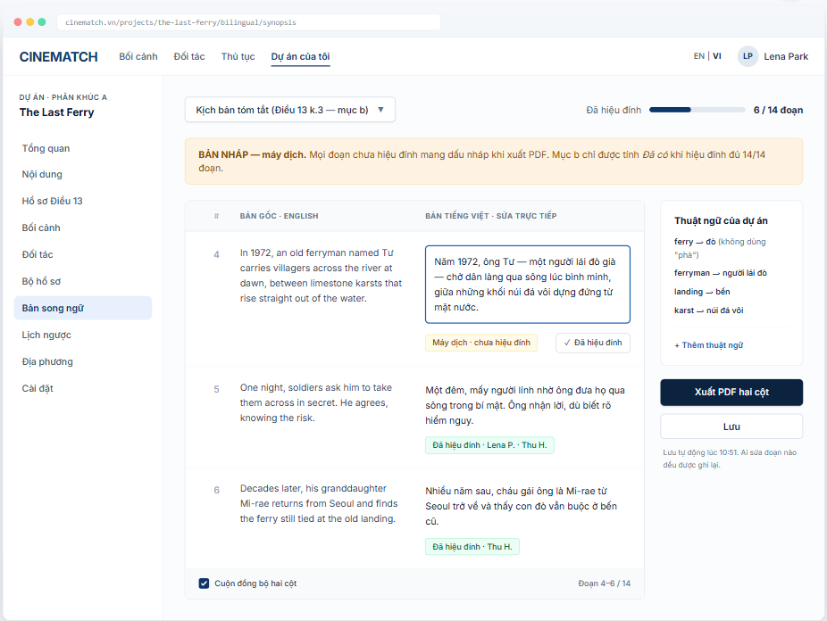

# Screen Spec: SC-28 Bilingual draft editor (Vietnamese–English)

> DBIZ3 Session 4 template — one file per screen. The Screen ID is kept from the DBIZ2 Screen List.
> The mockup image stays an image; everything around it is text.
> **Each orange numbered badge on the mockup is the row with the same number in section 3 (Element inventory).**

| Field | Value |
|---|---|
| Screen ID | `SC-28` |
| Screen name | Bilingual draft editor (Vietnamese–English) |
| Actor | Member |
| Priority | Must |
| Belongs to module | `docs/spec/spec-M5.md` |
| Mockup image | `img/SC-28.png` |
| Status | Draft |

*Route:* `/projects/[id]/bilingual/[doc]` · *Screen list file:* M5, item #16 (Tier 1 — Must) · *Design note from the screen list file:* Two-column view with editing.

## 1. Purpose

**Shown when:** Member clicks *Draft Vietnamese version* on `SC-27` or *Draft bilingual* on `SC-26`.

**The user leaves this screen when:** Member finishes proofreading and exports the PDF, or returns to the document kit.

## 2. Mockup

> The image is the visual contract (layout, grouping, hierarchy); the tables below are the behavioural contract.
> All data in the mockup is sample data for one fictional project (*The Last Ferry*, Harbour Line Films); organisation names, people and phone numbers are examples, not real records.

## 3. Element inventory

| # | Element | Type | Content / data source | Required | Validation |
|---|---|---|---|---|---|
| 1 | Navigation bar | Header | static | — | — |
| 2 | Project sidebar | List | static; *Bilingual drafts* selected | — | — |
| 3 | Document picker | Toggle (dropdown) | `bilingual_docs` — Synopsis / Full script for scenes shot in Vietnam / Application letter / Undertaking | Yes | project documents only |
| 4 | Proofreading progress | Text + bar | count of `bilingual_paragraphs.reviewed_by IS NOT NULL` | Yes | — |
| 5 | Source column | Text | `bilingual_paragraphs.source_text` | Yes | read-only |
| 6 | Vietnamese column | Input (textarea per paragraph) | `bilingual_paragraphs.target_text` | Yes | must not be empty; editing a proofread paragraph resets it to *not proofread* |
| 7 | Paragraph status | Text | `machine` / `reviewed` + proofreader's name | Yes | always has text |
| 8 | *✓ Proofread* button | Button | writes `reviewed_by`, `reviewed_at` | — | only shown on paragraphs not yet proofread |
| 9 | Project glossary | List | `project_glossary` | No | one translation per source term |
| 10 | *DRAFT* warning strip | Text | static + number of paragraphs not proofread | Yes | hidden once 100% proofread |
| 11 | *Export two-column PDF* button | Button | generated with `@react-pdf/renderer` | — | every page watermarked *DRAFT — REQUIRES PROOFREADING* (F-M5-05); unreviewed paragraphs also flagged |
| 12 | *Save* button | Button | static; autosave enabled | — | — |
| 13 | Sync scroll switch | Toggle | UI preference | — | on by default |

## 4. States

| State | What the user sees | Trigger |
|---|---|---|
| Default | Two columns aligned by paragraph: source on the left (read-only), Vietnamese on the right (editable), each paragraph with a status. | Open a document that has a source |
| Empty (no data) | No source yet: *Upload the English script to get started* + upload area. Source present but not translated: *Create Vietnamese draft* button. | No source / not translated |
| Loading | Creating the draft: paragraphs appear one by one with *Translating paragraph 4 / 14*. | Calls `F-M5-04` |
| Error | One paragraph fails to translate: it is left empty with *Could not translate — retry this paragraph*; other paragraphs remain usable. Save error: *Not saved — your text is still on screen*. | Translation error / save error |
| Success / confirmation | All 14/14 paragraphs: the warning strip is replaced by a green strip *Fully proofread. Item b has been updated in the dossier check.* | Fully proofread |

## 5. Interactions and navigation

| # | Element | User action | System response | Goes to screen |
|---|---|---|---|---|
| 1 | Document picker | tap | Open another document | stays |
| 2 | Vietnamese field | type | Autosaves after 2 seconds of inactivity; if the paragraph was proofread → back to *not proofread* | stays |
| 3 | *✓ Proofread* button | tap | Records who proofread and when | stays |
| 4 | *+ Add term* | tap | Adds to the glossary; highlights paragraphs where the term was translated differently | stays |
| 5 | *Export two-column PDF* button | tap | Download PDF | stays |
| 6 | When 14/14 paragraphs are done | — | Updates item b | SC-27 |

## 6. Screen-level rules

| Rule ID | Rule | Source |
|---|---|---|
| SR-161 | The script for scenes shot in Vietnam must have a **Vietnamese version** — this is why the screen exists. | Cinema Law 2022 (Law No. 05/2022/QH15), Article 13 cl.3 |
| SR-162 | Machine translation is **always** a *draft*. Only a person can mark a paragraph *proofread*; item b is *Present* only at 100% of paragraphs. | Human-decides principle |
| SR-163 | Editing a proofread paragraph **clears** its proofread mark. | Data integrity |
| SR-164 | Glossary terms are applied on translation and re-translation. | Terminology consistency |
| SR-165 | Every page of the exported PDF carries the watermark *DRAFT — REQUIRES PROOFREADING*; paragraphs not yet proofread are additionally flagged. CINEMATCH never produces a document presented as final. | Function List F-M5-05 |

## 7. Linked requirements

| FR ID (from the module spec) | What this screen does for it |
|---|---|
| FR-004 · spec-M5.md (F-M5-04) | Generate Vietnamese draft |
| FR-005 · spec-M5.md (F-M5-05) | Export two-column comparison PDF |
| FR-006 · spec-M5.md (F-M5-06) | Mark as proofread |

## 8. Responsive and accessibility notes

- Minimum supported width: **768px** — two-column editing needs a wide screen. Below 768px it switches to single-column mode, each paragraph showing the source above and the Vietnamese below.
- Edit fields have `lang="vi"`; the source column has `lang` set to the source language.
- Paragraph status is always spelled out in text.

## 9. Open questions

_Open questions are tracked outside this repository until they are resolved._

## Completion checklist

- [x] The mockup is a separate cropped image file, named with the Screen ID (`img/SC-28.png`).
- [x] Every visible element in the mockup appears in the element inventory — machine-checked: badge numbers on the image = row numbers in section 3.
- [x] Every input element has a validation rule or an explicit "—".
- [x] All five states are filled in, or marked "Not applicable" with a reason.
- [x] Every navigation target is a Screen ID that exists in `docs/screen-list.md` — machine-checked.
- [x] Every element that displays data names the field it displays, matching `docs/spec/spec-M5.md` section 5.1.
- [ ] **Checked by a person:** _(not signed — a Group C member compares the image with the tables and signs here)_

---
*DBIZ3 Session 4 · Group C · CINEMATCH. Built on the DBIZ2 Screen Design (Screen List and Screen Layout).*
