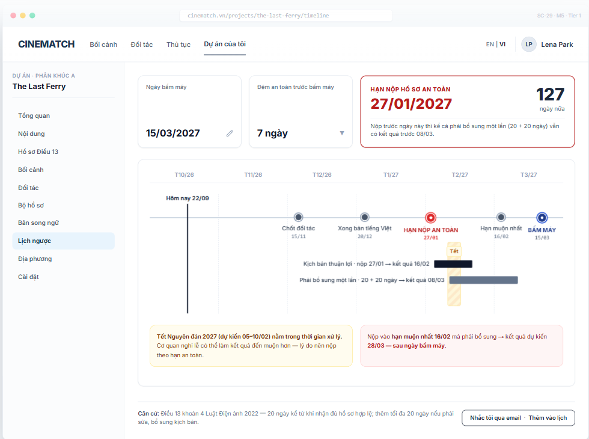

# Screen Spec: SC-29 20-day countdown

> DBIZ3 Session 4 template — one file per screen. The Screen ID is kept from the DBIZ2 Screen List.
> The mockup image stays an image; everything around it is text.
> **Each orange numbered badge on the mockup is the row with the same number in section 3 (Element inventory).**

| Field | Value |
|---|---|
| Screen ID | `SC-29` |
| Screen name | 20-day countdown |
| Actor | Member |
| Priority | Must |
| Belongs to module | `docs/spec/spec-M5.md` |
| Mockup image | `img/SC-29.png` |
| Status | Draft |

*Route:* `/projects/[id]/timeline` · *Screen list file:* M5, item #17 (Tier 1 — Must) · *Design note from the screen list file:* Timeline counting back from the shoot, emphasising the submission deadline.

## 1. Purpose

**Shown when:** Member clicks the deadline strip on `SC-12`, *Countdown* in the sidebar, or the deadline link on `SC-27`.

**The user leaves this screen when:** Member changes the first shooting day / safety buffer, turns on reminders, or moves to the document kit.

## 2. Mockup

> The image is the visual contract (layout, grouping, hierarchy); the tables below are the behavioural contract.
> All data in the mockup is sample data for one fictional project (*The Last Ferry*, Harbour Line Films); organisation names, people and phone numbers are examples, not real records.

## 3. Element inventory

| # | Element | Type | Content / data source | Required | Validation |
|---|---|---|---|---|---|
| 1 | Navigation bar | Header | static | — | — |
| 2 | Project sidebar | List | static; *Countdown* selected | — | — |
| 3 | First shooting day (editable) | Input (date) | `projects.shooting_start_date` | Yes | after today |
| 4 | Safety buffer | Toggle (dropdown) | `projects.buffer_days` — 0 / 7 / 14 / 21 | Yes | default 7 |
| 5 | *Safe submission deadline* card | Text | `F-M2-17`: first shooting day − buffer − 20 − 20; days remaining | Yes | most prominent element on screen |
| 6 | Timeline axis | Chart (timeline) | from today to after the first shooting day, monthly ticks | Yes | — |
| 7 | Milestone | Chart marker | `timeline_milestones` — partner confirmed, Vietnamese version done, safe deadline, latest deadline, first shooting day | Yes | overdue milestones turn red |
| 8 | Smooth-path bar | Chart bar | submission date → +20 days | Yes | — |
| 9 | One-resubmission bar | Chart bar | submission date → +40 days | Yes | — |
| 10 | Today line | Chart marker | current date | — | — |
| 11 | Holiday band within processing period | Chart band + Text | `public_holidays` (Lunar New Year (Tết), 30/4–1/5, 2/9…) | No | only shown when it falls in the processing window; marked *expected* until the official calendar is out |
| 12 | Article 13 cl.4 basis line | Text | static | Yes | — |
| 13 | *Remind me by email · Add to calendar* button | Button | Resend + `.ics` file | — | — |

## 4. States

| State | What the user sees | Trigger |
|---|---|---|
| Default | Three top cards (first shooting day, buffer, safe submission deadline), timeline with milestones, two path bars, Tết band, two warnings. | First shooting day set |
| Empty (no data) | No first shooting day: the axis is replaced by *Enter your first shooting day to calculate the deadline* + date field. Segment C: *Segment C projects don't need an Article 13 filming permit — no countdown*. | No date / segment C |
| Loading | **Not applicable** — calculated instantly from the first shooting day; changing the date redraws the axis immediately. | — |
| Error | First shooting day too close (safe deadline has passed): card 5 changes to *Safe submission deadline passed 12 days ago* + red warning and a *Book a VFDA consultation* button. Bad news is never hidden. | Safe deadline < today |
| Success / confirmation | Reminders on → green strip *We'll remind you 30, 14 and 3 days before 27/01/2027* and the `.ics` file downloads. | Reminders turned on |

## 5. Interactions and navigation

| # | Element | User action | System response | Goes to screen |
|---|---|---|---|---|
| 1 | First shooting day | tap | Edit date; all milestones recalculated; deadline strip on `SC-12` updated | stays |
| 2 | Safety buffer | tap | Change buffer days; recalculate | stays |
| 3 | A milestone | tap | Opens the related screen (partner confirmed → `SC-25`, Vietnamese version → `SC-28`) | SC-25 / SC-28 |
| 4 | *Remind me by email* button | tap | Creates email reminders, downloads `.ics` | stays |

## 6. Screen-level rules

| Rule ID | Rule | Source |
|---|---|---|
| SR-171 | **Safe submission deadline** = first shooting day − buffer − 20 − 20 days: room for **one resubmission** under Article 13 cl.4. This is the most emphasised figure. | Function list — note #17; Article 13 cl.4 |
| SR-172 | Always show the consequence of submitting late (e.g. *result after the first shooting day*). Never soften bad news. | Honesty principle |
| SR-173 | The **same calculation function** is used by `SC-12`, `SC-27` and this screen. | Consistency principle |
| SR-174 | Public holidays are read from the `public_holidays` table; dates without an official calendar are clearly marked *expected*. | No-guessing principle |
| SR-175 | Calculated in **calendar days** until the VFDA Legal Board confirms the method. | Interim assumption |

## 7. Linked requirements

| FR ID (from the module spec) | What this screen does for it |
|---|---|
| FR-017 · spec-M2.md (F-M2-17) | Calculate the 20-day milestone and countdown milestones |
| FR-018 · spec-M2.md (F-M2-18) | Show both paths |
| FR-007 · spec-M5.md (F-M5-07) | Enter planned shooting date |
| FR-008 · spec-M5.md (F-M5-08) | Two-path timeline |
| FR-008 · spec-SYS.md (F-SYS-08) | Deadline reminder emails |

## 8. Responsive and accessibility notes

- Minimum supported width: **360px**.
- Narrow screens: the horizontal axis becomes a vertical list of milestones; the safe submission deadline card stays on top.
- The timeline has a table alternative (milestone – date – days remaining) for screen readers.
- The safe deadline stands out through font size and border, not red alone.

## 9. Open questions

_Open questions are tracked outside this repository until they are resolved._

## Completion checklist

- [x] The mockup is a separate cropped image file, named with the Screen ID (`img/SC-29.png`).
- [x] Every visible element in the mockup appears in the element inventory — machine-checked: badge numbers on the image = row numbers in section 3.
- [x] Every input element has a validation rule or an explicit "—".
- [x] All five states are filled in, or marked "Not applicable" with a reason.
- [x] Every navigation target is a Screen ID that exists in `docs/screen-list.md` — machine-checked.
- [x] Every element that displays data names the field it displays, matching `docs/spec/spec-M5.md` section 5.1.
- [ ] **Checked by a person:** _(not signed — a Group C member compares the image with the tables and signs here)_

---
*DBIZ3 Session 4 · Group C · CINEMATCH. Built on the DBIZ2 Screen Design (Screen List and Screen Layout).*
