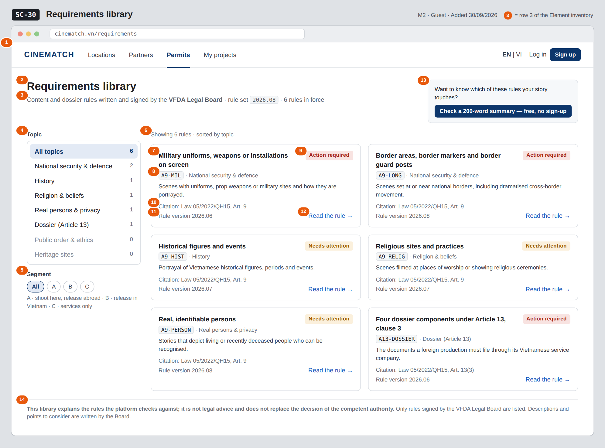

# Screen Spec: SC-30 Requirements library

> DBIZ3 Session 4 template — one file per screen. The Screen ID is kept from the DBIZ2 Screen List.
> The mockup image stays an image; everything around it is text.
> **Each orange numbered badge on the mockup is the row with the same number in section 3 (Element inventory).**

| Field | Value |
|---|---|
| Screen ID | `SC-30` |
| Screen name | Requirements library |
| Actor | Guest |
| Priority | Should |
| Belongs to module | `docs/spec/spec-M2.md` |
| Mockup image | `img/SC-30.png` |
| Status | Draft |

*Route:* `/requirements` · *Screen list file:* M2, item #28 (Added 30/09/2026 — Should) · *Design note from the screen list file:* Browse rules by topic.

**Notes against Screen List v2.0**

- **Screen Spec added 30/09/2026.** `SC-30` was in Screen List v2.0 (Should) but had no mockup. `SC-12` links to it as *View the regulations library*.

## 1. Purpose

**Shown when:** A visitor clicks *Permits* → *Requirements library* in the top navigation, *View the regulations library* on `SC-12`, or a citation link on `SC-48`.

**The user leaves this screen when:** The visitor opens one rule (`SC-31`) or starts a content pre-check (`SC-03`).

## 2. Mockup

> The image is the visual contract (layout, grouping, hierarchy); the tables below are the behavioural contract.
> All data in the mockup is sample data for one fictional project (*The Last Ferry*, Harbour Line Films); organisation names, people and phone numbers are examples, not real records.

## 3. Element inventory

| # | Element | Type | Content / data source | Required | Validation |
|---|---|---|---|---|---|
| 1 | Navigation bar | Header | static; *Permits* selected; guest view | — | — |
| 2 | Title | Header | static | — | — |
| 3 | Rule set line | Text | current `rule_version` and the number of rules in `legal_rule` (approved rules only) | — | — |
| 4 | Topic filter with counts | Toggle (single choice) | `topic` — security / history / religion / privacy / dossier / public_order / heritage, shown with readable labels; count of approved rules per topic | No | one of the 7 topic values or *All topics*; a topic with 0 rules stays visible, greyed, and shows the empty message when chosen |
| 5 | Segment filter | Toggle (single choice) | `segment` — A / B / C | No | enum A / B / C or *All* |
| 6 | Rule card list | List | `legal_rule` (`legal_rule_public[]`) — approved, active rules only | — | draft and retired rules never listed |
| 7 | Rule title | Text | `title_en` (or `title_vi` when the interface is in Vietnamese) | Yes | — |
| 8 | Rule code and topic label | Text | `rule_code`, `topic` | Yes | — |
| 9 | Severity label | Text | `severity` — notice → *Needs attention*, action → *Action required* | Yes | enum, 2 values |
| 10 | Citation | Text | `citation` | Yes | never empty for a listed rule (M2 BR-002) |
| 11 | Rule version | Text | `rule_version` in which this rule was last activated | Yes | — |
| 12 | *Read the rule* link | Link | `rule_slug` | — | — |
| 13 | Pre-check call to action | Button | static | — | — |
| 14 | Disclaimer | Text | static | — | always shown |

## 4. States

| State | What the user sees | Trigger |
|---|---|---|
| Default | All approved rules as cards, sorted by topic; topic counts on the left. | Open `/requirements` |
| Empty (no data) | A topic or segment with no approved rule: *No rules in force for this topic yet. The VFDA Legal Board adds rules as they are signed.* and a link back to *All topics*. | Filter returns 0 rules |
| Loading | Grey skeletons sized like 4 rule cards; filters stay usable. | Loading the rules |
| Error | *Couldn't load the requirements library — try again*, with a *Retry* button; no stale or cached rules are shown as current. | Query failed |
| Success / confirmation | Not applicable — read-only screen; choosing a filter simply updates the list and the page URL. | — |

## 5. Interactions and navigation

| # | Element | User action | System response | Goes to screen |
|---|---|---|---|---|
| 1 | Topic filter | tap | Filters the list by `topic`; the choice is kept in the page URL | stays |
| 2 | Segment filter | tap | Filters the list by `segment`; the choice is kept in the page URL | stays |
| 3 | Rule card / *Read the rule* | tap | Opens the rule page | SC-31 |
| 4 | *Check a 200-word summary* button | tap | Opens the content pre-check | SC-03 |

## 6. Screen-level rules

| Rule ID | Rule | Source |
|---|---|---|
| SR-281 | Only **approved rules in force** are listed; drafts and retired rules are never public. | M2 FR-015 (F-M2-15) |
| SR-282 | Every listed rule shows its citation; a rule without a citation cannot be active and therefore cannot appear. | M2 BR-002 |
| SR-283 | The words *approved*, *accepted*, *legally compliant* and *safe* are not used to describe a user's content on this screen. | M2 BR-003 |
| SR-284 | Topics use the fixed topic list of the rule base (7 values) with readable labels, so the library and the admin rule base (`SC-37`) always group rules the same way. | M2 §5.1 FR-001, FR-002 |
| SR-285 | The screen can be viewed without an account. | M2 US-5 |

## 7. Linked requirements

| FR ID (from the module spec) | What this screen does for it |
|---|---|
| FR-015 · spec-M2.md (F-M2-15) | Public library of approved rules, filterable by topic and segment |

## 8. Responsive and accessibility notes

- Minimum supported width: **360px**.
- Narrow screens: the topic list becomes a horizontal chip row above the cards; cards stack in one column.
- Filters are real buttons with `aria-pressed`; the count is read with the label (e.g. *History, 1 rule*).
- Severity labels always include text, not only colour.

## 9. Open questions

| # | Question | Blocking? | Status |
|---|---|---|---|
| 1 | [NEEDS CLARIFICATION: F-M2-15 filters by segment, but a legal rule has no segment field (M2 §6). Who decides which rules apply to segments A, B and C, and where is it stored?] | No | Open |
| 2 | [NEEDS CLARIFICATION: M2 §5.1 declares the public `topic` filter as `VARCHAR(60)` while the rule base uses the 7-value topic enum; confirm the library uses the same enum] | No | Open |

## Completion checklist

- [x] The mockup is a separate cropped image file, named with the Screen ID (`img/SC-30.png`).
- [x] Every visible element in the mockup appears in the element inventory — machine-checked: badge numbers on the image = row numbers in section 3.
- [x] Every input element has a validation rule or an explicit "—".
- [x] All five states are filled in, or marked "Not applicable" with a reason.
- [x] Every navigation target is a Screen ID that exists in `docs/screen-list.md` — machine-checked.
- [x] Every element that displays data names the field it displays, matching `docs/spec/spec-M2.md` section 5.1.
- [ ] **Checked by a person:** _(not signed — a Group C member compares the image with the tables and signs here)_

---
*DBIZ3 Session 4 · Group C · CINEMATCH. Built on the DBIZ2 Screen Design (Screen List and Screen Layout).*
