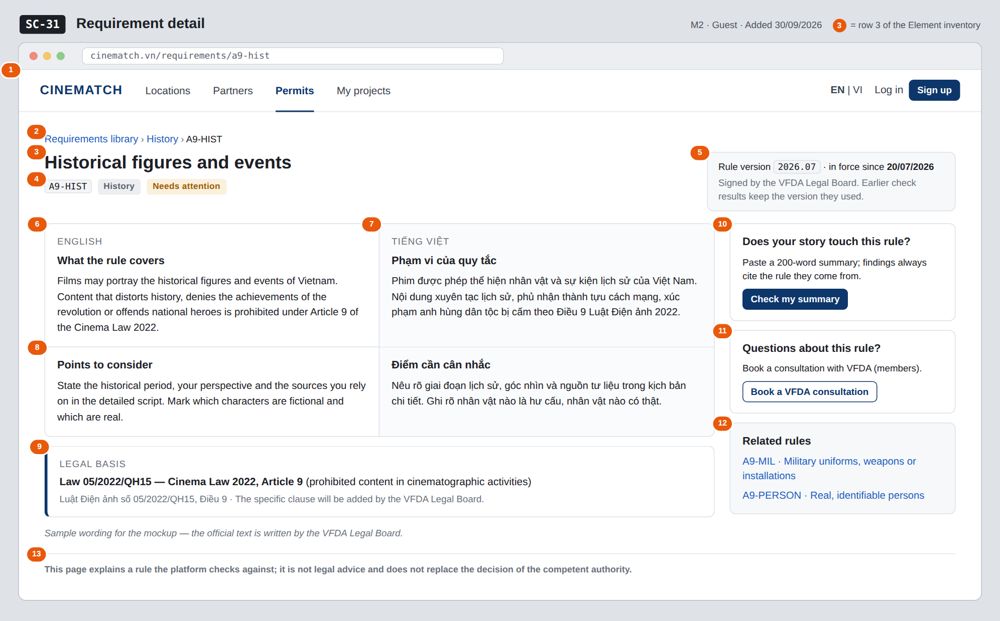

# Screen Spec: SC-31 Requirement detail

> DBIZ3 Session 4 template — one file per screen. The Screen ID is kept from the DBIZ2 Screen List.
> The mockup image stays an image; everything around it is text.
> **Each orange numbered badge on the mockup is the row with the same number in section 3 (Element inventory).**

| Field | Value |
|---|---|
| Screen ID | `SC-31` |
| Screen name | Requirement detail |
| Actor | Guest |
| Priority | Should |
| Belongs to module | `docs/spec/spec-M2.md` |
| Mockup image | `img/SC-31.png` |
| Status | Draft |

*Route:* `/requirements/[slug]` · *Screen list file:* M2, item #29 (Added 30/09/2026 — Should) · *Design note from the screen list file:* Bilingual description with citation.

**Notes against Screen List v2.0**

- **Screen Spec added 30/09/2026.** `SC-31` was in Screen List v2.0 (Should) but had no mockup.

## 1. Purpose

**Shown when:** A visitor opens a rule from `SC-30`, follows a rule code or citation from `SC-48`, or opens a shared rule link.

**The user leaves this screen when:** The visitor goes back to the library (`SC-30`), opens a related rule (`SC-31`), starts a pre-check (`SC-03`) or books a VFDA consultation (`SC-33`).

## 2. Mockup

> The image is the visual contract (layout, grouping, hierarchy); the tables below are the behavioural contract.
> All data in the mockup is sample data for one fictional project (*The Last Ferry*, Harbour Line Films); organisation names, people and phone numbers are examples, not real records.

## 3. Element inventory

| # | Element | Type | Content / data source | Required | Validation |
|---|---|---|---|---|---|
| 1 | Navigation bar | Header | static; *Permits* selected; guest view | — | — |
| 2 | Breadcrumb | Link | static + `topic` + `rule_code` | — | — |
| 3 | Rule title | Header | `title_en` / `title_vi` by interface language | Yes | — |
| 4 | Rule code, topic and severity | Text | `rule_code`, `topic`, `severity` (notice → *Needs attention*, action → *Action required*) | Yes | enum values shown with readable labels |
| 5 | Rule version box | Text | `rule_version`, `approved_at` of the version in force | Yes | — |
| 6 | Description — English | Text | `description_en` | Yes | — |
| 7 | Description — Vietnamese | Text | `description_vi` | Yes | — |
| 8 | *Points to consider* — English and Vietnamese | Text | `guidance_en`, `guidance_vi` | Yes | — |
| 9 | Legal basis (citation) | Text | `citation` | Yes | never empty (M2 BR-002) |
| 10 | *Check my summary* card | Button | static | — | — |
| 11 | *Book a VFDA consultation* card | Button | static | — | guests are asked to sign in first |
| 12 | Related rules | List | other approved rules with the same or a nearby `topic` | — | approved rules only; max 3 |
| 13 | Disclaimer | Text | static | — | always shown |

## 4. States

| State | What the user sees | Trigger |
|---|---|---|
| Default | Bilingual description and points to consider side by side, citation, version box and actions. | Open `/requirements/[slug]` |
| Empty (no data) | Unknown slug, or a rule that is a draft: *This rule does not exist or is not public* with a link to `SC-30`. A **retired** rule opened from an old link shows its last text with a grey strip *Retired on … — no longer checked* and no pre-check button. | `rule_slug` not found / not approved / retired |
| Loading | Grey skeleton for the two language columns and the citation box. | Loading the rule |
| Error | *Couldn't load this rule — try again* with *Retry*. | Query failed |
| Success / confirmation | Not applicable — read-only screen; no user action changes data here. | — |

## 5. Interactions and navigation

| # | Element | User action | System response | Goes to screen |
|---|---|---|---|---|
| 1 | Breadcrumb *Requirements library* / topic | tap | Back to the library, filtered by the topic when the topic is clicked | SC-30 |
| 2 | *Check my summary* button | tap | Opens the pre-check | SC-03 |
| 3 | *Book a VFDA consultation* button | tap | Signed in: opens booking; guest: sign in first | SC-33 |
| 4 | Related rule link | tap | Opens that rule | SC-31 |
| 5 | *EN / VI* in the navigation bar | tap | Switches the interface language; both language columns stay visible | stays |

## 6. Screen-level rules

| Rule ID | Rule | Source |
|---|---|---|
| SR-291 | One public page per approved rule, always showing **both languages** and the citation. | M2 FR-016 (F-M2-16) |
| SR-292 | A rule without a citation cannot be active, so this page never shows a rule without a legal basis. | M2 BR-002 |
| SR-293 | Retired rules are never deleted; an old link still opens and is clearly marked *Retired*. | M2 BR-008 |
| SR-294 | The version shown is the one in force; findings on `SC-48` keep the version they cited, even after the rule changes. | M2 BR-007, M2 BR-008 |
| SR-295 | Text on this page is written by the VFDA Legal Board; the system never generates or rewrites it. | M2 BR-001 |

## 7. Linked requirements

| FR ID (from the module spec) | What this screen does for it |
|---|---|
| FR-016 · spec-M2.md (F-M2-16) | Public page per rule with bilingual description and citation |

## 8. Responsive and accessibility notes

- Minimum supported width: **360px**.
- Narrow screens: English and Vietnamese stack (interface language first); the right-hand cards move below the citation.
- Each language block carries a `lang` attribute (`en` / `vi`) for screen readers.
- The citation box is a labelled region (*Legal basis*).

## 9. Open questions

| # | Question | Blocking? | Status |
|---|---|---|---|
| 1 | [NEEDS CLARIFICATION: the specific clause of Article 9 for each rule is to be filled in `legal_rule.citation` by the VFDA Legal Board; the mockup only goes to Article level] | No | Open |
| 2 | [NEEDS CLARIFICATION: should the public rule page list earlier versions of the rule and what changed between them?] | No | Open |

## Completion checklist

- [x] The mockup is a separate cropped image file, named with the Screen ID (`img/SC-31.png`).
- [x] Every visible element in the mockup appears in the element inventory — machine-checked: badge numbers on the image = row numbers in section 3.
- [x] Every input element has a validation rule or an explicit "—".
- [x] All five states are filled in, or marked "Not applicable" with a reason.
- [x] Every navigation target is a Screen ID that exists in `docs/screen-list.md` — machine-checked.
- [x] Every element that displays data names the field it displays, matching `docs/spec/spec-M2.md` section 5.1.
- [ ] **Checked by a person:** _(not signed — a Group C member compares the image with the tables and signs here)_

---
*DBIZ3 Session 4 · Group C · CINEMATCH. Built on the DBIZ2 Screen Design (Screen List and Screen Layout).*
