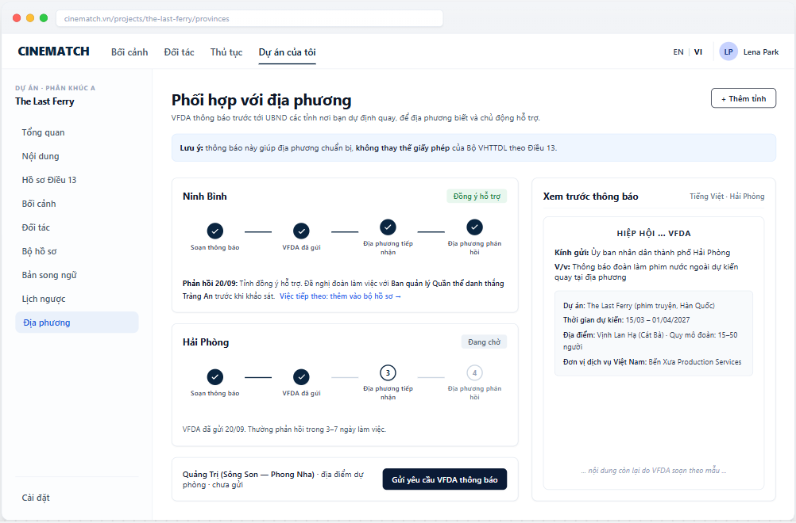

# Screen Spec: SC-32 Provincial People's Committee notice

> DBIZ3 Session 4 template — one file per screen. The Screen ID is kept from the DBIZ2 Screen List.
> The mockup image stays an image; everything around it is text.
> **Each orange numbered badge on the mockup is the row with the same number in section 3 (Element inventory).**

| Field | Value |
|---|---|
| Screen ID | `SC-32` |
| Screen name | Provincial People's Committee notice |
| Actor | Member |
| Priority | Should |
| Belongs to module | `docs/spec/spec-M7.md` |
| Mockup image | `img/SC-32.png` |
| Status | Draft |

*Route:* `/projects/[id]/provinces` · *Screen list file:* Tier 2, item #20 (Tier 2 — Should) · *Design note from the screen list file:* Source M7·1.

**Notes against Screen List v2.0**

- Screen List v2.0 puts `SC-32` at **Must**; the function list places it in **Tier 2 — Should**. This spec follows the function list.

## 1. Purpose

**Shown when:** Member clicks *I'm interested in this location* on `SC-16`, *Provinces* in the sidebar, or a *province replied* notification.

**The user leaves this screen when:** Member adds a province, asks VFDA to send a notice, or opens the next step from a province's reply.

## 2. Mockup

> The image is the visual contract (layout, grouping, hierarchy); the tables below are the behavioural contract.
> All data in the mockup is sample data for one fictional project (*The Last Ferry*, Harbour Line Films); organisation names, people and phone numbers are examples, not real records.

## 3. Element inventory

| # | Element | Type | Content / data source | Required | Validation |
|---|---|---|---|---|---|
| 1 | Navigation bar | Header | static | — | — |
| 2 | Project sidebar | List | static; *Provinces* selected | — | — |
| 3 | Title + purpose | Header + Text | static | — | — |
| 4 | Province card | Container | `province_notices` for the project | — | one card per province |
| 5 | 4-step progress | Chart (stepper) | `drafted_at`, `sent_at`, `received_at`, `responded_at` | Yes | exactly 4 steps |
| 6 | Reply status | Text | `province_notices.response` — Received / More info needed / Cannot support at this time / Waiting | Yes | enum; always has text |
| 7 | Reply content + next step | Text | `province_notices.response_note` entered by VFDA from the province's official letter | — | — |
| 8 | Notice letter preview | Container | `notice_templates` template drafted by VFDA | — | read-only for members |
| 9 | Project details included in the notice | Text | `projects.*`, confirmed locations, confirmed partners | Yes | must include: project, dates, location, crew size, Vietnamese company |
| 10 | *Ask VFDA to send notice* button | Button | creates `province_notices` with status `requested` | — | requires shooting dates and a location in the province |
| 11 | *+ Add province* button | Button | static | — | — |
| 12 | *Does not replace the permit* note | Text | static | Yes | always shown |

## 4. States

| State | What the user sees | Trigger |
|---|---|---|
| Default | One card per province with 4-step progress and reply; letter preview on the right. | Project has at least one notice |
| Empty (no data) | No notices yet: *No province has been notified yet. Click "I'm interested in this location" on a location, or Add province.* + *Add province* button. | 0 notices |
| Loading | Grey skeleton for province cards. | Loading |
| Error | Required information missing (e.g. no shooting date): send button disabled with the reason *A first shooting day is needed before notifying*. Send error: *Couldn't send the request to VFDA — try again*. | Missing data / write error |
| Success / confirmation | Request sent → new province card at step 1 with *VFDA will send the notice within 2 working days*. Province replies → in-app notification and email. | Request created / reply received |

## 5. Interactions and navigation

| # | Element | User action | System response | Goes to screen |
|---|---|---|---|---|
| 1 | *+ Add province* button | tap | Choose from the 34 provinces and cities; suggestions from confirmed locations | stays |
| 2 | *Ask VFDA to send notice* button | tap | Creates a request for VFDA (`F-M7-02`) | stays |
| 3 | *Next step: add to document kit* | tap | — | SC-26 |
| 4 | Province card | tap | Switch the preview to that province | stays |

## 6. Screen-level rules

| Rule ID | Rule | Source |
|---|---|---|
| SR-201 | Notices are **sent by VFDA**, not directly by the production — VFDA is the point of contact with provinces. | TL3 — VFDA's role |
| SR-202 | Always show the note: the notice **does not replace the permit** from MoCST. | Honesty principle |
| SR-203 | The province's reply is one of **three final statuses** (Received / More info needed / Cannot support at this time — enum `received`, `info_needed`, `cannot_support`), entered by VFDA from the actual official letter. | F-M7-03 |
| SR-204 | Response time is recorded and used for the provincial readiness index on `SC-18`. | F-M3-19 |
| SR-205 | The preview uses real project data; if a required field is missing, sending is blocked. | Data integrity |

## 7. Linked requirements

| FR ID (from the module spec) | What this screen does for it |
|---|---|
| FR-001 · spec-M7.md (F-M7-01) | Mark interest in a location |
| FR-002 · spec-M7.md (F-M7-02) | Generate and send notice |
| FR-003 · spec-M7.md (F-M7-03) | Province replies with three statuses |
| FR-004 · spec-M7.md (F-M7-04) | Status tracking page |

## 8. Responsive and accessibility notes

- Minimum supported width: **360px**.
- Narrow screens: the preview collapses into a *View notice* button; the 4-step progress becomes a vertical list.
- Progress is an `<ol>` with `aria-current="step"`.
- Reply status has text, not colour alone.

## 9. Open questions

| # | Question | Blocking? | Status |
|---|---|---|---|
| 1 | [NEEDS CLARIFICATION: does VFDA have the authority / established practice to send notices to Provincial People's Committees, and what is the official letter template] | Yes | Open |
| 2 | [NEEDS CLARIFICATION: should the notice go to the Provincial People's Committee or the provincial Department of Culture] | Yes | Open |

## Completion checklist

- [x] The mockup is a separate cropped image file, named with the Screen ID (`img/SC-32.png`).
- [x] Every visible element in the mockup appears in the element inventory — machine-checked: badge numbers on the image = row numbers in section 3.
- [x] Every input element has a validation rule or an explicit "—".
- [x] All five states are filled in, or marked "Not applicable" with a reason.
- [x] Every navigation target is a Screen ID that exists in `docs/screen-list.md` — machine-checked.
- [x] Every element that displays data names the field it displays, matching `docs/spec/spec-M7.md` section 5.1.
- [ ] **Checked by a person:** _(not signed — a Group C member compares the image with the tables and signs here)_

---
*DBIZ3 Session 4 · Group C · CINEMATCH. Built on the DBIZ2 Screen Design (Screen List and Screen Layout).*
