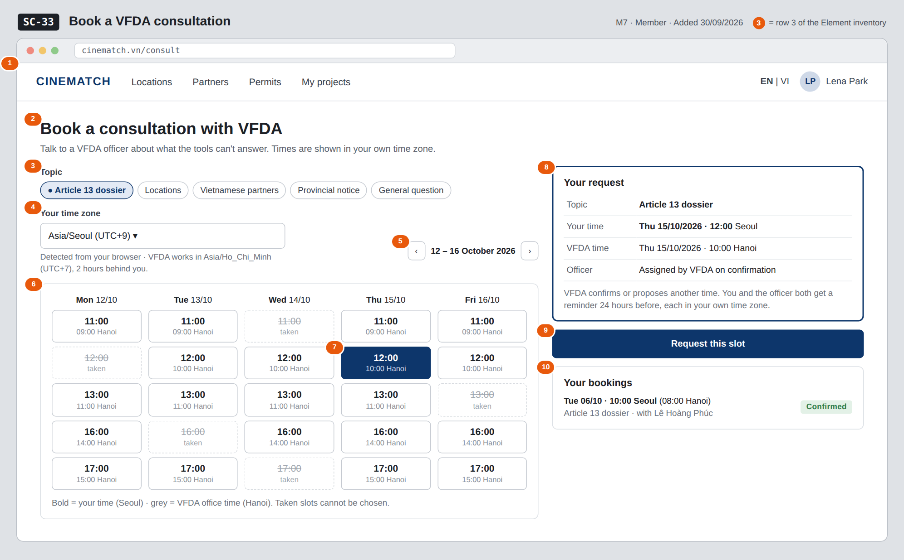

# Screen Spec: SC-33 Book a VFDA consultation

> DBIZ3 Session 4 template — one file per screen. The Screen ID is kept from the DBIZ2 Screen List.
> The mockup image stays an image; everything around it is text.
> **Each orange numbered badge on the mockup is the row with the same number in section 3 (Element inventory).**

| Field | Value |
|---|---|
| Screen ID | `SC-33` |
| Screen name | Book a VFDA consultation |
| Actor | Member |
| Priority | Should |
| Belongs to module | `docs/spec/spec-M7.md` |
| Mockup image | `img/SC-33.png` |
| Status | Draft |

*Route:* `/consult` · *Screen list file:* M7, item #36 (Added 30/09/2026 — Should) · *Design note from the screen list file:* Topic and time slot.

**Notes against Screen List v2.0**

- New Screen Spec written on 30/09/2026; SC-33 had no spec or mockup in the first set of 20.

## 1. Purpose

**Shown when:** A signed-in member clicks *Contact VFDA* in the footer, *Contact VFDA for an invitation* on `SC-04`, or an *Ask VFDA* link on a project screen; guests are sent to `SC-04` first.

**The user leaves this screen when:** The member requests a slot and stays on the page with the booking listed under *Your bookings*, or leaves through the navigation bar.

## 2. Mockup

> The image is the visual contract (layout, grouping, hierarchy); the tables below are the behavioural contract.
> All data in the mockup is sample data for one fictional project (*The Last Ferry*, Harbour Line Films); organisation names, people and phone numbers are examples, not real records.

## 3. Element inventory

| # | Element | Type | Content / data source | Required | Validation |
|---|---|---|---|---|---|
| 1 | Navigation bar | Header | static | — | — |
| 2 | Title + purpose | Header + Text | static | — | — |
| 3 | Topic | Toggle (single-select chips) | `topic` — ENUM(dossier, locations, partners, provincial_notice, general) | Yes | exactly one value of the enum |
| 4 | Time zone | Toggle (dropdown) | `timezone` — IANA name, VARCHAR(40); default from the browser | Yes | must be a valid IANA time zone |
| 5 | Week navigation | Button | static | — | past weeks disabled |
| 6 | Slot grid | List (calendar) | offered slots for the week, each shown in the member's time zone with the Hanoi time below; taken slots greyed | — | past and taken slots cannot be chosen |
| 7 | Selected slot | Toggle | `slot_start` — TIMESTAMPTZ stored in UTC | Yes | one slot; must still be free when sent |
| 8 | *Your request* summary | Text | topic, time in `timezone`, time in Asia/Ho_Chi_Minh, officer (`officer_id`, empty until confirmed) | — | — |
| 9 | *Request this slot* button | Button | creates the booking; returns `booking_id` | — | disabled until 3, 4 and 7 are set |
| 10 | *Your bookings* list | List | the member's bookings: `slot_start` in `timezone`, `topic`, officer, `booking_status` — confirmed / rescheduled / waiting | — | upcoming first |

## 4. States

| State | What the user sees | Trigger |
|---|---|---|
| Default | Topic chips, time zone, week grid with the next available week, summary and *Your bookings*, as in the mockup. | Page opens |
| Empty (no data) | No free slot in the shown week: *No free times this week* with *Next week ›*. No bookings yet: *Your bookings* shows *None yet*. | 0 free slots / 0 bookings |
| Loading | Grey placeholders in the grid while a week loads; *Request this slot* shows *Sending…* and is disabled. | Week change / sending |
| Error | Slot taken meanwhile: *That time was just booked — pick another*; the grid refreshes. Unknown time zone: error under the field. Write failure: *Couldn't send — nothing was booked, try again*. | Conflict / validation / write error |
| Success / confirmation | Banner *Request sent — VFDA will confirm and assign an officer*; the booking appears under *Your bookings* as *Waiting for VFDA*. When VFDA confirms or reschedules, an in-app notification and email show the time in both time zones. | Booking created / VFDA response |

## 5. Interactions and navigation

| # | Element | User action | System response | Goes to screen |
|---|---|---|---|---|
| 1 | Topic chip | tap | Selects the topic | stays |
| 2 | Time zone dropdown | tap | Changes the zone; the grid and summary re-render in the new zone | stays |
| 3 | ‹ / › week buttons | tap | Loads the previous / next week | stays |
| 4 | Free slot | tap | Selects it and fills the summary | stays |
| 5 | *Request this slot* | tap | Creates the booking, notifies VFDA staff | stays |
| 6 | *Log in* (guest redirect) | tap | — | SC-04 |

## 6. Screen-level rules

| Rule ID | Rule | Source |
|---|---|---|
| SR-361 | `slot_start` is stored in UTC with the member's IANA `timezone`; every time on screen and in messages is shown in the reader's own zone, with Hanoi time alongside for the member. | M7 FR-005 |
| SR-362 | A booking is a request until VFDA staff confirm or reschedule it and assign an officer; the member sees the status. | M7 FR-006 |
| SR-363 | Both sides get a reminder 24 hours before the consultation. | M7 FR-007 |
| SR-364 | The topic is one of five fixed values so VFDA can route and count requests. | M7 §5.1 FR-005 |
| SR-365 | Only signed-in members can book; a deactivated account has no access and cannot book. | SYS BR-005 |

## 7. Linked requirements

| FR ID (from the module spec) | What this screen does for it |
|---|---|
| FR-005 · spec-M7.md (F-M7-05) | Book by topic and slot with time-zone handling |
| FR-006 · spec-M7.md (F-M7-06) | Show VFDA's confirmation / rescheduling and the assigned officer |
| FR-007 · spec-M7.md (F-M7-07) | Explain and trigger the 24-hour reminders |

## 8. Responsive and accessibility notes

- Minimum supported width: **360px**.
- Narrow screens: the week grid becomes one day at a time with day tabs; the summary and button stick to the bottom.
- Each slot is a button whose accessible name includes both times (e.g. *Thursday 15 October, 12:00 Seoul, 10:00 Hanoi*).
- Taken slots are disabled buttons with the word *taken*, not only a strike-through.

## 9. Open questions

| # | Question | Blocking? | Status |
|---|---|---|---|
| 1 | [NEEDS CLARIFICATION: Which days and hours does VFDA offer for consultations, and how long is one slot?] | Yes | Open |
| 2 | [NEEDS CLARIFICATION: How is the consultation held (video call, phone, at the VFDA office) and who sends the joining details?] | No | Open |

## Completion checklist

- [x] The mockup is a separate cropped image file, named with the Screen ID (`img/SC-33.png`).
- [x] Every visible element in the mockup appears in the element inventory — machine-checked: badge numbers on the image = row numbers in section 3.
- [x] Every input element has a validation rule or an explicit "—".
- [x] All five states are filled in, or marked "Not applicable" with a reason.
- [x] Every navigation target is a Screen ID that exists in `docs/screen-list.md` — machine-checked.
- [x] Every element that displays data names the field it displays, matching `docs/spec/spec-M7.md` section 5.1.
- [ ] **Checked by a person:** _(not signed — a Group C member compares the image with the tables and signs here)_

---
*DBIZ3 Session 4 · Group C · CINEMATCH. Built on the DBIZ2 Screen Design (Screen List and Screen Layout).*
