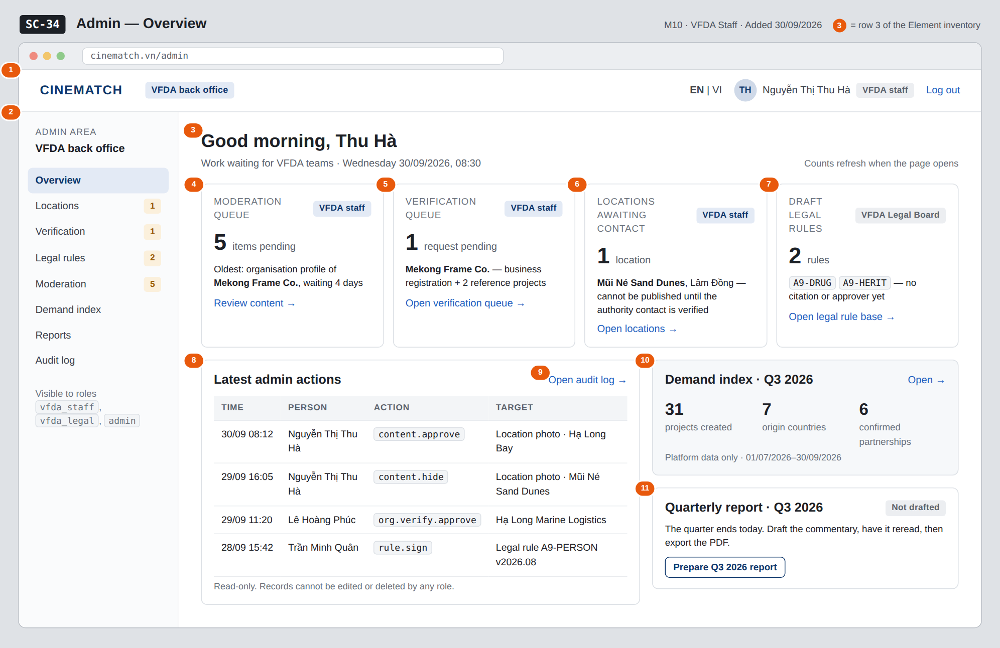

# Screen Spec: SC-34 Admin — Overview

> DBIZ3 Session 4 template — one file per screen. The Screen ID is kept from the DBIZ2 Screen List.
> The mockup image stays an image; everything around it is text.
> **Each orange numbered badge on the mockup is the row with the same number in section 3 (Element inventory).**

| Field | Value |
|---|---|
| Screen ID | `SC-34` |
| Screen name | Admin — Overview |
| Actor | VFDA Staff |
| Priority | Should |
| Belongs to module | `docs/spec/spec-M10.md` |
| Mockup image | `img/SC-34.png` |
| Status | Draft |

*Route:* `/admin` · *Screen list file:* M10, item #37 (Added 30/09/2026 — Should) · *Design note from the screen list file:* Admin home

**Notes against Screen List v2.0**

- **New Screen Spec (30/09/2026).** `SC-34` was in the Screen List without a mockup; written with the M10 Spec Document.

## 1. Purpose

**Shown when:** A VFDA staff member, VFDA Legal Board member or admin signs in and opens the admin area, or clicks *Overview* in the admin menu of any admin screen (`SC-35` … `SC-41`).

**The user leaves this screen when:** Each tile opens the queue it counts: `SC-38`, `SC-36`, `SC-35` or `SC-37`; the side panels open `SC-39`, `SC-40` and `SC-41`.

## 2. Mockup

> The image is the visual contract (layout, grouping, hierarchy); the tables below are the behavioural contract.
> All data in the mockup is sample data for one fictional project (*The Last Ferry*, Harbour Line Films); organisation names, people and phone numbers are examples, not real records.

## 3. Element inventory

| # | Element | Type | Content / data source | Required | Validation |
|---|---|---|---|---|---|
| 1 | Admin top bar | Header | static; signed-in user's `profile.full_name` and role (`user_account.role`) | — | shown only to `vfda_staff`, `vfda_legal`, `admin` |
| 2 | Admin menu | List | static: Overview · Locations · Verification · Legal rules · Moderation · Demand index · Reports · Audit log, with pending counts | — | items the role cannot open are hidden |
| 3 | Greeting and date | Header | signed-in user's first name; server date | — | — |
| 4 | *Moderation queue* tile | Text + Link | count of `moderation_queue` items with `content_status = pending`; oldest `submitted_at` | Yes | integer ≥ 0 |
| 5 | *Verification queue* tile | Text + Link | count of `verification_request` with `status_filter = pending` (M4 FR-009) | Yes | integer ≥ 0 |
| 6 | *Locations awaiting contact* tile | Text + Link | count of locations with `intake_status = awaiting_contact` (M3 FR-002) | Yes | integer ≥ 0 |
| 7 | *Draft legal rules* tile | Text + Link | count of `legal_rule` with `filter_status = draft` (M2 FR-001) | Yes | integer ≥ 0; link opens `SC-37` only for `vfda_legal` |
| 8 | *Latest admin actions* panel | List | last 4 `audit_entries`: `logged_at`, `admin_id` → name, `action`, `target_id` → readable label | — | newest first; read-only |
| 9 | *Open audit log* link | Link | static | — | shown to `admin` only (F-M10-09) |
| 10 | *Demand index* summary | Text + Link | `demand_index` for the current quarter: indicator 1 total, indicator 2 country count, indicator 5 confirmed count | — | values below 5 records read *Not enough data* (M10 BR-003) |
| 11 | *Quarterly report* status | Text + Button | current quarter's report: none / drafted / reread (`reread_by`) / exported (`report_pdf_url`) | — | — |

## 4. States

| State | What the user sees | Trigger |
|---|---|---|
| Default | Four work tiles with counts and the oldest item, latest admin actions on the left, demand summary and quarterly report status on the right — as in the mockup. | Admin area opens |
| Empty (no data) | Every queue empty: tiles show **0** and *Nothing waiting*; the audit panel reads *No admin actions yet*; the demand summary reads *Not enough data* for the quarter. | Fresh environment / all queues cleared |
| Loading | Grey skeleton in each tile and panel; each tile loads on its own, so a slow count never blocks the others. | Page opens |
| Error | A count that fails shows *Count unavailable — retry* in that tile only; the other tiles and panels stay usable. | One query fails |
| Success / confirmation | **Not applicable** — the overview only reads; decisions are taken on the screens it links to. | — |

## 5. Interactions and navigation

| # | Element | User action | System response | Goes to screen |
|---|---|---|---|---|
| 1 | *Moderation queue* tile | tap | Opens the queue filtered to pending items, oldest first | SC-38 |
| 2 | *Verification queue* tile | tap | Opens pending verification requests | SC-36 |
| 3 | *Locations awaiting contact* tile | tap | Opens locations filtered to `awaiting_contact` | SC-35 |
| 4 | *Draft legal rules* tile | tap | Opens draft rules (VFDA Legal Board only) | SC-37 |
| 5 | *Open audit log* | tap | — | SC-41 |
| 6 | *Demand index* summary | tap | Opens the index for the current quarter | SC-39 |
| 7 | *Prepare Q3 2026 report* | tap | Opens the report for the current quarter | SC-40 |
| 8 | Admin menu | tap an item | Opens that admin screen | SC-34 / SC-35 / SC-36 / SC-37 / SC-38 / SC-39 / SC-40 / SC-41 |

## 6. Screen-level rules

| Rule ID | Rule | Source |
|---|---|---|
| SR-371 | The admin area is reachable only by the roles `vfda_staff`, `vfda_legal` and `admin`; other roles get the not-authorised page. | M10 FR-004; SYS BR-002 |
| SR-372 | Each tile counts from the owning module's own status field — M10 moderation, M4 verification, M3 `intake_status`, M2 rule status — never from a copy. | Spec M10 §1 (Out of scope: those screens belong to M2, M3, M4) |
| SR-373 | A location counted as *awaiting contact* cannot be published until its authority contact is verified; the tile says so. | M3 BR-004 |
| SR-374 | The latest-actions panel is read-only and shows no edit or delete control; the full search is on `SC-41`. | M10 BR-005 |
| SR-375 | Demand figures on this screen follow the same sample-size rule as `SC-39`. | M10 BR-003 |

## 7. Linked requirements

| FR ID (from the module spec) | What this screen does for it |
|---|---|
| FR-001 · spec-M10.md (F-M10-01) | Count of content awaiting review |
| FR-004 · spec-M10.md (F-M10-04) | Current-quarter demand summary |
| FR-009 · spec-M10.md (F-M10-09) | Latest audit entries and link to the search |
| FR-009 · spec-M4.md (F-M4-09) | Count of pending verification requests |
| FR-001 · spec-M3.md (F-M3-01) | Count of locations not yet published |
| FR-001 · spec-M2.md (F-M2-01) | Count of draft legal rules |

## 8. Responsive and accessibility notes

- Minimum supported width: **360px**.
- Narrow screens: the admin menu collapses behind a *Menu* button; the four tiles stack two by two, then one per row; side panels move below the audit panel.
- Every count is text, not colour alone; tiles are links reachable with Tab in reading order.
- The audit table becomes a list of cards (time, person, action, target) below 600px.

## 9. Open questions

| # | Question | Blocking? | Status |
|---|---|---|---|
| 1 | [NEEDS CLARIFICATION: May VFDA staff (not only admins) read the latest audit entries on the overview, given that the audit log search F-M10-09 is for admins?] | No | Open |

## Completion checklist

- [x] The mockup is a separate cropped image file, named with the Screen ID (`img/SC-34.png`).
- [x] Every visible element in the mockup appears in the element inventory — machine-checked: badge numbers on the image = row numbers in section 3.
- [x] Every input element has a validation rule or an explicit "—".
- [x] All five states are filled in, or marked "Not applicable" with a reason.
- [x] Every navigation target is a Screen ID that exists in `docs/screen-list.md` — machine-checked.
- [x] Every element that displays data names the field it displays, matching `docs/spec/spec-M10.md` section 5.1.
- [ ] **Checked by a person:** _(not signed — a Group C member compares the image with the tables and signs here)_

---
*DBIZ3 Session 4 · Group C · CINEMATCH. Built on the DBIZ2 Screen Design (Screen List and Screen Layout).*
