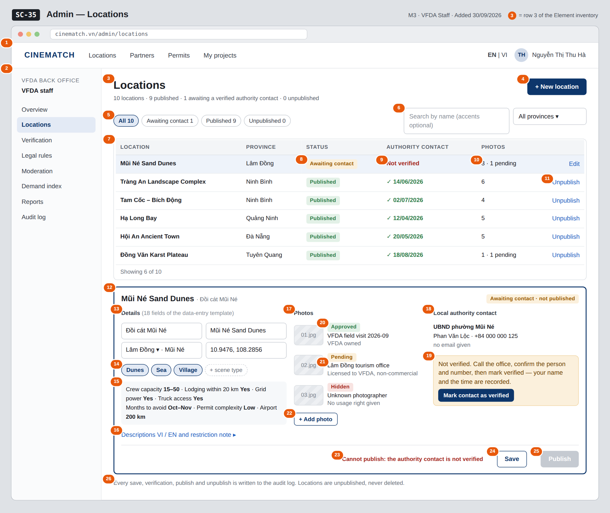

# Screen Spec: SC-35 Admin — Locations

> DBIZ3 Session 4 template — one file per screen. The Screen ID is kept from the DBIZ2 Screen List.
> The mockup image stays an image; everything around it is text.
> **Each orange numbered badge on the mockup is the row with the same number in section 3 (Element inventory).**

| Field | Value |
|---|---|
| Screen ID | `SC-35` |
| Screen name | Admin — Locations |
| Actor | VFDA Staff |
| Priority | Must |
| Belongs to module | `docs/spec/spec-M3.md` |
| Mockup image | `img/SC-35.png` |
| Status | Draft |

*Route:* `/admin/locations` · *Screen list file:* M3, item #31 (Added 30/09/2026 — Must) · *Design note from the screen list file:* Add, edit, verify, publish.

**Notes against Screen List v2.0**

- **Screen Spec added 30/09/2026.** `SC-35` is a Must screen that had no mockup (Screen List: *Must screens still without a mockup*). Location search (`SC-14`) has nothing to show without it.

## 1. Purpose

**Shown when:** VFDA staff sign in and choose *Locations* in the admin menu (from `SC-34` or any admin screen).

**The user leaves this screen when:** Staff move to another admin screen through the menu (for example `SC-34`), open the public page of a published location (`SC-16`), or open the audit log (`SC-41`).

## 2. Mockup

> The image is the visual contract (layout, grouping, hierarchy); the tables below are the behavioural contract.
> All data in the mockup is sample data for one fictional project (*The Last Ferry*, Harbour Line Films); organisation names, people and phone numbers are examples, not real records.

## 3. Element inventory

| # | Element | Type | Content / data source | Required | Validation |
|---|---|---|---|---|---|
| 1 | Navigation bar | Header | static; signed in as VFDA staff | — | — |
| 2 | Admin menu | List | static; *Locations* selected | — | items shown according to the user's role |
| 3 | Title + counts by status | Header | counts of `locations` by `intake_status` | — | — |
| 4 | *+ New location* button | Button | static | — | opens an empty editor; a new location starts as `awaiting_contact` |
| 5 | Status filter | Toggle (single choice) | `intake_status` — awaiting_contact / published / unpublished | No | enum or *All* |
| 6 | Search and province filter | Input + Toggle (dropdown) | `filter` — name (with or without Vietnamese diacritics), `province_id` from the 34-province list | No | search max 200 characters |
| 7 | Location table | List | `locations` (`location_admin[]`) including unpublished ones | — | visible to the `vfda_staff` role only (Row Level Security) |
| 8 | Location status | Text | `intake_status` — Awaiting contact / Published / Unpublished | — | enum |
| 9 | Authority contact verification | Text | `contact_verified`, `verified_at` | — | *Not verified* when `contact_verified` = false |
| 10 | Photo count | Text | count of photos; number with `image_status` = pending | — | — |
| 11 | Row action *Edit* / *Unpublish* / *Publish* | Link | published → *Unpublish*; awaiting_contact → *Edit*; unpublished → *Publish again* | — | *Unpublish* needs a confirmation dialog |
| 12 | Location editor | Container | the selected location | — | — |
| 13 | Names, province, district, coordinates | Input (several fields) | `name_vi`, `name_en`, `province_id`, `district`, `lat`, `lng` | Yes | names max 200 characters; province from the 34-province list; `lat` / `lng` inside Vietnam; district optional |
| 14 | Scene types | Toggle (multiple choice) | `scene_types` — karst / river / village / rice_field / sea / floating_village / cave / jungle / old_town / market / rice_terrace / mountain / dunes / mangrove | Yes | at least 1; only enum values |
| 15 | Logistics, season and permit complexity | Input (several fields) | `crew_capacity`, `lodging_20km`, `grid_power`, `truck_access`, `months_to_avoid`, `permit_complexity`, `airport_km` | Yes | `crew_capacity` u15 / 15_50 / o50; months 1–12; `permit_complexity` low / medium / high; `months_to_avoid` and `airport_km` optional |
| 16 | Descriptions and restriction note | Input (multi-line) | `desc_vi`, `desc_en`, `restriction_note` | Yes | both descriptions required; restriction note optional |
| 17 | *Photos* section | Container | location photos | — | — |
| 18 | *Local authority contact* section | Input (several fields) | `authority_name`, `contact_name`, `contact_phone`, `contact_email` | Yes | office max 200, name max 120, phone max 20 characters; email optional, valid format |
| 19 | Verification status + *Mark contact as verified* | Button | sets `contact_verified` = true, `verified_by` = current staff member, `verified_at` = now | — | confirmation dialog; any edit of the contact resets it to *Not verified* |
| 20 | Photo status | Text | `image_status` — pending / approved / hidden | — | only *approved* photos are shown publicly |
| 21 | Photo source and usage right | Text | `image_source`, `usage_right` | Yes | both required when a photo is added |
| 22 | *+ Add photo* button | Input (file) | `image_file` → `image_url` | — | jpg / png, max 10 MB; source and usage right asked before upload |
| 23 | Publish blocked reason | Text | `blocked_reason` | — | shown whenever *Publish* is disabled |
| 24 | *Save* button | Button | static | — | enabled when a field changed; required fields valid |
| 25 | *Publish* button | Button | sets `published` / `intake_status` = published | — | disabled while `contact_verified` = false (database CHECK) |
| 26 | Audit note | Text | static | — | always shown |

## 4. States

| State | What the user sees | Trigger |
|---|---|---|
| Default | Location table (all statuses) and the selected location in the editor below. The mockup shows a location awaiting a verified contact. | Open `/admin/locations` |
| Empty (no data) | No locations yet: *No locations yet — add the first one* with *+ New location*. A filter with no match (e.g. *Unpublished 0*): *No locations with this status*. | 0 locations / filter returns 0 |
| Loading | Grey skeleton rows in the table; photo uploads show a progress bar on their own row. | Loading / uploading |
| Error | Publish refused by the database: red strip with `blocked_reason` *Authority contact not verified*. Photo too large or wrong type: message at *+ Add photo* stating the limit. Save fails: *Couldn't save — your changes are kept*. | CHECK constraint / file check / write error |
| Success / confirmation | Published: status *Published*, strip *Mũi Né Sand Dunes is now visible in location search*. Unpublished: status *Unpublished*, strip *Removed from search — shortlists that include it now show No longer published*. Verified: contact shows *✓ verified by Nguyễn Thị Thu Hà, 30/09/2026*. | Publish / unpublish / verify succeeded |

## 5. Interactions and navigation

| # | Element | User action | System response | Goes to screen |
|---|---|---|---|---|
| 1 | Admin menu item | tap | Opens that admin screen | SC-34 |
| 2 | Status filter / search / province | tap / type | Filters the table | stays |
| 3 | Location row / *Edit* | tap | Loads the location into the editor | stays |
| 4 | *+ New location* button | tap | Empty editor; status awaiting_contact | stays |
| 5 | *Mark contact as verified* | tap | Confirmation; records who verified and when; writes an audit record | stays |
| 6 | *+ Add photo* | tap | Asks for source and usage right, uploads, photo status *pending* | stays |
| 7 | *Save* button | tap | Saves the location; writes an audit record | stays |
| 8 | *Publish* button | tap | Publishes when the contact is verified; the database refuses otherwise; writes an audit record | stays |
| 9 | *Unpublish* link | tap | Confirmation dialog; sets `intake_status` = unpublished; writes an audit record | stays |
| 10 | Name of a published location | tap | Opens the public location page in a new tab | SC-16 |
| 11 | Audit note | tap | Opens the audit log filtered to locations (admin role) | SC-41 |

## 6. Screen-level rules

| Rule ID | Rule | Source |
|---|---|---|
| SR-311 | A location **cannot be published until its local authority contact is verified**; enforced by a database CHECK constraint, and the reason is shown next to the disabled button. | M3 BR-004, M3 FR-005 (F-M3-05) |
| SR-312 | Locations are **unpublished, never deleted** (`intake_status = unpublished`); shortlists and provincial notices that refer to them keep them and show *No longer published*. There is no *Delete* action. | M3 BR-008 |
| SR-313 | Every photo has a source and a usage right; photos are shown publicly only when their `image_status` is *approved*. | M3 FR-003 (F-M3-03) |
| SR-314 | The verification records **who** verified the contact and **when**; changing the contact clears the verification. | M3 FR-004 (F-M3-04) |
| SR-315 | Provinces use the 34 provincial-level units after the 2025 reorganisation. | M3 BR-006 |
| SR-316 | Every save, verification, publish and unpublish writes one audit record in the same transaction. | M10 BR-005 (F-M10-08) |

## 7. Linked requirements

| FR ID (from the module spec) | What this screen does for it |
|---|---|
| FR-001 · spec-M3.md (F-M3-01) | List all locations including unpublished ones |
| FR-002 · spec-M3.md (F-M3-02) | Create and edit a location with the 18 template fields |
| FR-003 · spec-M3.md (F-M3-03) | Store photos with source, usage right and status |
| FR-004 · spec-M3.md (F-M3-04) | Record and verify the local authority contact |
| FR-005 · spec-M3.md (F-M3-05) | Publish blocked while the contact is not verified |
| FR-008 · spec-M10.md (F-M10-08) | Audit record for every admin action on a location |

## 8. Responsive and accessibility notes

- Minimum supported width: **360px** (admin work is expected on desktop; below 1024px the editor opens full screen over the table).
- The admin menu collapses into a menu button on narrow screens; the three editor sections stack.
- The disabled *Publish* button is linked to its reason with `aria-describedby`, so screen readers announce why.
- Status and photo labels always include text, not only colour; photos need a text alternative before publishing.

## 9. Open questions

| # | Question | Blocking? | Status |
|---|---|---|---|
| 1 | [NEEDS CLARIFICATION: Re-verification cycle for authority contacts (proposed 12 months).] | No | Open |
| 2 | [NEEDS CLARIFICATION: who changes a photo's `image_status` from pending to approved when VFDA staff upload it themselves, and must a location have at least one approved photo before it can be published?] | No | Open |

## Completion checklist

- [x] The mockup is a separate cropped image file, named with the Screen ID (`img/SC-35.png`).
- [x] Every visible element in the mockup appears in the element inventory — machine-checked: badge numbers on the image = row numbers in section 3.
- [x] Every input element has a validation rule or an explicit "—".
- [x] All five states are filled in, or marked "Not applicable" with a reason.
- [x] Every navigation target is a Screen ID that exists in `docs/screen-list.md` — machine-checked.
- [x] Every element that displays data names the field it displays, matching `docs/spec/spec-M3.md` section 5.1.
- [ ] **Checked by a person:** _(not signed — a Group C member compares the image with the tables and signs here)_

---
*DBIZ3 Session 4 · Group C · CINEMATCH. Built on the DBIZ2 Screen Design (Screen List and Screen Layout).*
