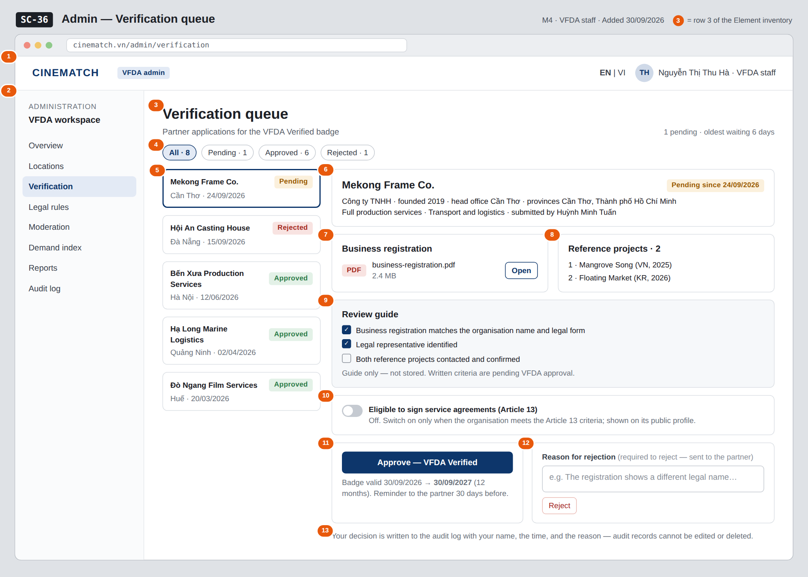

# Screen Spec: SC-36 Admin — Verification queue

> DBIZ3 Session 4 template — one file per screen. The Screen ID is kept from the DBIZ2 Screen List.
> The mockup image stays an image; everything around it is text.
> **Each orange numbered badge on the mockup is the row with the same number in section 3 (Element inventory).**

| Field | Value |
|---|---|
| Screen ID | `SC-36` |
| Screen name | Admin — Verification queue |
| Actor | VFDA Staff |
| Priority | Must |
| Belongs to module | `docs/spec/spec-M4.md` |
| Mockup image | `img/SC-36.png` |
| Status | Draft |

*Route:* `/admin/verification` · *Screen list file:* M4, item #35 (Added 30/09/2026 — Must) · *Design note from the screen list file:* Review organisation verification.

**Notes against Screen List v2.0**

- New Screen Spec written on 30/09/2026; SC-36 was listed in the Screen List as a Must screen still without a mockup.

## 1. Purpose

**Shown when:** VFDA staff open *Verification* in the admin menu, or a *new verification request* email / in-app notification.

**The user leaves this screen when:** Staff approve or reject the selected request and move to the next one, or switch to another admin section.

## 2. Mockup

> The image is the visual contract (layout, grouping, hierarchy); the tables below are the behavioural contract.
> All data in the mockup is sample data for one fictional project (*The Last Ferry*, Harbour Line Films); organisation names, people and phone numbers are examples, not real records.

## 3. Element inventory

| # | Element | Type | Content / data source | Required | Validation |
|---|---|---|---|---|---|
| 1 | Admin header | Header | static; signed-in staff name and role `vfda_staff` | — | — |
| 2 | Admin menu | List | static; *Verification* selected | — | — |
| 3 | Title + queue summary | Header + Text | count of `pending` requests and age of the oldest | — | — |
| 4 | Status filter | Toggle (chips) | `status_filter` — ENUM(pending, approved, rejected) or All, with counts | No | enum values only |
| 5 | Request list | List | `queue` — `verification_request[]`: organisation, head office, `status`, date | — | pending first, then newest decision first |
| 6 | Organisation header of the selected request | Text | `org_name`, `legal_form`, `founded_year`, `hq_province`, `province`, `service_groups`, submitting user | Yes | — |
| 7 | Business registration document | Text + Button | `business_license` (private storage) | Yes | opens in a new tab for staff only |
| 8 | Reference projects | List | `reference_projects` | Yes | — |
| 9 | Review guide | List (checkboxes) | static guide; ticks are not stored | — | — |
| 10 | *Eligible to sign service agreements (Article 13)* switch | Toggle | `art13_eligible` | No | only `vfda_staff` / `admin` can change it |
| 11 | *Approve* button + validity preview | Button + Text | `decision = approved` → `verified`, `verified_at`, `verified_until` = `verified_at` + 12 months | — | only for `pending` requests |
| 12 | Rejection reason + *Reject* button | Input (text area) + Button | `reason` with `decision = rejected` | Yes (to reject) | Reject disabled while the reason is empty |
| 13 | Audit log note | Text | static; audit record per decision (`action`, `admin_id`, `target_id`, `logged_at`) | — | — |

## 4. States

| State | What the user sees | Trigger |
|---|---|---|
| Default | Queue on the left with the oldest pending request selected; its documents, references, review guide, Article 13 switch and the two decision panels on the right, as in the mockup. | Page opens |
| Empty (no data) | No pending requests: *Nothing waiting for review.* The detail area is replaced by a short list of badges expiring in the next 30 days. | 0 pending with filter *Pending* |
| Loading | Grey placeholders in the list and detail; after a click on *Approve* / *Reject* both buttons are disabled until the save ends. | Loading / deciding |
| Error | Reject with an empty reason: *A reason is required to reject* under the field. Save failure: *Decision not saved — nothing was changed and no audit record was written*. Request already decided by a colleague: *Lê Hoàng Phúc decided this request at 10:42* and the panel reloads read-only. | Validation / write error / concurrent decision |
| Success / confirmation | Green strip *Mekong Frame Co. is VFDA Verified until 30/09/2027 — the partner has been notified*, or *Rejected — the reason was sent to the partner*; the request moves to Approved / Rejected and the next pending request opens. | Decision saved |

## 5. Interactions and navigation

| # | Element | User action | System response | Goes to screen |
|---|---|---|---|---|
| 1 | Status filter chip | tap | Re-filters the list | stays |
| 2 | Request in the list | tap | Opens that request's detail; decided requests are read-only with decider, date and reason | stays |
| 3 | *Open* business registration | tap | Opens the PDF in a new tab | stays |
| 4 | *Approve* button | tap | Confirmation; sets `verified_at`, `verified_until` (+12 months), notifies the partner, writes the audit record | stays |
| 5 | *Reject* button | tap | Saves the reason, notifies the partner, writes the audit record | stays |
| 6 | Organisation name in the header | tap | Opens the public profile in a new tab | SC-20 |
| 7 | *Moderation* in the admin menu | tap | Opens the moderation queue | SC-38 |

## 6. Screen-level rules

| Rule ID | Rule | Source |
|---|---|---|
| SR-351 | Only `vfda_staff` and `admin` can open this screen and decide; the list shows every organisation's requests. | M4 FR-009 |
| SR-352 | Rejecting requires a written reason, which is sent to the partner; who decided and when is recorded. | M4 FR-010 |
| SR-353 | An approved badge is valid 12 months from the decision; the badge states what was checked and what was not. | M4 BR-004 |
| SR-354 | Every decision and every change of the Article 13 switch writes one audit record in the same transaction; audit records cannot be edited or deleted. | M10 BR-005 |
| SR-355 | The review guide ticks are a working aid, not stored evidence, until VFDA's written criteria exist. | M4 §10 #2 |

## 7. Linked requirements

| FR ID (from the module spec) | What this screen does for it |
|---|---|
| FR-009 · spec-M4.md (F-M4-09) | Queue of verification requests filterable by status |
| FR-010 · spec-M4.md (F-M4-10) | Approve or reject with a mandatory reason, recording who and when |
| FR-011 · spec-M4.md (F-M4-11) | Sets the 12-month validity that drives the reminder and expiry |
| FR-008 · spec-M10.md (F-M10-08) | Audit record for every decision |

## 8. Responsive and accessibility notes

- Minimum supported width: **360px**.
- Admin screens are designed for desktop; below 1024px the admin menu becomes a drop-down and the list and detail stack (list first).
- The Article 13 switch is a real `switch` role with its label; decision buttons have distinct text, not only colour.
- Focus moves to the next request's heading after a decision.

## 9. Open questions

| # | Question | Blocking? | Status |
|---|---|---|---|
| 1 | [NEEDS CLARIFICATION: Written criteria for awarding VFDA Verified.] | Yes | Open |
| 2 | [NEEDS CLARIFICATION: Criteria for the *eligible to sign a service agreement under Article 13* flag.] | Yes | Open |

## Completion checklist

- [x] The mockup is a separate cropped image file, named with the Screen ID (`img/SC-36.png`).
- [x] Every visible element in the mockup appears in the element inventory — machine-checked: badge numbers on the image = row numbers in section 3.
- [x] Every input element has a validation rule or an explicit "—".
- [x] All five states are filled in, or marked "Not applicable" with a reason.
- [x] Every navigation target is a Screen ID that exists in `docs/screen-list.md` — machine-checked.
- [x] Every element that displays data names the field it displays, matching `docs/spec/spec-M4.md` section 5.1.
- [ ] **Checked by a person:** _(not signed — a Group C member compares the image with the tables and signs here)_

---
*DBIZ3 Session 4 · Group C · CINEMATCH. Built on the DBIZ2 Screen Design (Screen List and Screen Layout).*
